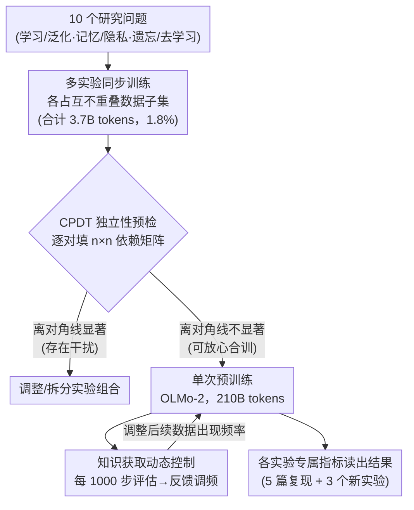

# Train Once, Answer All: Many Pretraining Experiments for the Cost of One

**会议**: ICLR 2026  
**arXiv**: [2509.23383](https://arxiv.org/abs/2509.23383)  
**代码**: [Python Package](https://arxiv.org/abs/2509.23383)（论文提供了 OLMo-2 实验包）  
**领域**: AI安全  
**关键词**: Pretraining Experiments, LLM, Experiment Independence, Continual Pretraining, Data Contamination

## 一句话总结

提出在单次 LLM 预训练中同时运行多个独立实验的方法论框架，在训练 2.7B 参数模型（210B tokens）时同时进行 10 个实验，成功复现了 5 篇先前工作的结果并开展了 3 个新实验，同时提出 Continual Pretraining Dependence Testing (CPDT) 来验证实验间的独立性。

## 研究背景与动机

**受控预训练实验是研究 LLM 行为的黄金标准**：通过从头训练模型来系统地隔离特定干预（数据变化、架构改动、学习目标修改等）的效果，在概念简单性和科学严谨性上优于其他方法。

**计算成本是预训练实验的最大瓶颈**：当前标准做法是每次实验一次独立训练，对于研究模型行为的特定方面而言，单个项目的预期洞察往往不足以证明从头训练模型的成本。

**预训练的多任务本质提供了理论基础**：模型在预训练过程中同时学习许多任务，因此理论上可以在不同任务上独立地同时干预。这也反映了实际模型开发中的做法——实践者通常在从头训练时组合多种干预。

**核心问题：实验间是否存在交互作用**：如果一个实验影响了另一个实验的结果，那么联合训练的有效性将受到质疑。需要一种方法来检测和量化这种依赖性。

## 方法详解

### 整体框架

整篇论文要解决的痛点是：受控预训练实验是研究 LLM 行为的黄金标准，但"一次训练只回答一个问题"的成本高到大多数研究者负担不起。作者的整体思路是把"一次训练只跑一个实验"改成"一次训练并排跑多个实验"：先把 10 个研究问题各自的干预塞进训练数据里互不重叠的一小块（合计改 3.7B tokens、占全部数据的 1.8%）；在真正烧钱开训前，用一个廉价代理（CPDT）逐对验证这些实验互不干扰；确认独立后只跑一次完整预训练（OLMo-2，210B tokens），其中知识获取实验还用一个反馈回路在训练途中动态调数据；训练结束后每个实验各用自己的专属指标读出结果。能这么做的底层依据是预训练本就是多任务过程，对不同任务的干预理论上可以并行而互不污染——剩下的工作就是把"互不污染"做成可设计、可验证的流程。

### 关键设计

**1. 多实验同步训练：把一次训练拆成 10 个并行实验**

针对的就是整体框架里"一次只跑一个实验太贵"的核心痛点。做法是让每个实验认领训练数据中互不重叠的一个子集去做干预，配上各自独立的评估指标，于是 10 个干预共享同一次前向反向，却各算各的账。这 10 个实验按主题分成三类：学习与泛化（知识获取 KA 改 26M tokens、数学推理 MR 改 180M）、记忆与隐私（基准污染 BC 106M、记忆模式 MemP 246M、逐字记忆 MemV 1.1B、高斯水印 GW 210M）、遗忘与去学习（预训练投毒 PP 235M、遗忘曲线 FC 19M、MUSE-News 152M、IID 替换 1.5B）。之所以能并排塞进同一次训练，正是因为它们落在不同数据子集、读不同指标，预训练的多任务特性保证了对一个任务的扰动不会顺带改写另一个任务的答案。

**2. Continual Pretraining Dependence Testing（CPDT）：花小钱事先验证实验互不干扰**

上一个设计成立的大前提是实验之间真的独立，否则一个实验的存在会污染另一个的结论。作者先给出形式化定义：实验 $E_1, \dots, E_n$ 独立，当且仅当对所有 $i$ 和任意 $T \subseteq [n] \setminus \{i\}$ 都有 $Y_i^{\{i\}} \stackrel{d}{=} Y_i^{\{i\} \cup T}$——即把别的实验数据加进来，实验 $i$ 的结果分布不变。直接做全量预训练来验证太贵，CPDT 改用一个廉价代理：取一个中间检查点，分别只用某个实验的数据做短期持续预训练（约替换 1% 数据），逐对量出"训练实验 $j$ 的数据会让实验 $i$ 的指标偏移多少"，即 $Y_i^{\{j\}}-Y_i^{\emptyset}$，填成一张 $n \times n$ 依赖矩阵（再补一行"全部实验同训"得到 $(n{+}1)\times n$ 的完整矩阵）。离对角线的格子若都不显著，就说明这组实验可以放心合训，而这一步在烧钱开训前完成、成本远低于从头训一遍。

**3. 知识获取的动态控制：用反馈回路精确地"注入"一条知识**

这是 10 个实验里最能体现"单次训练也能做精细干预"的一个，对应框架图里训练途中的反馈回环。它要回答的问题是——模型要在预训练里见到一条事实多少次，才会真正记住它？固定频率难以命中目标，于是作者把它做成一个控制回路：每隔 1000 步评估一次知识探针的当前概率，拿它和目标值（如 0.08）作差，再据此调高或调低后续数据里这条知识的出现频率，让概率曲线一路逼近目标。这等于把控制论的负反馈思想搬进预训练数据流，使"定向知识注入"从碰运气变成可调可控的过程。

### 损失函数 / 训练策略

训练沿用 OLMo-2-1B 架构，跑满 100,000 步 / 210B tokens：前 90,000 步学习率与原版 OLMo-2-1B 对齐，最后 10,000 步线性衰减到 0。各实验数据均匀铺在整个训练过程中，原位替换掉对应位置的原始预训练数据，从而不改变总 token 量。同一套配方还分别训了 179M、546M、1.5B、2.7B 四个规模，用来观察干预效应随模型尺寸的变化。

## 实验关键数据

### 主实验

新实验结果（OLMo-2-1B-Exp）：

| 实验 | 关键指标 | 结果 |
|------|---------|------|
| 知识获取 | 知识探针最终值 / 零样本准确率 | 0.05 (目标0.08) / 25% |
| 数学推理 | 超出训练难度的泛化 | 能生成 11 步最优解 |
| 高斯水印 | TPR@1%FPR | 始终高于随机基线，后期水印更易检测 |
| 基准污染（4×重复） | 过拟合程度 | ~1 个百分点 |
| 基准污染（144×重复） | 过拟合程度 | ~19 个百分点 |

模型规模效应：

| 模型 | 参数量 | 基准污染效应 | 投毒成功率 | 数学推理 |
|------|--------|-------------|-----------|---------|
| OLMo-2-179M-Exp | 179M | 较小 | 仍有效 | 未涌现 |
| OLMo-2-546M-Exp | 546M | 中等 | 有效 | 开始涌现 |
| OLMo-2-1B-Exp | 1.5B | 较大 | 有效 | 明显 |
| OLMo-2-2.7B-Exp | 2.7B | 最大 | 有效 | 最强 |

### 消融实验

CPDT 依赖性测试结果：

| 类型 | 对比 | 结论 |
|------|------|------|
| 语言建模基准间 | ARC-Easy → ARC-Challenge | +6.2pp，显著依赖 |
| 实验间（离对角线） | 所有实验对 | 均不显著，无依赖 |
| 全实验联合 vs 单独 | 对角线 vs 底行 | 效果一致，验证独立性 |

训练动态影响：

| 指标 | OLMo-2-1B | OLMo-2-1B-Exp |
|------|-----------|---------------|
| 10K holdout 基准准确率 | 55.51% | 55.15% |
| 训练/验证损失 | 基本重合 | 基本重合 |

### 关键发现

1. **5 篇先前工作全部成功复现**：基准污染、记忆模式、逐字记忆、预训练投毒、遗忘曲线的结果均与独立训练一致
2. **实验对整体训练动态影响极小**：训练损失、验证损失、输出层权重范数几乎完全重合
3. **模型规模越大，实验干预的效应越强**：基准污染、知识获取、投毒成功率都随模型规模增加
4. **数学推理能力在 ≥546M 参数时才涌现**：与先前独立训练的研究结论一致
5. **高斯水印存在"近期偏差"**：后期看到的数据更容易被检测，揭示了 LLM 学习过程中的时间特性

## 亮点与洞察

1. **方法论层面的重大贡献**：从"一次训练一个实验"到"一次训练多个实验"的范式转变，可能将 LLM 实验研究的成本降低一个数量级
2. **CPDT 是优雅的验证工具**：在全量预训练前用持续预训练来检测依赖性，成本远低于全量训练，且足以提供统计保证
3. **知识获取的动态控制**：创新性地将控制论思想引入预训练，按需调整知识频率，开辟了"定向知识注入"的新可能
4. **对社区的实践启示**：开源模型（如 OLMo）的训练过程本可以容纳多个研究实验，当前的开源训练实践存在"研究密度"不足的问题

## 局限与展望

1. **实验规模有限**：10 个实验各自最多修改 1.8% 数据，对于修改比例更大的实验（如全量合成数据训练），独立性可能不成立
2. **仅考虑数据干预**：除高斯水印外，所有实验都是修改训练数据；对于架构修改、超参数变化等干预无法并行
3. **CPDT 的近似性**：持续预训练的依赖检测是对全量预训练的近似，存在假阴性风险
4. **模型规模上限**：验证最大到 2.7B，对于 70B+ 规模的模型是否仍成立尚未验证
5. **高阶交互作用**：CPDT 主要检测成对依赖，三个或更多实验间的高阶交互可能被忽视

## 相关工作与启发

- **Bordt et al. (2025)**：基准污染实验的原始工作，本文成功复现其关于遗忘的核心发现
- **Panda et al. (2025)**：记忆模式/隐私泄露实验的原始工作，复现了稀有 token canary 的脆弱性
- **Zhang et al. (2025b)**：预训练投毒实验的原始工作，复现了后门攻击在小规模模型上的有效性
- **AdEMAMix (Pagliardini et al., 2025)**：遗忘曲线实验的参照，验证了个体批次的快速遗忘现象
- 启发：这种方法论可以推广到视觉模型、多模态模型的预训练实验中，有望成为 AI 研究的标准工具

## 评分

- **新颖性**: ⭐⭐⭐⭐⭐ — 方法论层面的开创性工作，"一次训练回答所有问题"的理念令人耳目一新，CPDT 也是全新的检验工具
- **实验充分度**: ⭐⭐⭐⭐⭐ — 10 个实验、4 个模型规模、5 个成功复现、3 个新实验，实验设计极为充分
- **写作质量**: ⭐⭐⭐⭐ — 论文结构清晰，数学化定义严谨，图表直观；但实验细节因篇幅被移入附录
- **价值**: ⭐⭐⭐⭐⭐ — 有望改变 LLM 预训练实验的范式，为资源有限的研究者提供了实质性帮助

<!-- RELATED:START -->

## 相关论文

- [\[CVPR 2025\] Towards All-in-One Medical Image Re-Identification](../../CVPR2025/llm_safety/towards_all-in-one_medical_image_re-identification.md)
- [\[ICLR 2026\] Attention Smoothing Is All You Need For Unlearning](attention_smoothing_is_all_you_need_for_unlearning.md)
- [\[ICLR 2026\] When Priors Backfire: On the Vulnerability of Unlearnable Examples to Pretraining](when_priors_backfire_on_the_vulnerability_of_unlearnable_examples_to_pretraining.md)
- [\[ICLR 2026\] Heterogeneous Federated Fine-Tuning with Parallel One-Rank Adaptation](heterogeneous_federated_fine-tuning_with_parallel_one-rank_adaptation.md)
- [\[ICLR 2026\] Reasoning or Retrieval? A Study of Answer Attribution on Large Reasoning Models](reasoning_or_retrieval_a_study_of_answer_attribution_on_large_reasoning_models.md)

<!-- RELATED:END -->
