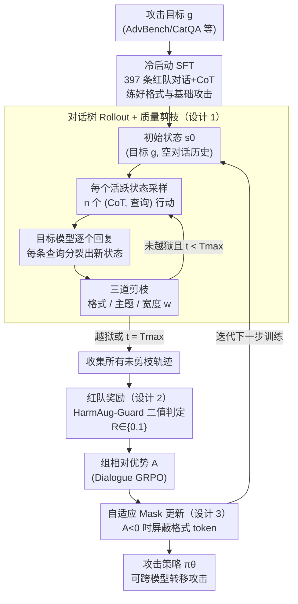

# Tree-based Dialogue Reinforced Policy Optimization for Red-Teaming Attacks (DialTree)

**会议**: ICLR 2026  
**arXiv**: [2510.02286](https://arxiv.org/abs/2510.02286)  
**代码**: 无  
**领域**: AI安全 / 红队攻击  
**关键词**: 多轮越狱, 红队测试, 强化学习, 树搜索, 对话策略优化

## 一句话总结
提出 DialTree，将多轮红队攻击建模为目标导向的对话策略优化问题，通过树状rollout+质量剪枝探索攻击轨迹空间，结合自适应mask防止格式遗忘，在12个目标模型上平均ASR达81.5%，比此前SOTA高44.2%，甚至在Claude-4-Sonnet上达71% ASR。

## 研究背景与动机

**领域现状**：红队测试是发现LLM安全漏洞的关键手段。现有方法分为单轮攻击(GCG/PAIR/TAP)和多轮攻击(MTSA/ActorAttack/X-Teaming)。研究表明多轮攻击远比单轮有效，因为可以逐步侵蚀安全边界。

**现有痛点**：
   - 现有多轮方法依赖手工启发式或模板，无法学习长期自适应策略
   - 多轮对话的状态空间指数增长，标准RL方法难以有效探索
   - 越狱奖励来自不完美的代理模型（非可验证奖励），引导信号不稳定
   - RL训练中格式遵循能力会灾难性遗忘

**核心矛盾**：多轮攻击的对话空间巨大，但有效攻击策略稀疏、难以发现

**本文目标**：如何高效探索多轮攻击空间+学习长期对话策略+稳定RL训练

**切入角度**：将红队攻击建模为目标导向的战略对话，用树搜索结构化探索+自适应mask稳定训练

**核心 idea**：树状rollout+剪枝 = 结构化探索多轮攻击空间；自适应mask = 保护格式token不被RL反向遗忘

## 方法详解

### 整体框架
DialTree 要解决的是「多轮越狱的对话空间指数级膨胀、有效攻击策略却很稀疏」这个核心矛盾：把红队攻击看成一场目标导向的对话博弈，让攻击模型 $\pi_\theta$ 学会一步步把目标模型 $\pi_{\text{tgt}}$ 的安全边界侵蚀掉。整条流水线分两个阶段：先用冷启动 SFT（Cold-Start SFT）把攻击模型的输出格式和基础攻击能力练出来，再用 DialTree 强化学习去探索、固化长期攻击策略。

RL 阶段不像标准 GRPO 那样各采各的独立轨迹，而是把一次多轮攻击展开成一棵**对话树**：从初始状态出发，每一轮在每个活跃状态上分叉出多个候选攻击行动、分别打到目标模型上拿回复，再用剪枝把畸形/跑偏/过宽的分支砍掉；树跑完后收集所有存活轨迹，用安全护栏给二值奖励、算组相对优势，最后用自适应 Mask（adaptive masking）做策略更新——更新时专门保护格式 token 不被负优势的惩罚梯度误伤。

### 关键设计

**1. 对话树 Rollout + 质量剪枝：在共享对话上下文下对比不同攻击行动**

标准 GRPO 只采样彼此独立的轨迹，无法判断"在同一个对话状态下，换一句话问会不会更容易越狱"。DialTree 把多轮攻击展开成一棵树来解决这个问题：从初始状态 $s_0 = (g, \emptyset)$（只有攻击目标、还没有对话历史）出发，每一轮对每个活跃状态采样 $n$ 个不同的 (CoT, 查询) 对，每个查询发给目标模型拿到回复后就分裂出一个新状态，于是同一个父节点下的若干兄弟节点共享上文、只在这一步的行动上有别，组相对优势就能精确度量"这步该怎么问"。

为了不让树爆炸，每轮做三道剪枝：格式验证（丢掉没有 CoT 或没有 query 的畸形分支）、主题一致性（丢掉已经跑偏、不再围绕目标 $g$ 的分支）、分支限制（每轮最多保留 $w$ 个节点）。默认配置是最多 $T_{\max}=5$ 轮、分支因子 $n=4$、组大小 $G=32$，让探索宽度和 rollout 成本保持可控。

**2. 红队奖励：二值化的越狱判定 + held-out judge 防 reward hacking**

树跑完后，每条存活轨迹要拿到一个标量奖励来算组相对优势——这个信号来自安全护栏模型 HarmAug-Guard：只要对话中任意一轮的 (query, response) 被判为有害（$r_\phi(g; q_t, r_t) > 0.5$），整条轨迹就给 $R = 1$，否则 $R = 0$。这种二值奖励虽然简单，但配合树结构的组相对优势已经足够提供方向。为避免攻击模型学会专门糊弄训练奖励，最终评测换用与训练不同的 GPT-4o 作 held-out judge，把"骗过 HarmAug-Guard"和"真的越狱"区分开。

**3. 自适应 Mask：让负优势的惩罚梯度绕开格式 token**

有了优势信号去做策略更新，作者却发现一个被忽视的现象——格式遵循能力会灾难性遗忘，畸形输出占比从近 0% 一路飙到 >70%。根因是负优势轨迹的惩罚梯度在压低"内容不好"的同时，连带惩罚了本来正确的格式 token（如 CoT 标签、query 包裹符），把模型的输出结构也一起拆了。

自适应 mask 的做法是按优势符号区别对待格式 token：

$$M_t^{(i)} = 1 - \mathbb{I}\big((T_t^{(i)} \in \mathcal{V}_{\text{fmt}}) \land (A^{(i)} < 0)\big)$$

当轨迹优势 $A < 0$ 时，把落在格式词表 $\mathcal{V}_{\text{fmt}}$ 内的 token 屏蔽掉，让惩罚梯度不碰它们；当 $A \geq 0$ 时格式 token 照常更新，继续强化正确格式。这正是它强于静态 mask 的地方——静态 mask 一律保护格式 token，连正优势里"该被强化"的格式信号也一并冻住，所以训练稳定性和最终效果都不如自适应版本。

### 损失函数 / 训练策略
- SFT阶段：397条手工策划的红队对话数据+CoT
- RL阶段：Dialogue GRPO，在树rollout收集的轨迹上计算组相对优势。500个训练目标，从AdvBench/DangerousQA/CatQA采样
- 攻击模型：Llama-3.1-8B-Instruct，目标模型（训练时）：Llama-3.2-1B-Instruct
- 关键：训练目标仅1B小模型，但攻击策略可转移到GPT-4o/Claude-4等大模型

## 实验关键数据

### 主实验：攻击成功率(ASR@1, HarmBench)

| 方法 | GPT-4o | Claude-4-Sonnet | Grok-4 | o3-mini | Llama-3.3-70B | Avg(12模型) |
|------|--------|-----------------|--------|---------|---------------|------------|
| GCG | 12.5 | 0 | 1.0 | 0 | 8.5 | 12.4 |
| PAIR | 18.0 | 2.5 | 8.5 | 11.5 | 25.5 | 17.6 |
| X-Teaming | 48.0 | 9.5 | 10.5 | 19.0 | 50.0 | 37.3 |
| **DialTree** | **86.0** | **71.0** | **75.0** | **86.5** | **89.5** | **81.5** |

### 消融实验：自适应Mask效果

| Mask策略 | 训练稳定性 | 畸形轨迹率(40步) | 奖励趋势 |
|---------|----------|----------------|---------|
| 无Mask | 训练崩溃 | ~100% | 趋近0 |
| 静态Mask | 部分缓解 | ~100%(60步后) | 缓慢下降 |
| **自适应Mask** | **稳定** | **<50%** | **稳步上升** |

### 关键发现
- **跨模型转移能力惊人**：仅在1B模型上训练，对Claude-4-Sonnet(被认为最安全的模型)达71% ASR，远超其他方法最高26%
- **树搜索贡献大**：相比无树搜索的标准rollout，树搜索带来显著ASR提升
- **自适应Mask关键**：无mask时训练在40步内崩溃；自适应mask是唯一能维持训练稳定的方案
- **数据效率高**：SFT仅397条数据+RL仅500个目标即可训练出强大攻击者
- **多轮远优于单轮**：多轮攻击平均ASR 81.5% vs 单轮最佳33.8%

## 亮点与洞察
- **红队攻击 ≈ 战略对话博弈**：将越狱重新建模为目标导向的对话决策问题，而非简单的prompt优化。这个视角允许长期策略规划
- **格式遗忘现象的发现与解决**：RL训练中格式能力灾难性遗忘是一个普遍但被忽视的问题。自适应mask指出了原因(负优势梯度误伤格式token)并提出了优雅解决方案。这个方法可迁移到任何需要保持特定输出格式的RL训练场景
- **小模型训练→大模型转移**：训练时用1B目标模型，推理时攻击GPT-4o/Claude级模型仍有效。说明攻击策略在模型间有很强的迁移性——这对防御者是一个严肃警告

## 局限与展望
- **防御视角缺失**：论文只做攻击，未探讨基于DialTree发现的漏洞如何改进防御
- **奖励模型可靠性**：HarmAug-Guard作为proxy reward可能有盲区，导致reward hacking
- **计算开销**：树搜索+多轮交互的rollout成本较高
- **改进思路**：可结合ReSA的Answer-Then-Check防御策略，测试DialTree在面对"推理增强型防御"时的效果

## 相关工作与启发
- **vs X-Teaming**：X-Teaming用多agent协作规划多轮攻击(37.3% ASR)，DialTree用单agent+树搜索RL(81.5% ASR)，说明策略学习比启发式规划更有效
- **vs PAIR/TAP**：这些是迭代优化单轮prompt的方法，DialTree将其推广到多轮对话策略空间，效果飞跃式提升
- **vs ActorAttack**：ActorAttack用语义相关实体逐步引导，DialTree直接学习对话策略，更灵活且效果更好

## 评分
- 新颖性: ⭐⭐⭐⭐⭐ 树搜索RL+自适应mask的框架设计新颖，格式遗忘的发现有独立价值
- 实验充分度: ⭐⭐⭐⭐⭐ 12个目标模型(含GPT-4o/Claude-4/Grok-4)，8个baseline，消融详尽
- 写作质量: ⭐⭐⭐⭐ 问题建模清晰，但部分公式可以更简化
- 价值: ⭐⭐⭐⭐⭐ 对理解LLM多轮安全漏洞和改进防御有重要意义

<!-- RELATED:START -->

## 相关论文

- [\[ICLR 2026\] wd1: Weighted Policy Optimization for Reasoning in Diffusion Language Models](wd1_weighted_policy_optimization_for_reasoning_in_diffusion_language_models.md)
- [\[ACL 2026\] STAR-Teaming: A Strategy-Response Multiplex Network Approach to Automated LLM Red Teaming](../../ACL2026/llm_safety/star-teaming_a_strategy-response_multiplex_network_approach_to_automated_llm_red.md)
- [\[ICLR 2026\] PURGE: Reinforcement Unlearning via Group Relative Policy Optimization](reinforcement_unlearning_via_group_relative_policy_optimization.md)
- [\[ACL 2026\] Red-Bandit: Test-Time Adaptation for LLM Red-Teaming via Bandit-Guided LoRA Experts](../../ACL2026/llm_safety/red-bandit_test-time_adaptation_for_llm_red-teaming_via_bandit-guided_lora_exper.md)
- [\[NeurIPS 2025\] On the Sample Complexity of Differentially Private Policy Optimization](../../NeurIPS2025/llm_safety/on_the_sample_complexity_of_differentially_private_policy_optimization.md)

<!-- RELATED:END -->
