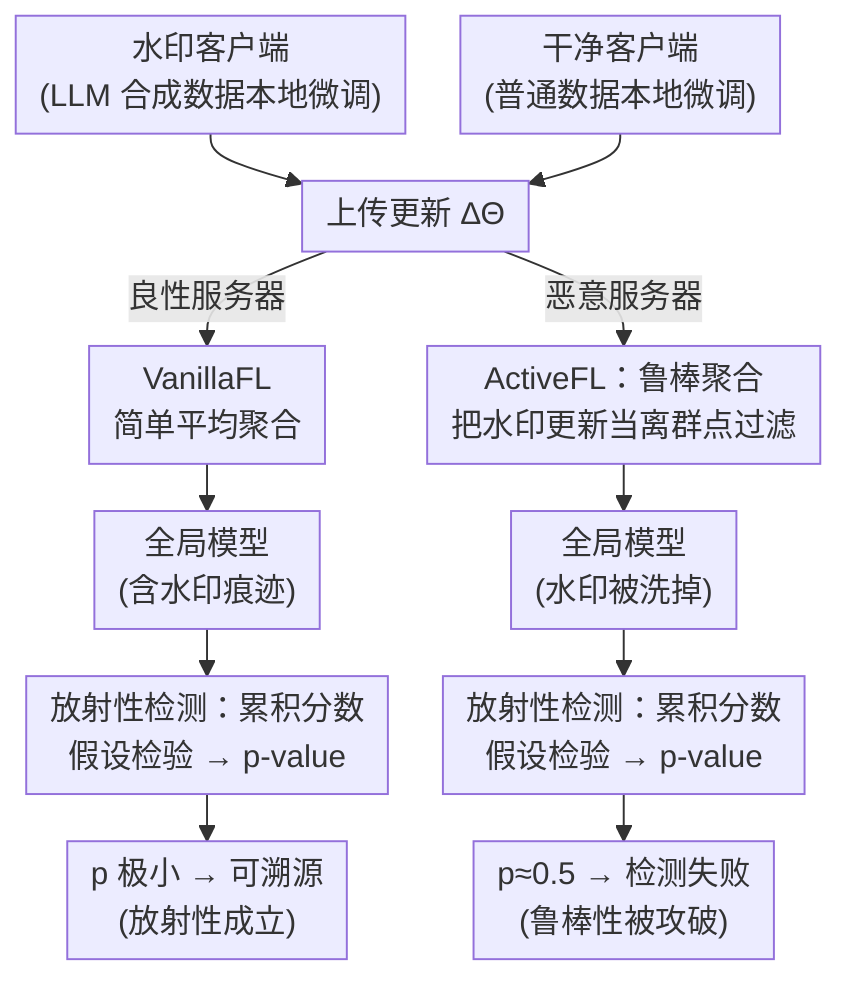

# Watermark Robustness and Radioactivity May Be at Odds in Federated Learning

**会议**: ICLR 2026  
**arXiv**: [2510.17033](https://arxiv.org/abs/2510.17033)  
**领域**: 视频理解  
**关键词**: 联邦学习, LLM水印, 数据溯源, 鲁棒聚合, 放射性检测

## 一句话总结

首次研究联邦学习中 LLM 水印的数据溯源问题，发现水印在 FL 中具有放射性（可检测），但恶意服务器可通过强鲁棒聚合算法过滤水印更新，揭示了放射性、鲁棒性和模型效用之间的根本性三元矛盾。

## 研究背景与动机

随着 LLM 生成的合成数据在联邦学习（FL）中的广泛使用，数据溯源（data provenance）变得至关重要：

**合成数据泛滥**：FL 客户端越来越多地使用 LLM 生成的合成数据集进行本地训练

**溯源需求**：若合成数据被恶意利用进行微调，无溯源机制则无法追责

**法规要求**：EU AI 法案等法规明确要求 AI 系统的透明性和可追溯性

**核心问题**：LLM 水印在 FL 环境中是否仍然有效？恶意服务器能否在保持模型效用的同时移除水印信号？

### 关键发现

通过 t-SNE 可视化发现：水印客户端的模型更新在高维空间中呈现为**异常值**，与干净客户端的更新分布明显分离（图1），这为恶意服务器提供了攻击手柄。

## 方法详解

### 整体框架

本文不提出新算法，而是把"LLM 水印能否在联邦学习（federated learning, FL）里溯源数据来源"这个问题形式化，并在两种服务器假设下做攻防对照实验。流程的左半段对双方都一样：部分客户端用带水印的 LLM 合成数据做本地微调、其余用干净数据，各自把模型更新 $\Delta\theta_i$ 上传服务器；右半段才分叉。良性服务器走 **VanillaFL**——把所有更新简单平均，得到全局模型后用检测器跑一次假设检验，看水印信号还在不在（这是放射性的基线）。恶意服务器走 **ActiveFL**——只把"平均"换成拜占庭鲁棒聚合器，专门把带水印的更新当离群点过滤掉，既保住模型效用又让事后检测失效。把同一组客户端分别喂给这两条分支，就能量化水印的可检测性（放射性）与抗过滤能力（鲁棒性），暴露二者的根本冲突。

### 关键设计

**1. 放射性的形式化：用统计检验把"模型见过水印数据"变成可拒绝的假设**

要在 FL 里追责，得先把"水印有没有留下痕迹"说清楚。本文定义：水印数据集 $D^w$ 对统计检验 $T$ 是 $\alpha$-放射性的，当且仅当 $T$ 能以低于 $\alpha$ 的 p-value 拒绝零假设 $H_0$——即"模型没在 $D^w$ 上训练过"。检测器（Detect）先在全局模型对 $D^w$ 的预测上累积一个分数，再把它和"没训练过 $D^w$ 的模型"的零分布比较，得到 p-value。这样溯源就被转化为一次假设检验：p-value 越小，越能断言聚合后的全局模型确实吸收了某个客户端的水印数据。KGW+ 这类绿名单水印的检测器能跨多个 prompt 累积统计信号，因此在 FL 里哪怕只有少量水印数据也能把 p-value 压得很低；而 KTH+ 的检测器无法跨 prompt 累积，信号被本地训练的漂移稀释，几乎检不出，这也解释了后文两种水印放射性的巨大差异。

**2. FL 鲁棒性的形式化：水印要"既被效用保留、又被检测识破"才算抗住攻击**

光定义可检测性还不够，得刻画攻击者能否在不伤害模型的前提下抹掉水印。本文规定：对一个本该在 VanillaFL 下变成 $\alpha$-放射性的数据集 $D^w_i$，若存在对抗者 $\mathcal{A}$ 同时满足两条——其聚合结果与诚实训练在评价指标 $\mathcal{E}$ 下近似等价从而保住效用，$\mathcal{A}(U_\Delta, \theta^{t_\mathcal{A}}) \approx_\mathcal{E} \mathcal{T}(C_\Delta, \theta^{t_\mathcal{A}})$；且事后对该数据的检测失败，$\text{Detect}^{\mathcal{M}_{\theta^{t_\mathcal{A}+1}},\mathcal{A}}_s(D^w_i) \rightarrow \text{False}$——则称 $D^w_i$ 对 $\mathcal{A}$ 不鲁棒。注意鲁棒性是针对"具体数据集"而非"水印方案"定义的，和放射性对齐。换言之，鲁棒性要求水印必须"既不影响模型质量、又躲过过滤"，这正好和攻击者的目标对立，为三元权衡埋下伏笔。

**3. 鲁棒聚合即攻击手段：把防拜占庭的离群点过滤反过来用于洗水印**

攻击者无需知道水印方案或密钥，只要把服务器的简单平均换成拜占庭鲁棒聚合器（本文用 RandEigen）即可——这正是图中 ActiveFL 那条分支。关键观察来自 t-SNE：带水印训练引入的分布偏移，使水印客户端的更新在高维参数空间中天然成为离群点，恰好落入这类聚合器设计来剔除的区域。这类强鲁棒聚合器对滤波后均值与诚实均值的偏差给出上界

$$\text{bias} = \|\text{Fil}(U_\Delta) - \mu_C\|_2 \leq \beta \cdot \|\Sigma_C\|_2^{1/2}$$

其中 $\beta = O(1)$ 与参数维度 $d$ 无关——这点对动辄上亿维的 LLM 至关重要，意味着即便在极高维空间，过滤后的全局模型也能贴近"只用干净客户端训练"的结果，从而在保住效用的同时把水印信号一并清除。为量化这套攻防，本文用两个指标刻画过滤效果：**逃逸率（escape rate, ER）** 指水印客户端在聚合后仍未被过滤的比例，ER 越高说明水印越能躲过过滤、越鲁棒；**过度过滤率（over-filtering rate, OFR）** 指被过滤掉的客户端里非水印客户端所占比例，衡量攻击的附带损伤。实验显示增大水印强度 $\delta$ 会让 ER 从 60.2%（$\delta=0$）骤降到 0.7%（$\delta=5$）——水印打得越深越易检测，却也越像离群点、越容易被洗掉，这正是放射性与鲁棒性"水火不容"的直接体现。

## 实验关键数据

### 放射性检测结果（VanillaFL，ε=6.6%）

| 数据集 | 水印 | 模型 | FT前 p-value | FT后 p-value |
|--------|------|------|-------------|-------------|
| C4 | KGW+ | 160M | 0.397 | $1.27\times10^{-3}$ |
| C4 | KGW+ | 410M | 0.877 | $2.41\times10^{-8}$ |
| Alpaca | KGW+ | 410M | 0.302 | $4.96\times10^{-24}$ |
| C4 | KTH+ | 全部 | ~0.5 | ~0.5 |

### 鲁棒性检测结果（ActiveFL vs VanillaFL，ε=6.6%）

| 数据集 | 模型 | VanillaFL p-value | ActiveFL p-value |
|--------|------|-------------------|------------------|
| C4 | 160M | $1.27\times10^{-3}$ | 0.550 |
| C4 | 410M | $2.41\times10^{-8}$ | 0.613 |
| Alpaca | 160M | $1.59\times10^{-11}$ | 0.231 |
| Alpaca | 410M | $4.96\times10^{-24}$ | 0.282 |

### 关键发现

1. **KGW+ 水印在 FL 中具有强放射性**：即使仅 6.6% 数据带水印，p-value 可低至 $10^{-24}$
2. **KTH+ 水印在 FL 中不具放射性**：因其检测器无法跨 prompt 累积统计信号
3. **RandEigen 聚合器有效移除所有水印**：所有放射性水印在 ActiveFL 下 p-value 均恢复至 ~0.5
4. **更大 δ 提高放射性但降低鲁棒性**：ER 从 60.2%（δ=0）降至 0.7%（δ=5）
5. **三元矛盾**：增大 ε 同时提高放射性和鲁棒性，但降低模型效用

## 亮点与洞察

1. **首个联邦数据溯源研究**：将水印检测从集中式扩展到分布式 FL 场景
2. **攻击者视角的洞察**：水印引入的分布偏移使更新成为异常值，恰好被设计用于防御拜占庭攻击的聚合器过滤
3. **三元权衡的揭示**：放射性（可检测性）、鲁棒性（抗攻击性）和效用（模型质量）无法同时满足
4. **实用的威胁模型**：服务器仅需更换聚合函数即可移除水印，无需知道水印方案细节

## 局限性

1. 仅评估了 Pythia 系列（70M-410M），未在更大模型上验证
2. 仅考虑两种水印方案（KGW+、KTH+），覆盖面有限
3. 假设恶意服务器不知道水印密钥和方案，实际中信息可能泄露
4. 未提出有效的防御方案来应对鲁棒聚合攻击
5. 水印客户端比例 ε 设置较小（最大 30%），更极端场景未探索

## 评分 ⭐⭐⭐⭐

问题定义新颖，实验设计严谨，揭示了 FL 中水印的根本性矛盾。虽然未提出解决方案，但为后续研究指明了方向。与视频理解领域关联较弱，更偏向安全与联邦学习交叉方向。

<!-- RELATED:START -->

## 相关论文

- [\[ICLR 2026\] SABRE-FL: Selective and Accurate Backdoor Rejection for Federated Prompt Learning](sabre-fl_selective_and_accurate_backdoor_rejection_for_federated_prompt_learning.md)
- [\[ICML 2026\] Decoupled Training with Local Reinforcement Fine-Tuning in Federated Learning](../../ICML2026/llm_safety/decoupled_training_with_local_reinforcement_fine-tuning_in_federated_learning.md)
- [\[AAAI 2026\] FedP²EFT: Federated Learning to Personalize PEFT for Multilingual LLMs](../../AAAI2026/llm_safety/fedp2eft_federated_learning_to_personalize_peft_for_multilingual_llms.md)
- [\[NeurIPS 2025\] FedSVD: Adaptive Orthogonalization for Private Federated Learning with LoRA](../../NeurIPS2025/llm_safety/fedsvd_adaptive_orthogonalization_for_private_federated_learning_with_lora.md)
- [\[NeurIPS 2025\] Learning to Watermark: A Selective Watermarking Framework for Large Language Models via Multi-Objective Optimization](../../NeurIPS2025/llm_safety/learning_to_watermark_a_selective_watermarking_framework_for_large_language_mode.md)

<!-- RELATED:END -->
