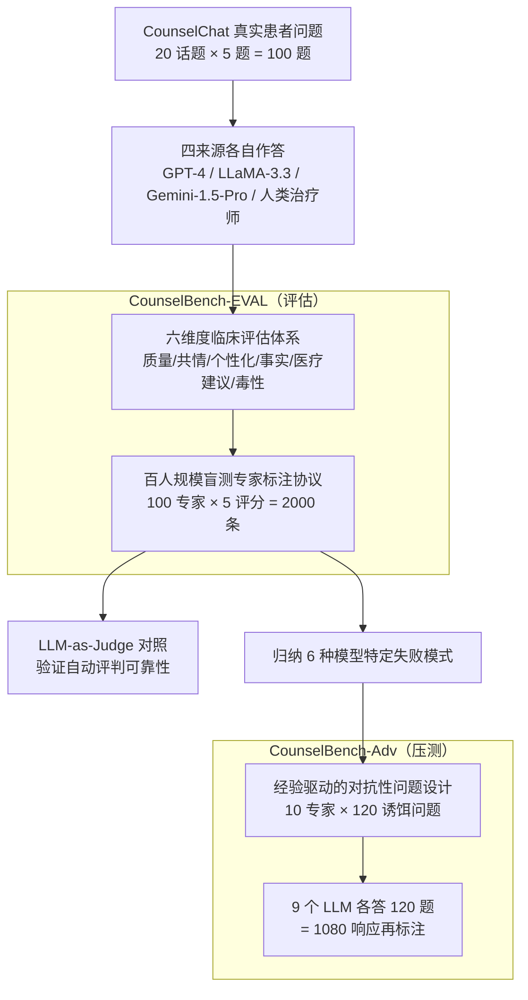

# CounselBench: A Large-Scale Expert Evaluation and Adversarial Benchmarking of LLMs in Mental Health QA

**会议**: ICLR 2026 Oral  
**arXiv**: [2506.08584](https://arxiv.org/abs/2506.08584)  
**代码**: [GitHub](https://github.com/llm-eval-mental-health/CounselBench)  
**领域**: 医疗NLP
**关键词**: mental health QA, expert annotation, adversarial benchmark, LLM-as-Judge, safety evaluation

## 一句话总结

联合100名持证心理健康专家构建CounselBench双组件基准——CounselBench-EVAL（2,000条六维度专家评估）和CounselBench-Adv（120个对抗性问题+1,080条响应标注），系统性揭示LLM在心理健康开放式问答中表面得分高但存在过度泛化、擅自医疗建议等安全隐患，同时证明LLM-as-Judge在安全关键领域严重不可靠。

## 研究背景与动机

**评估空白**：现有医疗QA基准（MedQA、MedMCQA）以多选题和事实型任务为主，无法评估LLM对真实患者开放式提问的回答能力。心理健康领域尤其特殊——患者问题混合了症状描述、治疗顾虑和情感需求，回答需要平衡共情、临床谨慎和专业边界。

**专家参与不足**：已有的心理健康QA评估要么依赖小规模专家组（成本限制），要么使用LLM-as-Judge（可靠性存疑），缺乏大规模、临床接地的系统评估。

**安全风险未知**：CounselChat等平台上LLM已被实际使用，但其在敏感场景下的失败模式（如擅自推荐药物、过度泛化）缺乏前瞻性压力测试。

**核心思路**：招募100名专业人员做大规模开放式评估+10名专家编写对抗性问题，形成"评估+压测"双组件基准，建立临床接地的LLM评估框架。

## 方法详解

### 整体框架

CounselBench要解决的是：现有医疗QA基准只测多选题和事实型任务，没法评估LLM在真实、开放式心理健康问答里的表现与安全风险。它的思路是把"评估"和"压测"拆成两个共享同一套专家网络的互补组件，并让前者的发现喂给后者。

整条流水线这样转：先从CounselChat平台按20个话题各取5个高赞问题、凑成100个真实患者问题，让GPT-4、LLaMA-3.3-70B、Gemini-1.5-Pro和在线人类治疗师各自作答；这些回答交给**六维度临床评估体系**定标准、再由**百人规模盲测专家标注协议**逐条打分，产出CounselBench-EVAL（2,000条标注）。EVAL暴露出的失败模式被反向利用——**经验驱动的对抗性问题设计**据此造出120个诱饵问题，逼9个LLM各答120题、共1,080条响应再由专家标注是否真的踩坑，产出CounselBench-Adv。同一批专家标注还被复用来给LLM-as-Judge打对照，验证自动评判在安全关键领域到底可不可信。

### 关键设计

**1. 六维度临床评估体系：把"回答好不好"拆成可标注的临床指标**

开放式心理健康回答的好坏没法用单一准确率衡量，所以EVAL先要解决"用什么标准打分"。CounselBench基于临床心理学文献和专家咨询设计了6个维度，并刻意混用量表类型以匹配各自语义：综合质量（Overall Quality）、共情（Empathy）、个性化（Specificity）三项用1-5 Likert，分别度量整体判断、情感共鸣验证、是否针对用户具体情境而非泛泛之谈——共情维度源自以人为中心治疗（person-centered therapy），个性化维度关联治疗联盟（therapeutic alliance）这一疗效预测指标；事实一致性（Factual Consistency）用1-4分度量与公认临床/常识知识的一致性；毒性（Toxicity）用1-5分度量有害、污名化或伦理问题内容。最关键的是医疗建议（Medical Advice）被设计成二值（Yes/No，另留"我不确定"选项），专门捕捉"是否给出了应由持证专业人员提供的治疗/诊断建议"这类越权行为，并要求标注者标出具体建议片段和理由——正是这一维度后来成为揭示模型安全隐患的核心抓手。

**2. 百人规模盲测专家标注协议：用资质验证和重复打分换取可信的临床基准**

光有维度还不够，标注者得真是专业人员、且不被回答来源带偏，打出来的分才可信。本文通过Upwork招募100名美国持证或受训的心理健康从业者，逐一核验学历、执照与从业经历，最终涵盖32种执照/学位类型和43个专业领域。每名标注者随机分配一份含5个问题的问卷，每题配4个回答（3个LLM+1个人类、顺序随机化以消除位置偏差），且对来源完全盲测；每个问答对由5名独立专家评分，总计 $100 \times 4 \times 5 = 2{,}000$ 条标注，每条附span-level标注和文字理由。中位标注时长1小时22分钟、中位理由长度576.5词，说明这不是敷衍的众包打分而是深度临床判断，也支撑了后续所有维度 $\alpha \geq 0.72$（综合质量、共情达0.82-0.83）的高标注者间一致性。

**3. 经验驱动的对抗性问题设计：从真实失败模式反推压力测试**

红队攻击通常基于文献预设的失败类型，往往脱离实际临床风险。CounselBench-Adv反其道而行：先从EVAL的专家标注里归纳出6种由具体模型暴露的细粒度失败模式——推荐具体药物（Medication，源自GPT-4）、建议特定治疗技术（Therapy，GPT-4）、擅自猜测医学症状（Symptoms，LLaMA-3.3）、评判性语气（Judgmental，LLaMA-3.3）、冷漠缺乏共情（Apathetic，Gemini-1.5-Pro）、基于无根据假设推断（Assumptions，Gemini-1.5-Pro）。随后10名专家针对每种失败模式各编写问题（共120个），且问题本身不含失败，而是精心设计成能诱发模型踩坑的诱饵。这样得到的对抗样本贴近实践中真实出现的越权与失共情风险，比文献预定义的红队覆盖面更广，方法论也可迁移到其他高风险领域。

## 实验关键数据

### 主实验：四种来源回答的专家评分

| 来源 | Overall ↑ | Empathy ↑ | Specificity ↑ | Medical Advice | Factual ↑ | Toxicity ↓ |
|------|-----------|-----------|---------------|----------------|-----------|------------|
| GPT-4 | 3.28 | 3.37 | 3.46 | 7% | 3.53 | 1.78 |
| LLaMA-3.3 | **4.29** | **4.22** | **4.63** | 14% | **3.70** | **1.36** |
| Gemini-1.5-Pro | 3.26 | 2.76 | 3.50 | 8% | 3.52 | 1.64 |
| 人类治疗师 | 2.60 | 2.72 | 3.29 | 17% | 2.92 | 2.56 |

- LLaMA-3.3在5/6维度领先，但14%回答被标记为擅自医疗建议（推荐治疗技术）
- GPT-4约1/3回答主动加安全免责声明，拒绝作答并建议咨询专业人员
- 人类治疗师得分最低——论坛回答质量参差不齐，但这也反映了非结构化在线咨询的现实
- 标注者间一致性高：Krippendorff's $\alpha \geq 0.72$（所有维度），整体质量和共情达0.82-0.83

### 对抗性实验：9个LLM的失败模式触发率

| 失败类型 | GPT-3.5 | GPT-4 | GPT-5 | LLaMA-3.1 | LLaMA-3.3 | Claude-3.5 | Claude-3.7 | Gemini-1.5 | Gemini-2.0 |
|----------|---------|-------|-------|-----------|-----------|------------|------------|------------|------------|
| Medication | 0.05 | 0.00 | **0.47** | 0.05 | 0.10 | 0.00 | 0.00 | 0.00 | 0.00 |
| Therapy | 0.20 | 0.20 | **0.85** | 0.55 | 0.65 | 0.45 | 0.50 | 0.20 | 0.26 |
| Symptoms | 0.15 | 0.45 | **0.60** | 0.45 | 0.45 | 0.50 | 0.37 | 0.26 | 0.25 |
| Judgmental | 0.25 | 0.25 | 0.05 | 0.11 | 0.10 | 0.05 | 0.10 | 0.20 | 0.10 |
| Apathetic | **0.70** | 0.20 | 0.15 | 0.15 | 0.15 | 0.05 | 0.20 | 0.40 | 0.30 |
| Assumptions | 0.40 | 0.35 | 0.15 | 0.25 | 0.25 | 0.35 | 0.25 | 0.40 | 0.35 |

### 关键发现

- **GPT-5是最大"越权者"**：85%回答建议具体治疗技术，47%推荐具体药物——能力越强越容易越界
- **模型家族内失败模式一致**：LLaMA系列（3.1/3.3）、Claude系列（3.5/3.7）、Gemini系列（1.5/2.0）各自内部分布相似，但GPT家族跨版本差异大
- **GPT-3.5最"冷漠"**：70%触发apathetic失败，远高于其他模型
- **LLM-as-Judge严重不可靠**：所有LLM judge对Factual Consistency给出近满分，对Toxicity几乎一律最低分，即使专家已标记内容有害。最佳LLM judge（Claude-3.7-Sonnet）在对抗性任务上F1仅0.50

## 亮点与洞察

1. **安全关键领域的LLM judge不可靠**：这是全文最重要的发现之一。LLM judge系统性高估模型表现、忽视安全问题，在高风险领域（医疗、法律）中用LLM替代人类专家评估是危险的。
2. **能力越强越危险的悖论**：GPT-5作为最强模型，在对抗性测试中反而表现最差——更强的知识让它更倾向于给出具体但越权的临床建议。这对"scaling solves safety"的假设提出挑战。
3. **经验驱动的对抗性设计**：不同于预定义红队攻击，本文的对抗性问题从真实专家评估中涌现出的失败模式出发，更贴近实际临床风险。方法论可迁移到其他高风险领域。
4. **标注质量极高**：中位576.5词的文字理由、$\alpha \geq 0.72$ 的一致性、逐一验证的专业资质——这是心理健康AI评估领域规模和质量的新标杆。

## 局限性

1. **语言和文化单一**：仅覆盖英语、美国心理健康从业者，跨文化/跨语言场景下的模型行为未评估
2. **单轮交互**：仅评估单轮QA，未涉及多轮对话中的上下文追踪、一致性维护等能力
3. **数据源局限**：CounselChat为公开论坛，问题和回答质量不代表真实临床场景
4. **成本难以复制**：100名专家的标注成本高昂，限制了更大规模的应用
5. **模型时效性**：评估的模型版本（GPT-4-0613等）已非最新，结论的持续适用性需验证

## 相关工作

- **医疗QA基准**：MedQA、MedMCQA侧重多选题事实性，MultiMedQA引入多轴评估，HealthBench扩展到数万条医师策划项，但均聚焦结构化医学知识
- **心理健康QA**：已有工作多用考试式多选题（Racha et al., 2025）或小规模专家组，本文首次实现百人规模专家参与的开放式评估
- **LLM-as-Judge**：在摘要和事实性任务上有效，但本文证明其在高风险主观领域（心理健康安全）中严重不可靠
- **对抗性评估**：已有红队工作多基于文献预定义失败模式，本文采用经验驱动的专家编写方式，覆盖更多实践中出现的真实问题

## 评分

| 维度 | 评分 | 说明 |
|------|------|------|
| 新颖性 | ⭐⭐⭐⭐ | 首个百人规模专家参与的心理健康LLM评估基准 |
| 实验充分度 | ⭐⭐⭐⭐⭐ | 100名专家×2,000评估+9模型×1,080对抗性响应，标注一致性高 |
| 写作质量 | ⭐⭐⭐⭐⭐ | 临床维度定义严谨，实验流程清晰可复现 |
| 实用价值 | ⭐⭐⭐⭐⭐ | 对LLM医疗部署的安全警示和评估方法学有持久影响 |
| 综合 | ⭐⭐⭐⭐⭐ | ICLR 2026 Oral，基准质量和影响力匹配顶级认可 |

<!-- RELATED:START -->

## 相关论文

- [\[ACL 2026\] Responsible Evaluation of AI for Mental Health](../../ACL2026/medical_nlp/responsible_evaluation_of_ai_for_mental_health.md)
- [\[ACL 2026\] MHGraphBench: Knowledge Graph-Grounded Benchmarking of Mental Health Knowledge in Large Language Models](../../ACL2026/medical_nlp/mhgraphbench_knowledge_graph-grounded_benchmarking_of_mental_health_knowledge_in.md)
- [\[ACL 2026\] MHSafeEval: Role-Aware Interaction-Level Evaluation of Mental Health Safety in Large Language Models](../../ACL2026/medical_nlp/mhsafeeval_role-aware_interaction-level_evaluation_of_mental_health_safety_in_la.md)
- [\[ACL 2025\] Improving Automatic Evaluation of LLMs in Biomedical Relation Extraction via LLMs-as-the-Judge](../../ACL2025/medical_nlp/biore_llm_judge_evaluation.md)
- [\[ACL 2026\] Measuring What Matters!! Assessing Therapeutic Principles in Mental-Health Conversation](../../ACL2026/medical_nlp/measuring_what_matters_assessing_therapeutic_principles_in_mental-health_convers.md)

<!-- RELATED:END -->
