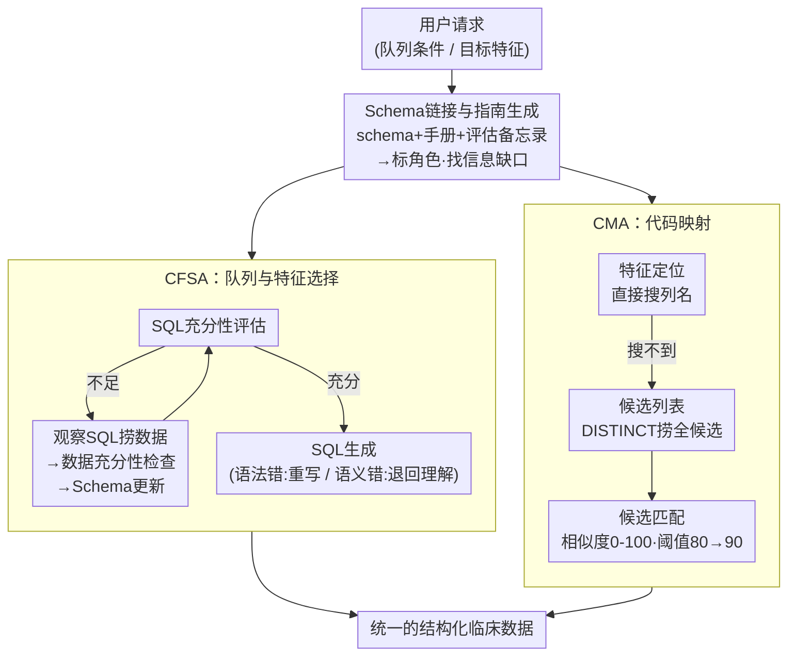

# EMR-AGENT: Automating Cohort and Feature Extraction from EMR Databases

**会议**: ICLR 2026  
**arXiv**: [2510.00549](https://arxiv.org/abs/2510.00549)  
**代码**: [有](https://github.com/AITRICS/EMR-AGENT)  
**领域**: 医疗NLP  
**关键词**: 电子病历, LLM Agent, 队列选择, 特征提取, 代码映射

## 一句话总结

提出EMR-AGENT，首个基于LLM Agent的电子病历（EMR）自动化预处理框架，通过动态SQL交互替代手工规则编写，实现跨数据库的队列选择、特征提取和代码映射，在MIMIC-III/eICU/SICdb上表现优异并具强泛化能力。

## 研究背景与动机

临床预测模型依赖从EMR中提取的结构化数据，但这一过程仍被硬编码、数据库特定的流水线主导，涉及队列定义、特征选择和代码映射三大步骤。这带来两大核心挑战：

**挑战1：跨机构语义和结构异质性**。不同医院EMR系统差异极大。例如"心率"在MIMIC-III中是`itemid=211`，在SICdb中是`HeartRateECG`，在eICU中是列名`heartrate`。这导致模型在跨数据库部署时的可比性和泛化性严重受限。

**挑战2：同一数据库内的不一致性**。同一临床概念可能有多种测量方式（如心率可通过传感器、听诊、触诊获得），导致多种代码映射。队列选择标准的模糊性（如"首次ICU入院"的不同解读）也造成不同研究选出不同患者群体。

现有解决方案（YAIB、ACES、BlendedICU等）要么依赖硬编码规则缺乏灵活性，要么依赖预定义输入格式限制泛化性。**核心问题**：能否用AI agent替代人工规则编写，实现自动化EMR预处理？

## 方法详解

### 整体框架

EMR-AGENT把"人工写规则做EMR预处理"重构成两个LLM Agent的自主探索：拿到用户请求后，先经过一个共享前端模块**Schema链接与指南生成**读懂陌生数据库，再分流给两个专职Agent——**CFSA**（队列与特征选择Agent，Cohort and Feature Selection Agent）负责选患者队列、提临床变量，**CMA**（代码映射Agent，Code Mapping Agent）负责把不同EMR系统里五花八门的特征编码对齐到统一标准，最后汇成一份标准化的结构化临床数据。整套系统的核心理念是把SQL当成"探索和决策工具"而非仅仅是最终查询的输出——Agent反复跑观察性查询、读返回结果、对照数据库文档来逐步厘清schema，最后才生成正式的提取语句，整个过程模仿临床人员"先读文档再上手查库"的工作方式。

### 关键设计

**1. Schema链接与指南生成：先读懂数据库再下手**

跨机构EMR最大的麻烦是同一个临床概念在不同库里长得完全不一样（"心率"在MIMIC-III是`itemid=211`，在SICdb是字符串`HeartRateECG`，在eICU是列名`heartrate`），只看裸schema根本对不上号。该共享前端模块因此不止吃schema，还引入数据库手册、评估备忘录等多种外部知识源，并在此基础上生成一份"指南"（Schema Guideline）：它会系统地标注每个表、每个列扮演什么角色，同时显式点出哪些信息缺失或含糊、需要进一步验证——这正是它和传统schema linking只决定"用哪些表列"的关键区别。给CFSA时，指南帮它规划接下来要跑哪些观测SQL（如发现缺性别编码就标记"暂不能生成SQL"）；给CMA时，指南先把列的角色定清楚，为后续准确生成候选编码列表打底。

**2. CFSA：用SQL观察-生成-纠错逼近正确查询**

CFSA不假设自己一次就能写对查询，而是先做一轮三步的SQL观察：**SQL充分性评估**判断当前schema和指南是否已经够写出目标SQL，不够就生成观察SQL去活库里捞额外数据（如查"性别在本库怎么存"）；**数据充分性检查**评估这批观察SQL返回的内容有没有真的改善理解（如发现"Male"对应编码23这个关键信息），有用就更新、没用就重新评估；**Schema更新**把新捞到的信息整合回schema和指南。观察到位后进入SQL生成与纠错——遇到语法错误就直接重写，遇到语法对但语义错（schema不匹配）就退回Schema链接步骤重新理解，拿到正确结果才算完成提取。为了平衡稳定与探索，CFSA最多允许10次观察（每次最多5条查询），前5次温度设为0保证确定性，之后每次温度$+0.1$鼓励跳出局部思路，错误反馈最多重试5次。

**3. CMA：候选列举加双阈值匹配，把杂乱编码对齐到统一特征**

代码映射的难点在于同一个临床概念往往有多种测量方式和多套编码，必须从一堆候选里挑出最贴合的那个。CMA先做**特征定位**，在schema里直接搜目标特征的列名；若直接搜不到，则进入**候选匹配**：候选列表阶段从schema里圈定可能含该特征ID、名称、单位的表和列，跑SQL DISTINCT查询把所有候选组合捞全；目标与候选匹配阶段批量比较用户请求的特征与候选，给每对算一个$0$–$100$的相似度分数，并执行两轮——先用相似度80粗筛，再用用户自定义阈值（实验中取90）精筛。这个用户可调阈值还带来实用性：调低阈值多召回（牺牲精度）、调高阈值压假阳（优先精度），让用户按需在召回与精度间权衡。

### 损失函数 / 训练策略

EMR-AGENT是纯推理驱动的Agent框架，不涉及任何训练；两个Agent都采用"问题分解"策略，把复杂的预处理任务拆成可管理的子问题逐个攻克。主力骨干用Claude-3.5-Sonnet，实验表明Agent能力强烈依赖骨干LLM的推理质量。

## 实验关键数据

### 主实验

**队列与特征选择（F1/Accuracy）**

| 方法 | MIMIC-III F1 | eICU F1 | SICdb F1 |
|------|:---:|:---:|:---:|
| **EMR-AGENT** | **0.940** | **0.929** | **0.814** |
| ICL(PLUQ) | 0.749 | 0.132 | 0.407 |
| DinSQL | 0.726 | 0.000 | 0.071 |
| REACT | 0.308 | 0.524 | 0.503 |
| ICL(SeqSQL) | 0.040 | 0.000 | 0.040 |

EMR-AGENT在所有数据库上大幅领先。eICU和SICdb上基线方法几乎完全失败（F1<0.53），而EMR-AGENT保持>0.81。

**代码映射（F1/Balanced Accuracy）**

| 方法 | MIMIC-III F1 | eICU F1 | SICdb F1 |
|------|:---:|:---:|:---:|
| **EMR-AGENT** | **0.516** | **0.648** | **0.536** |
| ICL(PLUQ) | 0.022 | 0.125 | 0.119 |
| REACT | 0.214 | 0.067 | 0.218 |

代码映射更具挑战性，但EMR-AGENT仍大幅领先（提升0.3-0.5 F1）。

### 消融实验

**CFSA组件消融**

| 组件 | MIMIC-III F1 | SICdb F1 |
|------|:---:|:---:|
| 完整系统 | 0.940 | 0.814 |
| 去掉SQL观察 | 0.916 | 0.795 |
| 去掉错误反馈 | 0.688 | 0.617 |
| 去掉全部DB交互 | 0.677 | 0.570 |
| 去掉SchemaGuideline | 0.827 | 0.792 |

**DB交互**是最关键组件。去掉Documents+Modules后CFSA在eICU上F1降为0，CMA全面崩溃。

**不同LLM骨干（SICdb）**

| LLM | CFSA F1 | CMA F1 |
|------|:---:|:---:|
| Claude-3.5-Sonnet | **0.81** | 0.54 |
| Claude-3.7-Sonnet | 0.80 | **0.63** |
| Claude-3.5-haiku | 0.74 | 0.44 |
| Qwen2.5-72B | 0.22 | 0.31 |
| Llama-3.1-70B | 0.18 | 0.14 |

开源模型（Qwen/Llama）性能远低于Claude系列，说明Agent能力强烈依赖骨干LLM的推理质量。

### 关键发现

1. 动态数据库交互（SQL观察+错误反馈）是性能的最大贡献者
2. 外部知识（数据库手册+评估备忘录）对CMA尤为关键
3. 在未见过的数据库（SICdb，晚于LLM训练数据截止日期）上仍有良好泛化
4. 代码映射固有困难（同一特征多种编码），F1~0.5-0.65已是显著进步

## 亮点与洞察

- **范式创新**：从手工编写规则到AI Agent动态交互的EMR预处理范式转变
- **SQL作为探索工具**：不同于Text-to-SQL的单次查询，Agent将SQL用于迭代观察、验证和决策
- **Schema Guideline方法**：结合多知识源的上下文感知schema理解，超越传统schema linking
- **配套基准PreCISE-EMR**：首个标准化EMR预处理评估协议，与临床专家合作构建
- **实际价值巨大**：医疗ML的数据预处理是真实瓶颈，自动化可极大提升效率

## 局限与展望

- 代码映射F1仍有提升空间（0.5-0.65），特别是同义临床概念的消歧
- 强烈依赖Claude系列LLM，开源模型效果差距大
- 仅评估ICU数据库（MIMIC-III/eICU/SICdb），未涉及门诊或专科EMR
- 56个特征限于生命体征和实验室结果，未覆盖用药、诊断代码、影像报告等
- 计算成本（多次LLM调用+SQL交互）未详细分析
- 需用户获取PhysioNet凭据才能复现，增加了准入门槛

## 相关工作与启发

- **vs YAIB/BlendedICU**：后者硬编码规则，新数据库需人工适配；EMR-AGENT自动适应
- **vs ACES/Clairvoyance**：后者依赖固定输入格式，EMR-AGENT直接与原始数据库交互
- **vs Text-to-SQL**（PLUQ/EHRSQL）：后者假设用户熟悉schema、只做单次查询；EMR-AGENT处理多轮探索和schema不确定性
- **vs EHRAgent**：后者做孤立的图表查询，EMR-AGENT做结构化预处理流水线
- **启发**：Agent驱动的数据获取可能成为医疗AI的新基础设施层

## 评分

| 维度 | 分数 |
|------|:---:|
| 创新性 | ★★★★★ |
| 理论深度 | ★★★☆☆ |
| 实验充分性 | ★★★★☆ |
| 实用价值 | ★★★★★ |
| 写作质量 | ★★★★☆ |

<!-- RELATED:START -->

## 相关论文

- [\[ICLR 2026\] Resp-Agent: An Agent-Based System for Multimodal Respiratory Sound Generation and Disease Diagnosis](resp-agent_an_agent-based_system_for_multimodal_respiratory_sound_generation_and.md)
- [\[ACL 2026\] RA-RRG: Multimodal Retrieval-Augmented Radiology Report Generation with Key Phrase Extraction](../../ACL2026/medical_nlp/ra-rrg_multimodal_retrieval-augmented_radiology_report_generation_with_key_phras.md)
- [\[ACL 2026\] MARCH: Multi-Agent Radiology Clinical Hierarchy for CT Report Generation](../../ACL2026/medical_nlp/march_multi-agent_radiology_clinical_hierarchy_for_ct_report_generation.md)
- [\[ACL 2025\] Query-driven Document-level Scientific Evidence Extraction from Biomedical Studies](../../ACL2025/medical_nlp/urca_biomedical_evidence_extraction.md)
- [\[ACL 2025\] Improving Automatic Evaluation of LLMs in Biomedical Relation Extraction via LLMs-as-the-Judge](../../ACL2025/medical_nlp/biore_llm_judge_evaluation.md)

<!-- RELATED:END -->
