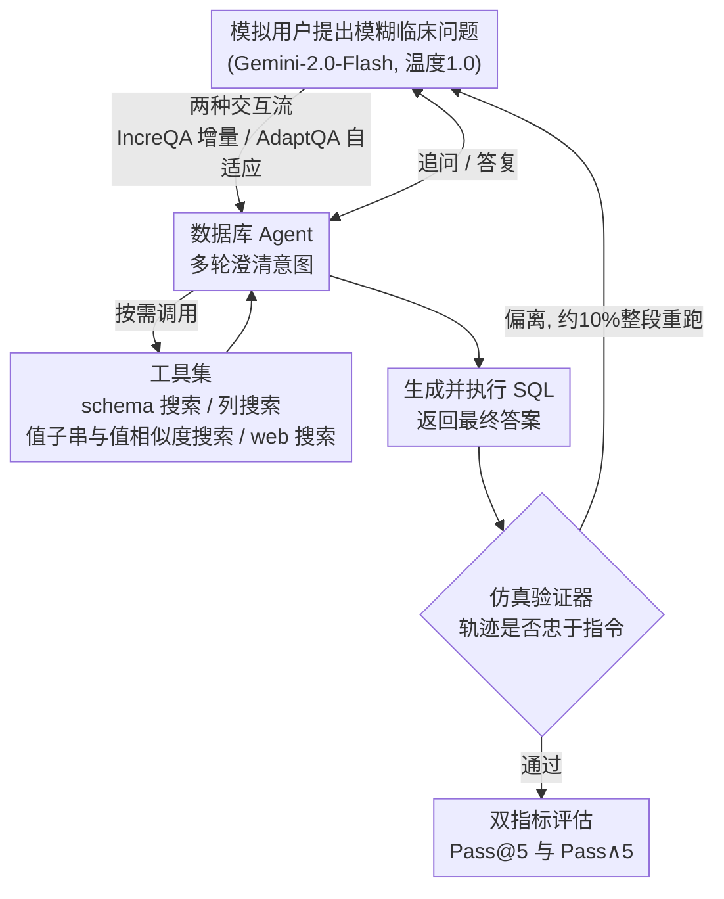

# From Conversation to Query Execution: Benchmarking User and Tool Interactions for EHR Database Agents

**会议**: ICLR 2026  
**arXiv**: [2509.23415](https://arxiv.org/abs/2509.23415)  
**代码**: [GitHub](https://github.com/glee4810/EHR-ChatQA)  
**领域**: 医疗NLP
**关键词**: EHR, 数据库Agent, 交互式QA, 查询歧义, 值不匹配

## 一句话总结
提出EHR-ChatQA基准，首次评估数据库Agent在电子病历场景中的端到端交互工作流（澄清模糊查询→解决术语不匹配→生成SQL→返回答案），发现最强模型(o4-mini)的Pass@5超90%但Pass∧5(全部成功)大幅下降(差距达60%)，暴露了安全关键领域的鲁棒性缺陷。

## 研究背景与动机

**领域现状**：LLM Agent越来越多用于与结构化数据库交互。Text-to-SQL基准（Spider、BIRD等）评估单轮自然语言→SQL翻译，但不涉及交互式场景。

**现有痛点**：(1) **查询歧义**：临床用户常提模糊问题（如"给我看最近的化验"）缺乏具体限定；(2) **值不匹配**：临床术语与数据库条目不一致（如"Lopressor" vs "metoprolol tartrate"）；(3) 现有基准不评估Agent在多轮交互中澄清intent、调用工具解决不匹配、生成正确SQL的端到端能力。

**核心矛盾**：单轮SQL生成已经不够——真实临床场景需要Agent主动提问、搜索数据库值、调用外部知识来桥接用户意图与数据库内容之间的鸿沟。

**切入角度**：构建完整的交互环境（LLM模拟用户+工具集+验证器），评估Agent从对话到查询执行的全链路。

## 方法详解

### 整体框架

EHR-ChatQA 把「从对话到查询执行」整条链路封装成一个可复现的交互环境，并用部分可观测马尔可夫决策过程（POMDP, Partially Observable Markov Decision Process）形式化：用户的真实意图是隐状态，Agent 只能通过「与用户对话」和「调用工具」两类动作去逼近它。一个由 LLM 扮演的模拟用户先提出一个模糊的临床问题，被测 Agent 通过多轮对话澄清意图、调用工具集在数据库里检索 schema 与具体取值、最终生成并执行 SQL 返回答案；对话结束后由一个仿真验证器逐条核查整条轨迹是否忠于任务指令，只有通过的轨迹才进入基于规则的打分，并用 Pass@5 与 Pass∧5 双指标量化。基准建在 MIMIC-IV 和 eICU 两个真实电子病历（EHR）数据库之上，共 366 个任务实例，覆盖查询歧义与值不匹配两类核心挑战。一个容易被忽略的细节是：为防止 SOTA 模型靠记忆这两个流行数据库的原始 schema 直接写 SQL，作者把所有表名/列名重命名（得到 MIMIC-IV⋆ 与 eICU⋆），逼 Agent 真正去用 schema 探索工具，而不是吃先验。

### 关键设计

**1. 两种交互流：分别压测上下文保持与动态适应**

临床用户访问数据的方式不是单一的，因此基准设计了两条互补的交互轨迹。IncreQA（增量查询细化，Incremental Query Refinement）让模拟用户逐步往初始问题里追加约束，目标线性收紧，考验 Agent 能否在多轮中稳定累积并保持上下文；AdaptQA（自适应查询调整，Adaptive Query Refinement）则让用户根据 Agent 返回的中间结果临时改变搜索方向，目标会分支，考验 Agent 能否丢掉旧假设、灵活重规划。两条流分别对齐真实临床数据探索中「逐步精确化」和「边看边调」两种模式，后者被实验证明明显更难。

**2. 工具集：把「桥接用户术语和数据库内容」做成可调用的动作**

Agent 面对的核心困难是用户说的词和数据库里存的值常常对不上（如「Lopressor」对应库里的「metoprolol tartrate」），所以工具集围绕「消除值不匹配」展开，提供 schema 探索（table_search、column_search）、值探索（value_substring_search、value_similarity_search，文本列预先用 text-embedding-3-large 建索引）、外部知识检索（web_search）和查询执行（sql_execute）共六类动作。值子串搜索和值相似度搜索用于在不确定确切写法时定位候选条目，web 搜索引入外部知识桥接同义/别名，SQL 执行负责最终落地。Agent 要不要调、调哪个、调几次都由它自己决定，这正是相比单轮 Text-to-SQL 多出来的交互负担。

**3. 模拟用户与仿真验证器：用 LLM 造出可控又真实的对话方**

模拟用户由 Gemini-2.0-Flash（温度 1.0）驱动以保留自然语言的多样性，但高温采样会让它偶尔偏离预设指令、污染评测。为此作者给模拟用户加了嵌套的验证-反思机制约束行为，并在外层加一个仿真验证器，逐条检查模拟用户的发言是否忠于任务指令，一旦判定偏离就整段重跑——实验中约 10% 的轨迹因此被触发重试，保证打分对象确实是 Agent 能力而非用户噪声。

**4. 双指标评估：把「会做」和「稳定做对」分开量化**

在安全攸关的 EHR 场景里，偶尔答对没有意义，需要每次都对。为此每个任务跑 5 次，用两个指标刻画：$\text{Pass@5}$ 表示 5 次中至少成功一次（乐观上界，反映 Agent「有没有能力」解出任务），$\text{Pass}^{\wedge}5$ 表示 5 次全部成功（反映「能不能稳定解出」）。二者之差 $\text{Pass@5}-\text{Pass}^{\wedge}5$ 直接量化 Agent 的不稳定性，差距越大说明同一任务上的表现越接近随机。正是这个差距（最高约 60%）暴露了即便最强模型也远未达到临床可部署的可靠性。

## 实验关键数据

### 主实验

| 模型 | IncreQA Pass@5 | IncreQA Pass∧5 | AdaptQA Pass@5 | AdaptQA Pass∧5 |
|------|---------------|----------------|----------------|----------------|
| o4-mini | >90% | ~50% | 60-70% | ~20% |
| Gemini-2.5-Flash | >85% | ~45% | 55-65% | ~20% |

### Pass@5 vs Pass∧5差距

| 设置 | 最大差距 | 说明 |
|------|---------|------|
| IncreQA | >38% | 乐观vs鲁棒 |
| AdaptQA | >36% | 更不稳定 |
| 总体最大 | **~60%** | 极度不可靠 |

### 关键发现
- Pass@5高→说明Agent有能力解决任务，但Pass∧5低→不能稳定地解决
- AdaptQA比IncreQA更难——需要根据中间结果灵活调整策略
- 值不匹配是主要失败原因——Agent不能可靠地将用户术语映射到数据库条目
- LLM模拟用户偶尔偏离指令→验证器有效识别并重跑（~10%比例）

## 亮点与洞察
- **Pass@5 vs Pass∧5的洞察**：这种双指标评估揭示了关键的安全问题——在EHR领域"偶尔能做对"不够，需要"每次都做对"。60%的差距意味着同一个Agent在相同任务上有接近随机的表现。
- **值不匹配的重要性**：之前的Text-to-SQL基准忽略了这个问题，但在EHR中极其关键——"Lopressor"不等于"metoprolol tartrate"可能导致完全错误的查询结果。
- **交互流设计**：IncreQA测试上下文保持，AdaptQA测试灵活适应——两者对齐了真实临床数据访问的不同模式。

## 局限与展望
- LLM模拟用户引入了不可控的随机性
- 仅两个EHR数据库，更多样的数据源可能有不同挑战
- 工具集是预定义的，真实场景可能需要更灵活的工具调用
- 评估是离线的，在线部署的延迟和交互体验未考虑

## 相关工作与启发
- **vs EHRSQL**: EHRSQL是单轮Text-to-SQL，EHR-ChatQA是多轮交互式
- **vs Tau-Bench**: Tau-Bench测通用Agent交互，EHR-ChatQA专注EHR域的特殊挑战
- **vs MedAgentBench**: MedAgentBench的任务指令不模糊，不需要交互澄清

## 评分
- 新颖性: ⭐⭐⭐⭐ 首个结合用户交互+工具使用+值不匹配的EHR QA基准
- 实验充分度: ⭐⭐⭐⭐ SOTA模型评估、5次重复、诊断分析
- 写作质量: ⭐⭐⭐⭐ POMDP形式化、任务设计清晰
- 价值: ⭐⭐⭐⭐⭐ 对EHR Agent部署的安全可靠性有直接警示意义

<!-- RELATED:START -->

## 相关论文

- [\[ACL 2025\] ReflecTool: Towards Reflection-Aware Tool-Augmented Clinical Agents](../../ACL2025/medical_nlp/reflectool_clinical_agent.md)
- [\[ICML 2026\] MedCase-Structured: A Text-to-FHIR Dataset for Benchmarking Diagnostic Reasoning in Clinically Realistic EHR Settings](../../ICML2026/medical_nlp/medcase-structured_a_text-to-fhir_dataset_for_benchmarking_diagnostic_reasoning_.md)
- [\[ACL 2026\] Measuring What Matters!! Assessing Therapeutic Principles in Mental-Health Conversation](../../ACL2026/medical_nlp/measuring_what_matters_assessing_therapeutic_principles_in_mental-health_convers.md)
- [\[ACL 2026\] Query Pipeline Optimization for Cancer Patient Question Answering Systems](../../ACL2026/medical_nlp/query_pipeline_optimization_for_cancer_patient_question_answering_systems.md)
- [\[ICLR 2026\] CounselBench: A Large-Scale Expert Evaluation and Adversarial Benchmarking of LLMs in Mental Health QA](counselbench_llm_mental_health_qa.md)

<!-- RELATED:END -->
