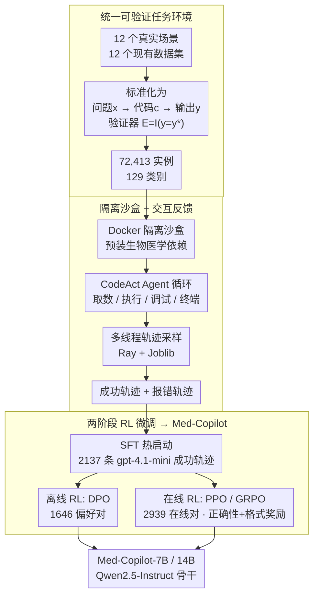

# MedAgentGym: A Scalable Agentic Training Environment for Code-Centric Reasoning in Biomedical Data Science

**会议**: ICLR 2026 Oral  
**arXiv**: [2506.04405](https://arxiv.org/abs/2506.04405)  
**代码**: 有  
**领域**: 医疗NLP
**关键词**: biomedical data science, agentic training, code-centric reasoning, reinforcement-learning, Med-Copilot, LLM agent

## 一句话总结
构建了首个统一的生物医学数据科学 Agent 训练环境 MedAgentGym，包含 72,413 个任务实例（覆盖 12 个真实场景、129 个类别），配备可执行沙盒和可验证 ground truth，系统基准评估 29 个 LLM 揭示商业/开源差距，并通过高效多线程轨迹采样 + 离线/在线 RL 训练出 Med-Copilot，分别获得 +43.02%/+45.28% 提升，达到与 GPT-4o 竞争的性能。

## 研究背景与动机
**领域现状**：生物医学数据科学涵盖基因组分析、临床数据处理、医学图像分析、药物发现等多个子领域，每个任务需要复杂的编程和领域推理能力。LLM 作为编码助手已在通用编程领域展示潜力，但在生物医学编码任务上的系统评估和训练基础设施缺乏。

**现有痛点**：(1) 现有医学 AI benchmarks（如 MedQA、PubMedQA）是静态的选择题/问答评估，不支持交互式代码执行和迭代调试；(2) 没有统一平台涵盖多种生物医学数据科学场景（基因组、临床、影像、药物等都是各自独立的 benchmark）；(3) 开源 LLM 与闭源模型（GPT-4o 等）在生物医学编码任务上差距显著，需要有效的训练方法缩小差距。

**核心矛盾**：训练一个能写生物医学分析代码的 Agent 需要大规模可交互的任务环境，但构建这种环境成本极高（需要真实数据、ground truth、安全沙盒、反馈机制）。

**本文目标**：同时解决环境构建和 Agent 训练两个问题——提供大规模训练环境 + RL 训练 pipeline。

**切入角度**：将 12 个真实生物医学场景统一为"输入数据+任务描述→执行代码→验证输出"的标准化格式，支持交互式反馈和自动化评分。

**核心 idea**：大规模可交互的统一训练环境 + RL 训练 pipeline = 缩小开源模型与闭源 LLM 在生物医学编码上的差距。

## 方法详解

### 整体框架
MedAgentGym 要填的是「生物医学数据科学 Agent 缺一个可训练环境」这个基础设施空白：过去基因组、临床、影像、药物各自有静态 QA benchmark，既不能跑代码、也没法用来训练 Agent。它把这件事拆成三步串起来——先把 12 个真实生物医学场景下的现有数据集统一成「问题 → 写代码 → 执行 → 对金标准验证」的可执行任务（共 72,413 个实例、129 个类别）；再给每个任务套一个 Docker 隔离沙盒，让 Agent 用 CodeAct 风格的多轮循环边写边调、并行采下成功与报错轨迹；最后拿这些可验证的轨迹做两阶段强化学习微调，把开源小模型 Qwen2.5-7B/14B 训成能和商业模型掰手腕的 Med-Copilot。

### 关键设计

**1. 统一可验证任务环境：把割裂的生物医学 benchmark 收成同一套可执行接口**

对应框架第一步。痛点是基因组、临床、影像、药物各有各的 benchmark，且多为静态选择题/问答，Agent 既无法跨任务迁移、也拿不到可训练的信号。MedAgentGym 把 12 个真实场景下的现有数据集（MIMIC-III、eICU、TREQS、MedCalcBench、MedAgentBench、BioCoder、EHRSHOT、BioDSBench，外加 4 个分布外数据集）统一成同一种形式：给定问题描述 $x$，Agent 生成代码 $c$ 跑出输出 $y$，再用验证器 $E(c, y) = \mathbb{I}(y = y^*)$ 与金标准 $y^*$ 比对判对错。对只给参考代码的任务（如 BioCoder），用参考代码的**执行输出**当金标准——因为同一道题可能有多种等价写法，「执行结果」比「代码本身」更稳定可靠。最终得到 72,413 个实例、129 个类别，并做 10-gram 去污染、划分 train/test 与内/外分布。这套统一形式是后两步的前提：只有所有任务长得一样，才谈得上跨场景采轨迹、统一训练。

**2. 隔离沙盒 + 交互反馈：让 Agent 像真人一样边跑边调**

对应框架第二步。痛点是生物医学分析代码一次写对的概率很低，很多任务必须靠调试才能跑通。MedAgentGym 给每个任务配一个 Docker 隔离沙盒（预装 pandas、scikit-learn、biopython 等依赖，保证环境隔离与医疗数据安全），并采用 CodeAct 风格的 POMDP scaffold：Agent 在四类动作间循环——`request_info`（取数据）、`terminal`（装包/管文件）、`code_execution`（跑代码）、`debugging`（把编译/运行报错翻译成自然语言）。交互反馈做了两件事：输出统一成 JSON 便于解析、报错统一 grounding 成自然语言便于模型读懂。一条轨迹写成 $\tau = [(o_1, a_1), \dots, (o_n, a_n)]$，关键是它**同时**留下成功轨迹 $\{c^{(i)} \mid y^{(i)} = y^*\}$ 和带报错的失败轨迹 $\{c^{(i)} \mid y^{(i)} \neq y^*\}$，两者都是训练信号。底层用 Ray + Joblib 多线程并行 rollout，才能把这种多轮交互轨迹大规模采下来。

**3. 两阶段 RL 微调出 Med-Copilot：用可验证奖励把开源小模型推到商业水平**

对应框架第三步。以 Qwen2.5-7B/14B-Instruct 为骨干（不是更大模型），走「先 SFT 热启动、再 RL 精修」两阶段。热启动用 gpt-4.1-mini 采的 2,137 条成功轨迹（平均 9.25 轮交互）做监督微调，让小模型先学会基本的写代码-调试范式。之后分两条 RL 路线：**离线 RL** 用 1,646 个离线偏好对做 DPO（把成功的最终代码对比中途出错的尝试），数据效率高；**在线 RL** 让 Agent 亲自与沙盒交互、用 2,939 个在线对做 PPO/GRPO，能持续探索。奖励由两部分组成——正确性奖励 $r = \mathbb{I}(y = y^*)$ 加一个格式奖励（输出是否含代码块）。两条路线把 7B 模型分别拉高 +43.02%（DPO）和 +45.28%（GRPO）。论文还额外训了一个 Qwen2.5-7B 的结果验证器（ORM，$r = \frac{e^{l_y}}{e^{l_y} + e^{l_n}}$）用于推理时挑轨迹，并用它做拒绝采样的自我提升。

### 训练策略
- 骨干模型：Qwen2.5-7B-Instruct 与 -14B-Instruct（产出 Med-Copilot-7B / -14B），统一 CodeAct scaffold
- 热启动：gpt-4.1-mini 的 2,137 条成功轨迹做 SFT
- 离线 RL：1,646 个偏好对做 DPO；在线 RL：2,939 个在线对做 PPO / GRPO
- 奖励：正确性奖励 + 格式奖励
- 共开源约 6K 训练轨迹 + 结果验证器（ORM）

## 实验关键数据

### 主实验：29 个 LLM 零样本基准评估（平均 Score，满分 100）

| 模型类别 | 代表模型 | 平均 Score |
|---------|---------|----------|
| 闭源商业 | gpt-4.1 (2025-04) | 70.15（最强） |
| 闭源商业 | gpt-o4-mini | 65.67 |
| 闭源商业 | gpt-4o | 48.75 |
| 开源基础 | Qwen2.5-7B-Instruct（基线） | 16.89 |
| Med-Copilot-7B | Qwen2.5-7B + 在线 RL (GRPO) | 62.17（+45.28） |
| Med-Copilot-14B | Qwen2.5-14B + 在线 RL (GRPO) | 71.42（+51.30，追平 gpt-4.1） |

### 消融实验：Med-Copilot-7B 不同后训练方法

| 配置 | 平均 Score | 相对基线 |
|------|---------|---------|
| Base (Qwen2.5-7B-Instruct) | 16.89 | – |
| +SFT | 53.87 | +36.98 |
| +DPO（离线 RL） | 59.90 | +43.02 |
| +PPO（在线 RL） | 57.96 | +41.07 |
| +GRPO（在线 RL） | 62.17 | +45.28 |

### 关键发现
- 商业 LLM 与开源 LLM 在生物医学编码任务上存在显著差距（gpt-4.1 70.15 vs. Qwen2.5-7B 16.89），但两阶段 RL 训练可大幅缩小：7B 模型经 GRPO 训练后从 16.89 跃升到 62.17，已超过 gpt-4o（48.75）
- 在线 RL（GRPO +45.28）略优于离线 RL（DPO +43.02），且两者都明显超过纯 SFT 基线（+36.98）；14B 模型经 GRPO 后达 71.42，甚至追平最强的 gpt-4.1
- 多轮交互（调试循环）对性能至关重要——单次代码生成的成功率远低于多轮迭代
- 不同生物医学场景难度差异大：结构化任务（数据库查询、医学计算）较简单，开放式任务（数据分析、ML 建模）更难

## 亮点与洞察
- **训练 + 评估一体化**：MedAgentGym 不仅是 benchmark（评估 29 个 LLM），更是训练环境（RL 训练管道直接可用）——这在医学 AI 领域是首创
- **实际缩小差距的证明**：8B 参数的开源模型通过 RL 训练达到 GPT-4o 水平——这对隐私敏感的医学场景极具实际价值（本地部署 vs API 调用）
- **规模化设计**：72K 任务 + 多线程轨迹采样 + 标准化接口——真正可扩展的训练基础设施
- **代码中心而非问答中心**：不同于 MedQA 等选择题 benchmark，MedAgentGym 要求写真实可执行的分析代码——更接近实际科研场景

## 局限与展望
- 任务以编码为中心，临床推理、诊断决策等知识密集型能力评估不足
- Ground truth 需要预定义的标准答案，不适合开放式探索性研究任务
- 当前仅用 7B / 14B 模型训练 Med-Copilot，更大模型（70B+）的扩展结果未报告
- 评分函数主要基于精确匹配或数值误差，未评估代码质量、可读性、效率等软指标
- 未评估模型在训练任务分布外的迁移能力

## 相关工作与启发
- **vs MedQA/PubMedQA**: 这些是静态 QA benchmark，无代码执行和交互反馈；MedAgentGym 支持多轮代码交互
- **vs SWE-bench**: SWE-bench 聚焦软件工程（修 bug），MedAgentGym 聚焦生物医学数据分析——任务性质不同
- **vs AgentBench**: AgentBench 覆盖多种 Agent 任务但不聚焦医学；MedAgentGym 提供深度的生物医学场景覆盖
- **vs AIME**: AIME 等评估医学推理，MedAgentGym 评估的是医学编程实践

## 评分
- 新颖性: ⭐⭐⭐⭐ 首个统一的生物医学 Agent 训练环境，问题定义有价值，但 RL 训练方法本身不是新的
- 实验充分度: ⭐⭐⭐⭐⭐ 72K 任务 + 29 LLM 系统评估 + 离线/在线 RL 对比 + Med-Copilot 验证
- 写作质量: ⭐⭐⭐⭐ 系统描述清晰，任务分类和实验组织合理
- 价值: ⭐⭐⭐⭐⭐ 为生物医学 AI Agent 研究提供了关键基础设施，开源环境有长期社区价值

<!-- RELATED:START -->

## 相关论文

- [\[ICLR 2026\] BiomedSQL: Text-to-SQL for Scientific Reasoning on Biomedical Knowledge Bases](biomedsql_text-to-sql_for_scientific_reasoning_on_biomedical_knowledge_bases.md)
- [\[ACL 2026\] Ryze: Evidence-Enriched Data Synthesis from Biomedical Papers](../../ACL2026/medical_nlp/ryze_evidence-enriched_data_synthesis_from_biomedical_papers.md)
- [\[CVPR 2026\] Towards Efficient Medical Reasoning with Minimal Fine-Tuning Data](../../CVPR2026/medical_nlp/towards_efficient_medical_reasoning_with_minimal_fine-tuning_data.md)
- [\[NeurIPS 2025\] CureAgent: A Training-Free Executor-Analyst Framework for Clinical Reasoning](../../NeurIPS2025/medical_nlp/cureagent_a_training-free_executor-analyst_framework_for_clinical_reasoning.md)
- [\[AAAI 2026\] Real-Time Trust Verification for Safe Agentic Actions Using TrustBench](../../AAAI2026/medical_nlp/real-time_trust_verification_for_safe_agentic_actions_using_trustbench.md)

<!-- RELATED:END -->
