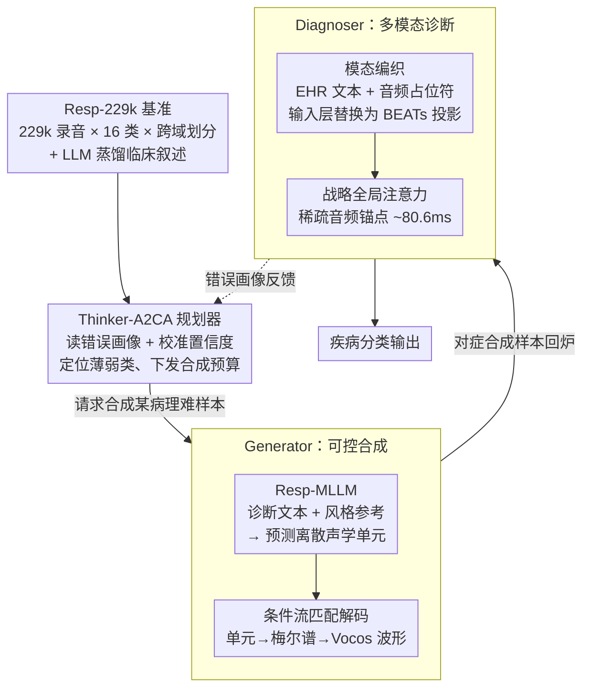

# Resp-Agent: An Agent-Based System for Multimodal Respiratory Sound Generation and Disease Diagnosis

**会议**: ICLR2026  
**arXiv**: [2602.15909](https://arxiv.org/abs/2602.15909)  
**代码**: [github.com/zpforlove/Resp-Agent](https://github.com/zpforlove/Resp-Agent)  
**领域**: 医学图像  
**关键词**: 呼吸音分析, 多模态融合, 可控音频生成, 主动对抗课程学习, 流匹配, 数据增强

## 一句话总结

提出 Resp-Agent 闭环多智能体框架，通过主动对抗课程规划器（Thinker-A2CA）协调可控呼吸音生成器与多模态诊断器，在 229k 规模基准上实现生成↔诊断协同设计，大幅提升长尾类别诊断性能。

## 背景与动机

1. **单模态表示瓶颈**：现有方法将呼吸音转为梅尔频谱图后用 CNN 处理，丢失了相位信息和瞬态事件（如爆裂音 crackles），无法捕捉毫秒级临床关键声学特征。
2. **缺乏大规模多模态数据集**：公开呼吸音数据集规模小、覆盖疾病少、缺少系统化的文本-音频配对监督，严重制约了多模态模型的发展。
3. **分析与生成脱节**：现有研究集中在分类/检测等诊断任务，生成式建模几乎未被探索，无法利用合成数据缓解类别不平衡和数据稀缺问题。
4. **浅层融合不充分**：即使有辅助元数据（人口统计学、症状等），现有方法仅采用基础融合技术（如拼接后全注意力），无法实现深层跨模态交互。
5. **数据增强缺乏针对性**：传统增强策略（如 SpecAugment）是无条件/无目标的通用扰动，无法精准地为模型失败模式生成对抗样本。
6. **跨域泛化能力弱**：大多数系统仅在同分布数据上测试，缺少跨机构、跨设备的严格评估协议，限制了临床可部署性。

## 方法详解

### 整体框架

Resp-Agent 把"分析"和"生成"拧成一个闭环的多智能体系统，整套流程跑在自建的 Resp-229k 大规模基准之上。底座先备好成对的文本-音频监督和严格的跨域划分；其上由中央的 Thinker-A2CA 规划器读取诊断器的失败画像，定向请求生成器合成最难分类的样本，再用这些样本回炉训练诊断器，形成「诊断发现弱点→对症合成→再训练」的主动循环。三个智能体各司其职——规划器决定"该补什么"，生成器负责"可控造样本"，诊断器负责"多模态读片"——而它们的协同效果最终又汇成新一轮的错误画像，驱动下一次定向投放。

### 关键设计

**1. Resp-229k：撑起闭环的跨域大规模基准**

闭环要跑起来，前提是有足够大、足够多样且带文本监督的数据。作者聚合 UK COVID-19、ICBHI、SPRSound、COUGHVID、KAUH 五个公开库，得到 229,101 条录音、408 小时、16 个诊断类别，并为每条录音配上由 DeepSeek-R1-Distill-Qwen-7B 蒸馏的标准化临床叙述，从而提供成对的文本-音频监督（叙述只整合已有元数据、不解读音频，并过一道规则校验 + 强模型 critique + 抽样人审的审计流水线）。划分上刻意做严格跨域：训练/验证只用 ICBHI、SPRSound、UK COVID-19，测试完全留给 COUGHVID 和 KAUH，逼模型在跨机构、跨设备的分布漂移下接受考验，而不是在同分布上自我安慰。

**2. Thinker-A2CA：把数据增强变成有目标的课程**

传统增强（如 SpecAugment）是无条件的通用扰动，根本不知道模型在哪类样本上栽跟头。Resp-Agent 让一个大语言模型（DeepSeek-V3.2-Exp）充当中央控制器：它解析当前诊断目标，复用诊断器输出的错误画像（error profiles）和校准置信度来定位薄弱类别，然后以确定性 I/O 模式明确告诉生成器"给我合成这一类的难样本"。这样合成预算不再被均摊到所有类别，而是精准投放到尾部和易混类，把被动的数据扩充升级成主动对抗课程——后面实验里它在仅 10k 合成样本时就拿到了总增益的约 52%，样本效率远超随机或类先验重平衡。

**3. Generator：先规划离散单元、再用流匹配重建波形**

要让合成的呼吸音"病理可控、风格也可控"，单阶段端到端生成很难解耦，这里拆成两步。第一步是 Resp-MLLM，把一个文本 LLM（Qwen3-0.6B-Base）改造成多模态单元生成器：用 BEATs 提取参考音频的帧级特征 $Z\in\mathbb{R}^{T\times D}$（10s、16kHz 参考对应 $T=496$），经时序池化压成 $K$ 个风格描述符，再过两层 MLP 投到 LLM 隐空间得到 $E^{style}$；输入序列由"诊断文本 $d$（控制患什么病）"加"$K$ 个 [AUDIO] 占位符（控制是什么声学风格）"拼成，内容与风格从输入端就分离，LLM 随后自回归预测 BEATs 码本里的离散声学单元，训练时对约 10% 目标位置施加 [BEATs_MASK] 掩码、避免教师强制泄漏 oracle token。第二步是条件流匹配（CFM）解码：用 Diffusion Transformer 参数化的解码器沿线性路径 $x_t=(1-t)x_0+tx_1$ 学习速度场 $v_\theta$，把离散单元重建为梅尔频谱图，再经 Vocos 声码器还原波形。CFM 走双路径条件——内容流对单元索引做嵌入并时序插值到梅尔帧率，音色流对 BEATs 特征做时间平均后广播——保证重建既贴合指定病理又保留参考音色。风格交换实验里固定病理标签、只换风格参考，Style-Sim 达 0.91 而 Pathology-Acc 仍有 97.9%（FAD=1.18），证明这套解耦确实成立。

**4. Diagnoser：模态编织 + 稀疏全局锚点，让文字直接问到瞬态声学事件**

呼吸音里爆裂音这类临床关键事件只持续毫秒级，浅层拼接式融合（各编各的、最后拼起来再做密集全注意力）既看不清又算不动。诊断器换了两招。一是输入级模态编织：把 EHR 临床文本 token 和 496 个音频占位符排成一条序列，在 Longformer 嵌入层直接用 BEATs 特征投影 $E_{[A]}=\mathrm{Align}(\Phi_{\text{BEATs}}(x))W$ 替换占位符，于是文本和音频从第一层就开始跨模态交互，而不是各编各的最后才拼。二是战略全局注意力：在 Longformer 滑窗注意力之上只放三类全局 token——[CLS] 分类头、[DESCRIPTION] 这个 EHR 哨兵、以及按步长 $s=4$ 稀疏布设的音频锚点。10s 切到 $T=496$ 帧时单帧约 20.16ms，步长 4 让相邻锚点间距 $\approx 80.6$ms，把可对齐的时间分辨率压到亚 100ms，让"夜间干咳"这样的文本症状能远距离查询到对应的瞬态声学事件；又因为全局 token 稀疏，整体仍保持线性时间复杂度。

### 一个完整示例

以一个尾部类别（如某种少见的喘息型呼吸音）为例走一遍闭环：诊断器在验证集上对该类频繁误判，错误画像显示其置信度低且常被混入相邻类——Thinker-A2CA 读到这一信号后，向生成器下达"合成 N 条该病理样本"的请求；生成器的 Resp-MLLM 以该病理文本加一段同病例的风格参考为条件，预测离散单元，CFM 解码器再把单元重建为带正确瞬态特征的波形；这批对症合成样本回炉训练后，诊断器借模态编织与音频锚点真正"看见"了那些毫秒级喘息事件，该类的 Macro-F1_tail 随之抬升，下一轮规划器再据新的薄弱点继续投放预算。

## 实验关键数据

### 表1：ICBHI 官方 60-40 划分上的呼吸音分类性能

| 方法 | 骨干网络 | Sp (%) | Se (%) | Score (%) |
|---|---|---|---|---|
| Dong et al. (2025) | AST | 85.99 | 49.11 | 67.55 |
| MVST (He et al., 2024) | AST | 81.99 | 51.10 | 66.55 |
| BTS (Kim et al., 2024c) | CLAP | 81.40 | 45.67 | 63.54 |
| **Resp-Agent [本文]** | **LLM+Longformer** | **79.29** | **66.10** | **72.70** |

Resp-Agent 以 72.7 的 Score 超越此前最佳方法 5+ 个绝对点，特别是敏感度（Se）达到 66.1%，远超其他方法（最高仅 51.1%），说明多模态融合有效提升了对少数类的识别。

### 表2：不同规划策略在 Test-CD 上的诊断性能（匹配预算 B=50k）

| 规划策略 | Acc | Macro-F1 | Macro-F1_tail |
|---|---|---|---|
| 无合成（CE 基线） | 0.849 | 0.212 | 0.074 |
| 随机采样 | 0.869 | 0.442 | 0.291 |
| 类先验重平衡 | 0.876 | 0.512 | 0.349 |
| 静态不确定性采样 | 0.881 | 0.546 | 0.376 |
| **Thinker-A2CA** | **0.887** | **0.598** | **0.421** |

Thinker-A2CA 在全部指标上最优，将 Macro-F1 从基线 0.212 提升至 0.598（+182%），尾部类别 Macro-F1_tail 从 0.074 提至 0.421（+469%），证明主动对抗课程显著优于所有被动策略。

### 生成器内容-风格解耦验证

风格交换实验：固定病理标签，变换风格参考，Style-Sim=0.91，Pathology-Acc=97.9%，FAD=1.18，证实生成器能独立控制声学风格而不改变疾病语义。

## 亮点

1. **闭环协同设计**：首次将呼吸音的分析与生成统一在一个智能体框架中，实现「诊断发现弱点→生成对症合成→再训练提升」的主动学习闭环，而非传统的被动数据增强。
2. **Resp-MLLM**：据作者所知是首个在对齐文本-音频监督下训练的呼吸音多模态大语言模型，实现了病理内容与声学风格的可控解耦生成。
3. **战略性音频锚点**：通过 ~80ms 间距的稀疏全局注意力锚点，在线性复杂度下实现文本到瞬态声学事件的远距离路由，解决了呼吸音中爆裂音等毫秒级事件的建模难题。
4. **Resp-229k 基准**：229k 规模、16 类、跨域划分、配有 LLM 蒸馏临床叙述，填补了呼吸音领域大规模多模态基准的空白。
5. **极高的样本效率**：Thinker-A2CA 在仅 10k 合成样本时就实现了总增益的 ~52%，大幅优于类先验和随机采样。

## 局限与展望

1. **控制器依赖闭源 LLM**：Thinker-A2CA 使用 DeepSeek-V3.2-Exp 作为规划器，部署成本较高且不可完全复现，可探索更轻量的规划策略。
2. **生成质量上限**：CFM 解码仍基于梅尔频谱图中间表示，对某些极细粒度的声学瞬态（如微弱爆裂音）可能重建不够精准。
3. **文本监督依赖 LLM 蒸馏**：临床叙述由 LLM 生成而非真实 EHR，可能引入系统性偏差；虽有审计流水线，但无法完全消除幻觉风险。
4. **16 类标签体系局限**：真实临床场景中呼吸疾病更复杂，且存在多病共存（multi-morbidity）情况，当前框架未处理多标签分类。
5. **非医疗认证系统**：明确声明不可用于临床决策，实际落地需额外的监管审批和临床验证流程。

## 与相关工作的对比

- **vs. OPERA/RespLLM**：OPERA 提供领域预训练但仍是单模态；RespLLM 虽融合文本但用密集全注意力拼接模态，计算成本高且缺少跨模态精细路由。Resp-Agent 的模态编织 + 稀疏锚点在亚二次复杂度下实现了更深的跨模态交互。
- **vs. SpecAugment/无条件生成**：传统增强是无目标的通用扰动，Resp-Agent 通过 Thinker 识别失败模式后定向合成对抗样本，将增强变为精确的课程学习工具。
- **vs. AudioLM/SoundStorm**：通用音频生成模型未考虑临床可控性。Resp-MLLM 通过诊断文本 + 风格参考的双条件设计实现了病理-音色解耦，是专为医学音频设计的生成方案。

## 评分

- 新颖性: ⭐⭐⭐⭐⭐ （闭环多智能体 + 呼吸音多模态 LLM + 主动课程学习，多个首创性工作）
- 实验充分度: ⭐⭐⭐⭐⭐ （7 组实验涵盖诊断/生成/消融/跨域/样本效率/解耦验证/LoSO）
- 写作质量: ⭐⭐⭐⭐ （结构清晰、公式规范，但系统复杂度高导致部分细节需反复查阅附录）
- 价值: ⭐⭐⭐⭐⭐ （数据集+框架+模型全开源，对医学音频 AI 领域有显著推动作用）

<!-- RELATED:START -->

## 相关论文

- [\[ACL 2026\] MARCH: Multi-Agent Radiology Clinical Hierarchy for CT Report Generation](../../ACL2026/medical_nlp/march_multi-agent_radiology_clinical_hierarchy_for_ct_report_generation.md)
- [\[ICLR 2026\] EMR-AGENT: Automating Cohort and Feature Extraction from EMR Databases](emr-agent_automating_cohort_and_feature_extraction_from_emr_databases.md)
- [\[ACL 2026\] SEMA-RAG: A Self-Evolving Multi-Agent Retrieval-Augmented Generation Framework for Medical Reasoning](../../ACL2026/medical_nlp/sema-rag_a_self-evolving_multi-agent_retrieval-augmented_generation_framework_fo.md)
- [\[ACL 2025\] LLMs Can Simulate Standardized Patients via Agent Coevolution](../../ACL2025/medical_nlp/evopatient_standardized_patient.md)
- [\[ICML 2025\] Agent WARPP: Workflow Adherence via Runtime Parallel Personalization](../../ICML2025/medical_nlp/agent_warpp_workflow_adherence_via_runtime_parallel_personalization.md)

<!-- RELATED:END -->
