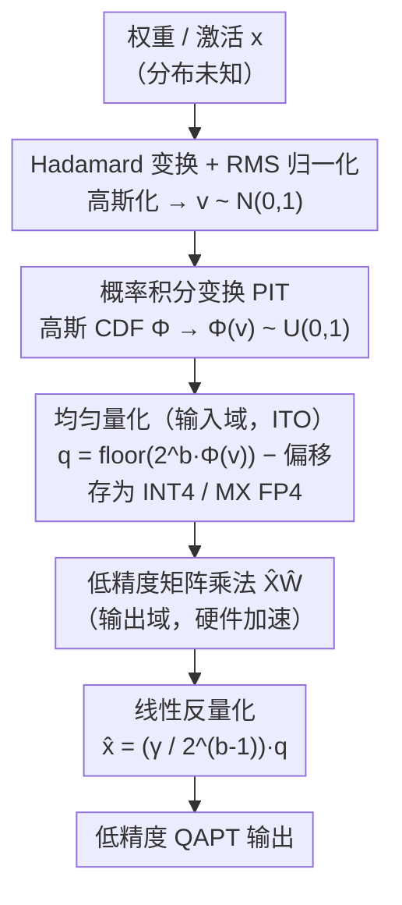

# Boosting Entropy with Bell Box Quantization

**会议**: ICLR 2026  
**arXiv**: [2603.01599](https://arxiv.org/abs/2603.01599)  
**代码**: [https://github.com/1733116199/bbq](https://github.com/1733116199/bbq)  
**领域**: 模型压缩 / 量化  
**关键词**: 量化感知预训练, 信息论最优量化, 计算高效数据类型, 熵最大化, 低精度推理

## 一句话总结
提出 Bell Box Quantization (BBQ)，首个同时满足"信息论最优"(ITO) 和"计算高效"(compute-efficient) 的量化方法，核心洞察是学习的域无关性——量化器输出域不必与输入域相同，由此在输入域做 ITO 量化以最大化熵，在输出域映射到硬件可加速的数据类型，在 1-4 bit QAPT 场景下全面超越 QuEST 和 LSQ。

## 研究背景与动机

**领域现状**：量化是将 DNN 部署到边缘设备的关键技术。量化感知预训练 (QAPT) 从零开始以低精度训练模型，可避免先全精度预训练再做 PTQ/QAFT 的额外开销，但低精度模型的信息容量有限，难以拟合大规模数据。

**现有痛点**：现有 QAPT 方法（如 QuEST、LSQ）使用计算高效的数据类型（INT4等），但这些数据类型 **不满足信息论最优** (ITO)——量化后各量化值的使用频率不均匀，从而浪费了有限的学习容量。另一方面，现有 ITO 方法（如 NF4/NormalFloat）虽能最大化熵，但需要反量化到全精度再计算，在能量受限的边缘设备上不可用。

**核心矛盾**：ITO 和计算高效之间存在 trade-off——ITO 量化值不在硬件支持的数据类型中，无法利用低精度矩阵乘法加速；计算高效的整数/浮点类型对高斯分布权重不是 ITO 的。

**本文目标**：能否在不牺牲计算效率的前提下实现 ITO 量化，让模型最大化利用有限的学习容量？

**切入角度**：**学习是域无关的 (domain-agnostic)**——DNN 可以从旋转图像、频域数据、latent embedding 中学习，只要信息被保留，把数据投影到不同域不影响学习。

**核心 idea**：量化器在输入域做 ITO 量化保留最多信息，输出到不同的计算高效域，使低精度矩阵乘法可直接使用。

## 方法详解

### 整体框架
BBQ 想同时拿到两件以往互斥的好处：量化要信息论最优（ITO，量化值等概率使用、熵拉满），又要落到硬件能加速的低精度整数上。它的破局点是"学习是域无关的"——既然量化（信息保留）和矩阵乘法（数值加速）可以发生在不同的域，那就让量化在输入域追求 ITO、让矩阵乘法在输出域跑硬件友好的整数类型。

落到流程上分三步加一次反量化：先用 Hadamard 变换加 RMS 归一化把任意未知分布的权重/激活"高斯化"成标准正态 $v\sim N(0,1)$；再用概率积分变换（PIT）把正态摊平成均匀分布 $\Phi(v)\sim U(0,1)$；对均匀数据做均匀量化就天然是 ITO 量化，得到可存成 INT4 / MX FP4 的整数 $q$；矩阵乘法直接在这些低精度整数上算，最后乘回一个线性缩放因子完成反量化。核心两式为：

$$q = \lfloor 2^b \Phi(v) \rfloor - 2^{b-1} - z,\quad v = \text{HT}(x)/\sigma \qquad\qquad \hat{x} = \frac{\gamma}{2^{b-1}}\, q$$

### 关键设计

**1. Hadamard 变换 + RMS 归一化：把任意未知分布的权重/激活"高斯化"**

ITO 量化的前提是分布已知，但权重和激活的真实分布五花八门，没法直接套用一个固定的最优分箱。BBQ 先对输入 $x$ 沿通道维度每 $H$ 个元素做 Hadamard 变换——一个已知能让数据趋向高斯的正交变换——再除以 RMS $\sigma$ 把方差归一，得到单位方差的标准正态 $v \sim N(0,1)$。有了这个确定的高斯分布，后面的概率积分变换才有精确的 CDF 可施加，整条 ITO 流水线才站得住脚。

**2. 概率积分变换 PIT：用高斯 CDF 替掉 clip，把正态摊平成均匀分布**

这是全文最核心的一步，针对的是"量化值使用频率不均、熵上不去"。QuEST/LSQ 用分段线性的 clip 截断再均匀量化，但 clip 对高斯数据并不能把量化 bins 均匀分配，各量化值频率不均，熵被压在经验上限（2-bit 约 1.93）。BBQ 改用标准高斯 CDF $\Phi$：对 $v \sim N(0,1)$ 施加 $\Phi$ 后 $\Phi(v) \sim U(0,1)$，正态被精确摊成均匀分布，此时再均匀量化，所有量化值等概率出现，达到信息论最优（2-bit 可逼近理论上限 2.0）。$\Phi$ 相比 clip 还无限可微、更平滑（类似 GELU 之于 ReLU）。推理时不必真算 $\Phi$：预计算 $\Phi^{-1}(i/2^b)$ 作为量化边界后，用 $b$ 次浮点比较的二分搜索就能定位量化值，几乎无开销。

**3. 域无关量化：输入域做 ITO 量化，输出域落到硬件友好的整数**

这一步是"域无关"洞察的落地，回答"ITO 量化值不在硬件数据类型里、没法加速"这个老矛盾。对 $\Phi(v) \sim U(0,1)$ 做均匀量化得到 $\lfloor 2^b \Phi(v) \rfloor$，减去偏移后是符号整数 $q$，可直接存成 INT4 或 MX FP4。关键在于反量化是简单的线性缩放 $\hat{x} = \frac{\gamma}{2^{b-1}} q$，于是矩阵乘法 $\hat{X}\hat{W}$ 能先在低精度整数域算完、再统一乘回缩放因子。换句话说，量化（输入域）追求信息最优，矩阵乘法（输出域）跑在硬件加速的整数类型上——两个域互不牵制，ITO 与计算高效第一次被同时拿到。代价是 $x$ 和 $\hat{x}$ 不在同一域、量化误差无界，因此该方案只适配从零训练的 QAPT。

**4. 可学习缩放因子 $\gamma$ 与初始化：防止换上 $\Phi$ 后训练直接发散**

把 clip 朴素换成 $\Phi$ 并不能直接 work——缩放因子初始化不当，首次迭代 $\hat{x}$ 的幅度就和 $x$ 对不上，梯度爆炸或消失，消融里 perplexity 会从 35.58 飙到 138.3。BBQ 把缩放因子解耦为 $s = \gamma / 2^{b-1}$，让 $\gamma$ 不依赖精度 $b$，并初始化为 $\zeta^* \sigma_0$（$\zeta^*$ 由最小化量化误差的期望解出），使第一次迭代 $\hat{x}$ 的幅度就与 $x$ 一致，训练才稳得住，$\gamma$ 之后还可继续学习微调。这一步把"PIT 替 clip 的收益"从理论真正兑现到了可训练。

### 训练与推理策略
- 对 floor 操作使用 Straight-Through Estimator (STE)，其余操作均可微分；对 $\gamma$ 施加梯度缩放（除以 $\sqrt{d}$），不对 $\gamma$ 使用 weight decay；权重用 channel-wise 量化，激活用 per-tensor 量化。
- **BBQ-Fast 推理变体**：实时计算激活的 RMS $1/\sigma$ 需要跨线程通讯，是推理时的额外开销；BBQ-Fast 改用指数移动平均 $E_{1/\sigma}$ 替代实时 $1/\sigma$，perplexity 完全不变但省掉这笔通讯，推理更快。

## 实验关键数据

### 主实验
在 LLaMA 架构上进行 QAPT，使用 C4 数据集，对比 BBQ、QuEST、LSQ：

| 模型参数 | 训练Token | 精度 (bit) | BBQ 熵/PPL | QuEST 熵/PPL | LSQ 熵/PPL |
|----------|-----------|-----------|------------|-------------|------------|
| 95M | 3B | 4-bit | 3.93 / 25.51 | 3.61 / 26.37 | 3.59 / 27.46 |
| 95M | 3B | 3-bit | 2.96 / 26.55 | 2.78 / 29.04 | 2.74 / 30.27 |
| 95M | 3B | 2-bit | 1.97 / 31.34 | 1.92 / 35.58 | 1.69 / 36.58 |
| 95M | 3B | 1-bit | 1.00 / 49.22 | 1.00 / 67.78 | - |
| 200M | 10B | 4-bit | 3.93 / 18.79 | 3.61 / 19.06 | 2.73 / 1778 |
| 200M | 10B | 2-bit | 1.98 / 23.08 | 1.93 / 25.46 | 1.63 / 78.19 |
| 300M | 20B | 4-bit | 3.93 / 16.10 | 3.61 / 16.26 | - |
| 300M | 20B | 2-bit | 1.98 / 19.75 | 1.93 / 21.53 | - |

BBQ 在所有精度下一致取得更高熵和更低 perplexity。精度越低，BBQ 优势越大（2-bit 降 4+ PPL，1-bit 降 18+ PPL）。LSQ 在大模型上训练发散。

### 消融实验
在 2-bit LLaMA-95M (3B tokens) 上的消融：

| 配置 | PPL | 熵 | 说明 |
|------|-----|-----|------|
| BBQ 完整 | 31.34 | 1.97 | 最优 |
| 去 HT | 35.79 | 1.98 | PPL 涨 4.45 |
| 去 RMS | 35.93 | 1.98 | PPL 涨 4.59 |
| QuEST (无 PIT) | 35.58 | 1.92 | baseline |
| 加 PIT 无 $\gamma$ 初始化 | 138.3 | 1.92 | 发散！ |
| 加 PIT + $\gamma$ 初始化 | 31.46 | 1.98 | PPL 降 4.12 |
| 加可学习 $\gamma$ | 31.34 | 1.97 | 再降 0.12 |

### 关键发现
- PIT ($\Phi$) 替代 clip 是最关键的改进，但必须配合合理的 $\gamma$ 初始化
- BBQ 可实现理论最大熵（如 2-bit 达到 1.97/2.0），QuEST 熵有经验上限（约 1.93）
- 推理速度：在 RTX 5090 上，BBQ 比 FP16 快 40%，比 NF4 快 48%（NF4 在 prefill 阶段比 FP16 更慢）
- BBQ 量化核开销仅为矩阵乘法节省时间的 1/10

## 亮点与洞察
- **域无关性洞察**：这是论文最核心的 "啊哈" 时刻——量化器不必在同一域做量化和反量化。这个简单但深刻的观察打破了 ITO 与计算效率不可兼得的僵局
- **用 $\Phi$ 替代 clip**：高斯 CDF 同时充当了平滑激活函数（类似 GELU vs ReLU 的关系）和信息最优分箱函数，一石二鸟
- **推理实现优雅**：推理时将 $\Phi$ + floor 联合实现为预计算边界的二分搜索，$b$ 次比较即可，融入量化核几乎无额外延迟
- **域变换 trick 可迁移**：只要任务的优化目标是域无关的（如神经网络训练），都可以考虑在信息保留最优的域做变换，在计算高效的域做运算

## 局限与展望
- **仅适用于 QAPT**：由于 $x$ 和 $\hat{x}$ 不在同一域，BBQ 无法保证量化误差 $\|x - \hat{x}\|$ 有界，因此不适用于 PTQ 和短时间的 QAFT
- **依赖 HT 的高斯化假设**：训练初期 HT(x) 确实趋近高斯，但训练后期可能偏离，导致 PIT 不完全 ITO。作者建议用更精确的平滑经验 CDF 替代 $\Phi$
- **仅验证了语言模型**：缺少视觉模型（ViT、ConvNet）和多模态模型的实验
- **可改进**：将域变换思路推广到 QAFT——可能需要一个短的 "域适应" 阶段让模型适应新域

## 相关工作与启发
- **vs QuEST**: QuEST 也用 HT 高斯化，但用 clip+均匀量化（对高斯数据非 ITO），熵有经验上限 ~1.93 bit/2 bit；BBQ 通过 PIT 消除此瓶颈
- **vs NF4/NormalFloat**: NF4 是 ITO 的但需反量化到全精度计算，prefill 比 FP16 更慢；BBQ 是首个同时 ITO 且计算高效的方法
- **vs N2UQ**: N2UQ 也做域变换但假设权重均匀分布，且仅作用于权重；BBQ 对权重+激活都做 ITO 且不假设分布形状

## 评分
- 新颖性: ⭐⭐⭐⭐⭐ 域无关性洞察简单深刻，ITO+计算高效的结合是首创
- 实验充分度: ⭐⭐⭐⭐ 多模型多精度全面对比+推理 profiling，但缺视觉模型验证
- 写作质量: ⭐⭐⭐⭐⭐ 动机推导清晰，从信息论到实现一气呵成
- 价值: ⭐⭐⭐⭐ 对低 bit QAPT 有直接推动，1-bit 模型的探索尤其有意义

<!-- RELATED:START -->

## 相关论文

- [\[ICLR 2026\] Rejuvenating Cross-Entropy Loss in Knowledge Distillation for Recommender Systems](rejuvenating_cross-entropy_loss_in_knowledge_distillation_for_recommender_system.md)
- [\[ICML 2026\] LFQ: Logit-aware Final-block Quantization for Boosting the Generation Quality of Low-Bit Quantized LLMs](../../ICML2026/model_compression/lfq_logit-aware_final-block_quantization_for_boosting_the_generation_quality_of_.md)
- [\[NeurIPS 2025\] Matryoshka Pilot: Learning to Drive Black-Box LLMs with LLMs](../../NeurIPS2025/model_compression/matryoshka_pilot_learning_to_drive_black-box_llms_with_llms.md)
- [\[ICML 2026\] Entropy-Aware On-Policy Distillation of Language Models](../../ICML2026/model_compression/entropy-aware_on-policy_distillation_of_language_models.md)
- [\[ICLR 2026\] Compute-Optimal Quantization-Aware Training](compute-optimal_quantization-aware_training.md)

<!-- RELATED:END -->
