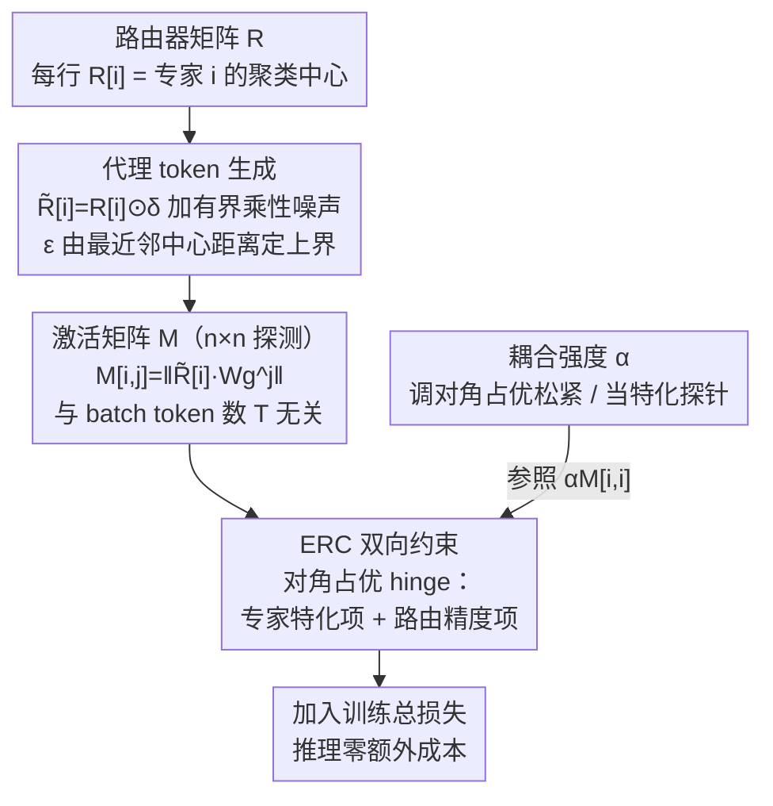

# Coupling Experts and Routers in Mixture-of-Experts via an Auxiliary Loss

**会议**: ICLR 2026 Oral  
**arXiv**: [2512.23447](https://arxiv.org/abs/2512.23447)  
**代码**: 无  
**领域**: 模型架构 / MoE  
**关键词**: Mixture-of-Experts, 路由-专家耦合, 辅助损失, 专家特化, 大语言模型

## 一句话总结

提出 Expert-Router Coupling (ERC) Loss，一种轻量级辅助损失函数，通过将路由器参数视为聚类中心的代理 token 并约束专家对其激活范数，实现路由器决策与专家能力的紧密耦合，仅需 $n^2$ 次激活计算即可显著提升 MoE-LLM 性能。

## 研究背景与动机

MoE（Mixture-of-Experts）是现代大语言模型的核心架构，通过路由器为每个 token 选择 top-K 专家处理，以稀疏激活实现高效的参数扩展。然而，传统 MoE 存在一个根本性问题：**路由器和专家之间缺乏显式约束来确保路由决策与专家实际能力对齐**。

具体而言：
- 路由器是一个线性分类器 $\mathbf{R} \in \mathbb{R}^{n \times d}$，通过内积 $\text{softmax}(\mathbf{x}\mathbf{R}^\top)$ 决定 token 分配
- 专家是独立的 FFN 模块，有自己的参数 $\mathbf{W}_g, \mathbf{W}_p, \mathbf{W}_o$
- 路由器无法直接获取专家参数（因此不知道专家真实能力），只能通过试错学习路由策略
- 这常导致"误路由"——token 被发送到不擅长处理它的专家，产生的梯度反而干扰专家的特化

先前的解决方案 Autonomy-of-Experts (AoE) 通过让所有专家部分处理每个 token 来获取路由信号，但这导致了远超标准 MoE 的计算和内存开销（训练时间增加 1.6×，内存增加 1.3×），且开销随 token 数量线性增长。

## 方法详解

### 整体框架

ERC Loss 建立在一个简洁的观察之上：路由器参数矩阵 $\mathbf{R}$ 的每一行 $\mathbf{R}[i]$ 其实就是分配给专家 $i$ 的那批 token $\mathcal{X}_i$ 的**聚类中心**——softmax 线性路由本质上是按内积把 token 划进离它最近的中心。既然 $\mathbf{R}[i]$ 概括了 $\mathcal{X}_i$ 的"平均形态"，那么就可以拿它当一个代理 token（proxy）去探测各个专家的响应，而不必像 AoE 那样把所有 token 真的送进所有专家。整个方法只在训练时加一项辅助损失：先由聚类中心生成带噪代理 token，再用它们探测出一张 $n\times n$ 的专家激活矩阵，最后用一个双向约束把"路由器选谁"和"专家擅长谁"拉到一起；其中耦合强度 $\alpha$ 这个旋钮负责调约束的松紧。推理阶段这一切都不参与，零额外成本。

### 关键设计

**1. 代理 token 生成：让聚类中心也能代表族内的差异**

直接拿 $\mathbf{R}[i]$ 当代理有个隐患——它是 $\mathcal{X}_i$ 的均值，损失会过拟合到这个均值点本身，而不是它代表的整族 token。为此对中心施加有界乘性噪声得到 $\tilde{\mathbf{R}}[i] = \mathbf{R}[i] \odot \boldsymbol{\delta}_i$，其中 $\boldsymbol{\delta}_i \sim \mathcal{U}(1-\epsilon_i, 1+\epsilon_i)^d$，用随机缩放模拟 $\mathcal{X}_i$ 内 token 围绕中心的真实抖动。噪声幅度不能拍脑袋给：取 $\epsilon_i \leq \frac{\|\mathbf{R}[i] - \mathbf{R}[j]\|}{2\|\mathbf{R}[i]\|}$（$j$ 为最近邻聚类中心），保证扰动后的代理仍落在自己的聚类边界内、不会越界跑到邻居族里去。$\epsilon_i$ 在每层、每步都按当前的 $\mathbf{R}$ 动态重算，跟着训练中聚类的漂移走。关键是，被扰动的 $\tilde{\mathbf{R}}$ 只进入损失计算，真正的路由决策依旧用原始的 $\mathbf{R}$，因此不会污染前向。消融也印证了这一点：去掉噪声后耦合会过拟合到 $\mathbf{R}$ 本身、性能大幅下降。

**2. 激活矩阵：用一次 $n\times n$ 探测刻画"谁对谁有反应"**

有了代理 token，就把每个 $\tilde{\mathbf{R}}[i]$ 喂进全部 $n$ 个专家的门控参数 $\mathbf{W}_g$，构造激活矩阵 $\mathbf{M}[i,j] = \|\tilde{\mathbf{R}}[i] \cdot \mathbf{W}_g^j\|$。$\mathbf{M}[i,j]$ 度量的是"专家 $j$ 对本该属于专家 $i$ 的那族 token 有多大反应"：对角线 $\mathbf{M}[i,i]$ 是专家对自己该管的 token 的响应，非对角线则是被别人"截胡"的潜在程度。之所以探测 $\mathbf{W}_g$ 的中间激活范数而非专家最终输出，是因为实验比较了几种激活选择后发现 $\tilde{\mathbf{R}}\mathbf{W}_g$ 信号最干净、效果最好。这一步的代价正是后文优势所在——它只跟专家数 $n$ 有关，与 batch 里的 token 数 $T$ 无关。

**3. ERC 双向约束：同时管住专家特化和路由精度**

核心损失把激活矩阵收紧成对角占优：

$$\mathcal{L}_{\text{ERC}} = \frac{1}{n^2} \sum_{i=1}^{n} \sum_{j \neq i}^{n} \left(\max(\mathbf{M}[i,j] - \alpha \mathbf{M}[i,i], 0) + \max(\mathbf{M}[j,i] - \alpha \mathbf{M}[i,i], 0)\right)$$

这个损失由两个互补的 hinge 项拼成，都以对角线 $\mathbf{M}[i,i]$ 为参照。第一项 $\mathbf{M}[i,j] < \alpha \mathbf{M}[i,i]$ 管**专家特化**：代理 $\tilde{\mathbf{R}}[i]$ 在自己专家 $i$ 上的激活要明显强于在别的专家上，逼着专家 $i$ 真正围绕它该处理的 token 族去特化。第二项 $\mathbf{M}[j,i] < \alpha \mathbf{M}[i,i]$ 管**路由精度**：专家 $i$ 对自己代理 $\tilde{\mathbf{R}}[i]$ 的响应要高于对其他代理 $\tilde{\mathbf{R}}[j]$ 的响应，从而保证 $\mathbf{R}[i]$ 这个聚类中心确实指向了专家 $i$ 的真实能力。两项一起作用，路由器"想送谁"和专家"擅长谁"就被绑成一致，从根上压住了误路由带来的干扰梯度。这套机制的开销极低：额外只增加约 $2n^2 D d$ 次 FLOPs，由于与 $T$ 无关，3B 模型（$n=64$）只多 0.18%、15B 模型（$n=256$）也仅 0.82%，而对照的 AoE 要增加随 token 线性增长的 $2T(n-K)dr$ FLOPs；推理阶段 ERC 完全不参与，零额外成本。

**4. 耦合强度 $\alpha$：一个旋钮，既调训练又当探针**

约束里的 $\alpha \in [0,1]$ 控制对角占优要多强。$\alpha \to 0$ 时约束最严，等价于要求 $\mathbf{R}[i]$ 与其他专家近乎正交、把特化推到极致；$\alpha \to 1$ 时约束放松，允许专家之间有更多能力重叠、更偏通才。它不只是个超参，还是一把测量专家特化程度的尺子：扫不同 $\alpha$ 看性能曲线，就能找出"特化"与"协作"之间的甜点，实验也正是借此发现并非越特化越好——3B（$n=64$）最优 $\alpha=1$，更大的 15B（$n=256$）反而在 $\alpha=0.5$ 时最好，说明专家越多越吃特化、专家越少越偏通才。

## 实验关键数据

### 主实验（3B 参数模型）

- 64 experts, $K=8$, 500B tokens 训练
- ERC Loss 显著优于 vanilla MoE，缩小与 AoE 的性能差距
- AoE 需要 ~1.6× 训练时间和 ~1.3× 内存

### 15B 参数模型扩展

| 基准 | MoE | MoE + ERC | 提升 |
|------|-----|-----------|------|
| ARC-C | 63.2 | 64.6 | +1.4 |
| HellaSwag | 67.5 | 69.0 | +1.5 |
| MMLU | 31.0 | 31.9 | +0.9 |
| MMLU-Pro | 42.0 | 44.2 | +2.2 |
| BBH | 44.3 | 45.6 | +1.3 |
| MATH | 25.7 | 26.1 | +0.4 |
| GSM8K | 45.2 | 45.8 | +0.6 |
| 平均 | 47.2 | 49.1 | **+1.9** |

AoE 在 15B 规模下因成本过高无法训练。

### 消融实验

| 配置 | 关键发现 |
|------|---------|
| 不同 $\alpha$ 值 | $\alpha=1$ 在 3B ($n=64$) 最优；$\alpha=0.5$ 在 15B ($n=256$) 最优 |
| 去除噪声 $\boldsymbol{\delta}$ | 性能大幅下降，耦合过拟合到 $\mathbf{R}$ 本身 |
| 仅路由器正交化 | 有限增益，因基线路由器本已近乎正交（余弦相似度 0.15） |
| $\alpha > 1$ | $\alpha=2$ 有限提升，$\alpha=3$ 几乎无效果 |
| 不同激活选择 | $\tilde{\mathbf{R}} \mathbf{W}_g$ 效果最好 |

### 关键发现

- **特化-协作权衡**: 追求极端特化并不可取，存在最优特化度。较小的 $n$ 偏好通才专家，较大的 $n$ 支持更高特化。3B 模型 ($n=64$) 的最优 $\alpha=1$，15B 模型 ($n=256$) 的最优 $\alpha=0.5$
- **噪声边界 $\epsilon$ 作为特化度量**: $\epsilon$ 与 $\alpha$ 强相关，可在训练过程中量化追踪专家特化程度的变化
- **t-SNE 可视化**: vanilla MoE 的专家参数没有形成有意义的聚类，而加入 ERC Loss 后聚类显著清晰
- **参数范数分析**: 模型通过学习有意义的耦合来降低 ERC Loss，而非简单操纵参数范数

## 亮点与洞察

1. **聚类视角的优雅设计**: 将路由器参数视为聚类中心、用聚类中心做代理来探测专家能力，这一观察既简洁又有力，避免了将所有 token 送入所有专家的高开销
2. **固定成本 vs. 可变成本**: $O(n^2)$ 的计算量与 batch size 无关，对于每批百万 token 的预训练场景，这个固定成本可以忽略不计
3. **特化度的可控探索**: $\alpha$ 既是训练参数又是探索工具，$\epsilon$ 提供量化度量，这为理解 MoE 行为提供了新视角
4. **挑战传统观点**: 实验证明"更多特化并不总是更好"，在小规模 MoE 中过度特化反而有害

## 局限与展望

1. **$\alpha$ 需要手动调节**: 不同模型配置（$n$, $K$, 深度）的最优 $\alpha$ 不同，目前缺乏自动确定方法
2. **线性路由器假设**: 聚类中心的解释依赖于 softmax 线性路由器，对非线性路由机制的适用性未探讨
3. **未与共享专家机制结合测试**: DeepSeek 等使用的共享专家可能改变最优特化度
4. **仅在预训练中验证**: 对微调和持续学习场景的效果未知
5. **缺乏与更多 MoE 变体的对比**: 如 Megablocks、Switch Transformer 等

## 相关工作与启发

- **Autonomy-of-Experts (AoE)** (Lv et al., 2025): 将路由编码进专家参数，通过激活范数选路，效果好但开销大，本文方法可视为 AoE 的轻量替代
- **Switch Transformer** (Fedus et al., 2022): 引入负载均衡损失，ERC Loss 与之兼容（负载均衡差异在 $10^{-5}$ 量级）
- **OLMoE**: 本文实现基于此开源 MoE 框架
- **DeepSeek-MoE**: 引入共享专家促进特化，与 ERC Loss 的方向互补

## 评分

- 新颖性: ⭐⭐⭐⭐⭐ — 聚类视角 + 代理 token 探测是巧妙设计，固定成本的辅助损失实用性强
- 实验充分度: ⭐⭐⭐⭐⭐ — 从 3B 到 15B，丰富的消融和分析，特化度探索出色
- 写作质量: ⭐⭐⭐⭐⭐ — 思路清晰，三步框架直观，附录详尽
- 价值: ⭐⭐⭐⭐⭐ — 实用、高效、可推广，直接改善 MoE 预训练，代码实现简洁

<!-- RELATED:START -->

## 相关论文

- [\[ICLR 2026\] Unveiling Super Experts in Mixture-of-Experts Large Language Models](unveiling_super_experts_in_mixture-of-experts_large_language_models.md)
- [\[ICLR 2026\] LD-MoLE: Learnable Dynamic Routing for Mixture of LoRA Experts](ld-mole_learnable_dynamic_routing_for_mixture_of_lora_experts.md)
- [\[ICML 2026\] DAG-MoE: From Simple Mixture to Structural Aggregation in Mixture-of-Experts](../../ICML2026/model_compression/dag-moe_from_simple_mixture_to_structural_aggregation_in_mixture-of-experts.md)
- [\[CVPR 2026\] Enhancing Mixture-of-Experts Specialization via Cluster-Aware Upcycling](../../CVPR2026/model_compression/enhancing_mixture_of_experts_specialization_via_cluster_aware_upcycling.md)
- [\[CVPR 2025\] DeRS: Towards Extremely Efficient Upcycled Mixture-of-Experts Models](../../CVPR2025/model_compression/ders_towards_extremely_efficient_upcycled_mixture-of-experts_models.md)

<!-- RELATED:END -->
