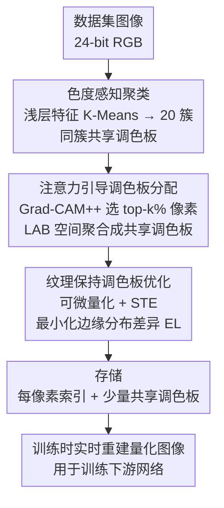

# Dataset Color Quantization: A Training-Oriented Framework for Dataset-Level Compression

**会议**: ICLR2026  
**arXiv**: [2602.20650](https://arxiv.org/abs/2602.20650)  
**代码**: 无  
**领域**: 模型压缩  
**关键词**: 数据集压缩, 颜色量化, 调色板共享, 注意力引导, 纹理保持  

## 一句话总结
提出 Dataset Color Quantization（DCQ）框架，通过色度感知聚类、注意力引导调色板分配和纹理保持优化三个机制，在数据集层面减少颜色冗余实现存储压缩，同时保持训练效果。

## 研究背景与动机

**领域现状与痛点**：大规模图像数据集的存储需求给资源受限环境带来挑战。现有数据集压缩方法（数据集剪枝、蒸馏）通过丢弃样本来减少数据量，却忽略了**每张图像内的颜色冗余**——许多像素共享几乎相同的颜色（如天空、墙壁等平滑区域）。现有颜色量化（Color Quantization, CQ）方法存在两大问题：

**基于图像属性的 CQ**（如 K-Means）：缺乏语义指导，导致语义边界模糊、对背景和前景均匀分配比特

**基于模型感知的 CQ**（如 ColorCNN）：虽保持识别准确率但引入突变的纹理/边缘不连续性——ColorCNN 将 CIFAR-10 量化为 4 色时预训练模型推理准确率 77%，但在量化数据上训练仅 58%

关键洞察：现有方法都是**推理导向**的（优化预训练模型对量化图像的识别），而本文首次提出**训练导向**的数据集颜色量化。

## 方法详解

### 整体框架
DCQ 在数据集层面而非单张图像上压缩颜色冗余：先把整个数据集按颜色分布聚成若干簇、让同簇图像共享一套调色板，再用注意力图把有限的颜色预算偏向语义关键区域，最后用可微量化优化调色板以保住纹理边缘。最终只需存储每像素的调色板索引加上少量共享调色板，训练时实时重建量化图像。从标准 24-bit RGB 量化到 $q$ bit 时调色板降至 $2^q$ 种颜色，压缩率 $q_r = 1 - q/24$，例如 2-bit 仅 4 种颜色即可达到 91.7% 的压缩率。

### 关键设计

**1. 色度感知聚类：让相似图像共享调色板以平衡一致性与保真度**

如果每张图像都单独学一套调色板，存储开销大且跨图像缺乏一致性；如果全数据集共用一套，又无法兼顾差异很大的图像。DCQ 取折中：用预训练模型的浅层特征 $\psi_{\text{shallow}}(x)$ 对数据集图像做 K-Means 聚类（$k=20$ 簇），同簇图像共享一套调色板。这里特意用浅层而非深层特征，因为随着层数加深特征越偏语义、越丢失视觉颜色信息（直觉记为 $i \uparrow \Rightarrow \text{Sem}(\psi_i) \uparrow,\ \text{Vis}(\psi_i) \downarrow$），而颜色量化关心的恰是颜色分布模式而非类别语义。消融显示浅层特征聚类（1-bit 下 79.90%）远优于按标签聚类（40.10%）或深层特征聚类（42.10%），$k=20$ 是一致性与量化保真度之间的最优平衡点。

**2. 注意力引导调色板分配：把有限的颜色预算花在前景关键区域**

在极低比特下颜色数量非常有限，若对背景和前景一视同仁地均匀分配，关键物体会因颜色不足而难以辨认。DCQ 用 Grad-CAM++ 计算注意力图，只保留注意力值最高的 $k_{Gra}\%$ 像素参与调色板聚合，使语义关键区域获得更多颜色表示而平滑背景被粗略量化。聚类在 LAB 色彩空间而非 RGB 中进行，因为 LAB 的欧氏距离更贴近人眼的感知相似性，从而让分配出的颜色在视觉上更连续。

**3. 纹理保持调色板优化：用可微量化抑制量化带来的边缘突变**

朴素颜色量化会在平滑区域产生色块、在物体边缘引入突变的纹理不连续，这正是 ColorCNN 在量化数据上训练崩塌的原因。DCQ 借鉴风格迁移的思路，把颜色量化做成可微操作并用直通估计器（STE）回传梯度，从而能直接优化调色板去对齐纹理。优化目标是最小化原图与量化图之间的边缘分布差异——用 Sobel 算子 $G(\cdot)$ 提取各通道边缘后计算 $EL = \sum_{i=1}^{3} w_i \cdot \text{MSE}\big(G(I_{\text{orig}}^i), G(I_{\text{quant}}^i)\big)$。消融表明该项约带来 1–3 个百分点的提升，是 DCQ 区别于推理导向 CQ、能在训练场景站住脚的关键。

## 实验关键数据

### 主实验

| 数据集 | 方法 | 2-bit (4色) | 1-bit (2色) |
|--------|------|-----------|-----------|
| CIFAR-10 | Random (剪枝) | 77.04% | 70.08% |
| CIFAR-10 | TDDS | 77.32% | 72.46% |
| CIFAR-10 | **DCQ (Ours)** | **89.15%** | **79.90%** |
| CIFAR-100 | Random | 39.71% | 36.68% |
| CIFAR-100 | **DCQ (Ours)** | **57.69%** | **38.44%** |
| ImageNet-1K | **DCQ (Ours)** | **49.69%** | **35.95%** |

- CIFAR-10 全精度准确率 95.45%，DCQ 2-bit 达到 89.15%（仅降 6.3 点），而 ColorCNN 量化后训练仅约 58%
- 消融：浅层特征聚类（79.90%@1-bit）远优于标签聚类（40.10%）、随机聚类（28.44%）、深层特征（42.10%）
- 簇数 $k=20$ 为最优平衡点（via 消融实验）
- CIFAR-100 2-bit 下 DCQ（57.69%）比最强剪枝 TDDS（32.15%）高出 **25.5 个百分点**
- ImageNet-1K 5-bit 下 DCQ（66.99%）接近全精度（73.54%），仅降 6.5 点
- 对比推理导向 CQ：MedianCut、OCTree 在训练场景下表现远差于 DCQ
- 纹理保持优化贡献约 1-3 个百分点的提升（消融实验见附录 C.1）

## 亮点与洞察
1. **问题定义新颖**：首次明确提出训练导向的数据集级颜色量化问题，区别于推理导向的传统 CQ
2. **与数据集剪枝正交互补**：DCQ 减少每张图像的存储，剪枝减少图像数量，二者可叠加使用
3. **共享调色板设计巧妙**：同簇图像使用相同调色板，既减少存储（仅需存索引）又提高跨图像一致性
4. **在激进压缩下优势显著**：特别是 1-2 bit 极低色彩下，DCQ 远超数据集剪枝方法

## 局限与展望
- 依赖预训练模型提取特征和注意力图（Grad-CAM++），增加了前处理成本
- 仅在 ResNet-18/34 上验证训练效果，未测试 ViT 等现代架构的适配性
- 极低比特（1-bit）时准确率下降仍然明显（CIFAR-10: 79.90% vs 95.45%）
- 共享调色板在类间差异大的数据集上可能降低量化质量
- 未与最新数据集蒸馏方法（如 D4M、RDED）做存储-准确率的公平对比
- LAB 色彩空间转换增加计算步骤，对超大规模数据集的扩展性有待验证
- 注意力引导中 $k_{Gra}\%$ 的选择需要消融调优，不同数据集最优值可能不同

## 相关工作与启发
- 与 ColorCNN/CQFormer 等模型感知 CQ 相比，DCQ 首次面向训练而非推理优化
- 与数据集剪枝（EL2N、Forgetting、CCS、TDDS）在同压缩率下直接对比，DCQ 在高压缩率下优势明显
- 色度感知聚类的思路可扩展到其他数据特征的量化（如频谱、纹理复杂度）
- DCQ 与数据集剪枝/蒸馏方法正交，可叠加使用：先用剪枝减少样本数，再用 DCQ 减少每样本存储
- 浅层特征用于图像聚类的有效性设计，为其他数据预处理任务提供了参考

## 评分
- 新颖性: ⭐⭐⭐⭐ (训练导向的数据集颜色量化是新方向)
- 实验充分度: ⭐⭐⭐⭐ (4 个数据集、多种基线、丰富消融)
- 写作质量: ⭐⭐⭐⭐ (动机清晰，方法描述详细)
- 价值: ⭐⭐⭐⭐ (为数据集压缩开辟新维度)
- 综合推荐: ⭐⭐⭐⭐

<!-- RELATED:START -->

## 相关论文

- [\[ICLR 2026\] Dataset Distillation as Pushforward Optimal Quantization](dataset_distillation_as_pushforward_optimal_quantization.md)
- [\[AAAI 2026\] Post Training Quantization for Efficient Dataset Condensation](../../AAAI2026/model_compression/post_training_quantization_for_efficient_dataset_condensation.md)
- [\[AAAI 2026\] Rethinking Long-tailed Dataset Distillation: A Uni-Level Framework with Unbiased Recovery and Relabeling](../../AAAI2026/model_compression/rethinking_long-tailed_dataset_distillation_a_uni-level_framework_with_unbiased_.md)
- [\[ICLR 2026\] S2R-HDR: A Large-Scale Rendered Dataset for HDR Fusion](s2r-hdr_a_large-scale_rendered_dataset_for_hdr_fusion.md)
- [\[ICLR 2026\] Understanding Dataset Distillation via Spectral Filtering](understanding_dataset_distillation_via_spectral_filtering.md)

<!-- RELATED:END -->
