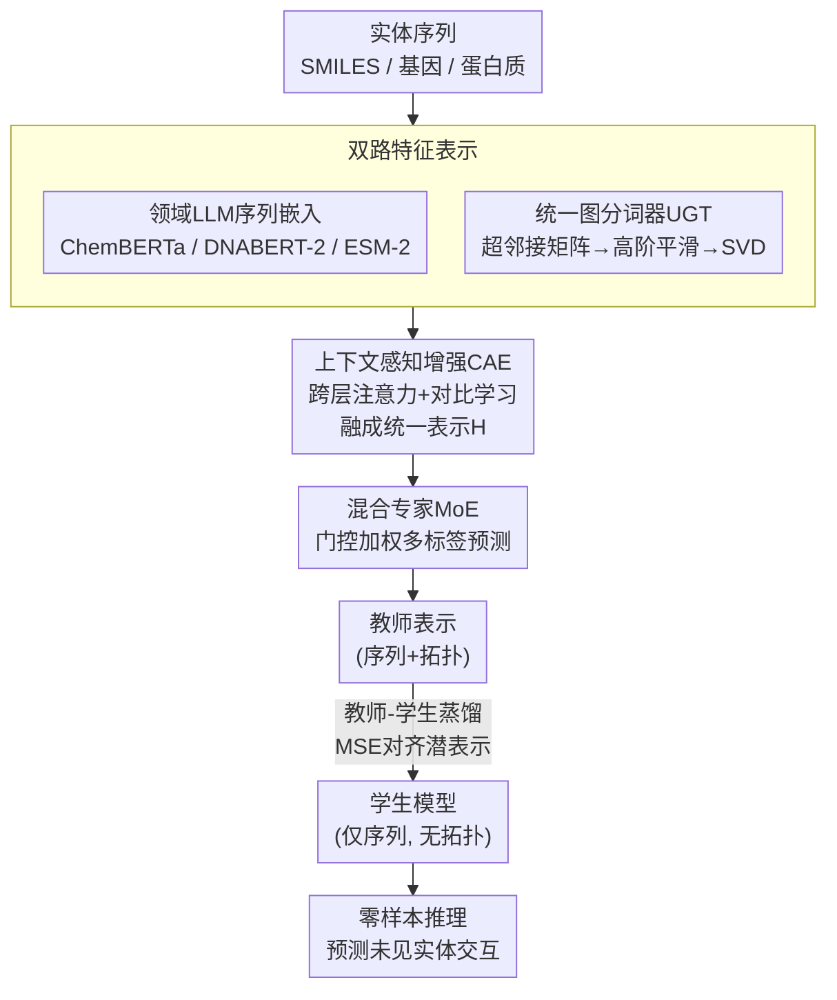

# Distilling and Adapting: A Topology-Aware Framework for Zero-Shot Interaction Prediction in Multiplex Biological Networks

**会议**: ICLR 2026  
**arXiv**: [2603.06618](https://arxiv.org/abs/2603.06618)  
**代码**: [有](https://github.com/alanadeng/CAZI-MBN)  
**领域**: 模型压缩  
**关键词**: 多重生物网络, 零样本预测, 知识蒸馏, 图Transformer, 多模态表示学习

## 一句话总结

提出CAZI-MBN框架，通过融合领域特定LLM序列嵌入、拓扑感知图分词器、上下文感知跨层注意力和教师-学生蒸馏，实现多重生物网络中未见实体的零样本交互预测，在5个基准数据集上AUROC较最优baseline提升3.1-20.4%。

## 研究背景与动机

多重生物网络（Multiplex Biological Networks, MBNs）通过多层结构表示同一组实体间的不同交互类型（如药物-基因的多种作用机制、蛋白质在不同细胞类型中的交互），是理解复杂生物系统的关键工具。现有方法存在三个核心缺陷：

**多重性处理不足**：大多采用单层网络分析，丢失了交互类型间的关系异质性和语义区分

**多模态整合能力弱**：难以将生物/化学序列特征与网络拓扑有效结合

**零样本预测困难**：对训练中未见的新实体（无先验邻域信息），现有GNN方法难以泛化

本文提出CAZI-MBN（Context-Aware and Zero-shot Interaction prediction in MBNs），旨在系统性地解决上述三个挑战。

## 方法详解

### 整体框架

CAZI-MBN把多重生物网络的交互预测拆成"先用序列与拓扑两路特征刻画每个实体、再让跨层注意力与对比学习把多层信息融成统一表示、最后用混合专家做多标签预测"这条主线，并在其上叠一层教师-学生蒸馏，把依赖邻域结构的教师知识压进只看序列的学生，从而让训练时没出现过、没有任何图结构的全新实体也能被预测。教师端由混合损失 $\mathcal{L} = \mathcal{L}_{disc} + \mathcal{L}_{reg} + \mathcal{L}_{cls} + \beta\|\Theta\|^2$ 驱动，学生端再以蒸馏损失对齐。

### 关键设计

**1. 双路特征表示：把序列语义和多重拓扑同时喂给模型**

生物实体本身的序列携带了交互预测最关键的语义，因此这一层不自己从头学编码，而是按实体类型直接复用对应的领域预训练 LLM：药物和代谢物的 SMILES 表示走 ChemBERTa，基因序列走 DNABERT-2，蛋白质序列走 ESM-2，得到各自的序列嵌入。光有序列还不够，多重网络的层间异质结构同样关键，为此作者设计了统一图分词器（UGT）来生成拓扑嵌入。UGT 先把各层的层内连接通过直和拼成超邻接矩阵 $\hat{A}$，再叠加层间连接矩阵 $C$，完整保留多重结构；随后做对称归一化 $\bar{A} = D^{-1/2}\hat{A}D^{-1/2}$ 并累加高阶项构成平滑矩阵 $\tilde{A} = \bar{A} + \bar{A}^2 + \cdots + \bar{A}^O$，让一次嵌入就同时捕捉到拓扑、多重性与高阶连接性；最后对 $\tilde{A}$ 做 SVD 得到 $U, \Sigma, V$，节点嵌入取 $e_v = \tilde{A}_{v,:} \cdot \text{LN}(U\sqrt{\Sigma} \| V\sqrt{\Sigma})$。消融显示序列 LLM 嵌入是贡献最大的组件（移除后 AUROC 掉 15-20%），印证了把序列语义放在第一位的设计取向。

**2. 上下文感知增强（CAE）：用跨层注意力和对比学习把多层嵌入融成共识表示**

同一个实体在不同交互层里的角色并不一致，简单拼接或平均会抹掉这种差异。CAE 先做节点级跨层注意力，让每个实体在层 $p$ 的表示自适应地从其他层 $q$ 吸收信息，权重按 $a_n^{(p \leftarrow q)} = \text{softmax}\left(\frac{\sigma(\theta^{(p)} \cdot (H_n^{(p)} \otimes H_n^{(q)}))}{\sum_{l \neq p} \sigma(\theta^{(p)} \cdot (H_n^{(p)} \otimes H_n^{(l)}))}\right)$ 计算，再经层级注意力把各层聚合成统一表示 $H$。为了让 $H$ 既稳健又有判别力，作者并行挂了一套对比学习：对每层图负采样生成扰动图 $\tilde{G}_i$，用判别器区分真实边嵌入与负边嵌入（对应判别损失 $\mathcal{L}_{disc}$），同时学一个共识嵌入 $Z$，通过正则化损失 $\mathcal{L}_{reg} = 1 + \text{CosineSim}(H, Z) - \text{CosineSim}(\tilde{H}, Z)$ 把它拉近真实表示 $H$、推开扰动表示 $\tilde{H}$。CAE 移除后 AUROC 掉 7-10%，是仅次于 LLM 的第二关键模块。

**3. 混合专家（MoE）：用多个专家分摊多标签预测里失衡的交互类型**

MBN 的交互预测本质是多标签分类，且不同交互类型样本量差距悬殊。MoE 用 $K$ 个专家 $f_k$ 各自捕捉一类交互模式，门控网络按输入算权重 $\boldsymbol{a} = \text{softmax}(W_g \mathbf{h} + b_g)$，最终预测为加权求和 $\hat{\mathbf{Y}} = \sum_{k=1}^{K} a_k f_k(\mathbf{h})$。这种自适应分配让稀少交互类型也能由专门的专家照顾，实验中模型在稀少类型上表现稳定，正得益于此；该模块移除后 AUROC 掉 5-8%。

**4. 教师-学生蒸馏：把拓扑知识压进只看序列的学生以实现零样本**

零样本预测的核心矛盾是：新实体没有任何邻域结构，拓扑嵌入无从谈起。作者的解法是让教师模型同时吃序列与拓扑嵌入、充分利用邻域上下文学好表示，再训一个只用序列、完全与拓扑无关的学生模型，用蒸馏损失（MSE 对齐师生潜在表示）加分类损失把教师学到的拓扑知识"翻译"进学生的序列空间。推理时直接用学生，即便面对完全未见、没有图结构的实体也能给出预测。零样本设置下性能衰退很小，说明拓扑知识确实被有效迁移进了序列侧。

### 损失函数 / 训练策略

教师模型由四项组成的混合损失 $\mathcal{L} = \mathcal{L}_{disc} + \mathcal{L}_{reg} + \mathcal{L}_{cls} + \beta\|\Theta\|^2$ 驱动：$\mathcal{L}_{disc}$ 是判别器的二元交叉熵损失，$\mathcal{L}_{reg}$ 是基于余弦相似度的共识正则化损失，$\mathcal{L}_{cls}$ 是多标签软间隔损失，末项为权重 $L_2$ 正则。学生模型则只用蒸馏损失（MSE）加分类损失 $\mathcal{L}_{distill}(\text{MSE}) + \mathcal{L}_{cls}$。

## 实验关键数据

### 主实验（5个多重生物网络，13个baseline）

**DGIdb（药物-基因，1846节点，5种交互类型）**：

| 设置 | 模型 | AUROC | AUPRC | HS | SA |
|------|------|-------|-------|-----|-----|
| 转导 | Graph Transformer | 0.505 | 0.514 | 0.493 | 0.508 |
| 转导 | HDMI | 0.551 | 0.557 | 0.540 | 0.511 |
| 转导 | **CAZI-MBN** | **0.715** | **0.729** | **0.687** | **0.684** |
| 零样本 | DMGI | 0.524 | 0.528 | 0.529 | 0.502 |
| 零样本 | **CAZI-MBN** | **0.671** | **0.709** | **0.688** | **0.663** |

**ChEMBL（化合物-细菌，9368节点，3种交互类型）**：

| 设置 | 模型 | AUROC | AUPRC | HS | SA |
|------|------|-------|-------|-----|-----|
| 转导 | HDMI | 0.663 | 0.762 | 0.789 | 0.730 |
| 转导 | **CAZI-MBN** | **0.812** | **0.863** | **0.889** | **0.757** |
| 零样本 | DMGI | 0.652 | 0.745 | 0.756 | 0.711 |
| 零样本 | **CAZI-MBN** | **0.791** | **0.839** | **0.857** | **0.723** |

**PINNACLE（蛋白质-蛋白质，7044节点，12种交互类型）**：

| 设置 | 模型 | AUROC | AUPRC |
|------|------|-------|-------|
| 转导 | xCAPT5 | 0.781 | 0.804 |
| 转导 | **CAZI-MBN** | **0.831** | **0.845** |
| 零样本 | xCAPT5 | 0.785 | 0.791 |
| 零样本 | **CAZI-MBN** | **0.812** | **0.820** |

### 消融实验

各模块移除后的平均性能下降（跨5个数据集）：
- **LLMs**：AUROC下降 15-20%（贡献最大）
- **CAE**：AUROC下降 7-10%
- **UGT**：AUROC下降 5-8%
- **MoE**：AUROC下降 5-8%

### 关键发现

1. CAZI-MBN在所有5个数据集的AUROC和AUPRC上一致优于13个baseline，提升幅度**3.1-20.4%**
2. 零样本设置下性能衰退小，表明知识蒸馏有效迁移了拓扑知识到序列空间
3. 领域特定LLM嵌入是最关键的组件（15-20%贡献），说明序列级语义信息对生物交互预测至关重要
4. 在稀少交互类型上表现稳定，MoE有效处理了标签不平衡问题
5. IBD案例研究中恢复了82.7%（DGIdb）和85.7%（TRRUST）的已知交互

## 亮点与洞察

1. **首个系统性的零样本MBN预测框架**：通过蒸馏将拓扑知识压缩到序列空间，使得完全未见实体的预测成为可能
2. **UGT的设计巧妙**：通过超邻接矩阵的SVD和高阶平滑，一步编码了拓扑、多重性和高阶连接性
3. **模块化设计合理**：序列→拓扑→跨层→预测的流水线使各组件贡献可分离、可消融
4. **自建5个高质量基准数据集**：填补了MBN评估标准化的空白

## 局限与展望

1. 未整合**3D结构数据**（蛋白质/化合物的三维结构），限制了精细化建模
2. 零样本仅实现实体级别泛化，对全新交互类型的泛化尚未验证
3. CAE模块中的多层注意力计算在大规模网络上的扩展性有待验证
4. 领域LLM的选择需要先验知识，框架的通用性依赖于合适的预训练模型
5. 未探索跨物种网络的迁移学习

## 相关工作与启发

- **单层GNN（GCN/GraphSAGE）**：处理多重数据能力不足
- **多重网络模型（DMGI/HDMI）**：保留层内/层间依赖但多模态整合弱
- **知识图谱方法**：扁平化层结构导致交互类型特异性丢失
- **知识蒸馏在NLP/CV中广泛应用**，但在MBN和零样本泛化中几乎未探索
- 启发点：拓扑→序列的蒸馏范式可推广到其他需要零样本泛化的图学习任务

## 评分

- **新颖性**: ★★★★☆ — 多重网络的零样本预测是新问题，框架设计系统完整
- **技术深度**: ★★★★☆ — UGT+CAE+MoE+蒸馏的组合有技术含量
- **实验说服力**: ★★★★★ — 5数据集×13baseline×2设置，覆盖全面
- **实用价值**: ★★★★☆ — 在药物发现和精准医疗中有直接应用前景
- **表达清晰度**: ★★★☆☆ — 模块众多，部分细节过于分散在附录中

<!-- RELATED:START -->

## 相关论文

- [\[ICLR 2026\] Topology and Geometry of the Learning Space of ReLU Networks: Connectivity and Size](topology_and_geometry_of_the_learning_space_of_relu_networks_connectivity_and_si.md)
- [\[ICLR 2026\] Boomerang Distillation Enables Zero-Shot Model Size Interpolation](boomerang_distillation_enables_zero-shot_model_size_interpolation.md)
- [\[NeurIPS 2025\] Enhancing Semi-supervised Learning with Zero-shot Pseudolabels](../../NeurIPS2025/model_compression/enhancing_semi-supervised_learning_with_zero-shot_pseudolabels.md)
- [\[ICCV 2025\] Perspective-Aware Teaching: Adapting Knowledge for Heterogeneous Distillation](../../ICCV2025/model_compression/perspective-aware_teaching_adapting_knowledge_for_heterogeneous_distillation.md)
- [\[ICLR 2026\] Parallel Token Prediction for Language Models](parallel_token_prediction_for_language_models.md)

<!-- RELATED:END -->
