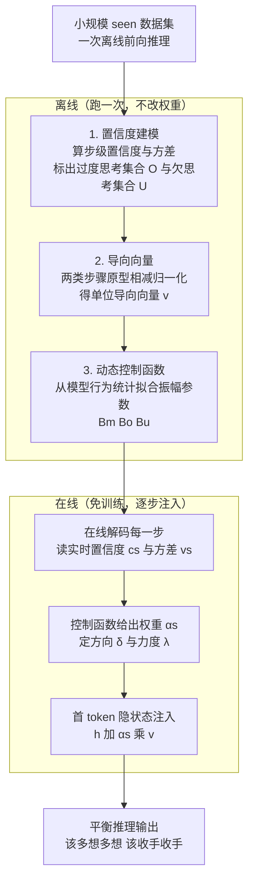

# Efficient Reasoning with Balanced Thinking

**会议**: ICLR 2026  
**arXiv**: [2603.12372](https://arxiv.org/abs/2603.12372)  
**代码**: [GitHub](https://github.com/yu-lin-li/ReBalance)  
**领域**: 模型压缩/高效推理  
**关键词**: 大语言模型推理, 过度思考, 欠思考, 隐状态导向, 无训练加速  

## 一句话总结

提出 ReBalance，一个无需训练的框架，通过基于置信度的动态隐状态导向（steering vector），同时缓解大推理模型（LRM）的过度思考和欠思考问题，实现推理效率与准确率的双重提升。

## 研究背景与动机

- **领域现状**：大推理模型（如 DeepSeek-R1、QwQ 等）通过 SFT 和 RL 训练获得了强大的推理能力，但在实际部署中面临计算效率问题
- **现有痛点**：LRM 存在两个对立问题——**过度思考**（overthinking）：对简单问题花费冗余推理步骤；**欠思考**（underthinking）：对复杂问题未能充分探索推理路径就过早收敛
- **核心矛盾**：现有缓解过度思考的方法（如抑制反思关键词、调整推理长度）往往会诱发欠思考，两者之间存在此消彼长的 trade-off。如图2(a)所示，已有方法在减少正确样本推理长度的同时，也显著减少了错误样本的推理长度，说明引入了欠思考
- **本文目标**：如何在缓解过度思考的同时避免引入欠思考，实现平衡推理
- **切入角度**：观察到模型的逐步置信度（stepwise confidence）和置信度方差可以作为推理状态的连续指标——高方差反映犹豫/路径切换（过度思考），持续高置信反映过早承诺（欠思考）
- **核心 idea**：利用置信度信号识别推理状态，构建从过度思考到欠思考的隐状态导向向量，再用动态控制函数根据实时置信度调节导向强度和方向

## 方法详解

### 整体框架

ReBalance 想做的事很直接：在不重新训练模型的前提下，让大推理模型该多想的时候多想、该收手的时候收手。它把工作拆成离线、在线两段，对应三个递进的组件——**置信度建模、导向向量、动态控制函数**。离线时只跑一次前向推理：在一个小规模数据集上扫一遍，先用置信度信号把每个推理步骤标成"过度思考"或"欠思考"（置信度建模），再从这两类步骤的隐状态里抽出各自的原型表示、相减得到一条"从过度到欠思考"的导向向量，最后顺手拟合一个动态控制函数。在线时不再改模型权重，而是边解码边读当前步骤的实时置信度，用控制函数算出该往哪个方向、推多大力气，然后把导向向量按这个力度注入到首 token 的隐状态里，把推理行为往平衡点拉。

### 关键设计

**1. 置信度建模：用步级置信度和方差把"想太多"和"想太少"显式标出来**

要纠偏，先得知道每一步到底偏向哪边。ReBalance 不靠人工规则或关键词，而是把模型自己的逐步置信度当探针。它先定义步级置信度 $c_s = \exp\left(\frac{1}{|\mathcal{T}_s|}\sum_{t \in \mathcal{T}_s} \ln p_t^{\max}\right)$——本质是该步内各 token 最大概率的对数均值再取指数，反映模型在这一步有多笃定；再在滑动窗口 $\mathcal{W}_s$ 上算置信度方差 $v_s = \operatorname{Var}(c_s; \mathcal{W}_s)$，捕捉它在相邻步骤间是否摇摆。两个信号拼起来就能区分两种病态：低置信加高方差说明模型在反复切换路径、犹豫不决，对应过度思考；持续高置信加低方差说明它早早锁死一条路、不再探索，对应欠思考。通过经验分位数定下阈值 $\tau_c^L, \tau_c^H, \tau_v^L, \tau_v^H$，就能把步骤切成两个集合：过度思考集合 $\mathcal{O} = \{s: c_s \leq \tau_c^L \wedge v_s \geq \tau_v^H\}$，欠思考集合 $\mathcal{U} = \{s: c_s \geq \tau_c^H \wedge v_s \leq \tau_v^L\}$。Fig.2(b) 的观察印证了这套对应关系成立。

**2. 导向向量：从两类步骤的隐状态相减抽出方向，再注入首 token**

有了 $\mathcal{O}$ 和 $\mathcal{U}$ 的步骤划分，下一步是把"过度→欠思考"这个方向在表示空间里找出来。做法是对两类集合中每个步骤的首 token 深层隐状态分别取平均，得到两个原型 $\bm{\mu}^O$ 和 $\bm{\mu}^U$，再相减归一化得到单位导向向量

$$\mathbf{v} = \frac{\bm{\mu}^O - \bm{\mu}^U}{\|\bm{\mu}^O - \bm{\mu}^U\|_2}.$$

在线推理时，把这条向量按权重注入步骤首 token 的隐状态：$\tilde{\mathbf{h}}_{t_s^{(1)}} = \mathbf{h}_{t_s^{(1)}} + \alpha_s \mathbf{v}$，其中 $\alpha_s = \lambda_s \delta_s$，符号 $\delta_s = -1$ 表示沿 $\mathcal{U} \to \mathcal{O}$ 反方向推、缓解过度思考，$\delta_s = +1$ 表示往 $\mathcal{O} \to \mathcal{U}$ 推、缓解欠思考。之所以选深层隐状态而非浅层，是因为深层对推理模式的判别力更强（附录消融可见）；之所以只动首 token，是因为在因果注意力下首 token 会条件化整步后续生成，改它的杠杆最大。

**3. 动态控制函数：按实时置信度决定每一步推多大力、往哪推**

固定一个注入强度会出问题：该步偏得越离谱就该纠得越狠，一刀切要么纠不动要么纠过头。ReBalance 因此让强度和方向都随实时置信度变化，用一个连续函数

$$g(c_s, v_s) = \text{sign}(c_s - \tau_c^H) \cdot B(c_s, v_s) \cdot \tanh(|c_s - \tau_c^H|)$$

统一给出。方向由 $\text{sign}(c_s - \tau_c^H)$ 决定：$c_s < \tau_c^H$ 取负、缓解过度思考，$c_s > \tau_c^H$ 取正、缓解欠思考。强度则由两部分相乘：$\tanh(|c_s - \tau_c^H|)$ 让偏离阈值越远力度越大、但平滑饱和不会爆掉，保证数值稳定、避开硬切换；$B(c_s, v_s)$ 是方差感知的振幅项，会根据当前处于正常、过度还是欠思考状态，在 $B_m$、$B_o$、$B_u$ 三个振幅之间自适应切换。关键是 $B_m$、$B_o$、$B_u$ 这些参数都从模型自身行为统计中得到，不用手工调参，这也是 ReBalance 能保持免训练、即插即用的原因。

### 训练策略

ReBalance 是无训练方法，不涉及损失函数或参数更新。上述导向向量、阈值、振幅参数全部在一次离线前向推理中得到，在线阶段只做隐状态注入。

## 实验关键数据

### 主实验

| 模型/数据集 | MATH-500 Acc↑ | MATH-500 Tokens↓ | AIME24 Acc↑ | GSM8K Acc↑ |
|---|---|---|---|---|
| R1-Distill-1.5B Baseline | 79.6 | 4516 | 23.3 | 76.0 |
| R1-Distill-1.5B ReBalance | **83.0** | 3474(-23%) | **33.3** | **78.3** |
| R1-Distill-7B Baseline | 89.8 | 3699 | 46.7 | 89.2 |
| R1-Distill-7B ReBalance | **92.6** | 2903(-22%) | **53.3** | **91.6** |
| Qwen3-14B Baseline | 93.8 | 4470 | 66.7 | 95.1 |
| Qwen3-14B ReBalance | **94.0** | 3641(-19%) | **73.3** | **96.3** |
| QwQ-32B Baseline | 94.8 | 4535 | 66.7 | 96.3 |
| QwQ-32B ReBalance | **95.4** | 3551(-22%) | **73.3** | **96.7** |

### 消融实验

- 仅使用导向向量不加动态控制：性能提升有限，甚至在某些数据集上下降
- 去除方差感知振幅 $B(c_s, v_s)$：无法区分正常推理和异常推理状态
- 浅层 vs 深层隐状态：深层（如倒数第 2-3 层）效果最好，浅层判别力不足

### 关键发现

1. ReBalance 在 4 个模型（0.5B-32B）、9 个 benchmark 上全面优于所有基线方法
2. **同时**减少推理长度（15-30%）**并**提升准确率（通常 +2-10%），这在之前的方法中极为罕见
3. 导向向量从小规模 seen 数据集提取后，在 unseen 数据集上依然保持强泛化
4. 与 SEAL、DEER 等 token 级抑制方法不同，ReBalance 不会牺牲有价值的中间推理步骤

## 亮点与洞察

1. **核心洞察**：置信度方差高 = 过度思考（犹豫不决）；持续高置信 = 欠思考（过早承诺），这个观察既符合直觉又有实验验证
2. **方法论价值**：将过度思考/欠思考问题统一到一个框架中解决，而非分别处理
3. **实用性极强**：无训练、plug-and-play、仅需小规模数据集离线计算一次，部署成本极低
4. **反直觉发现**：推理长度更短的输出反而准确率更高，说明冗余推理确实引入了幻觉

## 局限与展望

1. 导向向量从固定数据集提取，可能不适配所有任务分布，探索在线更新机制
2. 置信度计算依赖 token 概率，对采样策略（如 top-k、nucleus sampling）的鲁棒性未充分验证
3. 分位数阈值的设定 $q_L, q_H$ 虽然自适应，但不同模型和任务可能需要不同的最优值
4. 目前仅在数学和代码推理上验证，自然语言推理/多步规划等任务的效果待验证

## 相关工作与启发

- **过度思考缓解**：SEAL（Chen et al., 2025b）通过抑制反思关键词减少推理长度但可能引起欠思考；NoThinking（Ma et al., 2025b）完全跳过思考阶段更为激进
- **推理效率**：与基于 RL 的推理长度控制方法不同，ReBalance 完全免训练
- **隐状态操纵**：类似 representation engineering 的思路，但面向推理模式而非行为控制
- **启发**：将置信度作为推理质量的探针，可以推广到从 LRM 中提取更多细粒度的推理动态信息

## 评分

⭐⭐⭐⭐（4/5）

- **创新性**：⭐⭐⭐⭐ 将过度/欠思考统一建模并通过隐状态导向同时解决，思路新颖
- **实验**：⭐⭐⭐⭐⭐ 4 个模型 × 9 个 benchmark，实验极为全面
- **写作**：⭐⭐⭐⭐ 动机清晰、公式推导完整
- **实用性**：⭐⭐⭐⭐⭐ 无训练 plug-and-play，部署友好

<!-- RELATED:START -->

## 相关论文

- [\[ICLR 2026\] SwiReasoning: Switch-Thinking in Latent and Explicit for Pareto-Superior Reasoning](swireasoning_switch-thinking_in_latent_and_explicit_for_pareto-superior_reasonin.md)
- [\[ICLR 2026\] ParoQuant: Pairwise Rotation Quantization for Efficient Reasoning LLM Inference](paroquant_pairwise_rotation_quantization_for_efficient_reasoning_llm_inference.md)
- [\[AAAI 2026\] Efficient Reasoning for Large Reasoning Language Models via Certainty-Guided Reflection Suppression](../../AAAI2026/model_compression/efficient_reasoning_for_large_reasoning_language_models_via_certainty-guided_ref.md)
- [\[ICLR 2026\] FutureMind: Equipping Small Language Models with Strategic Thinking-Pattern Priors via Adaptive Knowledge Distillation](futuremind_equipping_small_language_models_with_strategic_thinking-pattern_prior.md)
- [\[ICLR 2026\] BeyondBench: Contamination-Resistant Evaluation of Reasoning in Language Models](beyondbench_contamination-resistant_evaluation_of_reasoning_in_language_models.md)

<!-- RELATED:END -->
