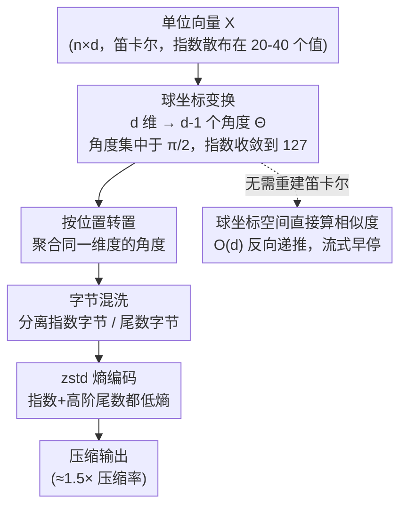

# Embedding Compression via Spherical Coordinates

**会议**: ICLR 2026  
**arXiv**: [2602.00079](https://arxiv.org/abs/2602.00079)  
**代码**: 无（算法在论文中完整给出）  
**领域**: 模型压缩 / 嵌入存储  
**关键词**: 嵌入压缩, 球坐标, IEEE 754, 无损压缩, 单位向量

## 一句话总结

提出一种基于球坐标变换的嵌入向量压缩方法，利用高维单位向量的球坐标角度集中在 $\pi/2$ 附近的数学性质，使 IEEE 754 浮点数的指数位和高阶尾数位熵大幅降低，实现 1.5× 压缩率，比最优无损方法提升 25%，重建误差低于 float32 机器精度。

## 研究背景与动机

嵌入向量是 RAG、检索、多模态系统的基础。典型的 1024 维 float32 向量需要 4KB 存储，1 亿向量需 400GB。对于 ColBERT 等多向量表示，每文档约 100 个向量，存储需求更是增加 100 倍。现有的无损压缩方法（ZipNN 等）对 float32 嵌入仅能达到约 1.2× 压缩，因为 float32 尾数位的熵接近最大值（~7.3 bits/byte），即使完美压缩指数位，理论上限也仅 1.33×。

核心洞察：大多数嵌入模型输出单位范数向量（$\|x\|_2=1$），用于余弦相似度计算。这意味着向量位于高维超球面 $S^{d-1}$ 上，但所有现有无损方法都忽略了这个几何结构。单位向量可等价地用 $d-1$ 个球坐标角度表示，而在高维空间中，这些角度在数学上集中于 $\pi/2 \approx 1.57$ 附近——这是一个已知的概率论结果。

切入角度：利用球坐标变换作为熵降低的预处理步骤，在 IEEE 754 层面让指数和尾数都变得可预测，然后再做标准的字节混洗 + 熵编码。

## 方法详解

### 整体框架

这篇论文要解决的是单位范数嵌入向量的近无损压缩。float32 嵌入约 3/4 的数据是尾数，而尾数熵接近上限（~7.3 bits/byte），所以现有无损方法（ZipNN 等）只能压到约 1.2×，连理论天花板也只有 1.33×（即便把指数完全压掉）。它的做法是在标准无损压缩管道前插一步**球坐标变换**当作熵降低预处理。整条流程是：把单位向量从笛卡尔坐标转成 $d-1$ 个球坐标角度，按位置转置以聚合同一维度的角度，再用字节混洗分离 IEEE 754 的指数字节和尾数字节，最后交给 zstd 熵编码；解压时反向执行即可恢复（误差 $<10^{-7}$，低于 float32 机器精度）。整套流程没有任何可学习参数，关键全在于球坐标变换让浮点的指数位和高阶尾数位都变得高度可预测，从而把熵编码的收益从指数一路推进到尾数。变换之外的转置、字节混洗、zstd 三步是沿用 ZipNN 的标准无损管道，球坐标角度还能在不重建笛卡尔向量的情况下直接算相似度，支持流式检索。

### 关键设计

**1. 球坐标变换：同时压低指数熵和尾数熵**

这是全文的核心。float32 嵌入的尾数熵接近最大，仅压缩指数有 1.33× 的硬天花板，要突破就得让尾数也变得可压。球坐标变换正好做到这点：笛卡尔分量取值随维度按 $1/\sqrt{d}$ 缩放，散布在 $[0.001, 0.3]$ 之间，对应 22–40 个不同的 IEEE 754 指数；而前 $d-2$ 个角度都落在 $[0, \pi]$ 且在高维下集中于 $\pi/2 \approx 1.57$ 附近（高维球面角度集中，Cai et al. 2013）。集中带来两层收益：指数上，99.7% 的角度指数都是 127，指数熵从 2.6 bits/byte 骤降到 0.03 bits/byte（jina-embeddings-v4，2048 维，笛卡尔本需 23 个指数值）；尾数上，角度紧贴 $\pi/2 \approx 1.5708$ 这个近常数，IEEE 754 里编码小数部分的高阶尾数字节也随之可预测，熵从 8.0 bits 降到 4.5 bits，额外带来约 11% 节省。正是因为同时打破指数和尾数两道熵壁垒，方法才能越过 1.33× 的无损天花板、达到约 1.5×——这也是它和"仅压指数"的 ZipNN 的本质区别。

**2. 维度减一：单位约束本身就省掉一维**

嵌入是单位向量、半径恒为 1，所以 $d$ 维向量只需 $d-1$ 个角度就能无损表示，相当于在熵编码之前就先砍掉了 $1/d$ 的原始数据量。这一层收益对高维嵌入尤其划算，也解释了实验里"维度越高压缩率越好"（384 维 1.50× → 2048 维 1.59×）的趋势——维度越高，省掉的那一维占比虽小，但角度集中得越紧，配合设计 1 的熵下降一起放大了增益。

**3. 球坐标空间直接算相似度：跳过重建做流式检索**

球坐标不只是存储格式，还能在不重建笛卡尔向量的前提下直接算余弦相似度。对两组角度做反向递推，在 $O(d)$ 时间内累积内积 $\mathbf{x}\cdot\mathbf{y}$，递推式为

$$R \leftarrow \cos\theta_k\cos\phi_k + \sin\theta_k\sin\phi_k \cdot R$$

从最后一维 $k=d-1$ 往前走到 $k=1$。因为递推方向和流式解压一致，可以一边解压一边累积，分数已经足够低时直接提前终止，天然支持 top-k 检索的早停。

### 实现与精度

方法是纯数学变换，不含任何学习参数或 codebook。球坐标变换在数学上精确可逆，但浮点超越函数（sin/cos/arccos）会引入有界误差，因此中间计算统一用双精度（double）累积，把重建误差压到 $10^{-7}$ 以下，低于 float32 的机器精度 $1.19\times10^{-7}$，对余弦相似度和检索质量都无可见影响。整体变换复杂度为 $O(nd)$，C 实现吞吐量超过 1 GB/s，在 zstd level 1 下完整管道仍能达到 487 MB/s 的编码速度。

## 实验关键数据

### 主实验

**表1: 基线对比（jina-embeddings-v4, 2048维, 7600 向量）**

| 方法 | 大小 (MB) | 压缩率 | Max 误差 | Cos Max 误差 |
|------|----------|--------|---------|-------------|
| Raw float32 | 59.38 | 1.00× | 0 | 0 |
| ZipNN (基线) | 49.57 | 1.20× | 0 | 0 |
| 截断 6 bits | 40.30 | 1.55× | 2e-6 | 5e-6 |
| **球坐标 (Ours)** | **37.59** | **1.58×** | **9e-8** | **2e-7** |

**表2: 26 种嵌入配置的压缩结果（部分）**

| 模型 | 维度 | 压缩率 | 相对基线提升 |
|------|------|--------|------------|
| MiniLM | 384 | 1.50× | +26.0% |
| BGE-base | 768 | 1.52× | +27.3% |
| GTE-large | 1024 | 1.58× | +29.0% |
| jina-embeddings-v4 | 2048 | 1.59× | +31.8% |
| jina-colbert-v2 (多向量) | 1024 | 1.52× | +26.5% |
| jina-clip-v2 (图像) | 1024 | 1.50× | +24.9% |

### 消融实验

- 压缩率范围 1.47×-1.59×，跨 26 种配置一致，说明压缩增益来自单位范数约束而非模态特异性
- 维度越高压缩率越好（384d: 1.50× → 2048d: 1.59×），符合高维球面集中理论
- 在相同压缩率下，球坐标方法的重建误差比尾数截断低 10 倍

### 关键发现

- float32 嵌入的无损压缩存在 1.33× 的理论天花板（仅压缩指数），球坐标方法通过同时降低尾数熵突破了这一限制
- ColBERT 场景下，100 万文档索引从 240GB 压缩到 160GB，实际意义巨大
- 重建误差 < float32 机器精度，不影响任何检索质量指标

## 亮点与洞察

- 思路极其优雅：利用一个数学事实（高维球面角度集中）来解决工程问题（浮点压缩）
- 分析深入到 IEEE 754 的 bit 级别，将几何性质与浮点表示精确对接
- 完全无需训练、无 codebook，适用于任何产出单位向量的嵌入模型
- 球坐标直接相似度计算开辟了流式检索的可能

## 局限与展望

- 仅适用于 float32 嵌入，BF16（8-bit 尾数）或 INT8 需要不同的策略
- 压缩率 1.5× 虽然超越无损方法，但与有损量化（4-32×）仍有数量级差距
- 需要向量严格为单位范数，非归一化向量无法使用
- 最后一个角度 $\theta_{d-1} \in [-\pi, \pi]$ 不集中，是压缩的瓶颈

## 相关工作与启发

- **ZipNN** (Hershcovitch et al., 2025): 字节混洗 + 熵编码的无损基线，本文在此之上叠加球坐标预处理
- **PolarQuant** (Han et al., 2025): 极坐标做 KV cache 有损量化，本文则是嵌入的近无损压缩
- **ECF8/DFloat11**: 利用模型权重的自然指数集中，本文则通过确定性几何变换创造集中
- 启发：利用数据的几何约束来降低信息熵的思路，可推广到其他具有几何结构的浮点数据

## 评分

- 新颖性: ⭐⭐⭐⭐⭐ 视角独特，将高维几何与浮点表示巧妙连接，思路完全原创
- 实验充分度: ⭐⭐⭐⭐ 26 种配置覆盖全面，但缺少端到端检索性能验证
- 写作质量: ⭐⭐⭐⭐⭐ 极度清晰简洁，算法描述完整，动机推导自然
- 价值: ⭐⭐⭐⭐ 即插即用的压缩方案，对大规模向量数据库部署有实际价值

<!-- RELATED:START -->

## 相关论文

- [\[ICML 2026\] ArcVQ-VAE: A Spherical Vector Quantization Framework with ArcCosine Additive Margin](../../ICML2026/model_compression/arcvq-vae_a_spherical_vector_quantization_framework_with_arccosine_additive_marg.md)
- [\[ICML 2026\] Dispersion Loss Counteracts Embedding Condensation and Improves Generalization in Small Language Models](../../ICML2026/model_compression/dispersion_loss_counteracts_embedding_condensation_and_improves_generalization_i.md)
- [\[NeurIPS 2025\] Zero-Shot Embedding Drift Detection: A Lightweight Defense Against Prompt Injections in LLMs](../../NeurIPS2025/model_compression/zero-shot_embedding_drift_detection_a_lightweight_defense_against_prompt_injecti.md)
- [\[ICLR 2026\] A universal compression theory for lottery ticket hypothesis and neural scaling laws](a_universal_compression_theory_for_lottery_ticket_hypothesis_and_neural_scaling_.md)
- [\[ICLR 2026\] FreqKV: Key-Value Compression in Frequency Domain for Context Window Extension](freqkv_key-value_compression_in_frequency_domain_for_context_window_extension.md)

<!-- RELATED:END -->
