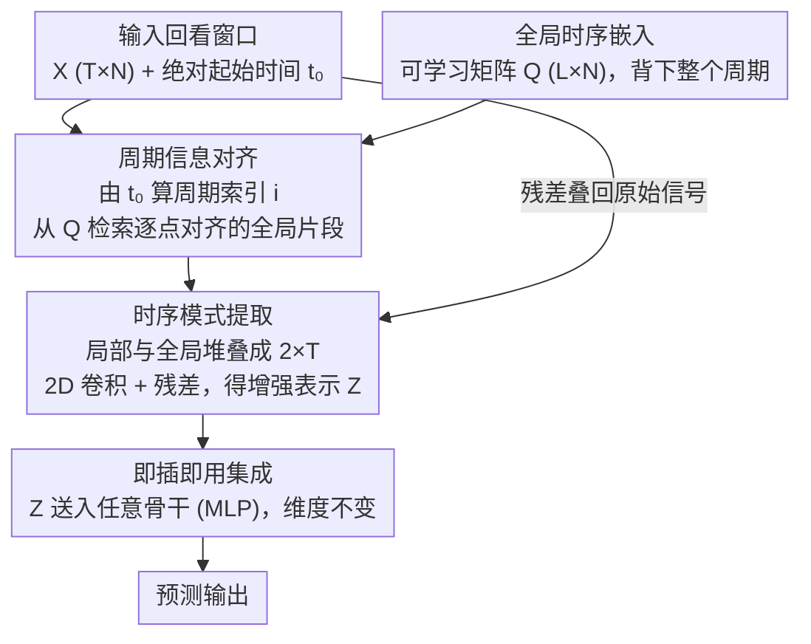

# Enhancing Multivariate Time Series Forecasting with Global Temporal Retrieval

**会议**: ICLR 2026  
**arXiv**: [2602.10847](https://arxiv.org/abs/2602.10847)  
**代码**: [https://github.com/macovaseas/GTR](https://github.com/macovaseas/GTR)  
**领域**: 视频理解 / 时间序列预测  
**关键词**: 时间序列预测, 全局周期性, 检索增强, 即插即用模块, 2D卷积

## 一句话总结

提出 Global Temporal Retriever（GTR），一个轻量级即插即用模块，通过维护自适应全局周期嵌入并利用绝对时间索引检索对齐全局周期信息，使任意预测模型突破回看窗口限制，有效捕获远超输入长度的全局周期模式。

## 研究背景与动机

**全局周期性的重要性**：真实时间序列常包含多尺度周期模式（日、周、月、季节），全局周期信号往往比局部相邻模式包含更强的预测信号。例如 Electricity 数据集中，远距离全局周期段的 Pearson 相关性（0.96）高于相邻局部周期段（0.94, 0.88）

**回看窗口限制**：现有方法（分解、频域、重塑等）均在固定回看窗口内操作，当全局周期长度远超输入长度时，模型对全局模式"视而不见"

**暴力扩展窗口不可行**：简单增大输入长度会导致过拟合噪声、计算/内存开销激增、难以从冗余信息中提取有效信号

**现有方法的局限**：季节-趋势分解方法受限于窗口内的分解精度；频域方法在稳态周期假设下工作良好但难处理长周期非平稳现象；检索增强方法依赖相似度搜索质量且未提供紧凑的时间对齐表示

## 方法详解

### 整体框架

GTR 是一个插在骨干模型之前的轻量级前置模块。它先维护一个覆盖整个周期的可学习全局矩阵，把"整段周期长什么样"显式背下来；预测时用输入序列的绝对起始时间算出当前落在周期里的位置，从矩阵中检索出与输入逐点对齐的全局周期参考；再把局部输入与全局参考堆叠成 2D 表示、用一个 2D 卷积融合，并以残差方式叠回原始信号，得到一份维度不变的增强表示，原样交给骨干（这里用 MLP）完成预测。整个过程不扩大回看窗口，却让模型"看到"了远超输入长度的全局周期结构。

### 关键设计

**1. 全局时序嵌入：把整个周期的结构直接背下来**

要让模型访问超出窗口的全局周期，最直接的办法不是扩大输入，而是显式存下整个周期。GTR 为此引入一个可学习参数矩阵 $\mathbf{Q} \in \mathbb{R}^{L \times N}$，其中 $L$ 是全局周期长度、$N$ 是变量数，矩阵从零初始化，训练过程中自动学到每个变量在一整个周期上的时序形状。它本质上是一份"全局周期速查表"：任意时刻只要知道当前位于周期中的哪个位置，就能从中取出对应的参考值。这样模型无需把输入窗口拉长到周期级别，就能稳定地获得全局周期信息，同时避免了暴力扩窗带来的过拟合与计算爆炸。

**2. 周期信息对齐：用绝对时间把"此刻"对准全局周期的正确位置**

存下整个周期还不够，关键是要知道当前输入落在周期的哪一段。GTR 利用输入序列的绝对起始时间 $t_0$ 计算周期索引向量 $\mathbf{i} = [(t_0 \bmod L) + \tau] \bmod L$（$\tau$ 遍历窗口内各时刻），据此从 $\mathbf{Q}$ 中检索出与输入逐点对齐的全局片段，并经一次线性变换增强。随后把原始输入与检索到的全局参考沿新维度堆叠成一个 $2 \times T$ 的 2D 表示，让"局部观测"与"全局周期"在同一坐标系下并排呈现。正是这种基于绝对索引的精确对齐，使模型能够感知"当前处于全局周期的哪个阶段"，而不是依赖相似度搜索去近似匹配。

**3. 时序模式提取：用 2D 卷积同时建模局部-全局交互与周期内形态**

局部与全局两路信息堆叠成 $\mathbf{F}_n \in \mathbb{R}^{2 \times T}$ 后，GTR 用一个 2D 卷积 $\mathcal{C}(\mathbf{F}_n; \kappa=(2, 1+2\lfloor P/2 \rfloor))$ 来融合，其中卷积核高度固定为 2，恰好同时覆盖局部和全局两个尺度，宽度则由主导高频周期长度 $P$ 决定，从而在跨尺度交互的同时捕捉周期内的细粒度形态。卷积输出再经残差连接 $\mathbf{z}_n = \mathbf{x}_n + \text{Dropout}(\mathbf{h}_n)$ 与原始输入相加，既注入了全局周期线索又保留了原始信号不被冲淡。相比把两路信息简单拼接或相加，2D 卷积天然适合刻画两个时间尺度之间的耦合关系。

**4. 即插即用集成：维度不变，套在任意骨干前都能用**

GTR 的输出与输入保持完全相同的形状，因此可以无侵入地插在 iTransformer、PatchTST、DLinear 等任意骨干模型之前，整条链路端到端训练即可，无需改动宿主架构。这种模块化设计把"补全全局周期"这件事从具体模型中解耦出来，使得已有预测系统只要前置一个 GTR 就能获得全局周期感知能力，最大化了方法的通用性与落地价值。

### 损失函数 / 训练策略

训练采用标准 MSE 损失端到端优化，并用 RevIN（Reversible Instance Normalization）抵消分布偏移。优化器为 Adam，学习率在 {1e-3, 3e-3, 5e-4} 中搜索，MLP 骨干隐藏维度取 $D=512$。

## 实验关键数据

### 主实验

**长期预测（T=96, S∈{96,192,336,720}平均）：**

| 模型 | ETTh1 MSE | ETTm1 MSE | Electricity MSE | Solar MSE | Weather MSE | Top-2 次数 |
|------|-----------|-----------|----------------|-----------|-------------|-----------|
| GTR (Ours) | 0.439 | 0.367 | 0.166 | 0.194 | 0.239 | **10/16** |
| RAFT | 0.428 | 0.381 | 0.175 | 0.301 | 0.270 | 3/16 |
| TQNet | 0.441 | 0.377 | 0.164 | 0.198 | 0.242 | 7/16 |
| CycleNet | 0.457 | 0.379 | 0.168 | 0.210 | 0.243 | 3/16 |

**短期预测（PEMS 数据集, T=96, S∈{12,24,48,96}平均）：**

| 模型 | PEMS03 | PEMS04 | PEMS07 | PEMS08 | Top-2 次数 |
|------|--------|--------|--------|--------|-----------|
| GTR (Ours) | 0.087 | 0.087 | 0.076 | 0.142 | **8/8** |
| TQNet | 0.097 | 0.091 | 0.075 | 0.142 | 7/8 |
| iTransformer | 0.113 | 0.111 | 0.101 | 0.150 | 0/8 |

### 消融实验

| 模型 + GTR Tech. | Electricity MSE 改善 | Weather MSE 改善 |
|------------------|---------------------|-----------------|
| iTransformer + GTR | 显著改善 | 显著改善 |
| PatchTST + GTR | 显著改善 | 显著改善 |
| DLinear + GTR | 显著改善 | 显著改善 |

GTR 作为即插即用模块在不同骨干上均带来一致提升，验证了其通用性。

### 关键发现

1. **全局周期建模至关重要**：GTR 在 Solar-Energy 数据集上超越 CycleNet 8.2% MSE，因为该数据集具有强烈的长期周期模式
2. **短期预测上优势更明显**：PEMS 全部 8 个任务均达到 Top-2，相比 iTransformer 平均降低 18.7% MSE
3. **跨模型通用性**：GTR 技术在 iTransformer、PatchTST、DLinear 等不同架构上均带来一致提升
4. **Traffic 数据集的局限**：由于强时空依赖和时延效应，GTR 在 Traffic 上不如专门建模变量间关系的模型（S-Mamba, SOFTS）

## 亮点与洞察

- **核心洞察**：全局周期的预测信号强于局部相邻模式（用 Pearson 相关矩阵定量验证），但被固定窗口遮蔽
- **设计极简而有效**：仅一个可学习矩阵 + 绝对时间索引 + 2D 卷积，参数和计算开销极小
- **即插即用特性**使 GTR 具有广泛实用价值，可直接提升现有预测系统的性能
- 复杂度分析清晰：总复杂度 $O(NT^2 + Nd^2 + NTd + NSd)$，关于变量数 N 和预测长度 S 线性

## 局限与展望

1. **全局周期长度 L 需要预先指定**：对于周期长度未知或变化的时间序列，需要自动周期检测机制
2. **对强空间依赖数据表现不佳**：Traffic 数据集的结果表明 GTR 未充分建模变量间关系
3. **全局嵌入是静态的**：一旦训练完成，全局周期模式固定，对概念漂移或周期变化的适应需要重新训练
4. **MLP 骨干的选择**：虽然验证了跨模型通用性，但骨干模型选择对最终性能仍有影响
5. 缺少对非周期性或弱周期性时间序列的分析

## 相关工作与启发

- **CycleNet**：显式学习循环周期结构，但受限于观测窗口——GTR 通过全局嵌入突破此限制
- **TimesNet**：将 1D 序列变换为 2D 张量建模周期内和周期间变化——GTR 的 2D 卷积思路与之类似但直接建模局部-全局交互
- **检索增强预测（RAFT 等）**：通过检索历史相似片段扩大上下文——GTR 用紧凑的全局嵌入替代显式检索，更高效且时间对齐
- 思路可推广至视频理解：视频中的周期性动作识别也面临"局部窗口看不到全局周期"的类似问题

## 评分

- **新颖性**: ⭐⭐⭐⭐ 全局周期嵌入 + 绝对时间索引的组合简洁新颖，但整体理念比较直观
- **实验充分度**: ⭐⭐⭐⭐⭐ 6个数据集、长短期预测、跨模型消融、复杂度分析非常全面
- **写作质量**: ⭐⭐⭐⭐ 动机可视化（Pearson 矩阵）直观有力，方法描述清晰
- **价值**: ⭐⭐⭐⭐ 即插即用设计具有很高实用价值，但贡献集中在工程层面

<!-- RELATED:START -->

## 相关论文

- [\[ICML 2025\] LightGTS: A Lightweight General Time Series Forecasting Model](../../ICML2025/model_compression/lightgts_a_lightweight_general_time_series_forecasting_model.md)
- [\[AAAI 2026\] XLinear: A Lightweight and Accurate MLP-Based Model for Long-Term Time Series Forecasting with Exogenous Inputs](../../AAAI2026/model_compression/xlinear_a_lightweight_and_accurate_mlp-based_model_for_long-term_time_series_for.md)
- [\[ICLR 2026\] Grounding and Enhancing Informativeness and Utility in Dataset Distillation](grounding_and_enhancing_informativeness_and_utility_in_dataset_distillation.md)
- [\[ICLR 2026\] Why Attention Patterns Exist: A Unifying Temporal Perspective Analysis](why_attention_patterns_exist_a_unifying_temporal_perspective_analysis.md)
- [\[ICLR 2026\] FlyPrompt: Brain-Inspired Random-Expanded Routing with Temporal-Ensemble Experts for General Continual Learning](flyprompt_brain-inspired_random-expanded_routing.md)

<!-- RELATED:END -->
