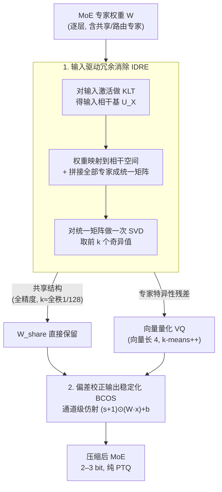

# KBVQ-MoE: KLT-guided SVD with Bias-Corrected Vector Quantization for MoE Large Language Models

**会议**: ICLR 2026  
**arXiv**: [2602.11184](https://arxiv.org/abs/2602.11184)  
**代码**: 无  
**领域**: 模型压缩  
**关键词**: MoE量化, 向量量化, KLT变换, SVD冗余消除, 偏差校正

## 一句话总结
提出 KBVQ-MoE，首个专为MoE架构设计的向量量化框架，通过KLT引导的SVD消除专家间冗余共享（IDRE），以及偏差校正的输出稳定化（BCOS），在2-bit量化下比现有方法提升10%+准确率。

## 研究背景与动机
MoE模型（如Qwen3-30B-A3B、Mixtral-8x7B）通过稀疏专家激活实现了性能-效率的平衡，但庞大的参数量使部署困难（Qwen3-80B-A3B需160GB+显存）。

向量量化(VQ)在密集LLM的超低比特压缩中展现了强大潜力——将权重向量映射到离散codebook中的最近码字。但直接应用于MoE存在两个关键障碍：

**专家间冗余表示**：MoE专家经常捕获相似的特征模式，VQ对每个专家重复量化相似表示，导致有限codebook容量的低效利用

**累积输出偏差被专家聚合放大**：量化误差跨层累积产生偏差，MoE中多专家的加权聚合进一步放大偏差，导致比密集LLM更严重的分布漂移

核心idea：先用KLT+SVD提取跨专家的共享权重结构（全精度保留），仅对专家特异性部分做VQ，然后用通道级仿射校正修复分布漂移。

## 方法详解

### 整体框架
KBVQ-MoE 想把 MoE 的权重压到 2–3 bit 又不崩，核心思路是先把"该省的省、该保的保"分开，再补一道校正。它分两步走：第一步 IDRE（输入驱动冗余消除）用 KLT 引导的 SVD 把每个专家权重拆成两块——一块是所有专家共享的结构（全精度保留），一块是专家各自特异的残差；只有特异性残差才交给向量量化（VQ）压成低比特。第二步 BCOS（偏差校正输出稳定化）在 VQ 之后给每个输出通道加一个仿射校正，把量化带来的均值/方差漂移拉回全精度水平。整条链路是

$$W \xrightarrow[\text{KLT+SVD}]{\text{IDRE}} \underbrace{W_{\text{share}}}_{\text{共享部分}} + \underbrace{W_{\text{quant}}}_{\text{特异部分}} \xrightarrow[\text{Bias Correction}]{\text{BCOS}} W_{\text{share}} + W_{\text{quant}}^{\text{VQ}} + (s, b)$$

全程纯 PTQ（训练后量化）、不重新训练。其中 VQ 这一步用的是常规配置：向量长度取 4，码本用 k-means++ 初始化再迭代 100 次收敛；IDRE 的输入统计和 BCOS 的输出统计都基于同一批校准数据（Red Pajama 256 个样本、序列长度 4096）估计，整套实验在单张 NVIDIA RTX A6000 上即可完成。

### 关键设计

**1. 输入驱动的冗余消除 IDRE：把专家共享的那部分权重挑出来全精度保留，别让 VQ 反复浪费码字**

MoE 的专家常常学到相似的特征模式，如果对每个专家都独立做 VQ，有限的 codebook 容量会被这些重复结构反复占用。IDRE 的做法是先识别出跨专家的公共结构再单独处理。它分三步：先对输入激活做 KLT，计算协方差矩阵 $C_X = \frac{1}{B-1}X^TX$ 并特征分解，得到按能量排序的正交基 $U_X = U_{\text{KLT}} \Lambda_{\text{KLT}}^{1/2}$；再把权重映射到这个输入相干空间 $\hat{W} = WU_X$，让后续的结构分析以输入的主方向为导向，而不是纯权重空间的盲目分解；最后把全部 $n$ 个专家的变换权重纵向拼成统一矩阵 $\bar{W} \in \mathbb{R}^{(n \cdot oc) \times ic}$，对它做一次 SVD，取前 $k$ 个奇异值对应的子空间作为共享结构，并映射回原始空间 $U_{\text{share}} = U^T \cdot U_X^{-1}$。这样一次 SVD 就同时处理了所有专家的冗余，KLT 又保证提取出的共享方向是输入统计上真正重要的方向。截断秩 $k$ 只取全秩的约 $1/128$，因此全精度共享部分带来的参数增量仅约 0.12%，剩下的特异性残差才交给 VQ——codebook 容量从此集中在真正非冗余的部分。

**2. 偏差校正的输出稳定化 BCOS：用一层几乎零成本的仿射变换，把 VQ 量化后被专家聚合放大的分布漂移拉回来**

量化误差会逐层累积成偏差，而 MoE 把多个专家的输出加权聚合，会进一步放大这种偏差，使分布漂移比密集 LLM 更严重。BCOS 针对已经 VQ 量化后的特异性权重 $W_{\text{quant}}$，在输出端做一次通道级仿射校正：

$$\mathbf{y}_{\text{corr}} = (s+1) \odot (W_{\text{VQ}}x) + b$$

其中缩放和偏移按通道对齐量化输出与全精度输出的二阶统计，$s_j \approx \frac{\sigma_{y_j}}{\sigma_{\hat{y}_j}} - 1$，$b_j = \mu_{y_j} - (1+s_j)\mu_{\hat{y}_j}$，让每个通道的均值和方差都回到全精度水平。这组参数在最小均方误差（MMSE）意义下有闭式解，只需校准数据的统计量即可直接算出，无需额外训练；每层只多 $2 \cdot oc$ 个参数，计算和存储开销可忽略。

## 实验关键数据

### 主实验（多模型、多比特宽度）

| 模型 | 比特 | 方法 | PPL(↓) | 平均准确率(↑) |
|------|------|------|--------|-------------|
| Qwen1.5-MoE-A2.7B | FP16 | — | 7.22 | 68.07 |
| Qwen1.5-MoE-A2.7B | 3-bit | VQ | 11.47 | 55.94 |
| Qwen1.5-MoE-A2.7B | 3-bit | GPTQ | 7.58 | 66.36 |
| Qwen1.5-MoE-A2.7B | 3-bit | **KBVQ-MoE** | **7.74** | **67.99** |
| Qwen3-30B-A3B | 2-bit | VQ | 115.30 | 30.61 |
| Qwen3-30B-A3B | 2-bit | **KBVQ-MoE** | **11.87** | **63.37** |
| Mixtral-8x7B | 3-bit | GPTQ | 4.17 | 77.43 |
| Mixtral-8x7B | 3-bit | **KBVQ-MoE** | **4.07** | **78.35** |

### 消融实验（Qwen3-30B-A3B, 3-bit）

| IDRE | BCOS | PPL | ARC-E | ARC-C | HellaSwag |
|------|------|-----|-------|-------|-----------|
| ✗ | ✗ | 18.72 | 57.83 | 40.87 | 63.23 |
| ✓ | ✗ | 11.67 | 71.35 | 50.55 | 73.51 |
| ✗ | ✓ | 14.32 | 65.49 | 47.33 | 68.37 |
| ✓ | ✓ | **9.26** | **—** | **—** | **—** |

### 关键发现
- Qwen1.5-MoE 3-bit量化达到67.99准确率，几乎等于FP16的68.07——损失仅0.08%
- Qwen3-30B-A3B 2-bit：KBVQ-MoE PPL降低6点、准确率提升10%+ vs 直接VQ
- IDRE消除冗余后专家输出相似度从高到低显著下降（对比图验证）
- BCOS有效修复分布漂移——校正后的通道均值和方差与FP精确对齐
- IDRE贡献 > BCOS贡献（PPL降低7 vs 4.4），但二者协同效果最佳

## 亮点与洞察
- 首次系统解决VQ在MoE架构上的特有问题——冗余浪费和偏差放大
- KLT引导SVD的设计优雅——输入统计驱动的权重空间对齐使冗余提取更精准
- BCOS的闭式解简单实用，仅需校准数据统计，无需额外训练
- 在极低比特（2-bit）下仍保持可用性能，说明方法的压缩极限较高

## 局限与展望
- 共享结构以全精度保留增加了存储，截断秩 $k$ 的choice可能需要per-layer调优
- KLT假设输入分布是平稳的，动态输入可能导致KLT基不够好
- 仅在推理（PTQ）设置下评估，与QAT结合可能进一步提升
- 在更大的MoE模型（如Qwen3-80B-A3B）上的可扩展性未验证

## 相关工作与启发
- **vs GPTQ/MoEQuant**: 标量量化方法在≤3 bit表现差，KBVQ-MoE利用VQ的结构优势
- **vs VPTQ/AQLM**: 通用VQ方法未考虑MoE的专家冗余，直接应用效果不佳

## 评分
- 新颖性: ⭐⭐⭐⭐ KLT+SVD+VQ+仿射校正的组合新颖但各组件有前人基础
- 实验充分度: ⭐⭐⭐⭐⭐ 4个模型、2/3-bit、7个数据集、完整消融
- 写作质量: ⭐⭐⭐⭐ 方法描述详细，公式推导清晰
- 价值: ⭐⭐⭐⭐⭐ 首个MoE专用VQ框架，3-bit近无损量化实用价值极高

<!-- RELATED:START -->

## 相关论文

- [\[ICML 2026\] RQ-MoE: Residual Quantization via Mixture of Experts for Efficient Input-Dependent Vector Compression](../../ICML2026/model_compression/rq-moe_residual_quantization_via_mixture_of_experts_for_efficient_input-dependen.md)
- [\[ICLR 2026\] Steering MoE LLMs via Expert (De)Activation](steering_moe_llms_via_expert_deactivation.md)
- [\[ICLR 2026\] SERE: Similarity-based Expert Re-routing for Efficient Batch Decoding in MoE Models](sere_similarity-based_expert_re-routing_for_efficient_batch_decoding_in_moe_mode.md)
- [\[ICLR 2026\] MoNE: Replacing Redundant Experts with Lightweight Novices for Structured Pruning of MoE](mone_replacing_redundant_experts_with_lightweight_novices_for_structured_pruning.md)
- [\[ACL 2025\] EAC-MoE: Expert-Selection Aware Compressor for Mixture-of-Experts Large Language Models](../../ACL2025/model_compression/eac_moe_expert_aware_compression.md)

<!-- RELATED:END -->
