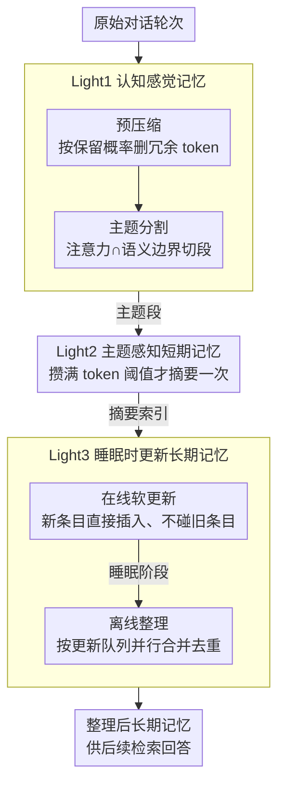

# LightMem: Lightweight and Efficient Memory-Augmented Generation

**会议**: ICLR 2026  
**arXiv**: [2510.18866](https://arxiv.org/abs/2510.18866)  
**代码**: [GitHub](https://github.com/zjunlp/LightMem)  
**领域**: 模型压缩  
**关键词**: LLM记忆系统, 感觉记忆, 短期记忆, 长期记忆, 睡眠时更新

## 一句话总结
提出 LightMem，一个受人类 Atkinson-Shiffrin 记忆模型启发的三阶段轻量记忆系统，通过认知感觉记忆预压缩、主题感知短期记忆整合、睡眠时离线更新三个模块，在 LongMemEval 上准确率提升最高7.7%，同时 token 消耗降低高达38倍。

## 研究背景与动机
LLM在动态复杂交互环境中难以有效利用历史信息，记忆系统是解决方案。但现有记忆系统有三大效率痛点：

**冗余感觉输入**: 原始对话包含大量无关信息，直接处理浪费资源甚至损害上下文学习能力

**粗糙粒度组织**: 按固定窗口切分导致语义混淆，按单轮切分又频繁调用API，两者均不理想

**实时更新瓶颈**: 记忆更新在推理时执行，引入延迟；且由于读写依赖需串行处理

核心矛盾是性能与效率的权衡——现有系统要么准确但昂贵，要么高效但粗糙。LightMem 的核心idea是模仿人类记忆的三层结构：快速过滤（感觉记忆）→ 组织整理（短期记忆）→ 深度巩固（长期记忆，离线执行）。

## 方法详解

### 整体框架
LightMem 要解决的是"记忆系统准确但太贵"的矛盾：原始对话噪声大、记忆更新又卡在推理路径上。它把对话信息依次过 3 个"Light"模块——Light1 先做预压缩 + 主题分割，把噪声 token 删掉、按话题切成段；Light2 以主题段为单位攒到阈值再摘要一次，索引进长期记忆；Light3 在线只做"软更新"（新条目直接插入、不动旧条目），把昂贵的合并去重整体推迟到离线"睡眠"阶段并行执行。这样用户交互时只剩轻量操作，重计算全挪到离线。

### 关键设计

**1. Light1 认知感觉记忆：在信息进入记忆系统前先过滤冗余、切好主题**

针对"原始对话噪声大、固定窗口切分又会语义混淆"这个痛点，Light1 包含预压缩和主题分割两个子模块。预压缩借用 LLMLingua-2 作为压缩模型，对每个 token 估计一个保留概率 $P(\text{retain } x_i \mid \bm{x}; \theta)$，再把阈值 $\tau$ 设为分布的第 $r$ 百分位，只留下信息量高的 token（也可改用交叉熵过滤，熵越高代表越意外、越该保留）。压缩之后，主题分割维护一个感觉缓冲区，缓冲区满了就触发一次混合切分：注意力边界 $\mathcal{B}_1$ 取相邻轮次注意力的局部极大值，语义边界 $\mathcal{B}_2$ 取相邻轮次嵌入相似度跌破阈值的位置，最终边界取两者交集 $\mathcal{B} = \mathcal{B}_1 \cap \mathcal{B}_2$。两个信号都同意才切，所以既不会像固定窗口那样把同一话题拦腰截断，也不会像单轮切分那样频繁触发后续 API 调用。

**2. Light2 主题感知短期记忆：以"主题段"而非固定窗口为单位攒摘要**

主题段从 Light1 出来后暂存在短期记忆（STM）缓冲区里，攒到设定的 token 阈值才调用一次 LLM 生成简洁摘要。每个主题在记忆里以 {topic, {$\text{sum}_i$, $\text{user}_i$, $\text{model}_i$}} 的结构组织——既留摘要又留原始的用户/模型轮次，摘要再通过嵌入被索引进长期记忆供后续检索。用主题段当摘要粒度是关键：粒度太细（每轮都摘）会频繁打 API，粒度太粗（固定窗口）又会把不相关内容糊在一起导致摘要失真，按主题边界对齐刚好在 API 调用量和摘要质量之间取折中。

**3. Light3 睡眠时更新长期记忆：把昂贵的合并去重从在线推理挪到离线**

记忆更新通常要做条目间的合并、去重，这些操作有读写依赖、必须串行，放在推理时就成了延迟瓶颈。Light3 把它一分为二：在线阶段只做"软更新"，新记忆条目直接插入、不碰已有条目，所以用户交互时几乎零额外开销；真正的整理推迟到离线"睡眠"阶段。睡眠时为每条记忆 $e_i$ 算一个更新队列 $\mathcal{Q}(e_i) = \text{Top}_k\{(e_j, \text{sim}(v_i, v_j)) \mid t_j \geq t_i\}$，只允许时间戳更晚的条目去更新更早的条目（保证因果方向一致）。由于不同条目的队列彼此独立，这些更新可以并行跑，离线整理的总延迟因此大幅下降。

### 损失函数 / 训练策略
LightMem 是一个无需训练的管道式系统，核心参数是压缩率 $r$ 和 STM 缓冲区容量 $th$。

## 实验关键数据

### 主实验 (LongMemEval-S, GPT-4o-mini)

| 方法 | ACC(%) | 总Token(k) | API调用 | 运行时间(s) |
|------|--------|------------|---------|------------|
| FullText | 56.80 | 105.07 | - | - |
| A-MEM | 62.60 | 1605.81 | 986 | 5132 |
| MemoryOS | 44.80 | 2991.75 | 2938 | 8030 |
| Mem0 | 53.61 | 1152.62 | 812 | 4248 |
| **LightMem** (r=0.7,th=512) | **68.64** | **28.25** | **18** | **284** |
| + 离线更新 | 67.07 | 111.69 | 144 | 496 |

### 消融实验

| 配置 | ACC(%) | Token效率 | 说明 |
|------|--------|-----------|------|
| r=0.5, th=256 | 64.29 | 30.81k | 压缩率低，保留更多信息 |
| r=0.6, th=256 | 67.78 | 35.11k | 适中压缩 |
| r=0.7, th=512 | 68.64 | 28.25k | 最佳准确率-效率组合 |
| 无压缩 | 偏低 | 高 | 冗余信息干扰上下文学习 |
| 无主题分割 | 偏低 | 较低 | 语义混淆导致摘要不准确 |

### 关键发现
- LightMem在准确率最高的同时token消耗最低：对比A-MEM提升6%准确率，token减少57倍
- 在线测试时成本极低：token降低最高106倍，API调用减少最高159倍
- 适度压缩（r=0.7）反而优于低压缩（r=0.5），说明去冗余确实改善上下文学习
- 睡眠时并行更新比串行更新快数倍

## 亮点与洞察
- 人类记忆模型的三阶段映射自然且有效：感觉过滤 → 工作记忆 → 长期巩固
- "睡眠时更新"概念优雅，将昂贵操作完全与用户交互解耦
- 无训练、即插即用的设计使其易于与任何LLM后端集成
- 压缩反而提升性能的发现对记忆系统设计有指导意义

## 局限与展望
- 压缩模型（LLMLingua-2）的质量会影响下游效果
- 主题分割阈值需要调优，跨领域泛化性存疑
- 离线更新的触发时机和频率没有自适应机制
- 评测主要在对话场景，其他长期交互模式（如代码开发）未测试

## 相关工作与启发
- **vs A-MEM**: 准确率更高且token消耗低60倍+
- **vs MemoryOS**: 避免了实时更新带来的高延迟
- **vs NaiveRAG**: 结构化记忆组织比简单检索更有效

## 评分
- 新颖性: ⭐⭐⭐⭐ 三阶段记忆架构设计巧妙，睡眠时更新概念新颖
- 实验充分度: ⭐⭐⭐⭐⭐ LongMemEval + LoCoMo，多骨干模型，全面效率分析
- 写作质量: ⭐⭐⭐⭐ 结构清晰，复杂度分析详尽
- 价值: ⭐⭐⭐⭐⭐ 实用性强，效率提升巨大，具有工程落地价值

<!-- RELATED:START -->

## 相关论文

- [\[ICML 2025\] Lego Sketch: A Scalable Memory-augmented Neural Network for Sketching Data Streams](../../ICML2025/model_compression/lego_sketch_a_scalable_memory-augmented_neural_network_for_sketching_data_stream.md)
- [\[ICLR 2026\] QKV Projections Require a Fraction of Their Memory](qkv_projections_require_a_fraction_of_their_memory.md)
- [\[ICLR 2026\] π-Flow: Policy-Based Few-Step Generation via Imitation Distillation](pi-flow_policy-based_few-step_generation_via_imitation_distillation.md)
- [\[ICLR 2026\] PTQ4ARVG: Post-Training Quantization for AutoRegressive Visual Generation Models](ptq4arvg_post-training_quantization_for_autoregressive_visual_generation_models.md)
- [\[ICLR 2026\] LLMs Encode Their Failures: Predicting Success from Pre-Generation Activations](llms_encode_their_failures_predicting_success_from_pre-generation_activations.md)

<!-- RELATED:END -->
