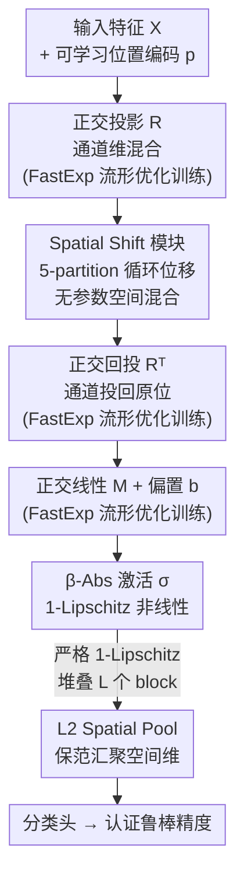

# LipNeXt: Scaling up Lipschitz-based Certified Robustness to Billion-parameter Models

**会议**: ICLR 2026  
**arXiv**: [2601.18513](https://arxiv.org/abs/2601.18513)  
**代码**: 无  
**领域**: 其他 / 对抗鲁棒性  
**关键词**: Lipschitz约束, 认证鲁棒性, 正交矩阵, 流形优化, 空间位移模块

## 一句话总结

提出LipNeXt——首个无约束、无卷积的1-Lipschitz架构，通过正交流形优化学习正交矩阵 + 由Theorem 1理论驱动的Spatial Shift Module实现空间混合，成功扩展到十亿参数规模，在CIFAR-10/100、Tiny-ImageNet和ImageNet上全面刷新认证鲁棒精度(CRA) SOTA，ImageNet上 $\varepsilon=1$ 时CRA提升达+8%。

## 研究背景与动机

**对抗鲁棒性的挑战**：对抗样本是安全关键应用（自动驾驶、医学影像、恶意软件检测）的核心威胁。经验防御无法提供形式化保证，模型可能在更强攻击下依然脆弱。

**认证鲁棒性的两条路线**：(a) 随机平滑(RS)通过噪声平均给出概率保证；(b) Lipschitz方法利用网络的Lipschitz常数给出确定性(worst-case)保证。本文聚焦后者。

**Lipschitz方法的scaling瓶颈**：现有方法大多使用 $\leq 32$M参数的VGG风格架构，在CIFAR-100上就开始欠拟合，ImageNet上性能大幅下降。增大模型带来的增益迅速饱和。

**正交矩阵是性能关键也是开销瓶颈**：紧的Lipschitz界要求所有权重正交。现有显式方法（矩阵指数SOC、Cayley变换、LOT-Orth、Cholesky-Orth）和隐式方法（AOL、CPL、SLL层）都引入大量额外计算（FFT、矩阵逆、power iteration等），限制了扩展性和低精度训练。

**注意力机制不适合Lipschitz控制**：Transformer的attention缺乏直接的Lipschitz约束手段。但ConvNeXt和MetaFormer表明，Transformer时代的宏观设计可以与Lipschitz架构结合。

**核心动机**：能否设计一个无需约束重参数化、无需卷积的1-Lipschitz架构，使认证鲁棒性像标准训练一样享受scaling law的红利？

## 方法详解

### 整体框架

LipNeXt把一个 block 拆成四个串联的 1-Lipschitz 组件——正交投影 $R\in\mathcal{M}_C$ 先在通道维做混合，Spatial Shift $\mathcal{S}$ 做空间混合，$R^\top$ 把通道投回原位，最后一层正交线性 $M$ 接 $\beta$-Abs 激活，整块写作 $Z=\sigma(MR^\top\mathcal{S}(R(X+p))+b)$，其中 $p\in\mathbb{R}^{H\times W\times 1}$ 是可学习位置编码。这样设计的核心是：每个组件都被单独证明保持 1-Lipschitz，串起来后全网严格 1-Lipschitz，无需任何事后约束或重参数化；堆叠 $L$ 个这样的 block 后，末端用 L2 Spatial Pool $[\text{L2Pool}(X)]_c=\sqrt{\sum_{h,w}X_{h,w,c}^2}$ 汇聚空间维，把保范性一路保持到分类头。三个核心创新各管一段数据流：FastExp 流形优化负责把所有正交矩阵（$R$、$R^\top$、$M$）训出来，Spatial Shift 负责无参数的空间混合，$\beta$-Abs 负责 1-Lipschitz 的非线性。

### 关键设计

**1. FastExp 流形优化：在正交流形上直接训练，把每步开销压到 5 次矩阵乘**

紧的 Lipschitz 界要求权重正交，但显式重参数化（矩阵指数、Cayley、Cholesky-Orth）都引入 FFT、矩阵逆等昂贵算子，是 scaling 的瓶颈。本文转而把正交矩阵当作流形上的点直接优化，关键观察是大模型学习率 $\eta\sim10^{-3}$ 很小，使指数映射的参数矩阵 $A$ 的 Frobenius 范数也很小，于是用自适应截断 Taylor 展开 $\text{FastExp}(A)$ 代替精确 $\exp(A)$：当 $\|A\|_F<0.05$ 时只取 $I+A+\tfrac12A^2$，$0.05\le\|A\|_F<0.25$ 取到 $\tfrac16A^3$ 项，$0.25\le\|A\|_F<1$ 取到 $\tfrac1{24}A^4$ 项，仅当 $\|A\|_F\ge1$ 才回退到精确指数。截断误差会缓慢累积，因此每个 epoch 结束做一次 SVD $X=U\Sigma V^\top$ 并重置 $X\leftarrow UV^\top$ 做 Polar Retraction 把矩阵拉回流形；同时把 Lookahead 改造成流形版本——标准的权重插值 $0.5X_t+0.5X_{t-K}$ 会破坏正交性，改为在正切空间累加 skew-symmetric 更新 $X_{\text{slow}}\leftarrow X_{\text{slow}}\cdot\text{FastExp}(\tfrac12\sum_{j=t-K+1}^{t}\Delta_j)$。三者组合后每步额外开销最多 5 次矩阵乘，远低于 FFT 卷积或 power iteration，且数值上稳定到能跑 bfloat16。

**2. Spatial Shift Module：用 Theorem 1 把"保范的空间混合"逼成确定的空间位移**

空间混合若用普通卷积，控制 Lipschitz 又得引入 power iteration。本文先证 Theorem 1：对 kernel $K\in\mathbb{R}^{k\times k}$、单位步长、circular padding 的卷积 $f_K$，它保范（$\|f_K(X)-f_K(Y)\|_F=\|X-Y\|_F$ 对所有 $X,Y$ 成立）当且仅当 $K$ 中恰有一个非零元且取值 $\pm1$。也就是说，保范的 depthwise 卷积别无选择、只能退化成一次空间位移——架构直接由定理导出而非试出来。落到 2D 实现上，把每个 token 的特征切成 5 个 partition 分别做上/下/左/右移和不动的 circular shift，并靠前后的正交投影 $R$ 混通道，避免位移永远作用在同一组通道上，经验最优位移比例 $\alpha\in\{1/8,1/16\}$。这里特意选 circular padding 而非 zero padding：后者会隐式泄露位置信息但破坏保范，前者保范却不带位置信息，于是再补一个显式位置编码 $p$，实验证实"circular padding + 显式 PE"优于 zero-padding 方案。

**3. β-Abs 激活：一个既 1-Lipschitz 又 GPU 友好的非线性**

常用的 MinMax 激活要排序/配对，在大模型上不划算。本文定义 $[\beta\text{-Abs}(\boldsymbol{x})]_i=|x_i|$（当 $i\le\beta d$）否则 $=x_i$，用 $\beta\in[0,1]$ 连续调节非线性比例。它取绝对值的部分自然 1-Lipschitz，且只是逐元素分段，没有排序或配对操作所以对 GPU 友好；同时表达力不减——当 $\beta=0.5$ 时存在 $R\in\mathcal{M}_{2d}$ 使 $\text{MinMax}(x)=R^\top\beta\text{-Abs}(Rx)$，等于把 MinMax 作为特例包含进来。

### 损失函数 / 训练策略

认证鲁棒训练沿用 LiResNet++ 的训练配方并采用 EMMA loss，多类分类用 one-vs-rest 分解。得益于 FastExp 替掉了 power iteration 与 FFT，LipNeXt 可在 bfloat16 下训练，而 LiResNet 因 power iteration 在 bf16 下数值溢出只能用 float32、BRONet 的 FFT 复数运算等效 float64——这让 LipNeXt 能持续吃到低精度硬件加速的红利。

## 实验关键数据

### 表1：CIFAR-10/100 + Tiny-ImageNet 主实验

| 数据集 | 模型 | 参数量 | Clean Acc | CRA@36/255 | CRA@72/255 | CRA@108/255 |
|--------|------|--------|-----------|------------|------------|-------------|
| CIFAR-10 | LiResNet | 83M | 81.0 | 69.8 | 56.3 | 42.9 |
| CIFAR-10 | BRONet | 68M | 81.6 | 70.6 | 57.2 | 42.5 |
| CIFAR-10 | **LipNeXt L32W1024** | **64M** | **81.5** | **71.2** | **59.2** | **45.9** |
| CIFAR-10 | **LipNeXt L32W2048** | **256M** | **85.0** | **73.2** | **58.8** | 43.3 |
| CIFAR-100 | LiResNet | 83M | 53.0 | 40.2 | 28.3 | 19.2 |
| CIFAR-100 | BRONet | 68M | 54.3 | 40.2 | 29.1 | 20.3 |
| CIFAR-100 | **LipNeXt L32W2048** | **256M** | **57.4** | **44.1** | **31.9** | **22.2** |
| Tiny-IN | BRONet | 75M | 41.2 | 29.0 | 19.0 | 12.1 |
| Tiny-IN | **LipNeXt L32W2048** | **256M** | **45.5** | **35.0** | **25.9** | **18.0** |

### 表3：ImageNet 实验

| 模型 | 参数量 | 训练速度(min/epoch) | CRA@ε=1 | Clean@ε=36/255 | CRA@ε=36/255 |
|------|--------|-------------------|---------|----------------|---------------|
| LiResNet | 51M | 5.3 | 14.2 | 45.6 | 35.0 |
| BRONet | 86M | 10.5 | - | 49.3 | 37.6 |
| **LipNeXt 1B** | **1B** | **8.9** | **21.1** | **55.9** | **40.3** |
| **LipNeXt 2B** | **2B** | **17.8** | **22.4** | **57.0** | **41.2** |

ImageNet $\varepsilon=1$ 时CRA较BRONet提升+8%，$\varepsilon=36/255$ 时CRA提升+3%。

### 表4：Scaling实验 (ImageNet 400类, ε=1)

| 配置 | 深度 | 宽度 | Clean Acc | CRA |
|------|------|------|-----------|-----|
| 固定深度=32 | 32 | 1024→4096 | 40.5→51.7 | 22.9→30.0 |
| 固定宽度=2048 | 8→128 | 2048 | 30.7→47.5 | 22.4→26.9 |
| 固定参数=1B | 32 | 4096 | **51.7** | **30.0** |
| 固定参数=1B | 64 | 2896 | 51.2 | 29.6 |

深度32层在固定参数预算下最优。宽度和深度都带来非饱和收益。

## 关键发现

1. **Lipschitz认证可以从scaling中获益**：1B→2B参数模型的CRA仍在持续提升，打破了"认证鲁棒=小模型"的传统认知。
2. **低精度训练的稳定性**：LipNeXt可用bfloat16训练，而LiResNet因power iteration在bf16下数值溢出只能用float32，BRONet的FFT复数运算等效float64。这使得LipNeXt能持续受益于硬件加速。
3. **FastExp近似足够准确**：自适应Taylor截断+周期性SVD retraction+流形Lookahead，三者组合保证了数值稳定性，性能与精确矩阵指数相当。
4. **保范卷积的理论极限**：Theorem 1证明circular-padding下保范depthwise卷积只能是空间位移——这是一个tight的必要充分条件。
5. **位置编码的必要性**：circular padding不引入位置信息，需要显式位置编码才能达到与zero-padding竞争的性能。实验验证了circular padding + 显式PE优于zero-padding。

## 亮点与洞察

- **理论驱动的架构设计**：Theorem 1从保范性条件自然导出Spatial Shift Module，不是经验性的"试出来的"设计。
- **约束→流形**的范式转变：将正交约束从"重参数化后投影"变为"直接在流形上优化"，概念简洁且计算高效（每步仅5次矩阵乘）。
- **首个billion-scale认证鲁棒模型**：证明了确定性认证不必局限于小模型，为后续工作开辟了新空间。
- **训练效率**：尽管模型大10-20倍，训练吞吐量与先前工作相当（1B模型8.9min/epoch vs BRONet 86M模型10.5min/epoch）。

## 局限性

- 仅考虑 $\ell_2$ 范数认证，$\ell_\infty$ 范数的Lipschitz认证更具实际需求但更具挑战。
- 2B参数模型的训练需要16×H100 GPU，部署成本高，实用化需要蒸馏或其他压缩技术。
- 最大CRA@ε=108/255在CIFAR-10上不如AOL（49.0 vs 45.9），AOL牺牲clean acc换取大ε下的鲁棒性。
- 未在大规模图文数据集上训练，与随机平滑方法（可利用预训练CLIP等）的对比可能不完全公平。

## 相关工作对比

| 方法 | 正交矩阵实现 | 空间混合 | 是否可scale | 低精度训练 |
|------|-------------|---------|------------|-----------|
| **LipNeXt (本文)** | 流形优化+FastExp | Spatial Shift (无参数) | ✅ 1-2B | ✅ bf16 |
| LiResNet (Hu et al., 2024) | Cholesky-Orth | 卷积+power iteration | ❌ 83M饱和 | ❌ 需float32 |
| BRONet (Lai et al., 2025) | Block Reflector | FFT-based频域卷积 | ❌ 86M | ❌ 等效float64 |

**vs LiResNet**：LipNeXt延续其宏观结构但替换了所有核心组件——用流形优化替代Cholesky-Orth，用Spatial Shift替代卷积+power iteration，消除了scaling瓶颈。

**vs BRONet**：BRONet的FFT卷积需要complex32运算，LipNeXt的Spatial Shift是无参数的整数索引操作。LipNeXt在相同参数量下已超越BRONet，scaling到更大模型后优势更大。

## 评分

- **新颖性**: ⭐⭐⭐⭐⭐ 首创无卷积+流形优化的billion-scale认证鲁棒架构，Theorem 1理论驱动设计
- **实验充分度**: ⭐⭐⭐⭐ 4个数据集 + scaling实验 + 多组消融，但缺少L∞实验
- **写作质量**: ⭐⭐⭐⭐ 理论推导清晰，Algorithm 1完整，动机层层递进
- **实用价值**: ⭐⭐⭐⭐⭐ 认证鲁棒性的重要里程碑，证明确定性保证可以追踪现代scaling趋势

<!-- RELATED:START -->

## 相关论文

- [\[ICML 2026\] Procedural Pretraining: Warming Up Language Models with Abstract Data](../../ICML2026/model_compression/procedural_pretraining_warming_up_language_models_with_abstract_data.md)
- [\[ICLR 2026\] Scaling Reasoning Hop Exposes Weaknesses: Demystifying and Improving Hop Generalization in Large Language Models](scaling_reasoning_hop_exposes_weaknesses_demystifying_and_improving_hop_generali.md)
- [\[ICLR 2026\] MobileLLM-R1: Exploring the Limits of Sub-Billion Language Model Reasoners with Open Training Recipes](mobilellm-r1_exploring_the_limits_of_sub-billion_language_model_reasoners_with_o.md)
- [\[ICML 2026\] Model Merging Scaling Laws in Large Language Models](../../ICML2026/model_compression/model_merging_scaling_laws_in_large_language_models.md)
- [\[ICLR 2026\] A universal compression theory for lottery ticket hypothesis and neural scaling laws](a_universal_compression_theory_for_lottery_ticket_hypothesis_and_neural_scaling_.md)

<!-- RELATED:END -->
