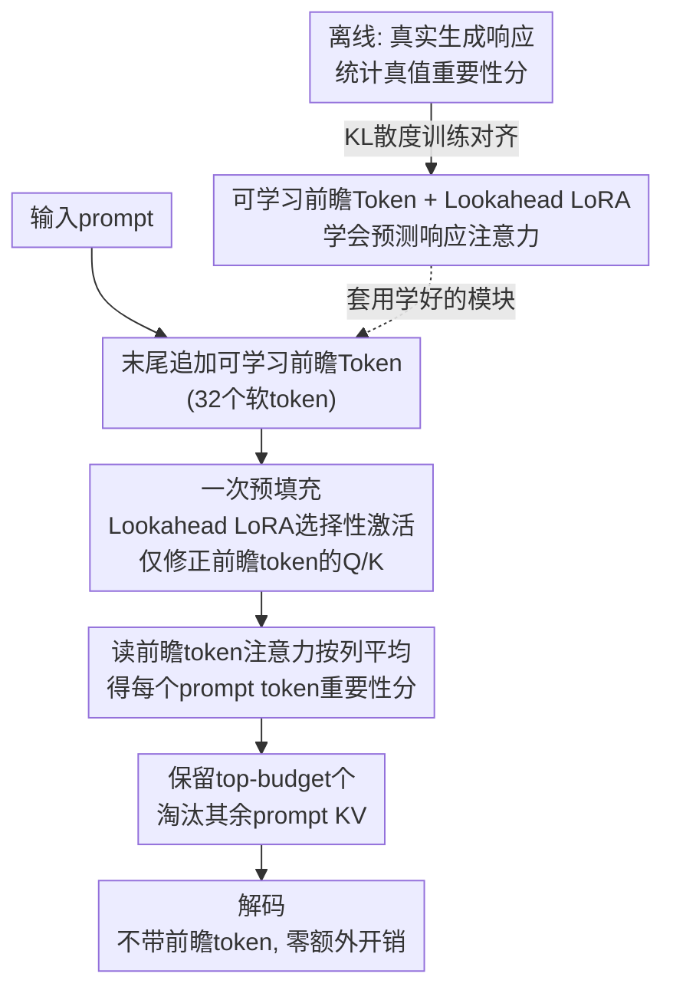

# LookaheadKV: Fast and Accurate KV Cache Eviction by Glimpsing into the Future without Generation

**会议**: ICLR 2026  
**arXiv**: [2603.10899](https://arxiv.org/abs/2603.10899)  
**代码**: [GitHub](https://github.com/SamsungLabs/LookaheadKV)  
**领域**: 模型压缩  
**关键词**: KV缓存压缩, 注意力重要性预测, LoRA, 前瞻token, 长上下文推理

## 一句话总结
提出 LookaheadKV，通过可学习的前瞻token和选择性激活的LoRA模块预测真实响应的注意力重要性分数，实现无需生成草稿的快速精确KV缓存淘汰，在多个长上下文基准上超越现有方法，驱逐开销降低最高14.5倍。

## 研究背景与动机
KV缓存大小随序列长度线性增长，成为长上下文推理的瓶颈。例如LLaMA3.1-70B处理128K token需要40GB内存。KV缓存淘汰方法通过保留重要token的KV缓存来压缩内存。

现有方法面临准确性-开销权衡：

**基于提示的方法**（SnapKV）：用输入后缀估计重要性，开销小但在低预算下性能急剧下降

**基于草稿的方法**（LAQ, SpecKV）：先生成近似响应再用其估计重要性，准确但草稿生成代价高

核心矛盾是：利用未来响应信息可以大幅提升淘汰质量，但生成响应本身就很昂贵。LookaheadKV 的核心idea是：训练一组特殊的前瞻token来"隐式预测"未来注意力模式，完全跳过草稿生成步骤。

## 方法详解

### 整体框架
KV 缓存淘汰的核心难题是「该保留哪些 token」：要判断准就得知道未来的响应会重点关注哪些 prompt token，但真去生成一段草稿响应又太贵。LookaheadKV 的破局思路是把「未来」预测出来而不是生成出来——在预填充阶段，于输入序列末尾追加一小撮可学习的前瞻 token，让它们的注意力查询向量经过专门的 LoRA 增强后，直接预测真实响应会对各 prompt token 投出怎样的注意力分布。训练时用 KL 散度把这组预测分数往真实响应的分数上拉；推理时只跑一遍预填充、读出前瞻 token 的注意力，就能给每个 prompt token 打重要性分并据此淘汰，整个解码阶段不再有任何额外开销。

### 关键设计

**1. 可学习前瞻 Token：用一组软 token 把「未来注意力」压成一次预填充就能读出的信号**

基于草稿的方法之所以准，是因为它真的把响应生成出来、再统计响应对 prompt 的注意力；代价就是那一段自回归生成。LookaheadKV 把这件事换成在输入末尾追加 $n_{\text{lookahead}}$ 个可训练软 token（默认 32 个），训练它们的查询向量去「压缩」真实响应的注意力模式。淘汰时直接对这些前瞻 token 的注意力矩阵按列求平均，得到每个 prompt token $j$ 的重要性估计 $\tilde{s}_j = \frac{1}{n_{\text{lookahead}}}\sum_i \mathbf{A}_{\text{LKV}_{i,j}}$。关键在于这些前瞻 token 只在预填充阶段参与，分数读完即弃，解码阶段完全不带它们，因此把草稿生成的成本压到了一次前向里。

**2. Lookahead LoRA（选择性激活）：只给前瞻 token 加 LoRA，原始 token 的表示一字不改**

前瞻 token 要学会预测响应的注意力，光靠原模型权重不够，得有专门的适配能力；但如果这套适配也作用到正常输入 token 上，就改变了原模型行为、破坏了即插即用。LookaheadKV 用一个对输入做掩码的 LoRA 解决：查询（键同理）计算为 $\mathbf{Q}_{\text{LKV}} = [\mathbf{X}; \mathbf{P}]\mathbf{W}_q + [\mathbf{0}; \mathbf{P}]\Delta\mathbf{W}_q$，其中 $\mathbf{X}$ 是正常输入、$\mathbf{P}$ 是前瞻 token，增量 $\Delta\mathbf{W}$ 前面乘的是 $[\mathbf{0}; \mathbf{P}]$——只有前瞻 token 那部分能拿到 LoRA 的修正，正常输入 token 那部分被置零、表示完全不变。这样既给前瞻 token 留足了预测能力，又保证原模型对真实 token 的计算分毫不动，可即插即用、与 FlashAttention 兼容。

**3. KL 散度训练：把预测分数往真实响应分数上拉，学的是排序而非绝对值**

有了前瞻 token 和 LoRA，还需要一个监督信号教它们「真实响应到底关注哪些 token」。LookaheadKV 先用模型对训练样本真实地生成响应、统计出每层每头的真值重要性分数 $\hat{\mathbf{s}}_{\text{GT}}$，再以 KL 散度把前瞻模块的预测分数往真值上对齐：

$$\mathcal{L}_{\text{LKV}} = \frac{1}{LH}\sum_l\sum_h D_{\text{KL}}(\hat{\mathbf{s}}_{\text{GT}}^{l,h} \,\|\, \hat{\mathbf{s}}_{\text{LKV}}^{l,h})$$

其中 $L$、$H$ 为层数与头数。用 KL 而非 MSE 是有意为之：它等价于 ListNet 排序损失，关注的是 token 之间的相对重要性排序而非分数绝对值——而淘汰本来就只看排序、保留 top-budget 个 token，所以这个目标和最终任务严丝合缝。

### 损失函数 / 训练策略
- 训练数据：50K ChatQA2 + 20K Tulu + 7K Stack + 9K few-shot合成
- 最大输入16K，响应长度512（贪婪解码）
- 所有LoRA应用于所有线性层，rank=8，α=32
- 额外可训练参数 < 0.5%（Llama-8B仅20.6M）

## 实验关键数据

### 主实验 (MT-Bench, 多模型)

| 方法 | LLaMA-1B@64 | LLaMA-3B@64 | LLaMA-8B@64 | Qwen-1.7B@64 |
|------|-------------|-------------|-------------|--------------|
| SnapKV | 4.70 | 6.28 | 6.80 | 5.95 |
| PyramidKV | 4.64 | 6.30 | 6.85 | 5.81 |
| StreamingLLM | 4.54 | 5.96 | 6.17 | 5.83 |
| LAQ | 5.03 | 6.48 | 7.10 | 6.19 |
| **LookaheadKV** | **5.21** | **6.87** | **7.26** | **6.70** |
| FullKV | 5.72 | 7.35 | 7.77 | 7.19 |

### 消融实验

| 配置 | LongBench平均 | TTFT开销 | 说明 |
|------|-------------|---------|------|
| 有LoRA + 前瞻token | 最佳 | <2.16% | 完整LookaheadKV |
| 无LoRA，仅前瞻token | 明显降低 | <2% | LoRA贡献显著 |
| 有LoRA，无前瞻token | 降低 | - | 前瞻token是核心 |
| SnapKV（基线） | 较低 | ~0% | 最轻量但不准确 |
| LAQ（草稿生成） | 接近 | 14.5倍于LKV | 生成开销大 |

### 关键发现
- TTFT（首token延迟）开销在32K上下文仅增加2.16%，比LAQ低14.5倍
- 在低预算设置（budget=64）下优势最明显，LLaMA-8B上比SnapKV高0.46分
- 跨6种模型（LLaMA 1B/3B/8B, Qwen 1.7B/4B/8B）一致有效
- LongBench和RULER上在多种预算和上下文长度下均保持优势

## 亮点与洞察
- "glimpsing without generation"的思路优雅：训练implicit的未来表示代替explicit的草稿生成
- 选择性LoRA激活设计精巧：保证推理时的兼容性和可选择性
- 额外参数极少（<0.5%），几乎不影响模型大小
- 得益于与FlashAttention兼容的实现，实际部署友好

## 局限与展望
- 需要离线训练前瞻模块，对每个模型需单独训练
- 训练数据的多样性可能影响特定领域的淘汰质量
- 固定32个前瞻token的设定可能不适合所有场景
- 未探讨与量化等其他压缩方法的组合

## 相关工作与启发
- **vs SnapKV**: 准确率更高，开销相当（均可复用预填充计算）
- **vs LAQ/SpecKV**: 准确率相当或更优，但驱逐开销降低14.5倍
- **vs StreamingLLM**: 在所有设置下均大幅领先

## 评分
- 新颖性: ⭐⭐⭐⭐ 前瞻token替代草稿生成是巧妙的折中方案
- 实验充分度: ⭐⭐⭐⭐⭐ 6模型×4基准×多预算×多上下文长度的全面评测
- 写作质量: ⭐⭐⭐⭐⭐ 问题陈述清晰，理论与实验紧密结合
- 价值: ⭐⭐⭐⭐⭐ 解决了KV缓存淘汰的核心权衡，实用性极强

<!-- RELATED:START -->

## 相关论文

- [\[ACL 2025\] Accurate KV Cache Quantization with Outlier Tokens Tracing](../../ACL2025/model_compression/accurate_kv_cache_quantization_with_outlier_tokens_tracing.md)
- [\[NeurIPS 2025\] Ada-KV: Optimizing KV Cache Eviction by Adaptive Budget Allocation for Efficient LLM Inference](../../NeurIPS2025/model_compression/ada-kv_optimizing_kv_cache_eviction_by_adaptive_budget_allocation_for_efficient_.md)
- [\[ACL 2026\] DASH-KV: Accelerating Long-Context LLM Inference via Asymmetric KV Cache Hashing](../../ACL2026/model_compression/dash-kv_accelerating_long-context_llm_inference_via_asymmetric_kv_cache_hashing.md)
- [\[ICLR 2026\] ConFu: Contemplate the Future for Better Speculative Sampling](confu_contemplate_the_future_for_better_speculative_sampling.md)
- [\[ACL 2026\] The Pitfalls of KV Cache Compression](../../ACL2026/model_compression/the_pitfalls_of_kv_cache_compression.md)

<!-- RELATED:END -->
