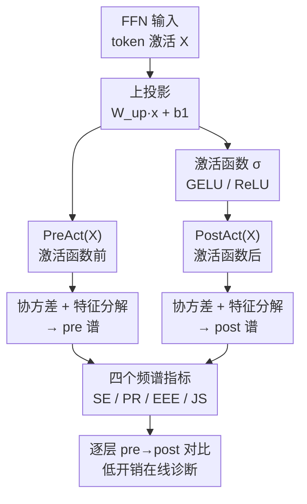

# NerVE: Nonlinear Eigenspectrum Dynamics in LLM Feed-Forward Networks

**会议**: ICLR 2026  
**arXiv**: [2603.06922](https://arxiv.org/abs/2603.06922)  
**代码**: [项目主页](https://nerve-eigenspectrum.github.io/)  
**领域**: 模型压缩 / FFN 分析  
**关键词**: FFN 分析, 特征谱动力学, 方差重注入, 优化器几何, 频谱诊断

## 一句话总结

提出 NerVE，一个轻量级的特征谱分析框架，通过四个互补指标（频谱熵、参与比、特征值早期富集、JS 散度）系统揭示了 LLM 中 FFN 非线性如何重新注入方差、重塑特征谱，以及架构和优化器选择如何印刻独特的频谱签名。

## 研究背景与动机

在 Transformer 中，FFN（前馈网络）占据了大部分参数和计算量，但相比注意力机制，FFN 的内部动力学研究严重不足。现有工作主要关注注意力图可视化和注意力机制分析，而 FFN 如何在高维潜在空间中组织和传播信息仍是开放问题。

关键挑战：
- FFN 变换在高维空间中展开，不像注意力图那样可以直接可视化
- 缺乏系统、高效的工具来刻画 FFN 的非线性激活如何重塑潜在表征
- 已有工作 (Kobayashi et al., 2024; Balestriero et al., 2024) 分别从注意力图和分段仿射分割角度研究 FFN，但都未揭示非线性如何重新分配方差

核心洞察：**FFN 的非线性激活不是简单地缩放激活值，而是主动将方差重新注入到未充分利用的特征模方向中**，从根本上控制着潜在维度的利用率。

## 方法详解

### 整体框架

NerVE 把每个 FFN 层的非线性当作一次"方差再分配"事件来观测：在上投影之后、激活函数之前取 $\text{PreAct}(X) = W_{up}x + b_1$，在激活之后、下投影之前取 $\text{PostAct}(X) = \sigma(W_{up}x + b_1)$（门控 FFN 则取 $\text{PreAct}(X)=W_{gate}x$、$\text{PostAct}(X)=\sigma(W_{gate}x)\odot(W_{up}x)$），对二者各自估计协方差矩阵并做特征分解，得到 pre / post 两套特征谱。围绕这两套谱定义四个互补的频谱指标，逐层比较 pre→post 的谱变化，就能刻画非线性到底对潜在表征做了什么。整个流程逐层独立、只依赖前向激活，可以挂在训练循环里在线运行。

### 关键设计

**1. 频谱熵 SE：用整条谱的均匀程度刻画方差是否被摊开**

单看头部几个特征值无法判断方差利用率，因为长尾里可能藏着大量被压扁的方向。SE 把归一化特征值 $\hat{\lambda}_i$ 当成一个概率分布，计算其 Shannon 熵 $SE = -\sum_{i=1}^{D} \hat{\lambda}_i \log \hat{\lambda}_i$，这等价于量子信息论里的 von Neumann 熵。SE 越高说明方差越均匀地铺在各个方向上，越低则说明方差挤在少数模上。由于熵对中尾部特征值的变化更敏感，它能察觉那些被"轻微唤醒"的次要方向，这正是判断非线性是否在填充潜在空间死角的关键。

**2. 参与比 PR：直接读出有多少维真正在干活**

SE 给的是一个抽象的熵值，不够直观；研究者还想要一个"有效维度"的读数。PR 定义为 $PR = \frac{(\sum_i \lambda_i)^2}{\sum_i \lambda_i^2}$，取值在 $[1, D]$ 之间，$PR \approx 1$ 表示表征高度各向异性、几乎塌缩到一条线，$PR \approx D$ 表示方差均匀铺满全空间。与 SE 互补的是，PR 由平方项主导、对头部大特征值更敏感，因此它和 SE 一头一尾地覆盖了谱的不同区域——后文 ReLU 在 NormFree 模型里制造的 PR 增益高达 20×–300×，正是靠这个指标读出来的。

**3. 特征值早期富集 EEE：量化谱有多"头重"**

SE 和 PR 都是标量汇总，丢掉了累积方差爬升的形状。EEE 用累积谱 $\tilde{S}_k$ 相对于均匀基线 $k/D$ 的积分偏差来度量，$EEE = \frac{2}{D} \sum_{k=1}^{D} (\tilde{S}_k - \frac{k}{D})$，$EEE \approx 1$ 意味着方差极度集中在最前面几个方向，$EEE \approx 0$ 则接近均匀。它的价值在于能区分两条 PR 相近、但累积方差爬升节奏不同的谱，从而看出非线性到底是在"陡峭地集中"还是"平缓地铺开"方差。

**4. Jensen-Shannon 散度 JS：唯一横跨 pre 与 post 两条谱的指标**

前三个指标各自描述单条谱，但无法回答"非线性这一步到底改动了多少"。JS 把 pre 与 post 的归一化谱视作两个分布 $P_{pre}, P_{post}$，以中点 $M=\tfrac{1}{2}(P_{pre}+P_{post})$ 为参照计算 $JS(P_{pre} \| P_{post}) = \frac{1}{2} D_{KL}(P_{pre} \| M) + \frac{1}{2} D_{KL}(P_{post} \| M)$，直接量化非线性引起的分布迁移幅度。JS 趋近 0 就是"频谱惰性"——非线性几乎没改动谱（NormFree+GELU 的前几层就是这种情况），而较大的 JS 则标记出非线性真正在重塑表征的层。四个指标合在一起满足覆盖性、互补灵敏度、有界性与尺度不变性，避免任何单一标量带来的误读。

### 损失函数 / 训练策略

NerVE 本身是分析框架而非训练方法，其低开销来自工程上的逐层流式处理：协方差矩阵按层即算即弃，峰值显存只需 $2 \times 36\text{MB}$（对应 $3072 \times 3072$ 的协方差矩阵），每 1000 步记录一次仅给训练增加约 1% 的时间，因此可以直接作为在线诊断挂在训练里。被诊断的模型训练配置覆盖多套设置以验证结论的普适性：GPT-2 (125M) 在 CodeParrot 上训练 2.1B tokens / 41K 步；LLaMA 变体 (71M–1.3B) 在 C4 上训练；GPT-2 (350M, 160M) 在 FineWeb 上训练用于优化器对比；MLP-Mixer (B/16) 在 CIFAR-100 上训练用于跨架构验证。

## 实验关键数据

### 主实验

GPT-2 基线模型不同配置的困惑度：

| 配置 | GELU | ReLU | NormFree GELU | NormFree ReLU | NormFree LReLU | WNorm | SNorm | HNorm |
|------|------|------|---------------|---------------|----------------|-------|-------|-------|
| PPL↓ | 2.714 | 2.774 | 3.223 | 2.988 | 3.081 | 3.041 | 3.000 | 3.122 |

优化器对比 (GPT-2 350M, FineWeb)：

| 优化器 | PPL (512 ctx) | PPL (1024 ctx) |
|--------|---------------|----------------|
| AdamW | 33.24 | 39.26 |
| Dion | 27.68 | 33.60 |
| Muon | **25.68** | **30.95** |

### 消融实验

| 配置 | 关键指标 | 说明 |
|------|---------|------|
| Pre vs Post SE/PR | Post > Pre（一致） | 非线性重注入方差，扩展有效维度 |
| GELU vs ReLU | GELU PR_post 更高 | 更平滑的非线性探索更广的子空间 |
| NormFree + GELU | EEE_post ≈ 1, JS ≈ 0（前几层） | 频谱惰性——非线性失效 |
| NormFree + ReLU | PR 增益 20×-300× | ReLU 激进补偿，打破频谱惰性 |
| PreLN vs PostLN | PreLN PR/D 最高且稳定 | PreLN 提供最佳"宽度回报率" |
| RoPE vs NoPE | RoPE 中深层 PR 更高 | RoPE 防止中深层频谱坍塌 |

### 关键发现

1. **方差重注入是 FFN 非线性的核心功能**：Post-activation 一致性地展现更高的 SE 和 PR，更低的 EEE——非线性将方差重新注入到未充分利用的方向，"唤醒"潜在空间中的死角
2. **优化器决定 FFN 非线性的角色——修复 vs 精炼**：
    - **AdamW**：导致 pre-activation 频谱坍塌 → FFN 非线性被迫进入"修复模式"（大 PR 增益但低最终 PR_post）
    - **Muon**：维持良好的 pre-activation 频谱 → FFN 非线性仅需"微调"（小 PR 增益但高 PR_post）→ 更低困惑度
3. **频谱签名预测泛化**：NerVE 指标与验证损失的 Pearson 相关系数 |r| ≥ 0.97（pre-activation），可作为前向传播的在线诊断工具
4. **ReLU 在 NormFree 模型中可部分替代 LayerNorm**：通过激进的方差重注入（PR 增益 20×-300×），ReLU 弥补了 ~50% 的困惑度差距
5. **Muon 将表征容量集中在中间 FFN 层**：最高的 PR_post 出现在中间层——困惑度排序追随中间层的 PR_post 趋势

## 亮点与洞察

- **全新视角**：从特征谱动力学角度理解 FFN，揭示了非线性的"方差重注入"这一此前未被认识到的核心功能
- **实用诊断工具**：NerVE 可以在训练中以极低开销 (~1%) 进行在线监控，无需额外前向传播
- **跨架构泛化**：核心发现在 GPT-2、LLaMA、MLP-Mixer 上都成立，说明这是深度前馈网络的通用性质
- **优化器作为归纳偏置**：不同优化器在 FFN 频谱上印刻了截然不同的几何签名，为优化器选择提供了新的诊断依据
- **四指标设计精巧**：每个指标对谱的不同区域敏感，联合使用避免了单一指标的误导

## 局限与展望

1. **逐层独立分析**：没有显式量化跨层的频谱关系，无法捕捉层间的频谱连贯性
2. **token 聚合**：将所有 token 位置混合计算，忽略了位置特定的频谱结构（附录 J 显示 LayerNorm 模型中存在显著的位置依赖性）
3. **不直接预测下游任务质量**：NerVE 指标与泛化高度相关，但不是因果关系
4. **大规模模型计算成本**：对 $D > 10K$ 的大 FFN 维度，全批协方差计算和特征分解可能昂贵（虽然 10% token 子采样可保留 pre-activation 诊断能力）
5. **未覆盖注意力-FFN 交互**：FFN 频谱如何受上游注意力层影响未被分析

## 相关工作与启发

- **RankMe** (Garrido et al., 2023) 和 **Diff-eRank** (Wei et al., 2024)：用频谱熵预测下游性能
- **Bao et al. (2024)**：QK 权重矩阵频谱集中度与注意力局部化的关系
- **Poole et al. (2016)**：随机初始化网络中非线性导致的序-混沌相变
- **Kobayashi et al. (2024)**：从注意力图角度研究 FFN
- **Pascanu et al. (2025)**：优化器定性地改变解——NerVE 提供了频谱层面的具体证据
- **启发**：FFN 非线性不是"辅助角色"而是信息流的核心调节器；优化器几何与网络内部表征几何深度耦合

## 评分
- 新颖性: ⭐⭐⭐⭐⭐ （全新的 FFN 特征谱分析框架，核心洞察"方差重注入"非常新颖）
- 实验充分度: ⭐⭐⭐⭐⭐ （极其全面：多架构 × 多优化器 × 多归一化 × 多激活函数 × 多尺度 × 跨架构验证）
- 写作质量: ⭐⭐⭐⭐ （内容丰富但篇幅很长，附录详尽）
- 价值: ⭐⭐⭐⭐⭐ （为 LLM 架构设计和优化器选择提供了实质性的诊断工具和理论洞察）

<!-- RELATED:START -->

## 相关论文

- [\[ICML 2025\] Eigenspectrum Analysis of Neural Networks without Aspect Ratio Bias](../../ICML2025/model_compression/eigenspectrum_analysis_of_neural_networks_without_aspect_ratio_bias.md)
- [\[NeurIPS 2025\] Fin3R: Fine-tuning Feed-forward 3D Reconstruction Models via Monocular Knowledge Distillation](../../NeurIPS2025/model_compression/fin3r_fine-tuning_feed-forward_3d_reconstruction_models_via_monocular_knowledge_.md)
- [\[ICLR 2026\] Adaptive Width Neural Networks](adaptive_width_neural_networks.md)
- [\[ICLR 2026\] A Recovery Guarantee for Sparse Neural Networks](a_recovery_guarantee_for_sparse_neural_networks.md)
- [\[ICLR 2026\] Fine-tuning Quantized Neural Networks with Zeroth-order Optimization](fine-tuning_quantized_neural_networks_with_zeroth-order_optimization.md)

<!-- RELATED:END -->
