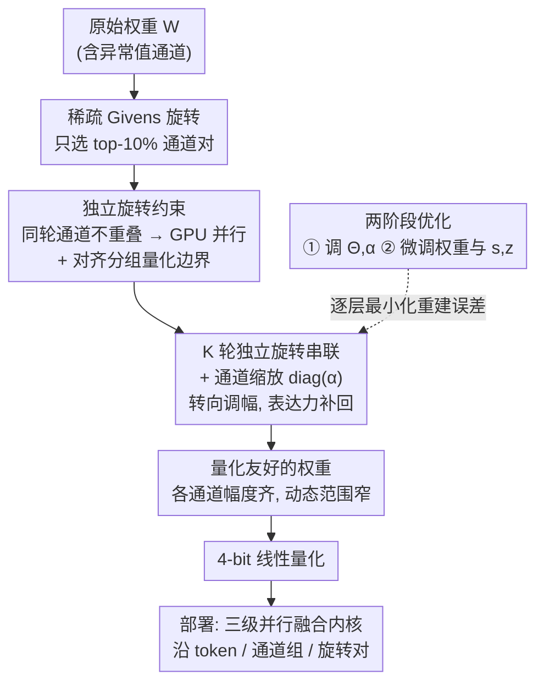

# ParoQuant: Pairwise Rotation Quantization for Efficient Reasoning LLM Inference

**会议**: ICLR 2026  
**arXiv**: [2511.10645](https://arxiv.org/abs/2511.10645)  
**代码**: [项目页](https://paroquant.z-lab.ai)  
**领域**: 模型压缩  
**关键词**: 后训练量化, Givens旋转, 推理LLM, 量化效率, 算法-系统协同设计

## 一句话总结

提出 ParoQuant，通过硬件高效且可优化的独立 Givens 旋转与通道缩放相结合来消除权重异常值，在推理 LLM 上实现高精度低开销的 4-bit 权重量化。

## 研究背景与动机

LLM 量化面临精度和效率的两难：
- **AWQ**：快速但精度损失大（如 Qwen3-4B 在 MMLU-Pro 上降 2.8%），推理 LLM 的长链思维使量化误差逐步累积
- **QTIP**：精度高但比 AWQ 慢约 30%，因为 Hadamard 变换引入了显著开销
- 推理模型需要生成数万 token，对量化的精度和效率要求更高

核心观察：

**旋转有效抑制异常值**，但全旋转矩阵计算代价大

**稀疏参数化的旋转同样有效**——仅保留 top-10% 通道对即可匹配全旋转效果

## 方法详解

### 整体框架

ParoQuant 要解决的是 4-bit 权重量化里的异常值（outlier）难题：权重里少数幅度极大的通道会撑大整组的动态范围，逼着量化步长变粗、误差变大，而推理 LLM 动辄生成上万 token，这种误差会沿着长链思维不断累积。它的核心是一个叫缩放成对旋转（Scaled Pairwise Rotation）的可学习变换：先用一串轻量的成对（Givens）旋转把异常值"摊平"到相邻通道，再用一组通道缩放因子拉齐各通道的平均幅度，让每个量化组内的动态范围都收窄，最后才做 4-bit 量化。整个变换由稀疏的 Givens 旋转和一个对角缩放阵组成，既能逐层优化以最小化量化重建误差，又能融进一个高并行的 GPU 内核里在线执行，从而在精度上逼近向量量化、在速度上接近 AWQ。

### 关键设计

**1. 稀疏 Givens 旋转：用少量通道对替代全旋转矩阵**

抑制异常值最直接的办法是给权重乘一个正交旋转矩阵，但任意 $n\times n$ 正交阵都可分解成最多 $\tfrac{1}{2}n(n-1)$ 个 Givens 旋转（即沿两条坐标轴张成的平面内旋转），相当于把所有通道对依次转一遍，计算量是 $O(n^2)$，正是 QTIP/QuaRot 慢的根源。ParoQuant 改用一组稀疏的平面旋转：只挑选一小撮通道对 $\mathcal{P} = \{(i_1,j_1), \ldots, (i_m,j_m)\}$，对每一对 $(i,j)$ 在二维平面上旋转角度 $\theta_k$，即 $\mathbf{W}^{(k)}[i,:] = \cos\theta_k \cdot \mathbf{W}^{(k-1)}[i,:] - \sin\theta_k \cdot \mathbf{W}^{(k-1)}[j,:]$，原地几条向量化的乘加就能算完，不再有全矩阵乘法。论文的直觉是异常通道和正常通道之间的旋转最能消异常值，并用实验验证：只优化幅度差最大的 top-10% 通道对，消异常值的效果就几乎匹配全旋转矩阵，说明正交变换在这件事上本就高度冗余。

**2. 独立旋转：让所有旋转对天然并行、且兼容分组量化**

一堆 Givens 旋转若有通道被多个对共享就会产生依赖——此时旋转不可交换、施加顺序有讲究，只能串行执行，GPU 利用率上不去。ParoQuant 加了一条约束（独立对）：同一轮里每个通道至多出现在一个旋转对中（任意两对 $P_k \cap P_l = \emptyset$），互不重叠。这样一轮内的所有旋转彼此独立、可一次性并行算完；同时这个划分天然对齐分组量化的边界——每个量化组内部各跑一套独立旋转，旋转不会跨组打乱幅度分布，既不破坏分组带来的精度收益，又允许逐组定制通道对、进一步提高并行度。约束换来的是工程上干净的并行，代价（单轮只剩 $n/2$ 个角度参数、表达力下降）由下一个设计补回。

**3. 多轮独立旋转串联通道缩放：把表达力补回来**

一轮独立旋转只有 $n/2$ 个可调角度，仅为全正交阵参数量的 $\tfrac{1}{n-1}$，拟合能力被严重压缩，单独用并不足以摆平复杂的异常值分布。ParoQuant 顺序叠加 $K$ 轮独立旋转（默认 $K=8$），每轮各自挑通道对（随机选、且跳过此前已用过的对以增加组合多样性）、各自优化角度，多轮复合后等效于一个表达力足够强的稀疏正交变换；旋转之外再乘一个对角缩放阵 $\text{diag}(\boldsymbol{\alpha})$ 直接均衡各通道的平均幅度，补上旋转处理不了的纯尺度差异。最终变换写作

$$T_{\mathcal{P},\Theta,\boldsymbol{\alpha}}(\mathbf{W}) = \left(\prod_{t=1}^K R(\mathcal{P}_t, \Theta_t)\right) \cdot \text{diag}(\boldsymbol{\alpha}) \cdot \mathbf{W}$$

旋转负责"转向"、缩放负责"调幅"，两者配合把权重变得对 4-bit 量化更友好。多轮旋转还能融进单次内核、一次性载入内存，叠这么多轮在推理时几乎不加开销。

### 损失函数 / 训练策略

优化目标是逐层的量化重建误差 $\mathcal{L}(Q) = \|Q(D)(\mathbf{X'}) - D(\mathbf{X})\|$，即让量化后该层的输出尽量贴近原始输出。训练分两阶段：先固定权重、只优化旋转角度 $\Theta$ 和缩放因子 $\boldsymbol{\alpha}$ 把变换调到位，再用类似 QAT 的方式微调权重以及量化参数（步长 $s$、零点 $z$）。每层用 AdamW 跑 10 个 epoch，校准数据从 WikiText2、C4、RedPajama 三个数据集均匀采样以避免过拟合单一分布。推理侧则把这套变换写成一个三级并行的 GPU 内核——沿 token、通道组、旋转对三个维度并行，多个独立旋转融合成单次 kernel 调用，这正是端到端加速能接近 AWQ 的原因。

## 实验关键数据

### 主实验（困惑度 - W4G128 量化）

| 模型 | 方法 | WikiText2 PPL | C4 PPL | 推理加速 |
|------|------|-------------|--------|---------|
| LLaMA-3-8B | FP16 | 5.54 | 7.10 | 1.0× |
| | AWQ | 5.92 | 7.42 | **2.4×** |
| | QTIP | 5.69 | 7.22 | 1.7× |
| | **ParoQuant** | **5.68** | **7.17** | **2.2×** |
| Qwen3-4B | AWQ | 7.36 | 7.89 | 2.4× |
| | QTIP | 7.09 | 7.68 | 1.7× |
| | **ParoQuant** | **7.03** | **7.63** | 2.2× |

### 推理任务精度（DeepSeek-R1-distilled LLaMA-3.1-8B）

| 方法 | MMLU-Pro | GPQA Diamond | AIME-24 | AIME-25 | 平均 |
|------|---------|-------------|---------|---------|------|
| FP16 | 52.4 | 43.9 | 56.7 | 40.0 | 48.3 |
| AWQ | 49.3 | 40.4 | 46.7 | 26.7 | 40.8 |
| **ParoQuant** | **52.5** | **41.4** | **53.3** | **36.7** | **46.0** |

### 关键发现

- ParoQuant 在推理任务上平均比 AWQ 提升 2.4%，开销不到 10%
- 精度匹配 QTIP（向量量化 SOTA），但速度快约 25%
- 在 Qwen3 系列（1.7B-14B）上效果尤其显著，小模型量化更具挑战

## 亮点与洞察

- 算法-系统协同设计：独立旋转的约束既保证了数学优化空间，又天然适合 GPU 并行
- 分析精辟：仅 10% 的通道对就能匹配全旋转效果，揭示了正交变换的冗余性
- 对推理 LLM 特别关注，结合长链思维的量化误差累积问题分析透彻
- 在线旋转内核利用共享内存和寄存器，多个独立旋转可融合为单次 kernel 调用

## 局限与展望

- 目前主要验证 4-bit 线性量化，未探索 2-3 bit 场景
- 独立旋转的通道对选择策略（随机+去重）可能非最优
- 旋转数 K=8 是经验值，不同模型可能需要不同 K
- 未开源时可能限制社区采用

## 相关工作与启发

- 与 QuaRot/SpinQuant 的区别：ParoQuant 使用可优化的独立 Givens 旋转而非固定 Hadamard 变换
- 与 AWQ 的区别：在通道缩放基础上增加旋转变换，大幅提升异常值抑制能力
- 启示：推理 LLM 时代，量化方法需要重新权衡精度和效率

## 评分

- 新颖性: ⭐⭐⭐⭐ 独立 Givens 旋转的设计新颖实用
- 实验充分度: ⭐⭐⭐⭐⭐ 多模型多任务多指标全面验证
- 写作质量: ⭐⭐⭐⭐ 动机分析清楚，但公式较多
- 价值: ⭐⭐⭐⭐⭐ 推理 LLM 量化的实用解决方案

<!-- RELATED:START -->

## 相关论文

- [\[ICML 2026\] ReSpinQuant: Efficient Layer-Wise LLM Quantization via Subspace Residual Rotation Approximation](../../ICML2026/model_compression/respinquant_efficient_layer-wise_llm_quantization_via_subspace_residual_rotation.md)
- [\[ICLR 2026\] Efficient Reasoning with Balanced Thinking](efficient_reasoning_with_balanced_thinking.md)
- [\[ICLR 2026\] Incentivizing Agentic Reasoning in LLM Judges via Tool-Integrated Reinforcement Learning](incentivizing_agentic_reasoning_in_llm_judges_via_tool-integrated_reinforcement_.md)
- [\[ICLR 2026\] A Fano-Style Accuracy Upper Bound for LLM Single-Pass Reasoning in Multi-Hop QA](a_fano-style_accuracy_upper_bound_for_llm_single-pass_reasoning_in_multi-hop_qa.md)
- [\[ICLR 2026\] The Geometry of LLM Quantization: GPTQ as Babai's Nearest Plane Algorithm](the_geometry_of_llm_quantization_gptq_as_babais_nearest_plane_algorithm.md)

<!-- RELATED:END -->
