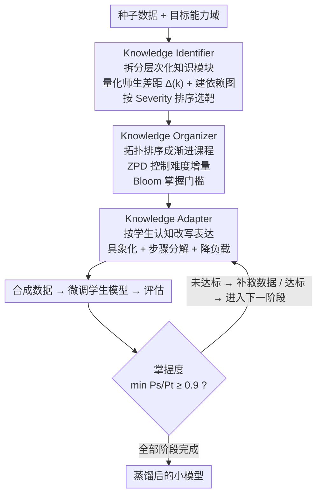

# Pedagogically-Inspired Data Synthesis for Language Model Knowledge Distillation

**会议**: ICLR 2026  
**arXiv**: [2602.12172](https://arxiv.org/abs/2602.12172)  
**代码**: 无  
**领域**: 模型压缩  
**关键词**: 知识蒸馏, 合成数据, 课程学习, 教育学启发, LLM压缩

## 一句话总结

提出 IOA（Identifier-Organizer-Adapter）框架，借鉴 Bloom 掌握学习原则和 Vygotsky 最近发展区理论，通过诊断知识缺陷、设计渐进课程、适配认知水平三个阶段，实现教育学驱动的 LLM 知识蒸馏。

## 研究背景与动机

现有 LLM 知识蒸馏方法的不足：

**知识识别缺失**：合成数据缺少针对学生模型特定知识缺陷的靶向性

**知识组织缺失**：数据生成无教学顺序，忽视知识的渐进学习轨迹

**知识适配缺失**：未考虑学生模型的认知容量，直接使用教师模型的复杂表达

核心类比：将 LLM 蒸馏视为教学过程——教师（大模型）需要根据学生（小模型）的先验知识和学习进度，动态选择教学内容和策略。

## 方法详解

### 整体框架

IOA 把蒸馏当成一堂为特定学生量身定制的课：先由 Identifier 诊断这个学生模型到底哪些知识没掌握、按什么顺序补，再由 Organizer 把这些知识排成一条由易到难、有先决关系的课程，最后由 Adapter 把每个知识点改写成学生当前认知水平能消化的表达，逐阶段合成数据、微调、考核，达标才放行进入下一阶段。

### 关键设计

**1. Knowledge Identifier：诊断该教什么，而不是漫无目标地灌数据**

通用蒸馏的痛点是合成数据没有靶子——教师随便出题，学生哪里弱、哪里强一概不管。Identifier 先把目标能力域拆成一组层次化知识模块 $\mathcal{D} = \{K_1, K_2, \ldots, K_m\}$，再对每个模块量化师生差距 $\Delta(k) = \frac{P_T(k) - P_S(k)}{P_T(k)}$，只有 $\Delta(k) > \tau_{gap}=0.3$ 的模块才被标记为真正的知识缺陷，把数据预算集中到学生确实学不会的地方。光知道缺什么还不够，知识之间有先后依赖，于是它通过条件性能分析（在掌握模块 A 的前提下测模块 B 的表现）构建知识依赖图 $G=(V,E)$，并用 $\text{Severity}(k) = \alpha \cdot \Delta(k) + (1-\alpha) \cdot \text{Connectivity}(k)$ 给缺陷排序——既看差距大小，又看这个知识点在依赖图里牵连多广，优先补那些既薄弱又卡住下游一大片的根节点。

**2. Knowledge Organizer：把诊断结果排成一条循序渐进的课程**

知道了缺什么还要决定何时教。Organizer 对依赖图做拓扑排序，保证先决知识一定排在依赖它的知识之前，避免学生在没学会加减法时被硬塞微积分。在此基础上它叠加两条教育学约束：一是 Vygotsky 最近发展区（ZPD），要求相邻阶段的难度增量受控 $\leq \tau_{ZPD} = 0.15$，让每一步都落在学生"踮脚够得着"的区间，既不重复已会的也不一步登天；二是 Bloom 掌握学习，每个阶段必须满足 $\min_{k \in s_i} \frac{P_S(k)}{P_T(k)} \geq \tau_{mastery} = 0.9$——即该阶段所有知识点都达到教师九成水平——才允许进入下一阶段，否则就针对没达标的模块生成补救数据继续训练。这套"考不过就补课"的机制，正是为了避免一口气灌完全部数据后早期知识被冲淡。

**3. Knowledge Adapter：把知识改写成学生当前能听懂的样子**

即便顺序对了，直接照搬教师那种 >100B 模型的复杂表达，小模型也消化不了。Adapter 在生成数据时对教师的讲法做认知适配：抽象概念具象化（把"导数"讲成"汽车速度表上的读数"）、复杂推理显式分解为可跟随的步骤链（信息提取→关系识别→方程建立→求解→验证）、认知负载管理（从 2×2 整数系数的简单实例起步再逐步加复杂度）、表示格式优化（统一解题模板降低格式噪声）、语言复杂度降低（用简单等价词替换专业术语）。本质上是把教师的"专家话术"翻译成"教学话术"，让同样的知识对一个三五十亿参数的学生变得可学。

### 损失函数 / 训练策略

每个阶段都走一遍"合成数据 → 微调 → 评估 → 是否达标 → 补救或进入下一阶段"的闭环，每轮聚焦约 20–30% 的缺陷模块逐步推进。实验中教师模型用 OpenAI o1 / DeepSeek-R1（>100B 参数），学生模型覆盖 Qwen2.5-3B/7B/14B、LLaMA-3.1-8B、LLaMA-3.2-3B，验证该流水线在不同规模和家族的学生上都成立。

## 实验关键数据

### 主实验（OpenAI o1 为教师，Qwen2.5-3B 为学生）

| 方法 | DollyEval | GSM8K | MATH | HumanEval | MBPP | GPQA-D |
|------|----------|-------|------|----------|------|--------|
| Undistilled | 25.37 | 37.24 | 5.79 | 22.46 | 31.58 | 7.95 |
| Self-Instruct | 32.18 | 43.69 | 7.12 | 25.63 | 36.27 | 9.28 |
| MADA (次优) | 36.42 | 52.04 | 13.15 | 33.39 | 42.18 | 11.93 |
| **IOA (Ours)** | **38.16** | **55.79** | **15.53** | **40.64** | **47.86** | **13.74** |

### 关键指标提升对比

| 指标 | IOA vs MADA 提升 | IOA vs Undistilled 提升 |
|------|-----------------|----------------------|
| MATH | +2.38 (+18.1%) | +9.74 (+168%) |
| HumanEval | +7.25 (+21.7%) | +18.18 (+81%) |
| GSM8K | +3.75 (+7.2%) | +18.55 (+49.8%) |
| DollyEval | +1.74 (+4.8%) | +12.79 (+50.4%) |

### 关键发现

- 学生模型在 DollyEval 上保留了教师 94.7% 的性能，参数量不到 1/10
- MATH 提升 19.2%，HumanEval 提升 22.3%（对比 SOTA 基线）
- 教育学原则显著提升了复杂推理任务的蒸馏效果
- Bloom 掌握学习的阶段性要求有效避免了知识遗忘

## 亮点与洞察

- 跨学科创新：系统性地将教育学理论（Bloom、Vygotsky）引入 LLM 蒸馏
- IOA 的三阶段设计完整回答了"教什么、何时教、怎么教"三个核心问题
- 知识依赖图的构建和条件性能分析是数据驱动的，客观可量化
- 在复杂推理任务上的提升远超简单指令跟随任务，符合教育学理论预期

## 局限与展望

- 知识模块的分解依赖教师 LLM 的自我组织能力，可能不完全准确
- 阶段性训练的总时间开销较大（需要多轮评估和补救）
- 教育学原则的超参数（$\tau_{mastery}=0.9$, $\tau_{ZPD}=0.15$）需要经验调整
- 未探索知识遗忘问题——后续阶段的训练可能干扰早期阶段的知识

## 相关工作与启发

- 与 DeepSeek-R1 蒸馏对比：IOA 增加了结构化课程和认知适配，而非简单微调
- 与 Lion/MADA 对比：IOA 的知识靶向和渐进学习使蒸馏更系统更高效
- 启示：好的蒸馏不仅要有好数据，还要有好的教学策略

## 评分

- 新颖性: ⭐⭐⭐⭐⭐ 教育学驱动的蒸馏框架高度创新
- 实验充分度: ⭐⭐⭐⭐ 多模型多基准验证，但主实验结果放在附录较多
- 写作质量: ⭐⭐⭐⭐ 教育学类比直观，但方法段公式偏多
- 价值: ⭐⭐⭐⭐⭐ 为黑盒蒸馏提供了系统化的新范式

<!-- RELATED:START -->

## 相关论文

- [\[AAAI 2026\] Condensed Data Expansion Using Model Inversion for Knowledge Distillation](../../AAAI2026/model_compression/condensed_data_expansion_using_model_inversion_for_knowledge_distillation.md)
- [\[ICLR 2026\] AMiD: Knowledge Distillation for LLMs with α-mixture Assistant Distribution](amid_knowledge_distillation_for_llms_with_α-mixture_assistant_distribution.md)
- [\[ACL 2026\] Find Your Optimal Teacher: Personalized Data Synthesis via Router-Guided Multi-Teacher Distillation](../../ACL2026/model_compression/find_your_optimal_teacher_personalized_data_synthesis_via_router-guided_multi-te.md)
- [\[ICLR 2026\] Distillation of Large Language Models via Concrete Score Matching](distillation_of_large_language_models_via_concrete_score_matching.md)
- [\[ICLR 2026\] PASER: Post-Training Data Selection for Efficient Pruned Large Language Model Recovery](paser_post-training_data_selection_for_efficient_pruned_large_language_model_rec.md)

<!-- RELATED:END -->
