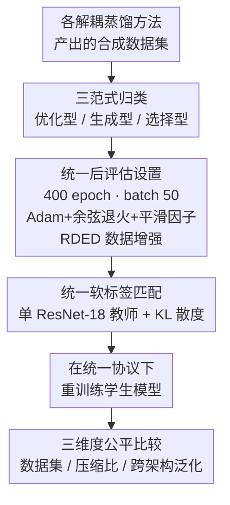

# Rectified Decoupled Dataset Distillation: A Closer Look for Fair and Comprehensive Evaluation

**会议**: ICLR 2026  
**arXiv**: [2509.19743](https://arxiv.org/abs/2509.19743)  
**代码**: [GitHub](https://github.com/ndhg1213/RD3)  
**领域**: 模型压缩/数据蒸馏  
**关键词**: 数据集蒸馏, 解耦蒸馏, 公平评估, 后评估协议, 合成数据  

## 一句话总结

提出 RD3（Rectified Decoupled Dataset Distillation），系统揭示现有解耦数据集蒸馏方法的性能差异主要源于不一致的后评估设置而非蒸馏质量差异，建立了统一公平的评估框架，将报告的 27.3% 性能差距校正为 6.7%。

## 研究背景与动机

数据集蒸馏旨在生成紧凑的合成数据集，使在其上训练的模型达到接近全量数据训练的性能。近年来解耦蒸馏方法（如 SRe2L）通过分离教师预训练和合成数据生成过程，显著扩展到 ImageNet-1K 等大规模数据集。

**核心问题**：现有解耦蒸馏方法存在严重的评估不一致：
- CDA 使用更小 batch size，RDED 使用平滑学习率和更强数据增强
- G-VBSM 和 EDC 使用多教师混合软标签
- 报告的 27.3% 性能差距中大部分归因于评估差异而非蒸馏质量

作者首次对此进行系统性调查，揭示了"虚假性能增益"问题。

## 方法详解

### 整体框架

RD3 不是一个新的蒸馏算法，而是一套"把所有解耦蒸馏方法放回同一条起跑线"的评估协议。它要解决的问题是：现有解耦蒸馏（decoupled dataset distillation）方法各自报告的 ImageNet-1K 准确率根本不可比，因为大家私下用了互不相同的后评估（post-evaluation）配方。RD3 的做法分三步走：先把待测方法按"合成数据怎么生成"归为三个范式（paradigm），再用一组完全锁死的后评估设置（训练轮数、batch size、学习率、数据增强）去重新训练评估每个方法产出的合成数据，同时把软标签（soft label）来源也统一成单教师，最后在目标数据集、压缩比、跨架构泛化三个维度上系统比较。这样就能把"蒸馏质量差异"和"评估设置差异"彻底拆开，看清各方法真实的合成数据可学性。

### 关键设计

**1. 三范式归类：先看清各方法到底在比什么**

各解耦方法表面上都报告 ImageNet-1K 上的准确率，但底层生成机制天差地别，混在一起比并不公平。RD3 按合成数据怎么来把它们分成三类：优化型（optimization-based，如 SRe2L、CDA、G-VBSM、DWA、EDC）用预训练分类器对合成图像做像素级优化；生成型（generation-based，如 Minimax、D4M）微调生成模型或优化视觉-文本嵌入来"画"出数据；选择型（selection-based，如 RDED）则直接从真实图像里裁剪类别相关区域拼合。先做这层归类，后面的校正才解释得通——优化型对初始化和软标签格外敏感，而选择型本身就携带真实数据统计量，因此同一套统一设置落到不同范式上提升幅度差异极大。

**2. 统一后评估设置：把"刷榜技巧"从蒸馏质量里剥离**

这是 RD3 的核心，也是 27.3% 差距大部分的来源。作者发现各方法私下用了互不相同的后评估配方：CDA 用更小 batch、RDED 用平滑学习率加更强增强、G-VBSM 和 EDC 用多教师混合软标签——这些都会抬高分数却与合成数据本身无关。RD3 把它们一刀切锁死：训练轮数固定 400 epochs（而非各方法自报的 300）以消除收敛速度偏差；batch size 统一压到 50（而非 SRe2L 的 1024 或 CDA 的 128），仅此一项就带来约 10% 的提升，因为在有限合成样本上小 batch 的梯度更新更细；优化器统一用 Adam、初始学习率 0.001、余弦退火，并加平滑因子 $\zeta=1$（ResNet-18）或 $\zeta=2$（其他架构）来软化调度；数据增强统一采用 RDED 的 CutMix + Random Resized Crop + Random Horizontal Flip。配方锁死后，方法间的分数才真正反映合成数据的可学性，而非谁的后评估调得更狠。

**3. 统一软标签匹配：堵住多教师软标签这个隐藏增益**

软标签是大规模蒸馏的标配，但谁来打这个标签影响巨大——多教师混合软标签等于偷偷给评估注入了额外监督，是设置 2 之外另一条独立的"刷分通道"。RD3 规定所有方法都只用单个预训练 ResNet-18 配 KL 散度生成 epoch-wise 软标签，学生在第 $t$ 步的更新统一写成

$$\theta_{\mathcal{S}}^{t+1} = \arg\min_{\theta \in \Theta} L_{KL}\big(f_{\theta_\mathcal{T}}(\mathcal{A}(\mathcal{S})),\, f_{\theta_\mathcal{S}^t}(\mathcal{A}(\mathcal{S}))\big),$$

其中 $\mathcal{A}$ 是统一的增强、$f_{\theta_\mathcal{T}}$ 是固定教师、$\mathcal{S}$ 为合成集。把教师和软标签来源都锁死后，原本靠多教师拉开的差距随之消失——这正是 EDC 等方法在校正后分数反而略降的直接原因。

## 实验关键数据

### 主实验：ImageNet-1K 上各方法校正前后对比（IPC=10, ResNet-18）

| 方法 | 校正前 | 校正后 | 变化 |
|------|--------|--------|------|
| SRe2L | 21.3 | 40.2 | +18.9↑ |
| CDA | 33.5 | 41.2 | +7.7↑ |
| G-VBSM | 31.4 | 41.5 | +10.1↑ |
| DWA | 37.9 | 42.5 | +4.6↑ |
| EDC | 48.6 | 46.9 | -1.5↓ |
| Minimax | 44.3 | 45.9 | +1.6↑ |
| D4M | 27.9 | 45.4 | +17.5↑ |
| RDED | 42.0 | 46.3 | +4.3↑ |

**关键发现**：校正后方法间差距从 27.3% 缩小至 6.7%，证明大部分报告的性能增益源于评估设置而非蒸馏质量。

### 跨数据集综合对比（校正后，IPC=50）

| 数据集 | SRe2L | CDA | DWA | EDC | Minimax | D4M | RDED |
|--------|-------|-----|-----|-----|---------|-----|------|
| CIFAR-10 | 53.9 | 54.5 | 59.9 | **64.8** | — | 61.9 | 63.3 |
| CIFAR-100 | 54.4 | 56.2 | 62.1 | **65.2** | — | 64.3 | 64.1 |
| TinyImageNet | 52.5 | 53.0 | 54.2 | 57.1 | 54.4 | 53.8 | **58.7** |
| ImageNet-1K | 55.2 | 56.7 | 57.7 | **60.1** | 60.4 | 60.2 | 58.9 |

在统一设置下，EDC（优化型）整体表现最优，但各方法差距显著缩小。

## 亮点与洞察

1. **揭示领域关键问题**：首次系统证明解耦蒸馏中"评估设置不一致"是主要混淆因素
2. **实用校准贡献**：统一小 batch size (50)、平滑 LR、RDED 增强三个关键设置即可消除大部分性能差异
3. **方法论意义**：为未来研究提供公平可复现的基准，避免"通过调评估设置刷榜"
4. **发现简单技巧的巨大影响**：如优化型方法使用真实数据初始化可显著提升性能

## 局限性

- 主要关注后评估阶段，未深入分析合成数据本身的内在质量差异
- 统一设置可能隐藏某些方法在特定场景下的优势
- 未考虑计算时间等评估维度的系统性对比
- 生成型方法（Minimax）在小数据集（CIFAR-10/100）上不适用

## 相关工作

- **双层蒸馏**：DC, DM, MTT — 小规模有效但不可扩展
- **解耦蒸馏**：SRe2L 开创性工作，后续 CDA, EDC 等优化
- **软标签匹配**：epoch-wise 软标签成为大规模蒸馏标配
- **数据集蒸馏综述**：关注方法论进展但缺乏统一评估

## 评分

| 维度 | 分数 | 说明 |
|------|------|------|
| 创新性 | ⭐⭐⭐⭐ | 揭示重要且被忽视的评估一致性问题 |
| 实用性 | ⭐⭐⭐⭐⭐ | 为社区提供公平评估标准，直接推动领域规范化 |
| 实验充分性 | ⭐⭐⭐⭐⭐ | 6 个数据集，8 个方法，IPC 1-100 全面覆盖 |
| 写作质量 | ⭐⭐⭐⭐ | 论证清晰，图表有说服力 |

<!-- RELATED:START -->

## 相关论文

- [\[AAAI 2026\] A Closer Look at Knowledge Distillation in Spiking Neural Network Training](../../AAAI2026/model_compression/a_closer_look_at_knowledge_distillation_in_spiking_neural_ne.md)
- [\[ICLR 2026\] Dataset Distillation as Pushforward Optimal Quantization](dataset_distillation_as_pushforward_optimal_quantization.md)
- [\[ICLR 2026\] Understanding Dataset Distillation via Spectral Filtering](understanding_dataset_distillation_via_spectral_filtering.md)
- [\[ICLR 2026\] Grounding and Enhancing Informativeness and Utility in Dataset Distillation](grounding_and_enhancing_informativeness_and_utility_in_dataset_distillation.md)
- [\[AAAI 2026\] TGDD: Trajectory Guided Dataset Distillation with Balanced Distribution](../../AAAI2026/model_compression/tgdd_trajectory_guided_dataset_distillation_with_balanced_distribution.md)

<!-- RELATED:END -->
