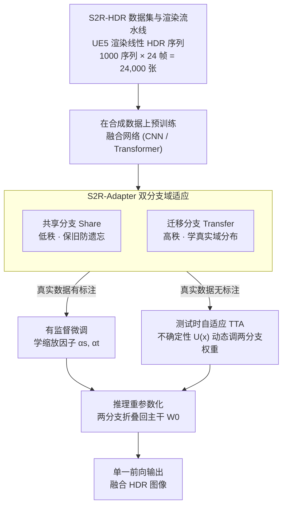

# S2R-HDR: A Large-Scale Rendered Dataset for HDR Fusion

## 基本信息

- **会议**: ICLR 2026
- **arXiv**: [2504.07667](https://arxiv.org/abs/2504.07667)
- **代码**: [项目主页](https://openimaginglab.github.io/S2R-HDR)
- **领域**: 计算机视觉 / 图像处理
- **关键词**: HDR Fusion, Synthetic Dataset, Domain Adaptation, Unreal Engine, Sim-to-Real

## 一句话总结

提出 S2R-HDR，首个大规模高质量合成 HDR 融合数据集（24,000 样本），并设计 S2R-Adapter 域适应方法弥合合成-真实域差距，在真实数据集上达到 SOTA HDR 融合性能。

## 研究背景与动机

### 问题背景
HDR 融合在计算摄影、自动驾驶等领域至关重要，但现有 HDR 数据集规模极小（最大仅 144 张），且主要局限于人工控制的简单动态场景，难以覆盖直射阳光、大运动等极端情况。

### 现有数据集的局限

**规模极小**：Kalantari (89 对)、SCT (144 张)、Challenge123 (123 张)；

**动态单一**：多数数据集仅包含基本人体运动，缺少动物、车辆等多样动态元素；

**采集困难**：真实 HDR ground truth 需逐帧拍摄不同曝光并手动控制运动，耗时且难以扩展；

**动态范围有限**：分束器仅支持两种曝光，无法覆盖极高动态范围场景。

### 核心思路
利用 Unreal Engine 5 渲染高质量合成 HDR 数据，结合域适应技术弥合合成-真实差距。

## 方法详解

### 整体框架

这篇论文要解决的是"真实 HDR 融合数据太少、太单一"这个根本瓶颈，思路分两步走：先用虚幻引擎 5（Unreal Engine 5，UE5）渲染出一个大规模、场景丰富的合成 HDR 数据集 S2R-HDR，再用一个即插即用的域适应模块 S2R-Adapter 把"在合成数据上训出来的模型"迁到真实数据上。整体流程是：UE5 渲染线性 HDR 序列 → 在 24,000 张合成图上预训练融合网络 → 把 S2R-Adapter 注入主干，在真实数据上做域适应（有标注时学缩放因子、无标注时走测试时自适应）→ 推理时把适配器重参数化折叠回主干，零额外开销。合成数据负责"规模和多样性"，域适应负责"填平合成与真实之间的分布鸿沟"，两者缺一不可。

### 关键设计

**1. S2R-HDR 数据集与渲染流水线：把规模从百级拉到两万级**

针对"现有 HDR 数据集最大才 144 张、动态元素单一、极端光照缺失"的痛点，作者直接绕开真实拍摄的物理限制，用 UE5 程序化渲染。关键是要让渲染输出真正可用作 HDR ground truth：修改 UE5 默认的色调映射和 gamma 校正，让输出保持在线性 HDR 空间而非被压缩到显示域；用 EXR 浮点格式存储，避免量化损失；并模拟手持拍摄的相机抖动以贴近真实采集。场景上覆盖行人、动物、车辆等多样动态元素，室内外与白天/黄昏/夜间环境，以及直射阳光这类超高动态范围情形——这些恰恰是真实数据集难以覆盖的边缘工况。最终得到 1,000 个序列 × 24 帧 = 24,000 张 HDR 图像，分辨率 1920 × 1080，比此前最大的真实数据集大约 **166 倍**。

**2. S2R-Adapter 双分支：低秩保旧知识、高秩学新分布**

合成数据再逼真，纹理分布也和真实数据有差距，直接微调又容易过拟合、遗忘合成阶段学到的通用结构。S2R-Adapter 的做法是给主干并联两条秩互补的适配支路：共享分支（Share Branch）用低秩适配器保留合成数据的共享知识、防遗忘，

$$
f_s = U_s V_s x, \quad r_s \ll \min(h_{in}, h_{out})
$$

迁移分支（Transfer Branch）则用高秩适配器去学真实数据特有的域知识，

$$
f_t = U_t V_t x, \quad r_t \geq \max(h_{in}, h_{out})
$$

两条支路与冻结主干 $W_0$ 通过缩放因子加权融合成最终输出：

$$
f = W_0 x + \alpha_s \times f_s + \alpha_t \times f_t
$$

低秩"守"、高秩"攻"的分工，让模型既不丢合成阶段的通用能力，又能针对真实分布做足够灵活的调整，这也是它在消融里优于单分支的原因。

**3. 测试时自适应（TTA）：用不确定性动态调两分支权重**

很多真实场景拿不到 HDR ground truth，无法做有监督域适应。S2R-Adapter 借助模型自身的不确定性 $\mathcal{U}(x)$ 来自动分配两分支的权重：

$$
\alpha_s = 1 - \mathcal{U}(x); \quad \alpha_t = 1 + \mathcal{U}(x)
$$

这里的 $\mathcal{U}(x)$ 是把同一输入做 $N$ 次增强（调曝光、白平衡、噪声、翻转）后输出方差的度量：不确定性越大，说明当前样本越偏离合成先验，就越依赖迁移分支去贴合真实分布；不确定性越小，则越保留共享分支的稳定知识。整个 TTA 套在 mean-teacher 框架里——教师模型产生伪标签和不确定性来更新适配器、并以学生模型的指数滑动平均（EMA）缓慢更新，这样无需任何标注就能在测试时持续校正域偏移。

**4. 推理重参数化：训练加分支、推理零开销**

两条适配支路都是线性算子，训练完成后可以通过重参数化（re-parameterization）把 $\alpha_s f_s + \alpha_t f_t$ 直接折叠回主干权重 $W_0$，使推理阶段恢复成单一前向、不引入任何额外计算或显存开销。这让 S2R-Adapter 在部署上几乎"免费"，可同时挂到 CNN 和 Transformer 两类融合架构上。

## 实验

### 主实验：在真实数据集上的 HDR 融合结果

| 方法 | SCT PSNR-μ | SCT SSIM-μ | Challenge123 PSNR-μ | Challenge123 SSIM-μ |
|------|-----------|-----------|---------------------|---------------------|
| DHDRNet | 40.05 | 0.9794 | 37.83 | 0.9707 |
| AHDRNet | 42.08 | 0.9837 | 40.44 | 0.9877 |
| HDR-Transformer | 42.39 | 0.9844 | 40.70 | 0.9881 |
| SCTNet | 42.55 | 0.9850 | 40.65 | — |
| EHDRNet (S2R-HDR) | 42.93 | 0.9858 | **42.15** | **0.9895** |
| **EHDRNet + S2R-Adapter** | **43.47** | **0.9871** | 41.89 | 0.9891 |

### 消融实验：域适应组件分析

| 配置 | SCT PSNR-μ | Challenge123 PSNR-μ |
|------|-----------|---------------------|
| 仅 S2R-HDR 训练 | 41.32 | 39.85 |
| + Share Branch | 42.15 | 40.71 |
| + Transfer Branch | 42.78 | 41.43 |
| + Share + Transfer (S2R-Adapter) | **43.47** | **42.15** |
| 直接真实数据微调 | 42.55 | 40.65 |

### 数据集质量对比

| 指标 | Kalantari | SCT | Challenge123 | **S2R-HDR** |
|------|----------|-----|-------------|------------|
| FHLP ↑ | 15.07 | 12.43 | 26.91 | **28.02** |
| EHL ↑ | 3.07 | 2.43 | 5.19 | **5.47** |
| SI ↑ | 18.4 | 18.25 | 20.47 | **38.02** |
| DR ↑ | 2.71 | 2.55 | 2.36 | **3.86** |
| 样本数 | 89 | 144 | 123 | **24,000** |

### 关键发现

1. **在 S2R-HDR 上训练的模型显著优于在小规模真实数据集上训练的模型**，即使存在域差距；
2. **S2R-Adapter 有效弥合域差距**，在有标注和无标注两种场景下均带来显著提升；
3. **双分支设计优于单分支**：共享分支和迁移分支各自贡献约 1 dB PSNR 提升；
4. **直接微调不如 S2R-Adapter**：直接在真实数据上微调会导致过拟合和知识遗忘；
5. **TTA 模式下仍有效**：即使无 ground truth 标注，测试时自适应也能提升约 0.5 dB。

## 亮点

- 首个大规模合成 HDR 融合数据集，24,000 样本覆盖多样场景和极端光照
- 定制化 UE5 渲染流水线保持线性 HDR 空间，模拟手持拍摄抖动
- S2R-Adapter 即插即用，兼容 CNN 和 Transformer 架构
- 支持有标注域适应和无标注测试时自适应两种模式
- 推理时通过重参数化零额外开销

## 局限性

- 合成数据在纹理分布上仍与真实数据存在差距（t-SNE 可视化可见）
- 渲染场景虽多样但仍有限，可能无法覆盖所有真实世界边缘情况
- UE5 渲染需要较高的计算资源和美术设计投入
- 域适应方法依赖校准数据集的代表性

## 相关工作

- **HDR 数据集**: Kalantari et al. (2017), SCT (Tel et al., 2023), Challenge123 (Kong et al., 2024)
- **HDR 融合方法**: AHDRNet (Yan et al., 2019), HDR-Transformer (Liu et al., 2022), DiffHDR
- **Sim-to-Real 域适应**: LoRA (Hu et al., 2021), TTA (Wang et al., 2022)
- **合成数据**: Li et al. (2023) 用于深度估计, Yang et al. (2023) 用于语义分割

## 评分

- 新颖性：⭐⭐⭐⭐ — 首个大规模 HDR 合成数据集，填补领域空白
- 技术深度：⭐⭐⭐⭐ — 渲染流水线 + 双分支适配器 + TTA 设计完善
- 实验充分度：⭐⭐⭐⭐ — 多基准、多架构对比，消融全面
- 实用价值：⭐⭐⭐⭐⭐ — 数据集和方法均可直接用于 HDR 研究和产品开发

<!-- RELATED:START -->

## 相关论文

- [\[AAAI 2026\] StepFun-Formalizer: Unlocking the Autoformalization Potential of LLMs Through Knowledge-Reasoning Fusion](../../AAAI2026/model_compression/stepfun-formalizer_unlocking_the_autoformalization_potential_of_llms_through_kno.md)
- [\[ICLR 2026\] Rethinking Continual Learning with Progressive Neural Collapse](rethinking_continual_learning_with_progressive_neural_collapse.md)
- [\[ICLR 2026\] UniFlow: A Unified Pixel Flow Tokenizer for Visual Understanding and Generation](uniflow_a_unified_pixel_flow_tokenizer_for_visual_understanding_and_generation.md)
- [\[ICLR 2026\] Revisiting Weight Regularization for Low-Rank Continual Learning](revisiting_weight_regularization_for_low-rank_continual_learning.md)
- [\[ICLR 2026\] SERE: Similarity-based Expert Re-routing for Efficient Batch Decoding in MoE Models](sere_similarity-based_expert_re-routing_for_efficient_batch_decoding_in_moe_mode.md)

<!-- RELATED:END -->
