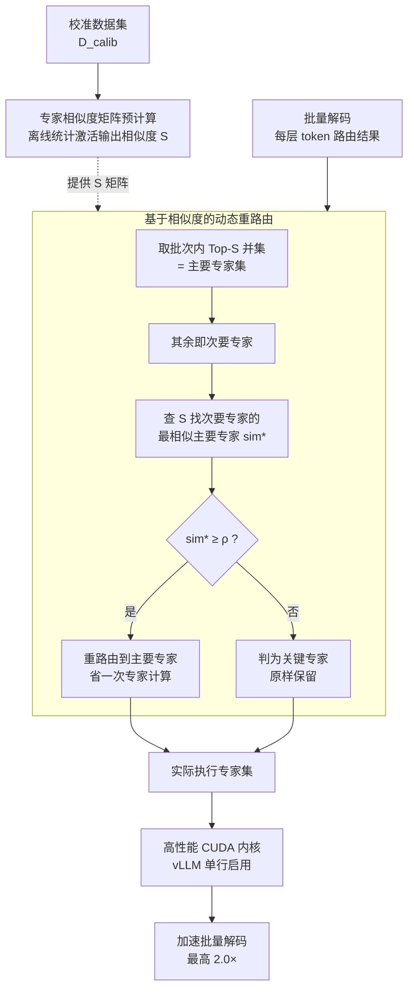

# SERE: Similarity-based Expert Re-routing for Efficient Batch Decoding in MoE Models

## 基本信息

- **会议**: ICLR 2026
- **arXiv**: [2602.07616](https://arxiv.org/abs/2602.07616)
- **代码**: [GitHub](https://github.com/JL-Cheng/SERE)
- **领域**: 模型压缩 / 高效推理
- **关键词**: Mixture-of-Experts, Batch Decoding, Expert Skipping, CUDA Kernel, vLLM

## 一句话总结

提出 SERE 方法，通过预计算专家相似度矩阵，在批量解码时将次要专家动态重路由到最相似的主要专家，实现最高 2.0 倍加速且质量损失极小，并提供即插即用的 vLLM CUDA 内核。

## 研究背景与动机

### 问题背景
MoE（混合专家）架构通过稀疏激活实现高效推理，每个 token 仅激活少量专家（如 Qwen3-30B-A3B 中 128 选 8）。然而在实际部署中，**批量推理**导致一个批次内不同 token 需要不同专家，使实际激活的专家数远超单 token 预算。

### 核心矛盾
- **稀疏性 vs 批量性**：批量越大，激活的专家越多（图 1），解码阶段的内存带宽开销随之增大；
- **训练时负载均衡进一步加剧问题**：负载均衡目标使 token 更均匀地分布到各专家，批次内专家多样性更高。

### 现有方法的局限
- **静态压缩**（剪枝/合并）：计算成本高、任务相关、减少模型容量和泛化能力；
- **动态跳过**（阈值/Top-p 路由）：仅依赖路由分数、忽略专家内在特性、需额外训练或阈值调优、难以集成到高性能推理框架。

## 方法详解

### 整体框架

SERE 建立在三个对 MoE 专家的观察之上：同一层内大量专家功能高度相似、可互相替代；排名靠前的主要专家主导了输出而次要专家贡献微弱；同时每层都存在少数与所有其他专家都不相似的"关键专家"，是不可替代的专门化单元。基于此，SERE 先用校准数据离线预计算每层的专家相似度矩阵，再在批量解码时把贡献小的次要专家动态重路由到与它最相似的主要专家、同时保护关键专家不动，并用一个即插即用的 CUDA 内核把这套逻辑无缝塞进 vLLM。整条链路就是「离线算一次相似度 → 在线每批每层按相似度合并冗余专家、保护关键专家 → 内核落地加速」三段。

### 关键设计

**1. 专家相似度矩阵预计算：用激活输出而非路由分数刻画可替代性**

跳过决策若只看路由分数，会忽略专家本身的功能特性。SERE 改为在校准数据集 $\mathcal{D}_{\text{calib}}$ 上离线统计专家激活输出之间的相似度，对第 $l$ 层的专家对 $(p,q)$ 计算 $\mathbf{S}_{p,q}^{(l)} = \frac{1}{N} \sum_{i=1}^{N} \text{Sim}(\mathbf{A}_{i,p}^{(l)}, \mathbf{A}_{i,q}^{(l)})$，其中 $\mathbf{A}_{i,j}^{(l)} = \mathbf{E}_j^{(l)}(\mathbf{X}_i^{(l-1)})$ 是该专家对第 $i$ 个样本的实际输出，相似度函数可取余弦、Frobenius 范数或 CKA（消融中 Frobenius 最佳）。在 Qwen3-30B-A3B 上这套矩阵揭示了清晰的层间差异：Layer-1 几乎所有专家对相似度都 $>0.9$（高度冗余），Layer-6 多数对 $<0.4$（高度分化），且每层都存在与其余专家相似度极低的关键专家——这正是后续按层自适应跳过的依据。整个矩阵只需预计算一次，无需重训练或任务特定调优。

**2. 基于相似度的动态重路由：按批次内实际激活情况分主次、再合并冗余专家**

由于批量解码中专家激活随输入而变，SERE 在每层、每个批次上动态决策。它先把所有 token 的 Top-$S$ 专家并起来作为主要专家集 $\mathcal{E}_p^{(l)} = \bigcup_{\mathcal{T}} \{\mathbf{E}_{r_k}^{(l)} \mid 1 \leq k \leq S\}$（超参 $S$ 控制加速比，越小跳得越多）；其余即为次要专家。对每个次要专家 $\mathbf{E}_u^{(l)}$，在主要专家集里找最相似者 $v_u^* = \arg\max_{\mathbf{E}_v^{(l)} \in \mathcal{E}_p^{(l)}} \mathbf{S}_{u,v}^{(l)}$，当最高相似度 $\text{sim}_u^* \geq \rho$ 时就把它的全部 token 重路由到 $\mathbf{E}_{v_u^*}^{(l)}$ 从而省下一次专家计算；若 $\text{sim}_u^* < \rho$ 则判定为找不到替身的关键专家、原样保留。最终实际执行的专家集为 $\mathcal{E}_{\text{final}}^{(l)} = \mathcal{E}_p^{(l)} \cup \{\mathbf{E}_u^{(l)} \mid \text{sim}_u^* < \rho\}$。阈值 $\rho$ 给出了关键专家的自动保护开关——消融中令 $\rho=\infty$ 关掉保护会掉 1.8%，而完全不区分主次随机跳过则掉 5.2%，说明"先分主次、再按相似度合并、并保护不可替代者"三步缺一不可。

**3. 高性能 CUDA 内核：把重路由做成 vLLM 的单行插件**

为了不让上述逻辑沦为纸面收益，SERE 把它实现成一个模型无关的 CUDA 内核，兼容各种 MoE 架构，且无需改动 vLLM 的核心执行管线——在推理框架里仅需一行代码即可启用。这让"跳过冗余专家省内存带宽"的理论加速能直接落到生产部署上，最终在 Qwen3-30B-A3B 上实现 $K{=}2$ 几乎无损、$K{=}1$ 仍优于所有基线的最高 2.0× 加速。

## 实验

### 主实验：精度与加速对比（Qwen1.5-MoE-A2.7B）

| 方法 | Exam Avg | Math Avg | Code Avg | 总均值 | TPOT (ms) ↓ |
|------|---------|---------|---------|--------|------------|
| Top-4 (原始) | 61.67 | 42.28 | 38.17 | 48.52 | 17.29 |
| Top-2 (朴素) | 58.27 | 36.19 | 29.71 | 42.85 | 13.53 |
| HC-SMoE (40 experts) | 49.69 | 24.86 | 3.34 | 28.79 | 14.20 |
| LYNX top-2 | 48.26 | 24.51 | 7.97 | 29.28 | 14.49 |
| **SERE top2; ρ=0.0** | **60.48** | **40.87** | **36.58** | **47.15** | **13.83** |
| **SERE top2; ρ=0.3** | **61.02** | **41.55** | **35.14** | **47.25** | **13.93** |

### Qwen3-30B-A3B 实验结果

| 方法 | Exam Avg | Math Avg | Code Avg | 总均值 | 加速比 |
|------|---------|---------|---------|--------|-------|
| Top-8 (原始) | — | — | — | 基线 | 1.0× |
| Top-K Reduction | — | — | — | 下降显著 | 1.3× |
| LYNX | — | — | — | 大幅下降 | 1.4× |
| **SERE (K=2)** | — | — | — | **几乎无损** | **1.5×** |
| **SERE (K=1)** | — | — | — | **优于所有基线** | **2.0×** |

### 消融实验：关键设计的影响

| 消融项 | 总均值变化 | 说明 |
|--------|----------|------|
| 移除关键专家保护 (ρ=∞) | -1.8% | 关键专家不可替代 |
| 不区分主次 (随机跳过) | -5.2% | 主次专家区分至关重要 |
| 静态相似度 vs 动态 | 差异小 | 预计算相似度足够可靠 |
| 不同相似度函数 | Frobenius 最佳 | 优于余弦和 CKA |

### 关键发现

1. **SERE 实现 2.0× 加速但质量损失极小**：SERE (K=2) 在所有任务上几乎无损，SERE (K=1) 仍优于所有基线；
2. **远超现有方法**：HC-SMoE 静态剪枝导致 20% 绝对精度下降，LYNX 下降 19%，SERE 仅下降 1-3%；
3. **关键专家保护机制有效**：通过相似度阈值 $\rho$ 自动保留不可替代专家；
4. **输入感知的动态性**：不同批次激活不同专家子集，SERE 自适应跳过冗余度高的专家；
5. **即插即用部署**：CUDA 内核集成到 vLLM 仅需一行代码。

## 亮点

- 利用专家相似度的内在属性而非单纯路由分数指导跳过决策
- 动态、输入感知的策略——冗余高多跳过、多样性需求大少跳过
- 关键专家自动保护机制防止能力退化
- 预计算一次相似度矩阵即可，无需重训练或任务特定调优
- 提供生产级 CUDA 内核，单行代码即可在 vLLM 中启用

## 局限性

- 重路由改变了 token-to-expert 映射但未修改路由权重，可能引入轻微的输出偏移
- 校准数据集的选择可能影响相似度矩阵的代表性
- 超参 $S$ 和 $\rho$ 需要在速度-质量间权衡，不同模型可能需要不同设置
- 目前主要在解码阶段验证，预填充阶段的适用性未探讨
- 当批次内 token 高度多样（如多领域混合请求）时，可跳过的冗余专家可能减少

## 相关工作

- **静态专家压缩**: MoE-I2 (Yang et al., 2024), HC-SMoE (Chen et al., 2025), EEP (Liu et al., 2024c)
- **动态专家跳过**: Top-p routing (Huang et al., 2024), AdaMoE (Zhong et al., 2024), LYNX (Gupta et al., 2024)
- **MoE 推理优化**: vLLM (Kwon et al., 2023), DeepSeekV2-Lite (Liu et al., 2024b)
- **MoE 架构**: Qwen-MoE (Bai et al., 2023), Qwen3-30B-A3B (Yang et al., 2025a)

## 评分

- 新颖性：⭐⭐⭐⭐ — 基于专家相似度的重路由思路清晰有效
- 技术深度：⭐⭐⭐⭐ — 从观察到方法到 CUDA 内核完整工程链
- 实验充分度：⭐⭐⭐⭐⭐ — 三个 MoE 模型 × 多基准 × 延迟测量 × 消融全面
- 实用价值：⭐⭐⭐⭐⭐ — 即插即用 vLLM 集成，直接可用于生产部署

<!-- RELATED:START -->

## 相关论文

- [\[ICLR 2026\] Revisiting Weight Regularization for Low-Rank Continual Learning](revisiting_weight_regularization_for_low-rank_continual_learning.md)
- [\[ICLR 2026\] S2R-HDR: A Large-Scale Rendered Dataset for HDR Fusion](s2r-hdr_a_large-scale_rendered_dataset_for_hdr_fusion.md)
- [\[ICLR 2026\] UniFlow: A Unified Pixel Flow Tokenizer for Visual Understanding and Generation](uniflow_a_unified_pixel_flow_tokenizer_for_visual_understanding_and_generation.md)
- [\[ICLR 2026\] Rethinking Continual Learning with Progressive Neural Collapse](rethinking_continual_learning_with_progressive_neural_collapse.md)
- [\[AAAI 2026\] StepFun-Formalizer: Unlocking the Autoformalization Potential of LLMs Through Knowledge-Reasoning Fusion](../../AAAI2026/model_compression/stepfun-formalizer_unlocking_the_autoformalization_potential_of_llms_through_kno.md)

<!-- RELATED:END -->
