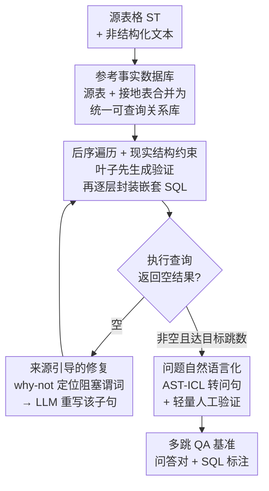

# SPARTA: Scalable and Principled Benchmark of Tree-Structured Multi-hop QA over Text and Tables

**会议**: ICLR 2026  
**arXiv**: [2602.23286](https://arxiv.org/abs/2602.23286)  
**代码**: [github.com/pshlego/SPARTA](https://github.com/pshlego/SPARTA)  
**领域**: 音频语音  
**关键词**: 多跳推理, 表格-文本问答, 基准构建, SQL, 跨模态推理

## 一句话总结

提出 SPARTA，一个端到端自动构建大规模表格-文本多跳问答基准的框架，通过参考事实数据库、来源引导的修复和现实结构约束生成高质量嵌套 SQL 查询，SOTA 模型在 SPARTA 上 F1 下降超过 30 分。

## 研究背景与动机

- **现有基准的三大缺陷**：
  1. **问题类型有限、推理浅**：多数基准仅需 ≤2 跳推理，不支持聚合、分组等高级操作
  2. **标注噪声严重**：审计 HybridQA 100 样本发现 21% 包含错误（冗余模态 52.4%、答案不完整 23.8%、错误/无法回答 23.8%）
  3. **仅依赖小规模 web 表格**：平均 ~15 行，远不及真实数据库的千行规模
- 手动标注复杂性限制了基准的规模和质量，需要自动化方法

## 方法详解

### 整体框架

SPARTA 要解决的是：现有表格-文本多跳问答基准要么推理太浅、要么标注噪声大、要么只用小规模 web 表格，而手动标注又贵到没法扩规模。它的破局思路是把基准构建**完全建立在 SQL 之上**——先把异构的表格和文本统一成一个可查询的关系数据库，再让 SQL 查询本身充当「带标准答案的推理题」，最后才把 SQL 翻译成自然语言问题。因为答案直接来自 SQL 在数据库上的执行结果，标注从「人去读两段材料拼答案」变成「机器执行查询」，规模、深度和正确率都由数据库引擎兜底。

整条流水线分三阶段。第一阶段**构建参考事实数据库**，把源表格和从文本抽出的接地表格合并成一个统一的关系库；第二阶段做**查询生成**，用后序遍历逐层封装嵌套 SQL，并对返回空结果的查询用来源引导的修复救活，直到嵌套深度匹配目标跳数；第三阶段**问题自然语言化**，把验证通过的 SQL 转成流畅的自然语言问句。整套流水线还做到领域无关——换领域只需替换源表格和接地表格两份输入，查询生成与修复流程原封不动复用，论文据此已把框架扩展到电影和医疗领域。

### 关键设计

**1. 参考事实数据库：把文本也变成可 SQL 查询的关系表**

多跳问答的痛点在于答案散落在表格和非结构化文本两种模态里，没法统一检索。SPARTA 把两者都收进一个关系数据库 $\mathcal{D}$：源表格 $\mathcal{S}_T$ 直接保留原始关系表（如 NBA 薪资、奖项、选秀等 6 张 Kaggle 公开表）；接地表格 $\mathcal{G}_T$ 则把非结构化文本分解为原子事实元组，同样存进 SQL 可查询的关系表。文本接地优先利用已验证语料（如 ROTOWIRE，其结构化表格已被验证与配套文字报告一致），也可基于模板做表到文本的转换。关键在于让两类表共享实体属性（如 PLAYER_NAME），并用主外键约束保证跨表联接可达——这样一条 SQL 才能真正横跨表格与文本两种来源做多跳。

**2. 后序遍历 + 现实结构约束：让每一层嵌套查询都先验证再封装**

要生成深嵌套的多跳 SQL，难点是直接让 LLM 一把生成往往整条不可执行、错在哪也说不清。SPARTA 把嵌套 SQL 建模为查询图 $G=(V,E)$，节点 $v_i$ 是一个查询块（一个 `SELECT … FROM … WHERE …` 子查询），边 $e_{ij}$ 是把两个块关联起来的嵌套谓词，然后用**后序遍历**来构建：先生成并验证通过的叶子子查询，再逐个谓词地把它们封装成更高层的查询，每加一层就立即执行一次。相比自顶向下或广度优先（都得在内层子查询还没建好时就验证一条不完整的查询），后序保证每个中间块在被封装进上层之前都已单独执行验证过，错误被局部隔离、不可行的分支能尽早剪掉，整条查询的执行成功率随之提高；同时现实结构约束（千行规模的真实数据库、分组/Having 等高级算子）保证生成的题目逻辑深度真的够。

**3. 来源引导的修复（Provenance-based Refinement）：用数据库 why-not 技术救活空结果查询**

后序构建里最棘手的是某条查询返回空结果——意味着这道题没有答案、整条就废了，但不知道是哪个谓词卡住的。SPARTA 借用数据库领域的 why-not provenance 来定位：先逆序剥离谓词，直到查询重新返回非空结果，从中采样得到「本应出现」的目标元组（传统 why-not 要用户手工提供这些元组，SPARTA 改成从中间结果动态推出）；再运行 why-not provenance 工具，精确找出当初是哪个谓词阻塞了这些元组；最后把这份诊断报告反馈给 LLM，让它**只重写**出问题的那个子句。比如一条查询因 `salary > 800000` 过滤过狠返回空，溯源会指出是这个谓词太严，反馈后 LLM 把阈值放松到 `salary > 600000` 即可救活。这是把成熟的数据库溯源技术第一次搬进 NLP 基准构建，让「修复一条坏查询」从盲猜变成有据可依。

**4. 问题自然语言化：SQL 转流畅问句 + 轻量人工验证**

验证通过的 SQL 还要变成人能读的问题。SPARTA 用 AST-ICL（一个 SOTA 的 SQL-to-text 模型，把 SQL 抽象语法树作为上下文示例喂给 LLM）把每条 SQL 转成语义对齐的流畅问句，再由 3 名计算机研究生做轻量级验证。因为正确性已经由 SQL 执行保证，人工只需检查问句通顺与语义对齐，标注效率达到 HybridQA 的 **4 倍**。

## 实验关键数据

### 基准对比

| 基准 | 表格规模 | 问题生成 | 分组/Having | >3-Hop | 标注错误率 |
|------|---------|---------|------------|--------|-----------|
| HybridQA | 4.4列×15.7行 | 手动 | ✗ | ✗ | 21% |
| OTT-QA | 4.4列×15.7行 | 手动 | ✗ | ✗ | 21% |
| TAT-QA | 4.0列×9.4行 | 手动 | ✗ | ✗ | 30% |
| **SPARTA (NBA)** | **12.2列×3280行** | **自动+轻量验证** | **✓** | **✓** | **0%** |

### SOTA 模型在 SPARTA 上的表现

| 模型 | HybridQA F1 | SPARTA F1 | 下降 |
|------|------------|-----------|------|
| 最优现有模型 | >70 | <40 | >30↓ |
| OTT-QA 最优模型 | >50 | <20 | >30↓ |

### 消融：查询生成策略

| 方法 | 执行成功率 | 查询多样性 |
|------|----------|-----------|
| One-Shot (无检查) | 低 | 低 |
| Post-Order (无 Provenance) | 中 | 中 |
| **Post-Order + Provenance** | **高** | **高** |

### 关键发现

1. SOTA 模型（GPT-4、Claude 等）在 SPARTA 上 F1 大幅下降，暴露跨模态推理根本弱点
2. 后序遍历 + 来源修复的组合显著提高了查询执行率和多样性
3. 轻量级人工验证仅需 HybridQA 1/4 的标注时间
4. 框架成功扩展到电影和医疗域，验证了领域无关性

## 亮点与洞察

- **从根本上重新设计 Table-Text QA 基准**：SQL-centric 流水线解决了规模、噪声和逻辑深度三个核心问题
- **Provenance 修复是关键创新**：将数据库技术（why-not provenance）引入 NLP 基准构建
- **高暴露性**：SOTA 模型 F1 骤降 30+ 分，清晰指向现有跨模态推理能力的根本不足
- **可复现可扩展**：代码、数据、模型全开源，方便后续研究

## 局限性

- 接地表格的原子事实提取依赖特定语料（如 ROTOWIRE），扩展到新领域需人工设计模板
- 自然语言化依赖 LLM，可能引入细微语义偏差
- 仅评估了提取式和生成式 QA 模型，尚未测试 Agent / Tool-augmented 方法

## 相关工作

- Table-Text QA 基准：HybridQA, OTT-QA, TAT-QA, FinQA, MultiHiertt 等
- 合成基准生成：ERBench, TDBench 等（多为单模态或浅层）
- PEEL：模板化 NL-嵌套 SQL 对生成

## 评分

- **新颖性**: ⭐⭐⭐⭐ — SQL-centric 的自动基准构建思路新颖
- **技术深度**: ⭐⭐⭐⭐ — Provenance 修复和后序遍历约束设计精巧
- **实验充分性**: ⭐⭐⭐⭐ — 多领域、多模型、消融全面
- **实用性**: ⭐⭐⭐⭐⭐ — 直接暴露 SOTA 的根本弱点，对社区价值高

<!-- RELATED:START -->

## 相关论文

- [\[ICLR 2026\] A Fano-Style Accuracy Upper Bound for LLM Single-Pass Reasoning in Multi-Hop QA](a_fano-style_accuracy_upper_bound_for_llm_single-pass_reasoning_in_multi-hop_qa.md)
- [\[ICLR 2026\] Scaling Reasoning Hop Exposes Weaknesses: Demystifying and Improving Hop Generalization in Large Language Models](scaling_reasoning_hop_exposes_weaknesses_demystifying_and_improving_hop_generali.md)
- [\[ICLR 2026\] MoNE: Replacing Redundant Experts with Lightweight Novices for Structured Pruning of MoE](mone_replacing_redundant_experts_with_lightweight_novices_for_structured_pruning.md)
- [\[ACL 2025\] STUN: Structured-Then-Unstructured Pruning for Scalable MoE Pruning](../../ACL2025/model_compression/stun_moe_pruning.md)
- [\[ICLR 2026\] Highly Efficient and Effective LLMs with Multi-Boolean Architectures](highly_efficient_and_effective_llms_with_multi-boolean_architectures.md)

<!-- RELATED:END -->
