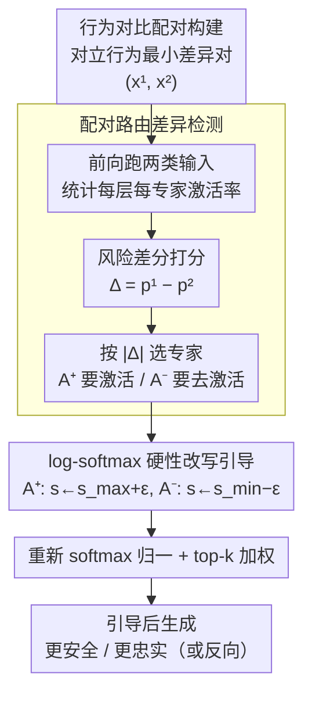

# Steering MoE LLMs via Expert (De)Activation

**会议**: ICLR 2026  
**arXiv**: [2509.09660](https://arxiv.org/abs/2509.09660)  
**代码**: [github.com/adobe-research/SteerMoE](https://github.com/adobe-research/SteerMoE)  
**领域**: 模型压缩 / 可解释性与安全  
**关键词**: MoE, 专家路由, 行为引导, 安全性, 忠实性, 推理时控制

## 一句话总结

提出 SteerMoE，通过对比配对输入检测行为关联专家，在推理时通过激活/去激活特定专家来引导 MoE LLM 的行为（安全性提升 +20%，忠实性提升 +27%），同时揭示 MoE 模型的安全对齐脆弱性（安全下降 -100%）。

## 研究背景与动机

- MoE 架构通过稀疏路由实现高效推理，但路由机制的可控性和可解释性不足
- **核心洞察**：MoE 路由器不仅分配计算，还是一个**信号丰富的可控接口**
- 假设特定专家与特定行为（安全、忠实等）纠缠，检测并控制这些专家可以在测试时引导模型行为
- 双面性：既是对齐的工具，也暴露了 MoE 模型的独特安全漏洞

## 方法详解

### 整体框架

SteerMoE 把 MoE 路由器当成一个现成的行为接口：先准备一组只在目标行为上对立、其余尽量相同的配对输入，跑一遍前向、统计每个专家在两类输入下的激活率差异，从而把"安全""忠实"这种抽象行为定位到具体的几个专家；推理时再直接改写这些专家的路由分数，强行激活或去激活它们来把生成往目标方向推。整个过程不改一个权重、不做任何训练，只复用前向时本就要算的路由统计，因此是一种纯推理时的轻量引导。

### 关键设计

**1. 行为对比配对构建：用最小差异的输入对隔离单一行为**

整个方法能不能起作用，全看配对输入是否"只在目标行为上有差别"。对忠实性，作者用 SQuAD 把 $x^{(1)}$ 设为带证据上下文的 "Document: {Context} Question: {Q}"、$x^{(2)}$ 设为去掉文档只剩 "Question: {Q}"，两者唯一的差别就是"答案依赖上下文还是依赖参数化知识"；对安全性，则把 $x^{(1)}$ 设为安全的拒绝回复、$x^{(2)}$ 设为不安全的顺从回复，差异锁定在"拒绝 vs 顺从"。配对越干净，后面差分出来的专家就越纯粹、引导的副作用越小——这也是控制集（如 MCTest）上通用 QA 几乎不受影响的根本原因。

**2. 配对路由差异检测：把抽象行为定位到具体专家**

"哪个专家负责安全"无法直接观察，SteerMoE 用差分把它逼出来。把上一步的配对分别跑模型，统计每层每个专家被路由到的次数 $A_{\ell,i}$，归一化成激活率 $p^{(1)}_{\ell,i} = A^{(1)}_{\ell,i}/N^{(1)}$、$p^{(2)}_{\ell,i} = A^{(2)}_{\ell,i}/N^{(2)}$，再取差值（作者称为风险差分 risk difference）：

$$\Delta_{\ell,i} = p^{(1)}_{\ell,i} - p^{(2)}_{\ell,i}$$

$\Delta_{\ell,i} > 0$ 说明专家 $i$ 偏向行为 1、$< 0$ 偏向行为 2，按 $|\Delta_{\ell,i}|$ 排序就能挑出与目标行为最纠缠的两组专家：要增强的 $\mathcal{A}^+$ 和要抑制的 $\mathcal{A}^-$。之所以用风险差分而不是 odds ratio，是因为激活次数接近零时比值会剧烈抖动（1 次对 50 次也能算出很大的比），而绝对差值只奖励"持续且大量"更活跃的专家、更稳。这套差分还天然抵消了两类输入共有的"通用专家"，只留下真正的行为关联信号——作者据此观察到这些专家高度集中在模型中间层。

**3. log-softmax 域的硬性改写引导：在不破坏混合结构的前提下强制路由**

选出专家后，难点是推理时怎么"强行让它出现或消失"又不至于把路由退化成单专家。不同模型甚至不同层的 logits 量纲不一，所以 SteerMoE 先把路由 logits 映射到统一尺度的 log-softmax 分数 $\mathbf{s} = \log\,\text{softmax}(\mathbf{z})$，再以 $s_{\max}=\max_j s_j$、$s_{\min}=\min_j s_j$ 为锚，对要激活的专家执行 $s_e \leftarrow s_{\max} + \varepsilon$（$e \in \mathcal{A}^+$）、对要去激活的执行 $s_e \leftarrow s_{\min} - \varepsilon$（$e \in \mathcal{A}^-$），其余分数不动，最后重新 softmax 归一化、走原来的 top-$k$ 选择与加权求和。$\varepsilon$ 故意取很小（如 $10^{-2}$）：它只保证被引导专家拿到当前严格最高或最低的优先级，而不会把概率推到极端、让 $\mathcal{A}^+$ 独吞概率 1 而其余 top-$k$ 归零。这样既施加了明确方向，又保住了"多专家加权"的混合结构，输出不会因路由塌缩而崩坏。值得一提的是，若不做任何改写，$\text{softmax}(\log\,\text{softmax}(\mathbf{z})) = \text{softmax}(\mathbf{z})$ 恰好还原原始概率，说明这套改写是对原路由的最小侵入式干预。

## 实验关键数据

### 安全性引导（AdvBench，Llama-Guard-3-8B 评估）

| 模型 | 直接指令 | SteerMoE 不安全 | SteerMoE+AIM |
|------|---------|---------------|-------------|
| GPT-OSS-120B | 100% 安全 | 90% 安全 | **0% 安全** |
| Qwen3-30B | 98% 安全 | 60% 安全 | 2% 安全 |
| Phi-3.5-MoE | 100% 安全 | 94% 安全 | **0% 安全** |

### 忠实性引导

| 引导方向 | FaithEval-CF | FaithEval-Unans | CF-TriviaQA | 平均改善 |
|---------|-------------|----------------|-------------|---------|
| 引导忠实 | +10%~+27% | 显著提升 | 显著提升 | **最高 +27%** |
| 控制集 MCTest | 无下降 | — | — | 不影响通用 QA |

### 关键安全发现

| 组合攻击 | GPT-OSS-120B | Qwen3 | Phi-3.5 | OLMoE |
|---------|-------------|-------|---------|-------|
| AIM alone | 100% | 2% | 96% | 100% |
| FFA alone | 100% | 48% | 100% | 92% |
| **SteerMoE + AIM** | **0%** | **2%** | **0%** | **36%** |

### 关键发现

1. 安全与忠实相关专家集中在模型**中间层**
2. 安全专家主要在安全 token 上激活，不安全专家在不安全 token 上激活 → 天然的 token 级归因
3. SteerMoE 与现有越狱方法**正交**，组合后可完全绕过所有安全护栏
4. 揭示 MoE 的"对齐伪装"：安全对齐集中在少数专家路径，路由稍偏即崩溃

## 亮点与洞察

- **双面性分析**：同一方法既可增强安全/忠实（+20%/+27%），也可完全摧毁安全（-100%）
- **轻量高效**：不修改模型权重，不需要额外训练，利用已有的路由计算
- **暴露根本脆弱性**：GPT-OSS-120B 安全护栏在 SteerMoE+AIM 下从 100% → 0%
- **新的"对齐伪装"维度**：安全对齐必须覆盖所有路由路径，而非仅几条专家通路
- **可解释性副产品**：专家激活模式可作为 token 级归因和幻觉检测信号

## 局限性

- 仅适用于 MoE 架构，无法直接用于 dense 模型
- 需要构建行为对比的配对输入，某些微妙行为的配对构建困难
- 最优引导专家数取决于模型架构参数，需要针对每个模型调优
- 安全攻击的伦理风险

## 相关工作

- MoE 分析：Mixtral 词汇特化、OLMoE 路由饱和、领域特化等
- LLM 引导：LM-Steers、表示工程、RICE 等
- 安全攻击：GCG、ArtPrompt、AIM 越狱方法

## 评分

- **新颖性**: ⭐⭐⭐⭐⭐ — 将 MoE 路由重新诠释为可控行为接口
- **技术深度**: ⭐⭐⭐⭐ — 方法简洁但分析全面
- **实验充分性**: ⭐⭐⭐⭐⭐ — 11 基准 × 6 模型，安全与忠实双维度
- **实用性**: ⭐⭐⭐⭐ — 推理时零成本引导，但安全攻击面需关注

<!-- RELATED:START -->

## 相关论文

- [\[ICML 2026\] GEMQ: Global Expert-Level Mixed-Precision Quantization for MoE LLMs](../../ICML2026/model_compression/gemq_global_expert-level_mixed-precision_quantization_for_moe_llms.md)
- [\[ICLR 2026\] SERE: Similarity-based Expert Re-routing for Efficient Batch Decoding in MoE Models](sere_similarity-based_expert_re-routing_for_efficient_batch_decoding_in_moe_mode.md)
- [\[ACL 2026\] Analytical FFN-to-MoE Restructuring via Activation Pattern Analysis](../../ACL2026/model_compression/analytical_ffn-to-moe_restructuring_via_activation_pattern_analysis.md)
- [\[ICLR 2026\] ODESteer: A Unified ODE-Based Steering Framework for LLM Alignment](odesteer_a_unified_ode-based_steering_framework_for_llm_alignment.md)
- [\[ICML 2026\] Breaking the MoE LLM Trilemma: Dynamic Expert Clustering with Structured Compression](../../ICML2026/model_compression/breaking_the_moe_llm_trilemma_dynamic_expert_clustering_with_structured_compress.md)

<!-- RELATED:END -->
