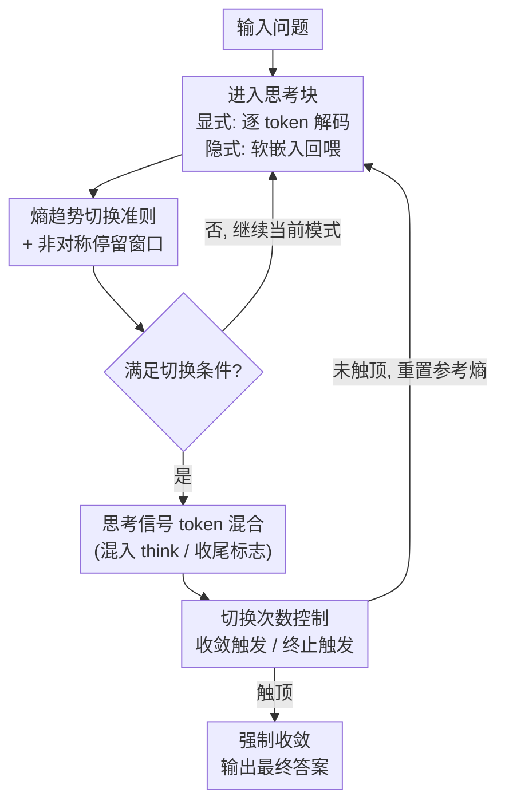

# SwiReasoning: Switch-Thinking in Latent and Explicit for Pareto-Superior Reasoning

**会议**: ICLR 2026  
**arXiv**: [2510.05069](https://arxiv.org/abs/2510.05069)  
**代码**: [https://github.com/sdc17/SwiReasoning](https://github.com/sdc17/SwiReasoning)  
**领域**: 模型压缩与高效推理 (Model Compression / Efficient Reasoning)  
**关键词**: 隐式推理, 显式推理, 模式切换, Token效率, 免训练框架

## 一句话总结

提出 SwiReasoning，一种免训练的 LLM 推理框架，通过基于熵趋势的块级置信度估计，动态切换显式（chain-of-thought）和隐式（latent space）推理模式，在 Pareto 意义上同时改善准确率（+1.8%~3.1%）和 Token 效率（+57%~79%）。

## 研究背景与动机

大语言模型的推理能力是当前 AI 研究的核心议题。现有的推理增强方法主要分为两大路径：

**显式推理（Explicit Reasoning）**：通过链式思考（Chain-of-Thought, CoT）步骤进行离散推理。优点是可解释，缺点是受自然语言边界限制，每步信息密度有限，且容易过度思考（overthinking），生成冗余 token。

**隐式推理（Latent Reasoning）**：让 LLM 在隐空间中连续推理，每步可以编码更丰富的信息，从而提升 token 效率。近期工作展示了这一方向的潜力。

然而，隐式推理在免训练（training-free）设定下面临两个核心挑战：

- **挑战一：精度下降**。纯隐式推理通过维持多条隐式路径来扩展搜索分布，这会分散概率质量、引入噪声，阻碍收敛到单一高置信度解，从而损害准确率。本质上是探索（exploration）过剩但利用（exploitation）不足。

- **挑战二：持续过度思考**。即使没有显式文本输出，overthinking 问题仍然存在——模型浪费 token 却无法提升结果质量，效率下降。

SwiReasoning 的核心动机是：**能否在显式和隐式两种推理模式之间动态切换，既利用显式推理的收敛性来"锚定"解，又利用隐式推理的高效性来加速探索？**

## 方法详解

### 整体框架

SwiReasoning 把推理 LLM 的思考过程切成一串交替的"思考块"（thinking block）：要么是显式块——像普通链式思考（chain-of-thought）那样逐 token 解码成可读文本；要么是隐式块——不真的采样某个 token，而是把整张 next-token 概率分布加权回所有词嵌入、把这个软嵌入喂回模型当作下一步输入（$\tilde{e}_t = \sum_{v} p_t[v]\, e(v)$，沿用 Soft-Thinking 的免训练做法），从而一步保留更多不确定性、信息密度更高。框架在推理时实时监控每步 next-token 分布的熵，把它当置信度信号来决定下一个块该走哪种模式：模型越确信（熵下降）就切到显式去"锚定"一条路径，越游移（熵升高）就切到隐式去并行探索。同时一个切换计数器给整条链的切换次数封顶，在自然检查点处提前逼出答案、压制过度思考。整套流程不动任何权重，可即插即用套在任意推理 LLM 上。

### 关键设计

**1. 熵趋势的块级置信度切换准则与非对称停留窗口**

针对纯隐式推理"探索过剩、概率质量被多条隐路径稀释而迟迟不收敛"的痛点，SwiReasoning 不引入任何额外分类器或奖励模型，而是直接拿熵当置信度探针。两次切换之间的内容称为一个思考块，块内用 next-token 分布的熵 $H_t = -\sum_{v} p_t[v]\log p_t[v]$ 度量置信度；每个块开头记一个参考熵 $\bar{H}$，发生切换时刷新。准则极简：隐式块里一旦 $H_t < \bar{H}$（置信度回升）就切回显式、把进展收敛到单一可读路径；显式块里一旦 $H_t > \bar{H}$（置信度下滑）就切到隐式重新展开探索。为防止熵的短期抖动把模式来回拨，作者给两个方向加了**非对称**的停留窗口：$W_{L\to E}=0$ 意味着熵一旦下探就可立刻切回显式（隐式天生发散，确信后久留只会引入杂讯），而 $W_{E\to L}>0$ 要求显式至少稳定积累 $W_{E\to L}$ 步才允许切回隐式（显式天生收敛，需给它时间把逻辑链铺稳，否则一次抖动就触发震荡）。这样隐式块天然担"探索"、显式块担"利用"，两者随熵信号自动配比。

**2. 思考信号 token 混合**

光按熵切换还不够贴合模型自己学到的思考节奏。作者在每个切换点把 `<think>` / `</think>` 这类思考标志 token 的嵌入混进当前步输入：进入隐式块的第一步 $t^\star$ 向"开始思考"偏置 $\tilde{e}_{t^\star} \leftarrow \alpha_{t^\star}\tilde{e}_{t^\star} + (1-\alpha_{t^\star})\,e_{\langle\text{think}\rangle}$，退出到显式块的第一步 $t^\dagger$ 向"结束思考"偏置（换成 $e_{\langle/\text{think}\rangle}$）。混合系数 $\alpha,\beta$ 随生成进度从初值线性升到 1（越靠后偏置越强）。这一步让模式切换与模型预训练时见过的"起思考 / 收思考"信号对齐，相当于用模型自己的语言告诉它"现在换挡了"，使切换更平滑、不至于在隐空间漂离正轨。

**3. 切换次数控制：收敛触发 + 终止触发**

即便有了置信度切换，模型在简单题上仍可能反复横跳、空耗 token。作者对整条链的 Latent→Explicit 切换次数设上限 $C_{\max}$，用计数器 $C_t$ 配两级触发：当 $\tfrac{1}{2}C_{\max}\le C_t\le C_{\max}$ 时启动**收敛触发**，在下一次 Latent→Explicit 切换处强制写入 `</think>`，鼓励（而非强逼）模型基于已有的部分推理开始收敛答案；当 $C_t > C_{\max}$ 时启动**终止触发**，直接注入答案前缀"The final answer is"、再最多放 $B$ 个 token 收尾。设计动机在于：每次切换本就标记一个"部分推理已被整合"的天然检查点，在这些点提前出答案既不浪费 token，又常常已经够正确。这也解释了为何预算越紧（$C_{\max}$ 越小）腾出的 token 余量越多、效率增益越突出。

### 损失函数 / 训练策略

SwiReasoning 完全免训练，不做任何参数更新或微调。软嵌入回喂、熵计算与参考熵刷新、停留窗口判定、信号混合、切换计数与触发，全部在推理时在线执行，与需要额外训练（如思考 token 蒸馏）的方案形成对比，部署门槛极低。

## 实验关键数据

### 主实验

在数学、STEM、编码和通用推理等基准上评估，跨越不同模型家族和规模。

| 基准类别 | 准确率提升 | 说明 |
|---------|----------|------|
| 数学 | +1.8%~3.1% | MATH, GSM8K 等 |
| STEM | +1.8%~3.1% | 跨各类 STEM 基准 |
| 编码 | +1.8%~3.1% | 代码推理任务 |
| 通用推理 | +1.8%~3.1% | 综合推理基准 |

Token 效率提升：

| 预算约束 | Token 效率提升 | 说明 |
|---------|-------------|------|
| 正常预算 | 57% | 基础效率增益 |
| 紧缩预算 | 79% | 预算越紧，增益越大 |

### 消融实验

| 配置 | 关键指标 | 说明 |
|------|---------|------|
| 纯显式推理 | 基线准确率 | 传统 CoT，token 消耗大 |
| 纯隐式推理 | 准确率下降 | 探索过剩，不收敛 |
| 随机切换 | 部分提升 | 验证动态切换的必要性 |
| 固定间隔切换 | 中等提升 | 不如自适应策略 |
| SwiReasoning（自适应） | 最优 | 动态切换 + 限制次数 |

### 关键发现

1. **Pareto 优越性**：SwiReasoning 在准确率和效率两个维度上同时优于基线，实现了 Pareto 意义上的改进——不是以牺牲一个目标来优化另一个。

2. **跨模型家族泛化**：在不同的模型家族（如 Qwen、LLaMA 等）和不同规模上都能稳定带来提升，证明了方法的通用性。

3. **预算越紧增益越大**：在受限预算场景下，SwiReasoning 的效率优势更加明显（79% vs 57%），说明其动态分配计算资源的策略在资源稀缺时更有效。

4. **难度自适应**：简单问题自然获得较少的计算量（少量块后即收敛），困难问题获得更多但有上限的计算量，实现了计算资源的合理分配。

## 亮点与洞察

1. **首次提出显式-隐式混合推理范式**：SwiReasoning 不是简单地选择显式或隐式推理，而是将两者有机融合，利用各自优势。显式推理擅长"收敛确认"，隐式推理擅长"高效搜索"——这一互补性是框架成功的关键。

2. **免训练设计**：作为一个推理时即插即用的框架，SwiReasoning 可以不修改模型权重直接应用于任何推理 LLM，实际部署门槛极低。

3. **熵趋势作为推理状态探针**：利用 next-token 分布的熵趋势来感知模型的内部推理状态（探索 vs 收敛），这一信号简洁高效，无需额外的分类器或奖励模型。

4. **对 overthinking 问题的优雅解决**：通过最大切换次数来自然地限制推理深度，比后处理截断更优雅，因为它允许模型在需要时深入思考但防止无限发散。

5. **连接了两个研究社区**：将隐式推理（latent reasoning）和显式推理（CoT）这两个方向桥接起来，提供了一个统一视角。

## 局限与展望

1. **仅在推理 LLM 上验证**：虽然免训练是优势，但专门训练的切换策略可能带来更大的性能增益。未来可以探索轻量级微调来进一步优化切换决策。

2. **熵趋势信号的鲁棒性**：基于 next-token 熵趋势的置信度估计可能在某些场景下不够准确（如多步推理中间步骤的熵波动），可能需要更多信号源。

3. **隐式推理的可解释性**：虽然最终输出包含显式文本，但隐式推理块中的"思考"过程不可观测，可能限制调试和理解。

4. **最大切换次数的超参数敏感性**：这个关键超参数需要针对不同任务和模型进行调优，缺乏自动确定机制。

5. **未探索多模态场景**：当前只在语言推理任务上验证，视觉推理、多模态推理等场景的表现尚未知。

## 相关工作与启发

- **Chain-of-Thought (CoT)**：经典的显式推理方法，是 SwiReasoning 的一个组成部分
- **Latent Reasoning / SIM-CoT / LaDiR**：隐式推理方向的最新工作，SwiReasoning 将其与显式推理融合
- **Token 效率优化**：如 Early Stopping CoT 等方法关注减少冗余 token，SwiReasoning 提供了更细粒度的控制
- **测试时计算优化**：如 Best-of-N、Self-Consistency 等方法，SwiReasoning 在单次推理路径中实现优化
- 启发方向：**推理模式的动态选择**可能是大模型高效推理的通用范式，未来可以扩展到更多推理模式的组合

## 评分

- 新颖性: ⭐⭐⭐⭐ （显式-隐式动态切换的想法较新颖，基于熵趋势的切换机制设计巧妙）
- 实验充分度: ⭐⭐⭐⭐ （多模型、多基准评估，消融实验完整，但缺少与更多隐式推理baselines的对比）
- 写作质量: ⭐⭐⭐⭐ （结构清晰，动机阐述充分）
- 价值: ⭐⭐⭐⭐⭐ （免训练、即插即用、Pareto 优越——实际应用价值很高，对 LLM 推理效率研究有重要推动）

<!-- RELATED:START -->

## 相关论文

- [\[ICLR 2026\] Efficient Reasoning with Balanced Thinking](efficient_reasoning_with_balanced_thinking.md)
- [\[ICLR 2026\] FutureMind: Equipping Small Language Models with Strategic Thinking-Pattern Priors via Adaptive Knowledge Distillation](futuremind_equipping_small_language_models_with_strategic_thinking-pattern_prior.md)
- [\[ICLR 2026\] BeyondBench: Contamination-Resistant Evaluation of Reasoning in Language Models](beyondbench_contamination-resistant_evaluation_of_reasoning_in_language_models.md)
- [\[ICLR 2026\] ParoQuant: Pairwise Rotation Quantization for Efficient Reasoning LLM Inference](paroquant_pairwise_rotation_quantization_for_efficient_reasoning_llm_inference.md)
- [\[ICLR 2026\] Landscape of Thoughts: Visualizing the Reasoning Process of Large Language Models](landscape_of_thoughts_visualizing_the_reasoning_process_of_large_language_models.md)

<!-- RELATED:END -->
