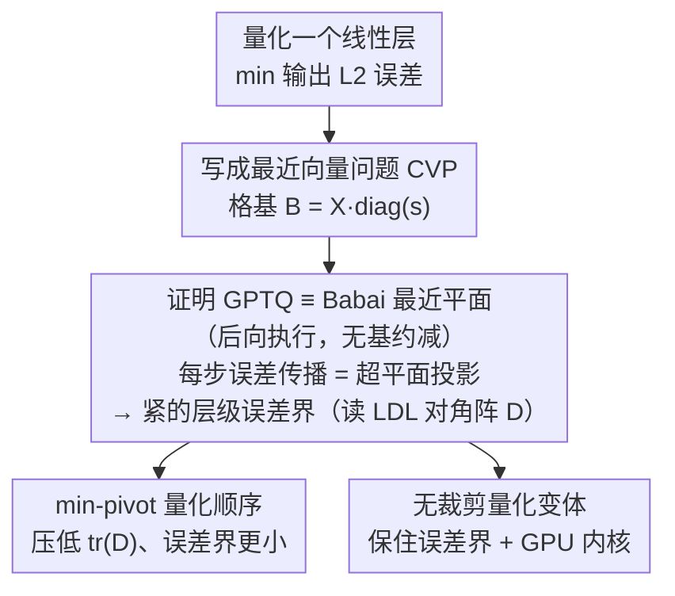

# The Geometry of LLM Quantization: GPTQ as Babai's Nearest Plane Algorithm

**会议**: ICLR 2026  
**arXiv**: [2507.18553](https://arxiv.org/abs/2507.18553)  
**代码**: [GitHub](https://github.com/IST-DASLab/GPTQ-Babai)  
**领域**: 模型压缩 / 量化  
**关键词**: GPTQ, 量化, 格理论, 最近向量问题, Babai算法, 误差界

## 一句话总结

首次证明 GPTQ（从后向前执行时）在数学上等价于经典格理论中的 Babai 最近平面算法，由此获得几何解释和层级误差上界，并基于此设计了无裁剪的改进量化方法。

## 研究背景与动机

GPTQ 是 LLM 后训练量化的标准方法之一，能够将16位权重一次性量化至4位并保持接近基线的精度。然而，GPTQ 仅被描述为一序列贪心代数操作——逐个量化权重、最优更新未量化权重以补偿误差——**缺乏几何直觉和最坏情况保证**。

核心问题：为什么一个局部贪心规则能在全局上表现如此优异？

## 方法详解

### 整体框架

本文不提出新的量化框架，而是把 GPTQ 这个贪心代数算法翻译到格理论（lattice theory）的语言里，给它配上几何图像和最坏情况保证，再顺着这条等价链改进算法。整条链路是：先把"量化一个线性层"严格写成格上的最近向量问题（CVP）；再证明 GPTQ 从后向前（back-to-front）执行时与经典的 Babai 最近平面算法逐步等价，于是 GPTQ 的每一步误差传播都对应一次几何上的超平面投影，并能直接搬来 Babai 的近似保证，得到一个可计算且紧的层级误差上界——读 Hessian 做 LDL 分解后的对角阵就能预判一层好不好量化。沿这个误差界往下，作者推出压低误差的量化顺序（min-pivot order），以及一个不裁剪溢出整数、从而让界保持成立的量化变体，并配套 GPU 推理内核。

### 关键设计

**1. 把量化写成最近向量问题（CVP）：让格理论的工具能够接管**

GPTQ 过去只被当作"逐列贪心代数操作"，缺的是一个能套用现成理论的数学形式。作者把它改写成 CVP：给定校准激活 $\bm{X} \in \mathbb{R}^{n \times c}$、权重 $\bm{W} \in \mathbb{R}^{c \times r}$ 和量化尺度 $\bm{S}$，逐列量化即为每一列找整数向量 $\bm{z}_i$ 最小化输出误差 $\arg\min_{\bm{z}_i \in \mathbb{Z}_\dagger^c} \|\bm{X}\,\text{diag}(\bm{s}_i)\,\bm{z}_i - \bm{X}\bm{w}_i\|^2$。把格基取作 $\bm{B} = \bm{X}\,\text{diag}(\bm{s}_i)$、目标向量取作 $\bm{y} = \bm{X}\bm{w}_i$，量化就变成"在格 $\{\bm{B}\bm{z}\}$ 里找离 $\bm{y}$ 最近的格点"——这正是 CVP。Theorem 1 进一步说明误差只依赖 Hessian $\bm{X}^\top\bm{X}$，因此任何满足 $\bm{\mathcal{X}}^\top\bm{\mathcal{X}}=\bm{X}^\top\bm{X}$ 的因子都能替代 $\bm{X}$，后续可以自由挑数值上更方便的格基。

**2. GPTQ ≡ Babai 最近平面：误差传播就是超平面投影，并由此读出误差界**

这是全文的核心结论。OBQ/GPTQ 每量化一个权重就最优更新其余未量化权重以补偿误差，过去只被看作代数技巧。Theorem 2 证明这一步在几何上等价于 Babai 算法把目标向量投影到当前最近超平面：更新量满足 $\Delta \zeta_{j_1} = \frac{(\bm{B}^\top\bm{B})^{-1}[j_1, j_2]}{(\bm{B}^\top\bm{B})^{-1}[j_2, j_2]}\,\Delta \zeta_{j_2}$，即一个坐标被量化后产生的扰动，会按 Hessian 逆的比例分摊到相邻坐标，恰好对应投影后残差在格基上的重新表示。Theorem 4 把它推到全局：把维度顺序对齐后（GPTQ 从后向前执行、并把下三角因子换成上三角，使每步只影响尚未量化的坐标），GPTQ 与无基约减的 Babai 最近平面算法逐步产生完全相同的结果——GPTQ 的每个中间权重向量正是 Babai 在激活空间里的残差向量。落到有几十年研究积累的格算法上之后，最大的红利是一个紧的误差界：无裁剪设定（$\mathbb{Z}_\dagger = \mathbb{Z}$）下，Theorem 5 给出

$$\|\bm{X}\,\text{diag}(\bm{s}_i)\,\bm{z}_i - \bm{X}\bm{w}_i\|^2 \leq \tfrac{1}{4}(\bm{T}^{-1}\bm{s}_i)^\top \bm{D}\,(\bm{T}^{-1}\bm{s}_i),$$

其中 $\bm{D}$ 是排列后的 Hessian 做 LDL 分解得到的对角矩阵、$\bm{T}$ 是对应的单位下三角（排列）因子。由于界只由 $\bm{D}$ 与尺度决定，无需真正运行量化、直接读 LDL 的对角元素就能预判一层的量化难度；当权重近似均匀分布时，期望误差约为最坏情况的 $1/3$。

**3. min-pivot 量化顺序：用最短残差换更小的 tr(D)**

误差界把优化目标显式化成压低 $\bm{D}$ 的迹 $\text{tr}(\bm{D})$，这直接指向量化顺序的选择。GPTQ 原有的 act-order 按 Hessian 对角线降序排列；本文提出 min-pivot order，每一步 LDL（或 Cholesky）分解时选当前最小的对角元素作主元，几何上等价于 Gram-Schmidt 正交化里每次挑最短的残差向量去正交化。它用立方时间即可算出、不增加量化总复杂度，累积下来 $\text{tr}(\bm{D})$ 一致低于 act-order。不过作者也诚实指出：下游精度提升有限——当 Hessian 良态时，只看对角线的 act-order 已经吃到了大部分收益，min-pivot 更多是一个"有原则的选择"。

**4. 无裁剪量化：保住误差界并配套 GPU 内核**

上面的误差界只在不裁剪时成立——原始 GPTQ 会把溢出的整数裁回合法范围，这一步引入大误差、破坏 Theorem 5 的界。作者据此设计不裁剪的量化方法，但注意到单纯放大尺度来避免裁剪是反效果的（尺度越大界越松、误差可能比裁剪还差）；于是改成"主体内点用低比特、少量溢出离群点用额外存储而非裁剪"的不均匀比特表示，并用二分搜索（按溢出密度 / 编码后比特数为目标）自动定标，使实际误差始终落在理论上界之内。配套的 CUDA 推理内核同时处理稠密内点与稀疏离群点，让这个变体可以直接部署。

## 实验关键数据

### GPTQ误差界的实际验证

| 设定 | 理论误差界与实际误差的关系 |
|------|--------------------------|
| 无裁剪 + act-order | 实际误差始终低于理论上界 |
| 无裁剪 + min-pivot | $\text{tr}(\bm{D})$ 一致降低，下游精度略有提升 |

### 量化顺序对比

| 排列策略 | tr(D) | 下游精度 |
|----------|-------|---------|
| 默认顺序 | 基线 | 基线 |
| act-order | 较低 | 改善（Hessian 良态时已吃到大部分收益） |
| min-pivot | 一致低于 act-order | 略优，但提升幅度有限（modest） |

### 关键发现

- 无裁剪方法在部分场景下优于原始 GPTQ（有裁剪）
- 等价性证明在数学上"不可加强"——Babai 投影后再做 GPTQ 更新结果不变（Section C.4）
- min-pivot 一致降低 $\text{tr}(\bm{D})$，但下游精度提升有限——act-order 只看 Hessian 对角线，已是廉价且接近的近似
- 期望误差约为最坏情况的 1/3（权重近似均匀分布时）

## 亮点与洞察

1. **数学优美**：将实用算法GPTQ与几十年格理论研究连接，为量化算法设计打开了新方向
2. **理论意义深远**：误差界的发现意味着可以直接读取LDL分解的对角阵来预判量化质量
3. **反直觉发现**：Babai投影后补做GPTQ更新是代数冗余的，两种算法已在等价性上"紧"了
4. **实用价值**：无裁剪方法 + 高效GPU内核 = 直接可部署的改进方案

## 局限性

- min-pivot order 的下游精度提升相对act-order较为有限
- 无裁剪方法需要额外的整数比特来存储溢出值，增加表示复杂度
- 基约减（LLL/BKZ）在LLM规模格上的计算开销问题尚未完全解决
- 仅关注层级误差，未分析误差在层间的累积效应

## 相关工作

- **GPTQ** (Frantar et al., 2023)：LLM一次性量化标准方法
- **OBQ/OBC** (Frantar & Alistarh, 2022)：GPTQ的前身
- **QuIP** (Chee et al., 2023)：证明GPTQ的误差保证并提出LDLQ
- **Babai算法** (Babai, 1986)：CVP的多项式时间近似
- **LLL基约减** (Lenstra et al., 1982)：格基约减经典算法

## 评分

- 新颖性：⭐⭐⭐⭐⭐（历史性的等价性证明）
- 理论性：⭐⭐⭐⭐⭐（严格的数学证明+紧误差界）
- 实验：⭐⭐⭐（理论验证充分但大规模实验相对有限）
- 实用性：⭐⭐⭐⭐（无裁剪方法+GPU内核直接可用）

<!-- RELATED:START -->

## 相关论文

- [\[ICLR 2026\] The Lattice Geometry of Neural Network Quantization -- A Short Equivalence Proof of GPTQ and Babai's Algorithm](the_lattice_geometry_of_neural_network_quantization_--_a_short_equivalence_proof.md)
- [\[ICLR 2026\] TurboBoA: Faster and Exact Attention-aware Quantization without Backpropagation](turboboa_faster_and_exact_attention-aware_quantization_without_backpropagation.md)
- [\[ICLR 2026\] ParoQuant: Pairwise Rotation Quantization for Efficient Reasoning LLM Inference](paroquant_pairwise_rotation_quantization_for_efficient_reasoning_llm_inference.md)
- [\[ICLR 2026\] Topology and Geometry of the Learning Space of ReLU Networks: Connectivity and Size](topology_and_geometry_of_the_learning_space_of_relu_networks_connectivity_and_si.md)
- [\[ICLR 2026\] Cut Less, Fold More: Model Compression through the Lens of Projection Geometry](cut_less_fold_more_model_compression_through_the_lens_of_projection_geometry.md)

<!-- RELATED:END -->
