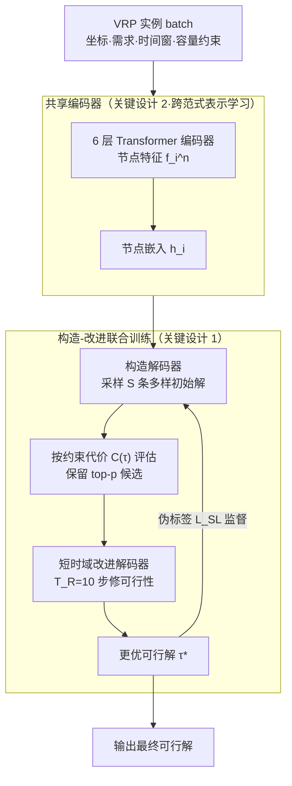

# Towards Efficient Constraint Handling in Neural Solvers for Routing Problems

**会议**: ICLR 2026  
**arXiv**: [2602.16012](https://arxiv.org/abs/2602.16012)  
**代码**: [https://github.com/jieyibi/CaR-constraint](https://github.com/jieyibi/CaR-constraint)  
**领域**: 模型压缩  
**关键词**: 神经组合优化, 车辆路径问题, 约束处理, 构造-改进混合, 可行性修复

## 一句话总结

提出 Construct-and-Refine (CaR) 框架，通过联合训练构造模块和轻量改进模块实现高效的可行性修复，首次为硬约束路径问题提供通用、高效的神经约束处理方案，在 TSPTW 和 CVRPBLTW 上大幅超越经典和神经 SOTA 求解器。

## 研究背景与动机

- **VRP 约束挑战**: 实际车辆路径问题包含复杂约束（时间窗、容量、回程等），现有神经求解器主要聚焦简单变体
- **现有约束处理方案的局限**:
  1. **可行性掩码 (Feasibility Masking)**: 在 MDP 中排除无效动作——对简单 VRP 有效，但在复杂情况下计算掩码本身是 NP-hard（如 TSPTW），或过度限制搜索空间（如 CVRPBLTW 中 >60% 节点被过滤）
  2. **隐式可行性感知**: 通过奖励惩罚或特征增强隐式引导——效果有限，且计算开销大
- **混合求解器的局限**: 现有构造-改进混合方法（RL4CO、NCS）针对优化目标而非可行性设计，需要数千步改进（如 5000 步），在硬约束 VRP 上可能 100% 不可行
- **核心问题**: 能否设计一个简单、通用、保持效率的神经约束处理框架？

## 方法详解

### 整体框架

CaR（Construct-and-Refine）把"构造一个初始解"和"修复不可行解"两件事拧成一个端到端联合训练的整体。给定一批 VRP 实例，一个**共享的 6 层 Transformer 编码器**先把节点编码成嵌入；**构造解码器**据此并行采样出一小批多样且尽量优质的初始路径，按约束代价 $C(\tau)$ 评估后只把 top-$p$ 个高潜力候选送进下一步；**轻量改进解码器**再用极少步数（$T_R=10$）把违反约束的地方快速修掉；修出来的更优可行解 $\tau^*$ 又作为伪标签反过来监督构造策略，让两端协同纠正不可行与次优。关键在于改进不再是传统混合求解器那种动辄 5000 步的漫长优化，而是被压成一个 $T_R=10$ 步的短时域过程，专门服务于"恢复可行性"这一目标。

### 关键设计

**1. 联合训练的可行性修复：让构造和改进互相喂信号**

现有混合求解器把构造器和改进器分开训练、各自只盯优化目标，结果在硬约束 VRP 上改进上千步仍可能 100% 不可行。CaR 把两个模块放进同一个目标里联合优化，总损失为 $\mathcal{L}(\theta) = \mathcal{L}(\theta^{\text{C}}) + \omega \mathcal{L}(\theta^{\text{R}})$，其中 $\theta^{\text{C}}$、$\theta^{\text{R}}$ 分别是构造与改进的参数，$\omega$ 平衡两者尺度。改进模块被建模成一个短时域约束 MDP（CMDP），只跑 $T_R=10$ 步、用 REINFORCE 优化每一步的修复质量；由于步数极短，它能像普通前向那样高效，却足以把不可行解拉回可行域。而改进产出的更优解又作为伪标签回头监督构造端（$\mathcal{L}_{\text{SL}}$），两端在每一步梯度里同时更新、协同纠错。正是"短改进 + 联合训练 + 互相喂信号"这套组合，把传统 5000 步压到 10 步、运行时间从小时级降到分钟/秒级。

**2. 跨范式表示学习：共享编码器、分离解码器**

构造和改进虽是两种范式，但面对的都是同一张路径图，强行各学一套编码会浪费约束相关的共性知识。CaR 让两者共用一个 6 层 Transformer 编码器，节点输入特征 $f_i^{\text{n}} = \{x_i, y_i, q_i, l_i, u_i, \ell\}$ 涵盖坐标、需求、时间窗上下界与持续时间；改进侧额外用循环位置编码（cyclic positional encoding）经合成注意力把当前解的序列结构注入，再用一个 MLP 把节点级注意力分数 $a^{\text{n}}$ 与解级分数 $a^{\text{s}}$ 逐元素融合。解码器则刻意保持独立——消融显示统一解码器会拖低性能，因为"从零构造"和"局部修补"需要不同的决策模式。共享编码器带来的收益在 CVRPBLTW 这种多约束场景下最为明显，说明约束意识确实在两个范式间发生了迁移。

**3. 灵活约束处理：掩码、隐式感知、显式修复三管齐下**

单靠可行性掩码在复杂约束下要么计算本身是 NP-hard（如 TSPTW），要么过度收紧搜索空间（CVRPBLTW 中 >60% 节点被过滤、阻碍 RL 收敛），所以 CaR 不押注单一手段，而是整合三种互补策略：能算掩码时用**灵活掩码**并允许按需放松，靠**跨范式共享表示**让模型隐式感知约束，最后由**轻量改进过程**做显式的可行性修复兜底。三者面对的违反程度由统一的约束违反代价度量

$$C(\tau) = \sum_{e_{ij} \in \tau} \left[C_L(e_{ij}) + \sum_{\eta=1}^{m} C_V^{\eta}(e_{ij})\right]$$

其中 $C_L$ 是路程长度等目标代价，$C_V^{\eta}$ 是第 $\eta$ 类约束（如时间窗超出量 $t_j - u_j$）在边 $e_{ij}$ 上的违反代价，$m$ 为约束种类数。把目标与违反统一进一个代价函数，正好让短时域改进知道该优先修哪里，也让 top-$p$ 候选筛选有据可依。

### 损失函数 / 训练策略

构造模块的训练混合了三种损失。主干是基于 REINFORCE 的策略梯度，以同一实例采样 $S$ 条轨迹的平均回报作 baseline 来降方差：

$$\mathcal{L}_{\text{RL}}^{\text{C}} = \frac{1}{S} \sum_{i=1}^{S} \left[\left(\mathcal{R}(\tau_i) - \frac{1}{S}\sum_{j=1}^{S}\mathcal{R}(\tau_j)\right) \log \pi_{\theta}^{\text{C}}(\tau_i)\right]$$

为弥补移除多起点策略后多样性的损失，再加一项熵型多样性损失鼓励探索：

$$\mathcal{L}_{\text{DIV}} = -\sum_{t=1}^{|\tau|} \pi_{\theta}^{\text{C}}(e_t \mid \tau_{<t}) \log \pi_{\theta}^{\text{C}}(e_t \mid \tau_{<t})$$

而当改进模块产出比构造解更优的 $\tau^*$ 时，就把它当伪标签做监督学习，让构造端直接吸收改进的成果（$\mathbb{I}$ 为"改进更优"的指示函数）：

$$\mathcal{L}_{\text{SL}} = -\mathbb{I} \cdot \sum_{t=1}^{|\tau^*|} \log \pi_{\theta}^{\text{C}}(e_t^* \mid \tau_{<t}^*)$$

改进模块则在短时域 CMDP 上用 REINFORCE 优化每步修复质量，最终与构造损失按 $\omega$ 加权合并为前述联合损失统一反传。

## 实验

### TSPTW（掩码计算 NP-hard）

| 方法 | n=50 Gap↓ | n=50 Infsb%↓ | n=50 Time | n=100 Gap↓ | n=100 Infsb%↓ |
|------|-----------|-------------|-----------|-----------|--------------|
| LKH-3 (100 trials) | 0.004% | 11.88% | 7m | 0.103% | 31.05% |
| PIP (neural SOTA) | - | - | - | - | - |
| NCS | - | 100% | - | - | 100% |
| **CaR** | **best** | **best** | **6-8× faster** | **best** | **best** |

- CaR 实现 6-8× 加速同时提升可行性和解质量
- 甚至找到 LKH-3 无法找到的可行解

### CVRPBLTW（多约束，掩码过度限制）

CaR 在容量+回程+持续时间+时间窗的四约束组合下展现主导优势，超越经典和神经 SOTA

### 消融实验结果

| 组件 | 效果 |
|------|------|
| 联合训练 vs 分离训练 | 联合训练显著提升可行性和解质量 |
| 共享编码器 vs 独立编码器 | 共享编码器在复杂约束（CVRPBLTW）上提升最大 |
| 多样性损失 $\mathcal{L}_{\text{DIV}}$ | 补偿移除多起点策略带来的多样性损失 |
| 监督损失 $\mathcal{L}_{\text{SL}}$ | 利用改进结果反馈提升构造质量 |
| 改进步数 10 vs 5000 | 10 步即可实现有效修复，运行时间从小时级降至分钟/秒级 |

### 通用性验证

- 构造骨干: POMO、PIP 均可与 CaR 集成
- 改进骨干: NeuOpt (k-opt)、N2S (remove-and-reinsert) 均兼容
- 变体: 简单 VRP (CVRP) 和复杂 VRP (TSPTW, CVRPBLTW) 均适用

## 亮点

- **首个通用方案**: 首次提出适用于简单和复杂 VRP 的统一神经约束处理框架
- **效率惊人**: 从 5000 步改进压缩到 10 步，运行时间从小时降至分钟
- **理论上首次提出可行性修复**: 在神经求解器领域引入显式学习性可行性修复，填补空白
- **跨范式协同**: 共享编码器实现构造和改进的知识迁移，特别在复杂约束场景优势明显

## 局限性

- 联合训练增加了实现复杂度，需要同时维护构造和改进两个 MDP
- 共享编码器在简单 VRP 上收益有限（CVRP 提升不显著）
- 改进操作（k-opt、remove-reinsert）的选择需要针对不同 VRP 变体调整
- 目前仅验证 n≤100 规模，更大规模（n>1000）的扩展性待探索
- 依赖均匀分布生成的合成问题实例，真实世界分布的泛化能力未充分验证

## 相关工作

- **构造求解器**: AM、POMO、PIP——逐步构建解，通过掩码处理简单约束
- **改进求解器**: NeuOpt、N2S——迭代改进现有解，需要大量步数
- **混合求解器**: LCP、RL4CO、NCS——组合两种范式，但主要针对简单 VRP 的最优性
- **约束处理**: Lagrangian 松弛（Tang et al.）、约束特征（MUSLA）、近似掩码（PIP）
- **CaR**: 首个融合灵活掩码、隐式感知和显式修复的统一框架

## 评分

| 维度 | 分数 |
|------|------|
| 创新性 | ★★★★☆ |
| 理论深度 | ★★★★☆ |
| 实验充分性 | ★★★★★ |
| 实用价值 | ★★★★☆ |
| 写作质量 | ★★★★☆ |

<!-- RELATED:START -->

## 相关论文

- [\[NeurIPS 2025\] MTL-KD: Multi-Task Learning Via Knowledge Distillation for Generalizable Neural Vehicle Routing Solver](../../NeurIPS2025/model_compression/mtl-kd_multi-task_learning_via_knowledge_distillation_for_generalizable_neural_v.md)
- [\[ICLR 2026\] SERE: Similarity-based Expert Re-routing for Efficient Batch Decoding in MoE Models](sere_similarity-based_expert_re-routing_for_efficient_batch_decoding_in_moe_mode.md)
- [\[ICLR 2026\] LD-MoLE: Learnable Dynamic Routing for Mixture of LoRA Experts](ld-mole_learnable_dynamic_routing_for_mixture_of_lora_experts.md)
- [\[ICLR 2026\] Adaptive Width Neural Networks](adaptive_width_neural_networks.md)
- [\[ICLR 2026\] A Recovery Guarantee for Sparse Neural Networks](a_recovery_guarantee_for_sparse_neural_networks.md)

<!-- RELATED:END -->
