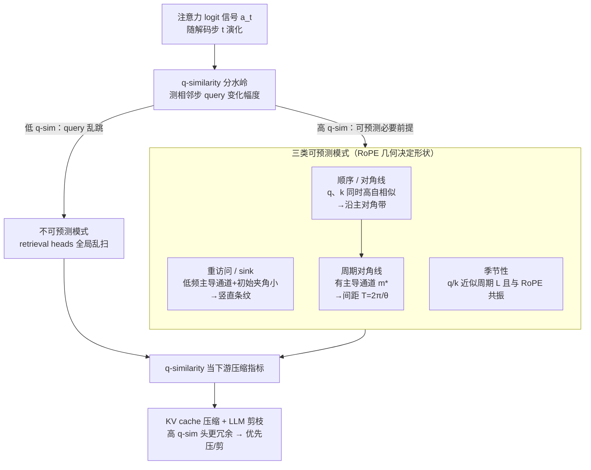

# Why Attention Patterns Exist: A Unifying Temporal Perspective Analysis

**会议**: ICLR 2026  
**arXiv**: [2601.21709](https://arxiv.org/abs/2601.21709)  
**代码**: [GitHub](https://github.com/MIRALab-USTC/LLM-TAPPA)  
**领域**: 模型压缩 / 注意力机制分析 / LLM 推理加速  
**关键词**: attention patterns, temporal analysis, RoPE, query self-similarity, KV cache compression, LLM pruning

## 一句话总结

本文提出 TAPPA 框架，从时间连续性视角统一解释了 LLM 中多种注意力模式（attention sink、对角线、周期性等）的形成机制，并通过 query 自相似性（q-similarity）指标指导 KV cache 压缩和模型剪枝任务。

## 研究背景与动机

LLM 中的注意力头呈现多种结构化模式：
- **Attention sinks**：首个 token 获得异常高注意力
- **对角线模式**：关注相邻 token
- **检索头（Retrieval heads）**：全局扫描上下文
- **周期性模式**：周期性重复关注

先前研究通常只分析单个模式，缺乏统一解释。关键问题：**在相同的注意力公式下，是什么因素决定了不同头采用不同的注意力模式？**

## 方法详解

### 整体框架

TAPPA（Temporal Attention Pattern Predictability Analysis，时间注意力模式可预测性分析）把"注意力模式从何而来"翻译成一个时间序列问题：在自回归解码中，把第 $t$ 步对某个位置的注意力 logit $a_t$ 看成随解码步 $t$ 演化的信号，一个头的注意力是否"结构化"，就取决于这个信号沿时间方向是否连续。沿这条主线，TAPPA 先把所有头切成两类——**可预测模式**（高分位置随 $t$ 平滑漂移、可外推）与**不可预测模式**（跨步乱跳、缺乏时间一致性，典型是检索头 retrieval heads）；再在可预测这一支里，用 query/key 的自相似性与 RoPE 的旋转几何，逐一推出它具体长成哪种形状（重访问 / attention sink、顺序对角线、周期对角线、季节性）。决定一切的核心变量只有一个：**query 自相似性（q-similarity）**，即相邻解码步 query 的相似度。最后，这个理论里冒出来的判据 q-similarity 被原样拿去当下游压缩的决策指标，在 KV cache 压缩和模型剪枝上验证理论确实有用。

### 关键设计

**1. q-similarity：把"随机 vs 结构化"压成一个可度量的分水岭**

要解释为什么有的头杂乱无章、有的头却规整可预测，先得有个能算的判据。Proposition 4.1 给出下界：若相邻步 query 差异 $\|q_{t+1}-q_t\|$ 较大、且与旋转后的 key 不正交，则注意力 logit 的逐位差异必然被顶起来，$\|a_{t+1}-a_t\|_\infty \geq c_1\|q_{t+1}-q_t\| - c_2$。也就是说 query 变化剧烈（低 q-similarity）时注意力一定随机跳变、形不成稳定模式（retrieval heads 即此类）；反过来，**高 q-similarity 是任何可预测模式出现的必要前提**。这一条把后面所有结构化模式收进同一个充分条件之下，也正是它让 q-similarity 后来能当一个轻量下游指标——只需统计相邻步 query 的相似度，不需训练或复杂打分。

**2. 同一套 q-similarity + RoPE 条件，推出三类可预测模式的几何形状**

光知道"高 q-similarity 才可预测"还不够，得说清可预测的头具体长什么样、间距由谁定。TAPPA 在可预测这一支里给出一组充分条件，把同一套变量（query/key 自相似性 + RoPE 旋转）拧出三类形状：

- **重访问 / attention sink**（定理 5.1，垂直稳定性）：query 高度自相似、且该头有一个主导的**低频 RoPE 通道**时，注意力 logit 沿时间几乎不变，$|a_{t+1,i}-a_{t,i}|$ 被压得很小。几何根源是 query 与 key $k_i$ 的夹角 $\phi_{t,i}^{(m)}$ 很小、旋转后余弦项接近 1 且随 $t$ 缓慢漂移，于是同一位置 $i$ 连续多步都拿高分，形成竖直"重访问"条纹，即 sink。
- **顺序 / 对角线**（定理 5.2）：query 与 key **同时**高自相似（$\|q_{t+1}-q_t\|\leq\varepsilon$、$\|k_{i+1}-k_i\|\leq\varepsilon$）时，沿对角线同步位移的 logit 几乎相等，$|a_{t+1,i+1}-a_{t,i}|\leq C\varepsilon$。因为 RoPE 只编码相对位置，query、key 一起平移一格相对角度不变，交互被原样保留，注意力沿主对角线拉成一条稳定带。
- **周期对角线**（定理 5.3，顺序模式的细化）：当存在主导通道 $m^\star$ 时，对角线不止一条、而是以固定周期重复，间距 $T=\frac{2\pi}{\theta_{m^\star}}=2\pi c^{2m^\star/d}$（$c$ 为 RoPE base）。这个闭式给出可直接验证的预言：把主导通道挪到低索引（高频）位置就该看到周期对角线浮现、调小 base $c$ 间距就该缩短——后续实验正是用这两个旋钮把现象逐一对上。
- **季节性**（定理 5.4，比对角线更松）：query/key 近似以周期 $L$ 重复、且 $L$ 与主导 RoPE 频率共振时，相隔 $L$ 步的 logit 仍接近，$|a_{t+L,i}-a_{t,i}|\leq C_1(\varepsilon_q+\varepsilon_k)+C_2\delta$，把"每隔 $L$ 步回到相似分布"落成由周期误差 $\varepsilon_q,\varepsilon_k$ 与共振失配 $\delta$ 控制的可量化偏差。

四类共享同一推理骨架——**高自相似保证时间连续、RoPE 频率结构决定具体几何**，这正是 TAPPA 能"统一"解释、而非逐个现象贴标签的关键。

**3. q-similarity 直接当下游压缩的决策指标**

既然 q-similarity 决定一个头是否可预测、注意力是否跨步稳定，它就天然适合当头级的冗余度指标。高 q-similarity 的头注意力跨步稳定、信息冗余多，于是可以更激进地压缩其 KV cache、或在剪枝时优先当冗余头移除；低 q-similarity 的头则多留预算。整套用法不需额外训练或复杂打分，只统计相邻步 query 相似度，这也是 KV cache 压缩与剪枝实验里一个简单指标就能稳定超基线的原因。

## 实验

### KV Cache 压缩（LongBench）

| 方法 | Budget=512 | 平均分 |
|------|-----------|--------|
| StreamingLLM | — | 41.75 |
| H2O | — | 44.39 |
| SnapKV | — | 46.92 |
| CAKE | — | 47.19 |
| **TAPPA** | — | **47.55** |
| Full cache | — | 49.06 |

TAPPA 基于 q-similarity 的简单指标一致优于所有基线方法。

### LLM 剪枝

在 Llama-3.1-8B 和 Qwen-2.5-7B 上：
- q-similarity 指导的剪枝优于无指导的均匀剪枝
- 高 q-similarity 头被修剪后对性能影响更小

### 理论验证实验

1. **主导通道重定位**：将 Qwen2.5 中索引 124 的主导通道移至索引 2/3/5，成功产生了理论预测的周期性对角线
2. **RoPE base 调整**：$c = 1,000,000 \to 100,000$ 使对角线间距缩短，与 $T = 2\pi / \theta_{m^\star}$ 的理论预测一致
3. **q-similarity 分布**：跨层、头、模型和数据集分析验证了高/低连续性头的普遍存在

### 关键发现

1. q-similarity 是区分可预测/不可预测注意力模式的关键因素
2. Re-access 模式需要高 q-similarity + 低频 RoPE 主导通道
3. Sequential 模式需要高 q-similarity + 高 k-similarity
4. 周期性对角线间距由主导 RoPE 通道频率决定
5. q-similarity 作为下游任务的指标简单而有效

## 亮点

- 首次从时间连续性视角统一解释多种注意力模式
- 四个定理提供了严格的数学分析
- q-similarity 指标极其简单但一致有效
- 通过控制实验（重定位通道/调整 RoPE base）精确验证理论

## 局限性

- 理论分析假设 query/key 自相似性可度量，但在实际中这些量随上下文变化
- 对不可预测模式（如 retrieval heads）的分析相对较少
- 季节性模式需要 RoPE 共振条件，实际中的适用范围可能有限
- 下游任务改进虽然一致但幅度较小（~0.5-1 个点）

## 相关工作

- **Attention Patterns**：Xiao et al. (2023) 的 attention sink；Wu et al. (2024) 的 retrieval heads
- **RoPE 分析**：Barbero et al. (2025) 将对角线归因于高频 RoPE 成分
- **KV Cache 压缩**：H2O、SnapKV、PyramidKV、MInference
- **输入动态性**：AttentionPredictor (Yang et al., 2025)；Lee et al. (2024)

## 评分

- 新颖性：⭐⭐⭐⭐⭐ — 统一理论框架是重要贡献
- 理论深度：⭐⭐⭐⭐⭐ — 四个定理严格推导
- 实验充分性：⭐⭐⭐⭐ — 理论验证精彩，下游任务略简单
- 实用价值：⭐⭐⭐⭐ — q-similarity 简单实用
- 写作质量：⭐⭐⭐⭐⭐ — 清晰优雅，可视化出色

<!-- RELATED:START -->

## 相关论文

- [\[ICLR 2026\] AgilePruner: An Empirical Study of Attention and Diversity for Adaptive Visual Token Pruning in LVLMs](agilepruner_an_empirical_study_of_attention_and_diversity_for_adaptive_visual_to.md)
- [\[ICCV 2025\] Representation Shift: Unifying Token Compression with FlashAttention](../../ICCV2025/model_compression/representation_shift_unifying_token_compression_with_flashattention.md)
- [\[ICLR 2026\] Enhancing Multivariate Time Series Forecasting with Global Temporal Retrieval](enhancing_multivariate_time_series_forecasting_with_global_temporal_retrieval.md)
- [\[ICLR 2026\] TurboBoA: Faster and Exact Attention-aware Quantization without Backpropagation](turboboa_faster_and_exact_attention-aware_quantization_without_backpropagation.md)
- [\[ICLR 2026\] FASA: Frequency-Aware Sparse Attention](fasa_frequency-aware_sparse_attention.md)

<!-- RELATED:END -->
