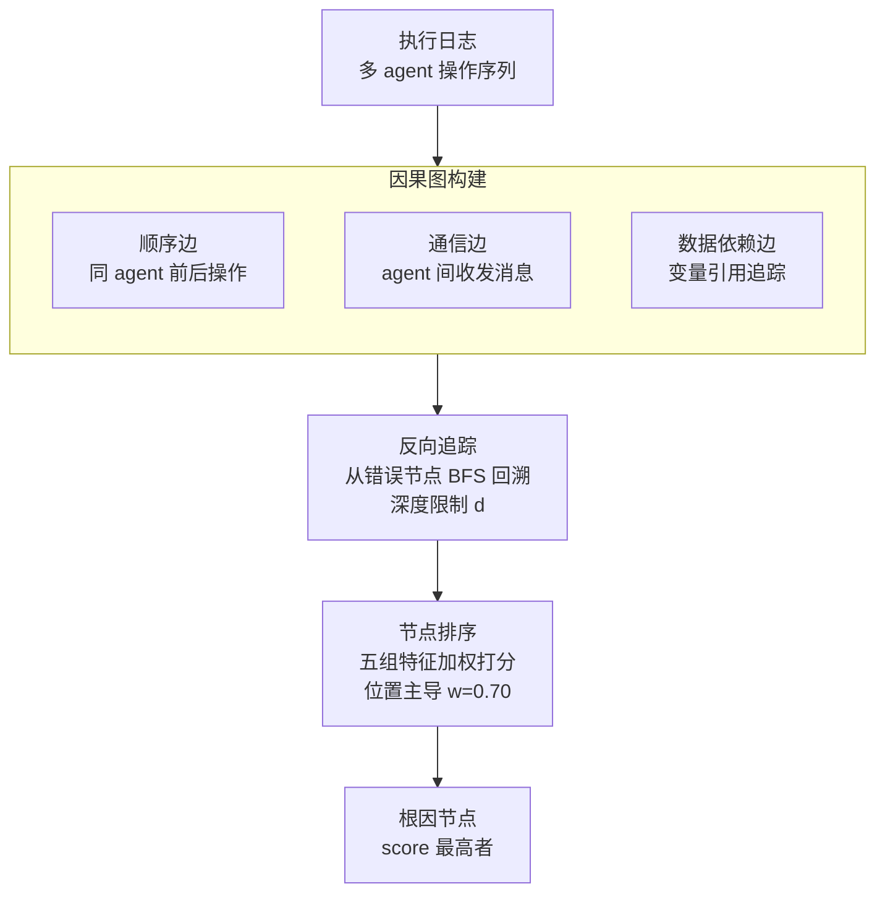

# AgentTrace: Causal Graph Tracing for Root Cause Analysis in Deployed Multi-Agent Systems

**会议**: ICLR 2026  
**arXiv**: [2603.14688](https://arxiv.org/abs/2603.14688)  
**代码**: [https://github.com/zwang000/AgentTrace](https://github.com/zwang000/AgentTrace)  
**领域**: 因果推理  
**关键词**: 多智能体调试, 因果图追踪, 根因分析, 执行日志分析, 位置特征  

## 一句话总结
提出AgentTrace框架，从多智能体系统的执行日志中构建因果图，通过反向追踪+轻量级特征排序（五组特征的加权线性组合）定位根因节点，在550个合成故障场景上Hit@1达94.9%，延迟0.12秒，比LLM分析快69倍。

## 研究背景与动机

**领域现状**：基于LLM的多智能体系统（AutoGen、MetaGPT等）日益被部署到客户支持、DevOps、研究助手等场景，但故障诊断极其困难——错误在多个agent间级联传播，表现点远离根因点。

**现有痛点**：(a) 传统调试方法逐组件检查，无法捕获跨agent因果依赖；(b) 人工检查长执行trace慢且不可靠；(c) LLM-based调试方法需要昂贵推理且对跨agent问题效果有限。

**核心矛盾**：多智能体工作流的分布式和涌现性使得故障根因极难定位——需要理解agent间的信息流和因果关系。

**本文目标**：设计一个轻量级、不依赖LLM推理的后验故障诊断框架，能从执行日志中快速定位根因。

**切入角度**：借鉴分布式系统Tracing（如Jaeger/Zipkin）思想，但适配LLM多智能体场景——将agent操作建模为因果图节点，信息流为边。

**核心 idea**：从日志重建因果图 → 从错误节点反向追踪 → 用可解释的结构和位置特征排序候选根因。

## 方法详解

### 整体框架
AgentTrace要解决的是部署后的多智能体系统出故障时"症状点远离根因点"的诊断难题。它把整条执行日志当成一张因果图来处理：先从日志里重建出一张有向无环图（DAG），节点是 agent 的每一步操作、边是操作之间的信息流；然后从报错的那个节点沿因果边反向走，把可能的祖先节点圈成候选集；最后用一组结构化和位置特征给候选打分排序，排第一的就是根因猜测。整条流水线不调用任何 LLM 推理，全是图遍历加线性加权打分，平均 0.12 秒就能跑完一次诊断，CPU 级别的开销让它能直接嵌进交互式调试流程。

### 关键设计

**1. 因果图构建：把异构日志还原成可追溯的因果结构**

多智能体的故障之所以难定位，是因为错误在 agent 之间级联传播、信息流又散落在日志各处。这一步的任务就是把这些隐式的依赖显式化为三类因果边：**顺序边**连接同一个 agent 内前后相继的操作，刻画它自己的推理流；**通信边**连接 agent 间的消息发送与接收事件，刻画跨 agent 的协作；**数据依赖边**则通过追踪变量引用，识别"谁生产、谁消费"的数据流关系。这三类边覆盖了多智能体工作流里的主要信息传递模式，拼起来的 DAG 完整表达了操作之间的因果结构，后续的追踪和排序都建立在这张图上。

**2. 反向追踪：从症状沿因果链回溯，把搜索空间收到相关子图**

根因必然是报错节点的因果祖先，而不是图里随便哪个节点，所以没必要在全图上找。这一步从错误节点 $v_{\text{error}}$ 出发做标准 BFS 反向遍历，沿因果边逆流而上收集祖先节点作为候选集，复杂度只有 $O(|V|+|E|)$。遍历带一个深度限制参数 $d$ 来控制回溯范围，避免在长 trace 上把过远的、几乎不可能相关的节点也拉进来。经过这一步，候选集就从"全部节点"缩成了"错误的因果上游子图"，给后面的排序减负。

**3. 节点排序：用五组可解释特征的加权线性组合定位根因**

候选集里仍有多个节点，需要打分挑出最可疑的那个。AgentTrace 不靠 LLM 理解，而是对每个候选节点 $v$ 算一个线性加权得分：

$$\text{score}(v) = \sum_{i} w_i \cdot F_i(v)$$

五组特征各管一个侧面：**位置特征**（$w_p=0.70$）看归一化位置、到错误节点的距离、trace 深度；**结构特征**（$w_s=0.20$）看出度、betweenness 中心性、扇出比例；**内容特征**（$w_c=0.05$）看错误关键词、不确定性标记、内容长度；**流程特征**（$w_f=0.03$）看是否发生跨 agent 通信、角色关键度；**置信度特征**（$w_e=0.02$）看显式置信度分数和 hedging 语言。位置特征拿到压倒性的 0.70 权重，是因为在层级化的多智能体工作流里，早期的规划/路由决策对下游有不成比例的影响——一个上游错误会沿因果链级联放大，所以越靠前、越接近错误源头的节点越可疑。这套权重不是拍脑袋定的，而是在 50 个验证场景上做 grid search 调出来的。

## 实验关键数据

### 主实验
在550个合成故障场景（10个领域）上评估：

| 方法 | Hit@1 | Hit@3 | MRR |
|------|-------|-------|-----|
| Random | 9.1% | 27.3% | 0.18 |
| First Node | 3.6% | 10.9% | 0.07 |
| Last Node | 12.7% | 38.2% | 0.25 |
| LLM Analysis (GPT-4) | 68.5% | 81.4% | 0.74 |
| **AgentTrace** | **94.9%** | **98.4%** | **0.97** |

McNemar检验证实AgentTrace显著优于所有基线（p<0.001），与LLM Analysis的Cohen's h=0.77（大效应量）。

### 消融实验

| 特征组 | 单独使用Hit@1 |
|-------|-------------|
| Position only | 87.3% |
| Structure only | 34.5% |
| Content only | 28.7% |
| Flow only | 15.2% |
| Confidence only | 12.1% |
| All features | **94.9%** |

### 关键发现
- Position特征独挑大梁（87.3%），说明在层级化工作流中"早期错误→晚期症状"是高度一致的模式
- Structure特征补充了7.6%的额外准确率（87.3%→94.9%），说明拓扑信息有独立价值
- Content/Flow/Confidence特征单独效果有限但组合后边际贡献正向
- AgentTrace延迟0.12s vs LLM Analysis 8.3s（69x加速），真正适合生产环境
- 跨领域性能一致（Technical 96.4%, Knowledge 96.5%, Planning 91.3%）

## 亮点与洞察
- **实用主义设计**：用简单的加权线性特征组合替代LLM推理，Hit@1从GPT-4的68.5%提升到94.9%——在这个具体任务上，结构化特征比LLM理解更有效
- **位置特征的深层含义**：作者正确指出这不仅是benchmark artifact——在层级化多智能体系统中，上游决策约束下游空间是结构性的因果属性。这个发现对agent系统设计也有启示：应该在早期决策节点增加验证
- 将分布式系统Tracing概念迁移到LLM agent领域的思路很有启发

## 局限与展望
- **合成benchmark局限**：所有550个场景都是人工注入单一根因的合成数据，真实multiagent故障通常有多个交织的根因
- **位置特征的过度依赖**：0.70的权重在真实场景中可能过高——如果根因不总是在早期出现呢？
- 假设执行日志完整准确，生产环境可能存在日志丢失/不完整
- 场景规模较小（每个trace 8-15个动作），大规模agent工作流（数百步）的效果未知
- 缺乏在真实生产系统上的验证——所有结果基于合成基准
- 单作者论文，benchmark设计可能存在偏见

## 相关工作与启发
- **vs LLM Self-Debug (Chen et al. 2024)**: LLM-based方法需要昂贵推理且对跨agent问题效果差（Hit@1仅68.5%）；AgentTrace无LLM推理但依赖日志结构
- **vs Jaeger/Zipkin**: 分布式tracing工具处理RPC级别的请求元数据；AgentTrace处理包含语义内容的agent消息
- **vs Traditional RCA**: 传统方法用统计或PageRank，AgentTrace用针对agent工作流设计的领域特征

## 评分
- 新颖性: ⭐⭐⭐ 方法本身较简单（BFS+线性特征组合），创新在于问题定义和跨领域思路迁移
- 实验充分度: ⭐⭐⭐ 消融完整但全部是合成数据，缺乏真实系统验证
- 写作质量: ⭐⭐⭐⭐ 简洁清晰，问题动机和方法描述到位
- 价值: ⭐⭐⭐⭐ 定义了一个重要的新问题（multiagent RCA），提供了实用的baseline方案

<!-- RELATED:START -->

## 相关论文

- [\[AAAI 2026\] A Graph-Theoretical Perspective on Law Design for Multiagent Systems](../../AAAI2026/multi_agent/a_graph-theoretical_perspective_on_law_design_for_multiagent_systems.md)
- [\[ACL 2026\] MASFactory: A Graph-centric Framework for Orchestrating LLM-Based Multi-Agent Systems with Vibe Graphing](../../ACL2026/multi_agent/masfactory_a_graph-centric_framework_for_orchestrating_llm-based_multi-agent_sys.md)
- [\[AAAI 2026\] COACH: Collaborative Agents for Contextual Highlighting -- A Multi-Agent Framework for Sports Video Analysis](../../AAAI2026/multi_agent/coach_collaborative_agents_for_contextual_highlighting_--_a_multi-agent_framewor.md)
- [\[AAAI 2026\] Scalable and Accurate Graph Reasoning with LLM-Based Multi-Agents](../../AAAI2026/multi_agent/scalable_and_accurate_graph_reasoning_with_llm-based_multi-agents.md)
- [\[ICLR 2026\] Stochastic Self-Organization in Multi-Agent Systems](stochastic_self-organization_in_multi-agent_systems.md)

<!-- RELATED:END -->
