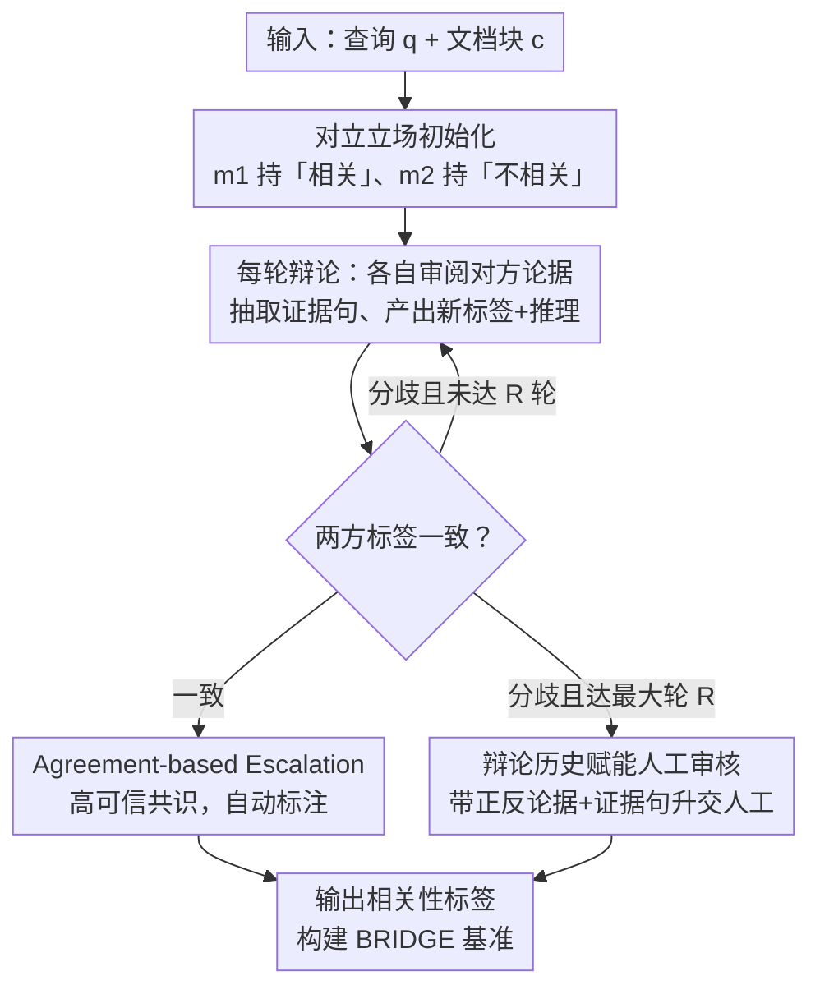

# Completing Missing Annotation: Multi-Agent Debate for Accurate and Scalable Relevance Assessment

**会议**: ICLR 2026  
**arXiv**: [2602.06526](https://arxiv.org/abs/2602.06526)  
**代码**: [GitHub](https://github.com/DISL-Lab/DREAM-ICLR-26)  
**领域**: 其他  
**关键词**: 信息检索评测, 多Agent辩论, 相关性标注, 人机协作, BRIDGE基准

## 一句话总结

提出DREAM——基于对立立场初始化的多Agent多轮辩论框架用于IR相关性标注：一致时自动标注、分歧时交给人工(含辩论历史辅助)。达到95.2% balanced accuracy且仅3.5%需人工介入，据此构建BRIDGE基准数据集，发现29,824个原有基准缺失的相关标注(原标注的428%)，修正了检索系统排名偏差和RAG中检索-生成性能不匹配问题。

## 研究背景与动机

**领域现状**：信息检索(IR)评测严重依赖人工标注的query-chunk相关性判断。然而由于标注成本高昂，实际中仅能标注少量文档，导致大量未标注的相关文档——所谓"holes"——被默认为不相关。这些holes使评测结果产生系统性偏差，某些检索器因恰好检索到未被标注的相关文档而被低估。

**现有痛点**：

1. **全自动LLM标注的过度自信**：LLMJudge(单Agent)的balanced accuracy仅73.9%，主要在不相关类的召回率上严重不足(50.2%)——过度倾向于判定"相关"
2. **基于置信度的人机混合方法效率低**：LARA等方法使用LLM token概率进行不确定性估计，但校准不良——需要50%的人工介入才能匹配DREAM 3.5%介入下的准确率
3. **Holes的级联影响**：IR基准中的holes不仅扭曲检索系统排名，还导致RAG评测中检索-生成性能不匹配——强检索被误认为差检索，生成的好结果被错误归因于模型内部知识
4. **单Agent判断的本质局限**：无论置信度校准多精细，单一模型视角无法克服系统性偏差

**核心矛盾**：需要高准确率+低人工成本的标注方法。全自动则不够准确(73.9%)，confidence-based混合方法的校准不可靠且仍需大量人工。

**本文方案**：用多Agent辩论取代单Agent判断。两个Agent以对立立场初始化→多轮互相批评→一致=高可信自动标注(信号比单模型置信度更可靠)→分歧=升交人工(带辩论历史辅助)。

## 方法详解

### 整体框架

DREAM把单Agent的"一锤定音"换成两个对立Agent的多轮辩论：Agent $m_1$ 被赋予"相关"立场 $s_1$、$m_2$ 被赋予"不相关"立场 $s_2$，每轮各自审阅对方论据、抽取证据句、再产出新的标签与推理；只要某一轮两方标签相同就视为高可信共识自动标注，若辩到最大轮数仍分歧则连同辩论历史升交人工。判定逻辑可写成

$$\text{DREAM}(q,c) = \begin{cases} y_1^j, & \exists j \leq R \text{ s.t. } y_1^j = y_2^j \\ \text{Human}(q, c, h^R), & \text{otherwise} \end{cases}$$

其中 $R$ 为最大辩论轮数(默认 2)、$h^R$ 为最终轮辩论历史。

### 关键设计

**1. 对立立场初始化：用强制冲突逼出过早共识背后的错误**

单Agent乃至中性初始化的多Agent都吃LLM"倾向判相关"的过度自信亏——两方若都从中立出发，往往迅速但错误地达成一致。DREAM 反其道把 $m_1$、$m_2$ 钉死在"相关"与"不相关"两端，迫使每个Agent深挖支撑自己立场的证据、同时主动质疑对方，把原本会被掩盖的冲突证据摆到台面上，确保两种可能性都被充分论证后才收敛。消融显示立场分配顺序不影响结果，说明收益来自冲突本身而非某一侧的先手优势。

**2. Agreement-based Escalation：用"两方是否一致"取代"单模型置信度"做升交信号**

LARA 这类方法靠 LLM 的 token 概率估不确定性，但这种置信度校准本质不可靠，要把准确率做上去就得放行大量人工——3.5% 升交时 bAcc 仅 82.1%。DREAM 改用多Agent的一致性作为质量信号：一致即自动标注、分歧即升交，既不需要拿人工数据训练校准模型，也不需要手动调 escalation 阈值。在同样 3.5% 的人工介入下，这一信号把 bAcc 直接拉到 95.2%，验证了"agreement 比 confidence 更可信"这一核心假设。

**3. 辩论历史赋能人工审核：让升交不是"AI 放弃后从头来"，而是带着正反论证交接**

升交人工的案例往往正是最难的边界样本，若让标注者从原始文档重新读起，质量和一致性都难保证。DREAM 把双方Agent的论据、抽取的证据句和完整推理一并交给人工，标注者直接审阅结构化的正反交锋即可裁决。实验中，有辩论历史辅助的人工标注 bAcc 从 87.3% 升到 92.0%、标注一致性 Fleiss κ 从 0.50 升到 0.62——辩论历史既帮Agent在两轮内高效收敛，又成了人工环节的杠杆，实现真正的 AI-Human 协同。

## 实验关键数据

### 主实验：标注准确率与escalation率

| 方法 | 不相关召回率 | 相关召回率 | bAcc | Escalation率 |
|------|-----------|----------|------|-------------|
| LLMJudge | 50.2% | 97.5% | 73.9% | 0.0% |
| LARA (3.5%) | 74.5% | 89.6% | 82.1% | 3.5% |
| LARA (12.5%) | 76.1% | 91.6% | 83.9% | 12.5% |
| LARA (50%) | 94.1% | 98.4% | 96.3% | 50.0% |
| Human-Only (MTurk) | 89.9% | 97.8% | 93.8% | 100.0% |
| **DREAM** | **91.9%** | **98.4%** | **95.2%** | **3.5%** |

DREAM用3.5%的人工介入达到95.2% bAcc，超过Human-Only的93.8%。LARA需要50%人工介入才接近这一水平。

### 消融实验：辩论轮数与裁决策略

| 设置 | 裁决者 | 不相关召回率 | 相关召回率 | bAcc |
|------|-------|-----------|----------|------|
| DREAM (R=1) | LLM | 82.9% | 97.2% | 90.0% |
| DREAM (R=2) | LLM | 90.0% | 96.7% | 93.3% |
| DREAM (R=3) | LLM | 90.8% | 95.7% | 93.2% |
| **DREAM (R=2)** | **Human** | **91.8%** | **98.4%** | **95.1%** |

两轮辩论即饱和(R=3无额外收益)。人工裁决(95.1%)显著优于LLM裁决(93.3%)，验证了AI-Human协同策略。

### BRIDGE基准构建

| 指标 | 数值 |
|------|------|
| 总标注量 | 116,622 |
| 自动标注(Agent一致) | 112,566 (96.5%) |
| 人工标注(Agent分歧) | 4,056 (3.5%) |
| 发现的缺失相关chunk(holes) | **29,824** |
| 原始标注的gold chunk数 | 6,976 |
| holes占原标注比例 | **428%** |
| 人工标注成本 | ~$506 |
| 比Human-Only便宜 | 200倍 |
| 比Human-Only快 | 3.5-7倍 |

### Holes的影响：检索系统重排名

| 指标 | 原始基准 | BRIDGE | 变化 |
|------|---------|--------|------|
| 平均Hole@10 | 17.1% | 修正 | 消除 |
| 系统排名变化 | - | 20/25系统排名改变 | 显著 |
| RAGAlign@10(平均) | 0.70 | **0.84** | +0.14 |
| RAGAlign Pearson相关 | - | **0.985** | 高度对齐 |

修正holes后，检索-生成对齐度(RAGAlign)从0.70提升至0.84，Pearson相关达0.985。这证明此前IR评测中的检索-生成不匹配部分源于检索指标的系统性低估。

## 亮点与洞察

- **Agreement > Confidence的核心洞察**：多Agent一致性是比单模型置信度更可靠的质量信号——LARA需14倍的人工量才能匹配DREAM的准确率，根本原因是LLM的置信度校准本质不可靠
- **辩论历史的双重价值**：不仅帮助Agent在2轮内高效收敛，更作为辅助资源将人工标注质量从87.3%提升至92.0%——实现了真正的AI-Human协同而非简单的"AI做不了就让人做"
- **29,824个holes的震撼性**：原始基准仅有6,976个gold标注，DREAM发现的缺失标注是原有的428%——这意味着主流IR基准的评测结果存在系统性偏差
- **检索-生成不匹配的新解释**：此前归因于"外部知识与内部知识冲突"，本文揭示另一被忽视的原因——检索性能本身被低估了

## 局限性

- Agent数量增加反而降低准确率(更难在relevant cases上达成一致)
- 评测集700对的规模相对有限
- 依赖Llama3.3-70B，更换模型可能需重新验证
- 对极度模糊的边界案例，辩论可能也无法解决

## 评分

- 新颖性: ⭐⭐⭐⭐ 多Agent辩论+agreement-based escalation的组合
- 实验充分度: ⭐⭐⭐⭐⭐ 全面消融+BRIDGE构建+检索重排+RAG对齐分析
- 写作质量: ⭐⭐⭐⭐⭐ 结构清晰，问题定义和方法动机层层递进
- 价值: ⭐⭐⭐⭐⭐ IR评测方法论的重要进步+BRIDGE基准的实际影响

<!-- RELATED:START -->

## 相关论文

- [\[AAAI 2026\] Scalable and Accurate Graph Reasoning with LLM-Based Multi-Agents](../../AAAI2026/multi_agent/scalable_and_accurate_graph_reasoning_with_llm-based_multi-agents.md)
- [\[AAAI 2026\] iMAD: Intelligent Multi-Agent Debate for Efficient and Accurate LLM Inference](../../AAAI2026/multi_agent/imad_intelligent_multi-agent_debate_for_efficient_and_accura.md)
- [\[NeurIPS 2025\] 3D-Agent: Tri-Modal Multi-Agent Collaboration for Scalable 3D Object Annotation](../../NeurIPS2025/multi_agent/3d-agenttri-modal_multi-agent_collaboration_for_scalable_3d_object_annotation.md)
- [\[ACL 2026\] HACHIMI: Scalable and Controllable Student Persona Generation via Orchestrated Agents](../../ACL2026/multi_agent/hachimi_scalable_and_controllable_student_persona_generation_via_orchestrated_ag.md)
- [\[ACL 2025\] Voting or Consensus? Decision-Making in Multi-Agent Debate](../../ACL2025/multi_agent/voting_or_consensus_decision-making_in_multi-agent_debate.md)

<!-- RELATED:END -->
