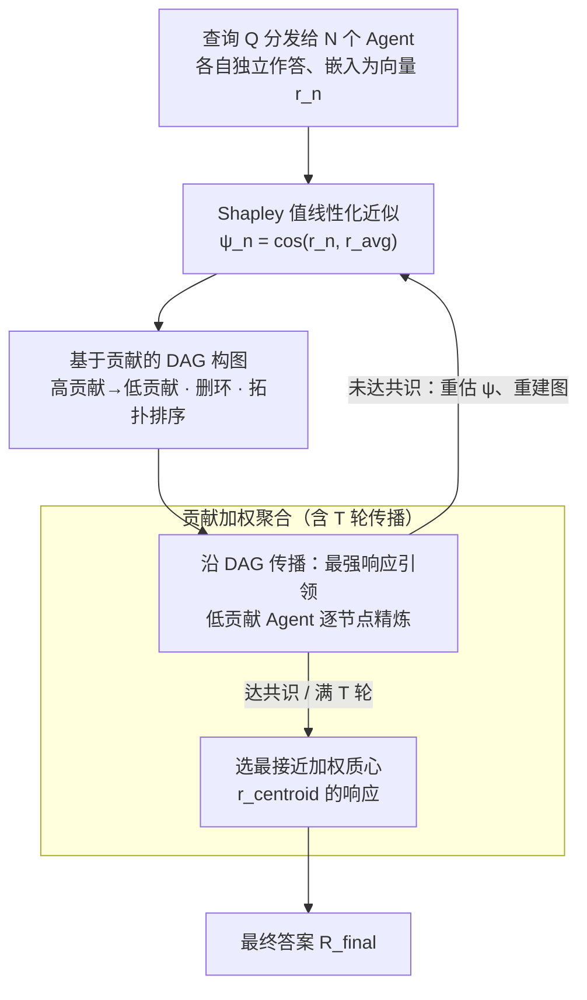

# Stochastic Self-Organization in Multi-Agent Systems

**会议**: ICLR 2026  
**arXiv**: [2510.00685](https://arxiv.org/abs/2510.00685)  
**代码**: 待确认  
**领域**: LLM预训练  
**关键词**: multi-agent systems, self-organization, Shapley value, communication graph, DAG, LLM collaboration

## 一句话总结

提出 SelfOrg 框架，基于 Agent 响应的语义相似度和 Shapley 值贡献估计，动态构建有向无环通讯图（DAG），实现多 Agent 系统的自组织协作。在弱模型场景下优势尤为显著。

## 研究背景与动机

基于 LLM 的多 Agent 系统（MAS）理论上能解决单个 LLM 无法处理的任务，但协作效果高度依赖通讯拓扑结构。现有方法的核心问题：

**固定拓扑**（链、树、全连接图）：无法适应不同任务和实例

**可优化拓扑**（GPTSwarm、AgentPrune）：需要策略梯度或掩码训练，开销大

**外部 LLM 裁判**（DyLAN）：引入额外 LLM 评估开销

**预训练图生成器**（G-Designer、MAS-GPT）：需要额外训练

本文的关键洞察是：由于 LLM 本质上是随机的，同一个 Agent 对同一问题的不同运行可能产生完全不同的答案。因此，**通讯结构应该基于当前响应状态动态决定**，而不是基于任务类型或问题本身。特别是在弱模型场景下，编排系统的价值在于放大稀少的正确响应并抑制噪声。

## 方法详解

### 整体框架

SelfOrg 让每个 Agent 先独立给出答案，再把这些答案投影到嵌入空间，按各自对群体共识的贡献排出高低、连成一张有向无环通讯图（DAG），让高贡献 Agent 处于信息上游引导低贡献 Agent。经过若干轮传播后，系统选出最贴近"贡献加权质心"的那个响应作为最终输出。整个过程没有外部 LLM 裁判、没有预训练图生成器、也没有强化学习，所有计算都发生在推理时。下图把这条推理时流水线串起来：贡献估计 → DAG 构图 → 多轮传播与加权聚合，其中传播每轮结束都会重估贡献、重建图，直到达成共识或跑满 $T$ 轮。

### 关键设计

**1. Shapley 值线性化近似：把贡献估计从指数复杂度降到线性**

要判断哪个 Agent 更值得信任，自然想到用合作博弈里的 Shapley 值衡量每个 Agent 对集体的边际贡献，但精确计算需要遍历 $2^N$ 个子集、对 LLM 系统完全不可行。SelfOrg 的做法是观察到：贡献大的 Agent，其响应往往落在群体响应的"主流"方向上。于是用轻量嵌入模型 $f$（如 6 层的 all-MiniLM-L6）把每个响应映射成向量 $\mathbf{r}_n = f(\mathcal{R}_n)$，并直接用该向量与平均嵌入 $\mathbf{r}_{\text{avg}}$ 的余弦相似度作为贡献代理 $\psi_n$：$\phi_n \approx \psi_n := \cos(\mathbf{r}_n, \mathbf{r}_{\text{avg}})$。这样只需一次嵌入和一次平均，复杂度从指数级降到线性。Theorem 1 给出了这个近似的可靠性：当各响应嵌入范数相等、两两内积有下界时，近似误差被 $I\Gamma^2$ 上界控制；Corollary 1 进一步说明只要两个 Agent 的真实贡献差距够大，余弦相似度给出的排序就不会翻转——这正是后续构图所依赖的稳定性。

**2. 基于贡献的 DAG 构图：让信息从强 Agent 流向弱 Agent**

有了贡献值还需要决定谁影响谁。SelfOrg 在两个 Agent 之间架设有向边 $e_{m\to n}$ 的条件是两者响应足够相似且 $m$ 的贡献更高，即 $\cos(\mathbf{r}_n, \mathbf{r}_m) \geq \tau$ 且 $\psi_m > \psi_n$，从而保证信息只从高贡献流向低贡献。相似度阈值 $\tau$ 过滤掉语义无关的连边，避免噪声相互污染。由于贡献值偶有并列可能引入回路，构图时会检测环并删除"环中最弱 Agent 指向最强 Agent"的那条边把它打散，再按贡献值做拓扑排序、用贡献高低打破平局，最终得到一张严格的 DAG。这一规则把"谁该听谁的"这个抽象问题，转化成了由响应状态即时决定的确定性结构。

**3. 贡献加权聚合：放大稀少的正确答案、抑制分散的噪声**

沿 DAG 传播时，最强响应先初始化下一轮、低贡献 Agent 顺着边逐节点参考上游响应来精炼自己的答案；每轮结束都会重估贡献、重建图，如此迭代直到达成共识或跑满 $T$ 轮（实践中两轮通常足够：第一轮探索、第二轮巩固）。传播收束后，系统不是简单投票，而是计算一个贡献加权质心 $\mathbf{r}_{\text{centroid}}^{(T)} = \frac{\sum_{n=1}^N \psi_n^{(T)} \mathbf{r}_n^{(T)}}{\sum_{n=1}^N \psi_n^{(T)}}$，再选出最接近质心的真实响应 $n_\star = \arg\max_{n} \cos(\mathbf{r}_n^{(T)}, \mathbf{r}_{\text{centroid}}^{(T)})$ 作为输出（注意最终答案是从已有响应里挑一个，而非重新生成）。用加权质心而非均值，意味着高贡献 Agent 在最终决策中权重更大，少数正确响应得以被放大，而四散的错误响应彼此抵消、影响被削弱——这正是弱模型场景下编排系统的核心价值所在。

**4. 正确性放大的概率保证：解释方法为何在弱模型上反而更有效**

上述设计能成立，依赖于一个经验观察并被两条引理形式化：正确答案在多次随机运行中会反复落在同一处，而错误答案各式各样、高度分散。Lemma 1（一致性集中）指出，两个独立 Agent 都答对的概率 $\Pr[X_c]=p^2$ 大于它们在任意错误答案上巧合一致的概率之和 $\sum_k p_k^2$，前提就是错误足够分散（实验里 100 次运行下正确答案反复出现、错误答案星散，验证了这一点）。Lemma 2（贡献主导）在"正确答案嵌入紧密聚类、错误答案嵌入分散"的假设（Assumption 1）下进一步证明：正确 Agent 的贡献值 $\psi$ 严格高于错误 Agent。两者合起来说明，余弦贡献排序天然把正确响应推到 DAG 上游，因此 SelfOrg 在正确率本就稀少的弱模型上能稳定地把那一点点正确信号放大出来。

## 实验关键数据

### 主实验

**弱模型场景（Qwen-2.5-1.5B）**：

| 方法 | MATH | GSM8K | AQUA | GSM-H | MMLU | MMLU-P | AIME | AVG | AVG-R |
|------|------|-------|------|-------|------|--------|------|-----|-------|
| Single | 49.20 | 70.40 | 51.18 | 36.20 | 49.60 | 28.80 | 3.33 | 41.24 | 2.57 |
| DyLAN | 49.80 | 67.80 | 51.18 | 27.20 | 50.00 | 15.40 | 3.33 | 37.82 | 4.00 |
| AgentVerse | 45.20 | 69.00 | 50.39 | 27.80 | 38.20 | 24.00 | 0.00 | 36.37 | 4.86 |
| AutoGen | 11.60 | 69.40 | 28.74 | 5.40 | 12.20 | 5.20 | 0.00 | 18.93 | 6.06 |
| **SelfOrg** | **52.40** | **74.60** | **58.27** | **38.00** | **53.80** | **31.60** | **6.67** | **45.05** | **1.00** |

SelfOrg 比最强单 Agent 基线提升约 **+4 个百分点**，是唯一排名稳定第一的方法。

**强模型场景（LLaMA-3.3-70B）**：

| 方法 | MATH | GSM8K | AQUA | MMLU | GPQA | AIME | AVG | AVG-R |
|------|------|-------|------|------|------|------|-----|-------|
| CoT | 75.00 | 95.80 | 79.92 | 85.20 | 56.70 | 26.67 | 68.46 | 2.50 |
| MacNet | 74.80 | 96.00 | 79.13 | 83.00 | 58.26 | 26.67 | 67.31 | 3.63 |
| **SelfOrg** | **79.80** | **96.60** | **81.10** | 85.00 | **59.82** | **30.00** | **70.19** | **1.25** |

### 消融实验

**扩展性分析（Qwen-2.5-X）**：

| 模型规模 | AQUA Single | AQUA SelfOrg | Δ | MMLU-P Single | MMLU-P SelfOrg | Δ |
|---------|-------------|-------------|---|--------------|----------------|---|
| 1.5B | 51.18 | 58.27 | +7.09 | 28.80 | 31.60 | +2.80 |
| 3B | 65.35 | 73.62 | +8.27 | 42.60 | 46.20 | +3.60 |
| 7B | 73.62 | 78.35 | +4.73 | 53.20 | 56.40 | +3.20 |
| 72B | 81.10 | 80.71 | -0.39 | 70.60 | 71.20 | +0.60 |

增益在弱/中等模型最大，72B 模型时几乎消失（AQUA 甚至微降），符合理论预期。

### 关键发现

1. **弱模型收益最大**：现有 MAS 基线在 1.5B 模型上全部 "崩溃"（部分甚至低于单 Agent），SelfOrg 是唯一显著提升的方法
2. **异构 Agent 有效**：混合 Qwen/Falcon/LLaMA/Mistral 4 种 7B 模型，SelfOrg 将混合池的随机基线从 53.94 提升到 66.14（AQUA-RAT）
3. **贡献排名合理**：强模型（Qwen、Falcon）一致获得高排名，弱模型（Mistral）被降级
4. **实践中 2 轮协作通常足够**：第一轮探索，第二轮巩固

## 亮点与洞察

1. **响应条件化 > 任务条件化**：打破了"每个任务类型有一个最优拓扑"的假设，改为基于当前响应动态构建拓扑，这是更合理的建模
2. **无外部裁判、无预训练、无 RL**：使用轻量嵌入模型（6 层 MiniLM）替代昂贵的 LLM 裁判，大幅降低开销
3. **理论与实验高度统一**：概率模型准确预测了正确答案聚类、错误答案分散的实验现象
4. **Shapley 值的巧妙近似**：从指数复杂度降到线性，同时保证排序稳定性
5. **弱模型场景的实际价值**：当使用成本较低的小模型时，SelfOrg 提供了显著且稳定的收益

## 局限性

1. 依赖嵌入模型的质量——如果嵌入无法区分正确和错误响应的语义差异，贡献估计将失效
2. "多数即正确"的隐含假设——如果大多数 Agent 都错误且错误一致，SelfOrg 可能放大错误
3. 72B 规模模型收益消失，说明方法主要适用于中小规模 LLM
4. 评估局限于推理类 Benchmark，开放式生成任务的效果未知

## 相关工作与启发

- 与 GPTSwarm（参数化拓扑优化）和 G-Designer（预训练图生成器）相比，SelfOrg 是零开销的在线方法
- Shapley 值在联邦学习中的应用被成功迁移到 MAS 场景
- 启发：可以将此类自组织机制与专家混合（MoE）结合，实现推理时的动态专家路由
- DAG 构建中的"贡献主导信息流"原则可推广到更大规模的 Agent 编排系统

## 评分

- **创新性**: ⭐⭐⭐⭐ — 响应条件化拓扑构建是重要概念贡献，理论分析扎实
- **实验充分性**: ⭐⭐⭐⭐⭐ — 7 个 Benchmark、多种骨干模型（1.5B~72B）、异构设置、扩展性分析
- **实用性**: ⭐⭐⭐⭐ — 方法轻量无需训练，但需多次 LLM 调用
- **写作质量**: ⭐⭐⭐⭐ — 理论推导清晰，实验全面
- **综合评分**: ⭐⭐⭐⭐ (4/5)

<!-- RELATED:START -->

## 相关论文

- [\[ACL 2026\] Towards Self-Improving Error Diagnosis in Multi-Agent Systems](../../ACL2026/multi_agent/towards_self-improving_error_diagnosis_in_multi-agent_systems.md)
- [\[ICLR 2026\] When Agents "Misremember" Collectively: Exploring the Mandela Effect in LLM-based Multi-Agent Systems](when_agents_misremember_collectively_exploring_the_mandela_effect_in_llm-based_m.md)
- [\[ACL 2026\] AgenticEval: Toward Agentic and Self-Evolving Safety Evaluation of Large Language Models](../../ACL2026/multi_agent/agenticeval_toward_agentic_and_self-evolving_safety_evaluation_of_large_language.md)
- [\[ICLR 2026\] Stop Wasting Your Tokens: Towards Efficient Runtime Multi-Agent Systems](stop_wasting_your_tokens_towards_efficient_runtime_multi-agent_systems.md)
- [\[ICLR 2026\] AgentTrace: Causal Graph Tracing for Root Cause Analysis in Deployed Multi-Agent Systems](agenttrace_causal_graph_tracing_for_root_cause_analysis_in_deployed_multi-agent_.md)

<!-- RELATED:END -->
