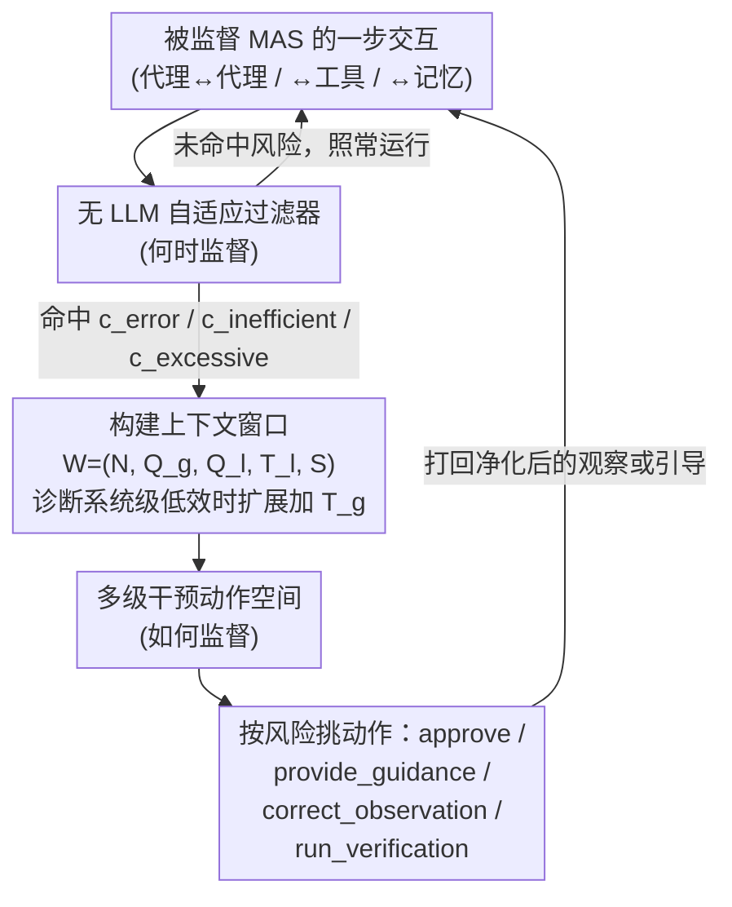

# Stop Wasting Your Tokens: Towards Efficient Runtime Multi-Agent Systems

**会议**: ICLR 2026  
**arXiv**: [2510.26585](https://arxiv.org/abs/2510.26585)  
**代码**: 无  
**领域**: 社会计算  
**关键词**: 多智能体系统, Token 效率, 运行时监督, 自适应过滤, 错误纠正

## 一句话总结

提出 SupervisorAgent，一个轻量级的实时自适应监督框架，通过无 LLM 的自适应过滤器在关键交互节点主动干预（纠错、指导、观察净化），在 GAIA 基准上将 Smolagent 的 token 消耗降低 29.68% 而不损失成功率。

## 研究背景与动机

- 多智能体系统（MAS）在复杂任务上表现出色，但面临**效率与鲁棒性悖论**：
    - **错误传播**：单个幻觉信息污染整个推理链的下游代理
    - **低效行为**：代理进入重复操作循环、选择不必要的复杂路径
    - **上下文膨胀**：冗长的工具返回（如原始 HTML）充斥上下文窗口
- 现有方法主要关注**事后归因**（post-hoc failure attribution），缺乏**实时主动干预**

## 方法详解

### 整体框架

方法的核心是在原有多智能体系统（Multi-Agent System，MAS）之上叠加一个元级控制代理 SupervisorAgent，把它和被监督的 MAS 一起构成监督型多智能体系统（Supervised MAS，SMAS）。整个设计围绕三个递进的问题展开——**监督什么、何时监督、如何监督**。监督的对象（监督什么）是 MAS 里三类最容易出问题的高风险交互：代理间通信/委托（Agent-Agent，易传播幻觉信息）、外部工具调用（Agent-Tool，可能返回不准确或过时数据）、记忆检索（Agent-Memory，可能取出有缺陷的历史信息）。被监督代理每走一步，先经过一道无 LLM 的廉价过滤器判断是否触及风险（何时监督）；只有命中风险时才唤醒 SupervisorAgent，由它收集一个紧凑的上下文窗口、从多级动作空间里挑一个强度匹配的干预动作打回去（如何监督）。整套框架不改基础代理架构，靠"何时介入"和"如何介入"两个旋钮把监督开销压到最低。

### 关键设计

**1. 无 LLM 的自适应过滤器：用启发式决定何时监督**

如果对每一次交互都调一次 LLM 来判断要不要干预，监督本身的成本就会吃掉它省下的 token。作者的关键取舍是让"何时监督"这一步完全不调用 LLM，而是用一组轻量启发式信号在关键节点触发：显式错误 $c_{error}$（工具调用失败、代码执行报错）、低效行为 $c_{inefficient}$（陷入重复操作循环，比如反复 page_down 翻页而不去直接搜索）、以及观察过长 $c_{excessive}$（工具返回超长内容，如整页原始 HTML）。只有命中其中一个条件时 SupervisorAgent 才被唤醒，因此绝大多数正常交互不付出任何额外代价，监督开销被这层廉价过滤器牢牢钉住——这正是"用监督省 token"能成立的前提。

**2. 记忆增强的上下文窗口：只喂诊断必需的状态**

要做出正确判断，监督者必须比任何单个被监督代理掌握更全面的系统状态，但又不能把整条历史塞进去重新制造上下文膨胀。为此它的输入被组织成一个固定的紧凑窗口 $\mathcal{W} = (N, Q_g, Q_l, T_l, S)$，其中 $N$ 是被监督代理名称，$Q_g$、$Q_l$ 是全局目标与当前局部任务，$T_l$ 是该代理近期的局部行动轨迹，$S$ 是最新交互步的摘要。当需要诊断跨代理的系统级低效时，再切换到扩展窗口 $\mathcal{W}_{ext} = \mathcal{W} \cup \{T_g\}$，额外补上全局轨迹 $T_g$。这种"按需扩展"的设计让监督者天然拥有超越单个代理视野的全局视角，又不会把无关细节带进推理。

**3. 多级干预动作空间：按问题严重程度匹配介入强度**

触发监督后还要决定"如何监督"，作者设计了一个从轻到重的动作空间，并用触发条件 $c$ 限定每种场景下允许的动作子集 $\mathcal{A}(c)$，使干预强度与风险匹配、避免小题大做。低效场景 $c_{inefficient}$ 允许 $\{approve,\ provide\_guidance\}$：最轻的 `approve` 放行那些其实有效的重复行为（应对误报），`provide_guidance` 追加一段引导提示把跑偏的推理路径拉回来。显式错误 $c_{error}$ 允许 $\{correct\_observation,\ provide\_guidance,\ run\_verification\}$，其中最重的 `run_verification` 会调起一个验证子代理做外部事实核查。观察过长 $c_{excessive}$ 只允许 $\{correct\_observation\}$，直接把冗长的原始 HTML 净化成有用摘要。正是 `correct_observation` 这类动作把上下文膨胀的根源——超长工具返回——在进入下游推理链之前就清理掉，从而在不损失成功率的前提下省下大量 token。

### 一个完整示例

以 GAIA 上一次典型的网页检索任务为例：被监督代理调用浏览工具，返回一整页原始 HTML，命中观察过长条件 $c_{excessive}$，过滤器唤醒 SupervisorAgent；监督者读取紧凑窗口 $\mathcal{W}$，判断这段观察对当前局部任务 $Q_l$ 价值很低，于是从该场景唯一允许的动作里选 `correct_observation`，用净化后的摘要替换原始 HTML 再交回下游。被污染的长上下文还没来得及进入后续推理就被截断，案例分析显示这样一次成功干预即可削减 70% 以上的 token 消耗。若代理转而陷入反复 page_down 的循环，则会命中 $c_{inefficient}$，监督者改用 `provide_guidance` 提示换一种检索策略，或在确认重复仍有效时直接 `approve` 放行。

## 实验关键数据

### GAIA 基准主实验

| 方法 | 平均准确率 | 平均 Token (K) | L2 Token (K) |
|------|----------|--------------|-------------|
| CodeAgent | 40.00 | 120.40 | — |
| Smolagent (pass@1) | — | 基线 | 基线 |
| **SMAS (pass@1)** | 持平 | **-29.68%** | **-35%** |

### GAIA Level 2 详细分析

| 指标 | Smolagent | SMAS | 改善 |
|------|----------|------|------|
| Token 消耗 | 基线 | -35% | 显著 |
| 方差 | 基线 | -63% | 大幅降低 |
| 步骤数 (案例) | 基线 | -43% | 显著 |

### 跨基准验证

| 基准 | 领域 | Token 减少 | 准确率变化 |
|------|------|----------|----------|
| HumanEval | 代码生成 | **-23.74%** | +提升 |
| MBPP | 代码生成 | 显著减少 | 持平/提升 |
| AIME 2024 | 数学推理 | 减少 | 持平 |
| GSM8k-Hard | 数学推理 | 减少 | 持平 |
| DROP | 问答 | 减少 | 持平 |

### 关键发现

1. HumanEval 上实现 23.74% token 减少的同时准确率还提升了
2. SupervisorAgent 跨 GPT-4.1、Gemini-2.5-pro、Qwen3 系列均有效
3. 自适应过滤器有效控制了监督开销，避免了对每个交互的冗余检查
4. 案例分析显示一次成功的监督干预可减少 70%+ 的 token 消耗

## 亮点与洞察

- **实时主动干预 vs 事后分析**：从 reactive 到 proactive 的范式转变
- **Pareto 改善**：降低 token 消耗的同时不损失（甚至提升）成功率
- **无 LLM 过滤器**：关键创新在于用简单启发式替代 LLM 来决定"何时监督"
- **与现有方法正交**：可叠加到任意现有 MAS 框架上
- **方差大幅减少**：更稳定可靠的系统行为

## 局限性

- 自适应过滤器基于预定义的启发式规则，可能错过某些新类型的高风险交互
- SupervisorAgent 本身的 LLM 调用也有成本，需要权衡监督收益与监督开销
- 主要在 Smolagent 框架上验证，在其他 MAS 框架上的适配可能需要调整
- 对于不使用工具的纯对话任务，框架的适用性有限

## 相关工作

- 失败归因：Aegis、AgenTracer 等事后分析方法
- 效率优化：AgentDropout（剪枝代理）、MetaAgent（设计时优化拓扑）
- 上下文压缩：观察摘要/蒸馏

## 评分

- **新颖性**: ⭐⭐⭐⭐ — 运行时监督的概念新颖，非侵入式设计实用
- **技术深度**: ⭐⭐⭐ — 方法相对直觉，技术复杂度适中
- **实验充分性**: ⭐⭐⭐⭐⭐ — 6 基准 × 多基础模型 × 详细案例分析
- **实用性**: ⭐⭐⭐⭐⭐ — 直接可部署，对降低 MAS 运营成本有重要价值

<!-- RELATED:START -->

## 相关论文

- [\[ICLR 2026\] KVComm: Enabling Efficient LLM Communication through Selective KV Sharing](kvcomm_enabling_efficient_llm_communication_through_selective_kv_sharing.md)
- [\[ACL 2026\] Efficient Multi-Agent System Training with Data Influence-Oriented Tree Search](../../ACL2026/multi_agent/efficient_multi-agent_system_training_with_data_influence-oriented_tree_search.md)
- [\[AAAI 2026\] iMAD: Intelligent Multi-Agent Debate for Efficient and Accurate LLM Inference](../../AAAI2026/multi_agent/imad_intelligent_multi-agent_debate_for_efficient_and_accura.md)
- [\[AAAI 2026\] Assemble Your Crew: Automatic Multi-agent Communication Topology Design via Autoregressive Graph Generation](../../AAAI2026/multi_agent/assemble_your_crew_automatic_multi-agent_communication_topol.md)
- [\[AAAI 2026\] EcoAgent: An Efficient Device-Cloud Collaborative Multi-Agent Framework for Mobile Automation](../../AAAI2026/multi_agent/ecoagent_an_efficient_device-cloud_collaborative_multi-agent.md)

<!-- RELATED:END -->
