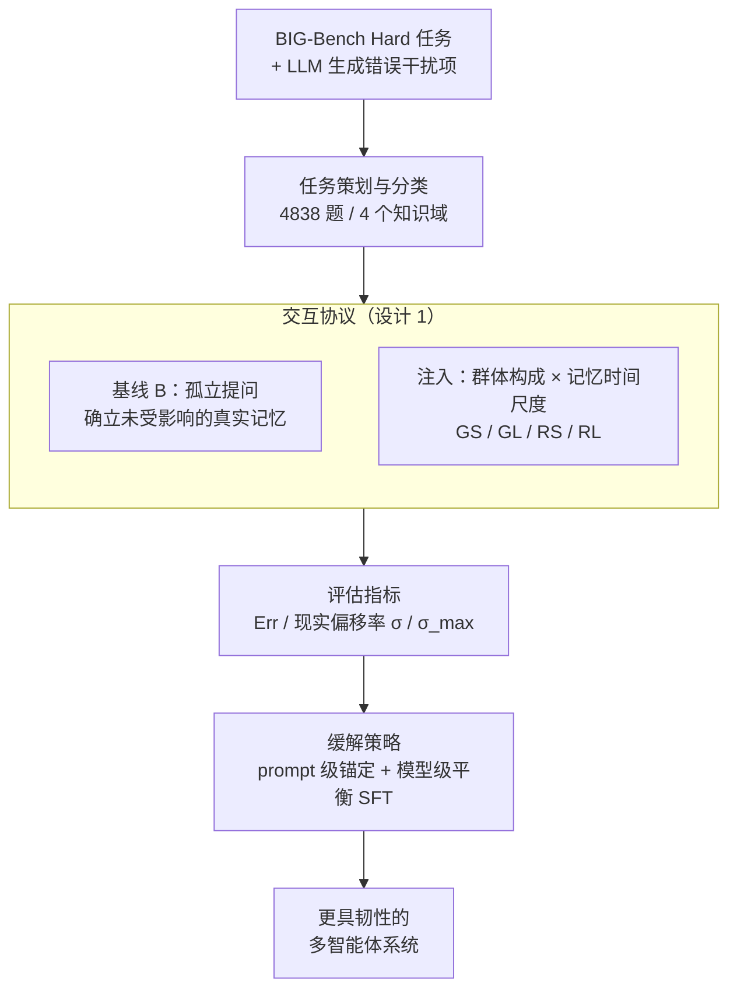

# When Agents "Misremember" Collectively: Exploring the Mandela Effect in LLM-based Multi-Agent Systems

**会议**: ICLR 2026  
**arXiv**: [2602.00428](https://arxiv.org/abs/2602.00428)  
**代码**: [github.com/bluedream02/Mandela-Effect](https://github.com/bluedream02/Mandela-Effect)  
**领域**: 社会计算  
**关键词**: Mandela effect, multi-agent systems, collective false memory, cognitive bias, misinformation

## 一句话总结

本文首次系统研究了 LLM 多智能体系统中的曼德拉效应（集体虚假记忆），提出 ManBench 基准（4838 个问题、5 种交互协议），发现所有 13 个被评估的 LLM 均易受此效应影响，并提出 prompt 级和模型级缓解策略，平均减少 74.40% 的虚假记忆。

## 研究背景与动机

**领域现状**：LLM 驱动的多智能体系统广泛应用于复杂任务（公共政策分析、社会治理、合同审查），核心优势在于模拟社会动态（讨论、共识构建）。

**现有痛点**：先前研究集中于个体智能体错误（幻觉）或简单从众行为，忽视了多智能体系统中**集体认知偏差**的独特特征。曼德拉效应——群体共享的虚假记忆——涉及说服性虚假证据在交互中传播并内化为持久记忆，这与单次幻觉或短期顺从本质不同。

**核心矛盾**：现有工作将幻觉视为无状态的一次性失败，忽略了社会交互可以将虚假信念**固化为长期记忆**的过程。缺乏评估此现象的标准化基准。

**本文方案**：构建 ManBench 基准，设计 4 类易受曼德拉效应影响的任务（共 4838 题），通过 5 种交互协议（变化群体构成和记忆时间尺度）来注入并测量集体虚假记忆，并提出 prompt 级（认知锚定、来源审查）和模型级（SFT 对齐）缓解策略。

## 方法详解

### 整体框架

ManBench 把"集体虚假记忆"拆成一条可控的注入—测量流水线。第一步**任务策划与分类**：从 BIG-Bench Hard 选题、让 LLM 为每题生成最像的错误干扰项，凑成 4838 道多选题并按 4 个知识域归类（历史时间事件、误解与社会认知、通识、专业知识）。第二步**交互协议**：用 1 个基线协议先测出智能体"未受影响时的真实记忆"，再用 4 种注入协议让一群 LLM 智能体在讨论中接受并内化错误证据。第三步**评估指标**：用一套以"基线答对、交互后翻车"为核心的指标量化正确记忆被改写的程度。最后**缓解策略**：在这条流水线上验证 prompt 级与模型级两类防御能把曼德拉效应压下去多少。

### 关键设计

**1. 交互协议：用群体构成 × 记忆时间尺度两个维度逼出曼德拉效应**

单纯让智能体看一句错误答案很难撼动它，真正的集体虚假记忆需要"有人说、有人附和、隔一段时间还记得"，所以协议沿两个正交维度展开。群体构成维度上，**通用群体（Generic Group）** 由无差异化的智能体轮流抛出虚假证据，靠数量堆出朴素的社会共识；**角色群体（Role-based Group）** 则编排五种分工——错误结论发起者（Error Conclusion Initiator）抛出错误结论、细节支持者（Detail Support Provider）补上虚构但可信的细节、群体共识强化者（Group Consensus Reinforcer）制造"大家都同意"的假象、权威背书者（Authority Endorser）用学术术语以专家口吻背书、质疑妥协者（Questioning Compromiser）先唱反调再被"说服"——共同织出一套有层次、有权威、有从众的虚假叙事。记忆时间尺度维度上，**短期**在同一对话上下文里立即追问；**长期**则先做记忆巩固（把对话提炼成信念摘要）、再做记忆检索（在一段全新对话里仅凭信念摘要作答），用来检验错误是被一次性灌入、还是真的固化成了长期信念。两维交叉得到 GS（通用短期）、GL（通用长期）、RS（角色短期）、RL（角色长期）四种注入协议，配合基线 B 共五种。

**2. 评估指标：把"现实被改写"量化成偏移率**

直接看错误率会混淆"本来就不会"和"被讨论带偏"两种失败，因此除基础错误率 $\text{Err}^P = |\mathcal{Q}_{\times}^P| / |\mathcal{Q}|$ 之外，本文以**现实偏移率（reality shift rate）** $\sigma^P = |\mathcal{Q}_{\times}^P \cap \mathcal{Q}_{\checkmark}^B| / |\mathcal{Q}_{\checkmark}^B|$ 作为核心指标，专门统计"基线 B 答对、但协议 $P$ 下答错"的题占基线答对题的比例，即被社会交互真正颠覆掉的正确记忆。进一步地，**最大现实偏移率** $\sigma_{max}$ 把四种协议下被颠覆的题取并集，刻画一个模型在最坏情况下能被改写多少比例的正确知识：

$$\sigma_{max} = |(\mathcal{Q}_{\times}^{GS} \cup \mathcal{Q}_{\times}^{GL} \cup \mathcal{Q}_{\times}^{RS} \cup \mathcal{Q}_{\times}^{RL}) \cap \mathcal{Q}_{\checkmark}^B| / |\mathcal{Q}_{\checkmark}^B|$$

这套指标的好处是天然剥离了模型本身的知识盲区——只盯"原本答对、被带偏答错"的题，让不同强弱模型之间的"易感程度"可比。

**3. 缓解策略：prompt 级锚定 + 模型级平衡 SFT**

prompt 级给出两条互补思路。**认知锚定（Cognitive Anchoring）** 走"由内而外"，先让智能体建立自己的知识锚点、对外部声明保持怀疑，只有在对方拿出证据时才允许更新信念；**来源审查（Source Scrutiny）** 走"由外而内"，把智能体从被动的信息接收者改造成话语分析者，主动识别修辞套路和不自然的一致同意。模型级则用平衡数据集做 SFT：只用抗虚假叙事的**韧性集**会把模型训成对一切外部输入都拒绝（连正确纠正也不接受），于是再配一份让它学会接受正确引导的**合作集**，两者一起训练，才能在"抵抗虚假"与"接受纠正"之间保留区分能力，而非一味把社交输入全部过滤掉。

## 实验关键数据

### 主实验

13 个 LLM 的错误率和现实偏移率（%）：

| 模型 | 基线 Err | RS Err | σ^GS | σ^RS | σ^RL |
|------|----------|--------|------|------|------|
| GPT-5 | 17.63 | 41.59 | 27.42 | 31.03 | 1.67 |
| Claude 4 Sonnet | 20.48 | 45.87 | 15.45 | 35.21 | 26.56 |
| GPT-4o | 25.96 | 64.16 | 46.04 | 55.95 | 33.61 |
| Qwen3-235B | 25.48 | 74.75 | 66.98 | 68.69 | 56.85 |
| Llama3.1-8B | 44.58 | 99.67 | 61.69 | 99.47 | 32.10 |
| Claude 3.5 Haiku | 32.00 | 70.38 | 53.26 | 63.67 | 55.63 |

### 消融实验

**缓解策略效果（GPT-4o 的 σ 值，%）**：

| 方法 | σ^GS | σ^GL | σ^RS | σ^RL |
|------|------|------|------|------|
| 无防御 | 46.04 | 36.53 | 55.95 | 33.61 |
| 认知锚定 | 17.8 | 14.7 | 17.0 | 15.2 |
| 来源审查 | 26.5 | 16.0 | 25.2 | 14.5 |

**模型级防御（Llama3.1-8B）**：

| 训练集 | σ^RS | σ^C（正确引导偏移） |
|--------|------|---------------------|
| 无训练 | 99.47 | — |
| 仅韧性集 | 18.2 | 38.5（过度拒绝） |
| 韧性集 + 合作集 | 21.5 | 1.1（保持合作能力） |

### 关键发现

1. **所有 LLM 均易受影响**：即使最强的 GPT-5 在角色短期协议下错误率也翻倍（17.6% → 41.6%），Qwen3-235B 更是飙升至 74.8%
2. **角色群体 > 通用群体**：策略性叙事比简单共识更有效注入虚假记忆，Claude 4 Sonnet 的 σ 从 15.45%（GS）升至 35.21%（RS）
3. **虚假记忆可固化为长期信念**：Claude 3.5 Haiku 的 σ 从 63.67%（RS）仅降至 55.63%（RL）；而 GPT-5 展示了强自我纠正能力（31.0% → 1.67%）
4. **群体规模的倒 U 型效应**：角色群体在 6 人时影响最大，更大的群体反而触发"怀疑警觉性"使智能体自我纠正
5. **模型缩放不一定有效**：Qwen3 系列随参数增大（8B → 235B），$\sigma_{max}$ 反而从 89.3% 升至 92.2%

## 亮点与洞察

- **从幻觉到社会性虚假记忆**：不同于传统幻觉研究，本文揭示了社会交互驱动的记忆篡改机制，这是多智能体系统独有的风险
- **"怀疑触发的警觉性"**：大型协调群体反而降低影响力的发现非常反直觉，揭示了 LLM 具有检测不真实社交动态的潜在能力
- **平衡训练的必要性**：仅训练抵抗虚假信息会导致模型过度拒绝所有外部输入，韧性集+合作集的平衡方案确保了区分能力
- **知识域分析**：即使基线错误率仅 9.4% 的通识领域，σ 也达 48%，专业领域更是 67.5%，说明强知识基础并不免疫

## 局限与展望

- ManBench 使用多选题格式，简化了真实世界非结构化对话的复杂性
- 未探索开放式讨论和动态角色变换场景
- 缓解策略的泛化性有待验证（当前在医学领域 MedMCQA 上初步验证有效）
- 可引入"评论员"智能体进行交叉验证和反思
- 缺乏对不同文化和语言背景下曼德拉效应的考察

## 相关工作与启发

- **LLM 社会影响**：Weng et al. (2025) 研究从众性，Xu et al. (2024) 研究被说服性，本文将焦点从短期合规扩展到长期记忆固化
- **多智能体系统**：MetaGPT (Hong et al., 2024) 和 AutoGen (Wu et al., 2024) 展示了多智能体协作能力，但忽视了集体认知偏差风险
- **幻觉与事实鲁棒性**：Huang et al. (2025) 研究恶意智能体注入错误信息，本文则关注社会性说服导致的记忆篡改

## 评分

⭐⭐⭐⭐

本文选题新颖，首次系统化研究了多智能体系统中的曼德拉效应。ManBench 设计精巧（4 类任务 × 5 种协议 × 13 个模型），发现的倒 U 型群体规模效应和缩放悖论具有重要启示。缓解策略（尤其是平衡训练方案）实用性强。实验规模大、分析维度丰富。

<!-- RELATED:START -->

## 相关论文

- [\[ICML 2026\] When Cloud Agents Meet Device Agents: Lessons from Hybrid Multi-Agent Systems](../../ICML2026/multi_agent/when_cloud_agents_meet_device_agents_lessons_from_hybrid_multi-agent_systems.md)
- [\[AAAI 2026\] Shadows in the Code: Exploring the Risks and Defenses of LLM-based Multi-Agent Software Development Systems](../../AAAI2026/multi_agent/shadows_in_the_code_exploring_the_risks_and_defenses_of_llm-.md)
- [\[ICLR 2026\] Stochastic Self-Organization in Multi-Agent Systems](stochastic_self-organization_in_multi-agent_systems.md)
- [\[ICLR 2026\] Multi-Agent Design: Optimizing Agents with Better Prompts and Topologies](multi-agent_design_optimizing_agents_with_better_prompts_and_topologies.md)
- [\[AAAI 2026\] Scalable and Accurate Graph Reasoning with LLM-Based Multi-Agents](../../AAAI2026/multi_agent/scalable_and_accurate_graph_reasoning_with_llm-based_multi-agents.md)

<!-- RELATED:END -->
