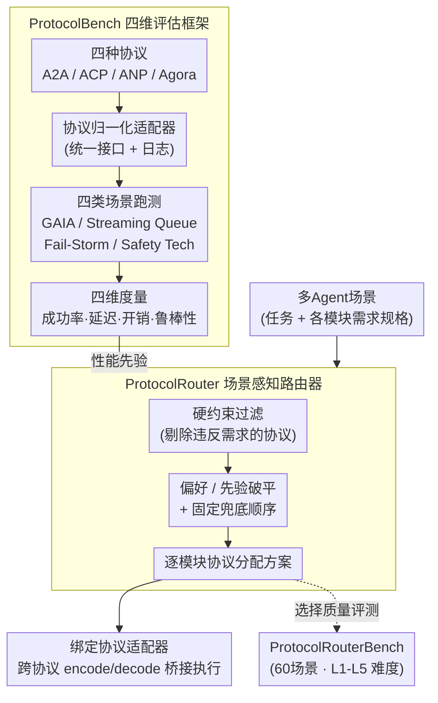

# Which LLM Multi-Agent Protocol to Choose?

**会议**: ICLR 2026  
**arXiv**: [2510.17149](https://arxiv.org/abs/2510.17149)  
**代码**: 有（论文附带benchmark artifacts）  
**领域**: LLM评测  
**关键词**: 多Agent协议, ProtocolBench, ProtocolRouter, A2A, 通信协议评估

## 一句话总结

本文提出ProtocolBench基准和ProtocolRouter路由器，首次系统性比较了多Agent系统中的通信协议（A2A、ACP、ANP、Agora等）在任务成功率、延迟、消息开销和鲁棒性四个维度上的差异，并通过可学习的协议路由器实现场景自适应的协议选择，最高降低18.1%的故障恢复时间。

## 研究背景与动机

随着大规模多Agent系统的演进，通信协议层已成为影响系统性能和可靠性的关键但被忽视的因素：

**协议爆发式增长**: 近年来涌现了多种Agent通信协议，包括Google的A2A（Agent-to-Agent）、ACP（Agent Communication Protocol）、ANP（Agent Network Protocol）、Agora等，但缺乏统一的比较标准

**选择困难**: 在实际部署中，协议选择通常基于直觉或经验，缺乏数据驱动的决策支持

**性能差异被低估**: 通常认为协议只是"管道"，对系统性能影响有限，但实际上协议差异可导致高达36.5%的完成时间差异

**缺乏标准化评估**: 不同协议的论文使用不同的任务和指标进行评估，无法直接对比

**单一协议的局限性**: 没有一种协议在所有场景下都是最优的，但现有系统通常只使用单一协议

本文的目标是建立标准化的协议评估框架，并通过自适应路由实现最优协议选择。

## 方法详解

### 整体框架

本文把"选哪个多Agent通信协议"这件常被拍脑袋决定的事拆成两块来做：先用 ProtocolBench 这个协议无关（protocol-agnostic）的标准化基准，把 A2A、ACP、ANP、Agora 四种主流协议套进同一组归一化适配器，放到统一的场景里跑，沿任务成功率、端到端延迟、消息/字节开销、故障鲁棒性四个维度量一遍，得到"哪种协议在哪种场景下强"的性能先验；再用 ProtocolRouter 这个**确定性**路由器，把每个模块的需求规格（spec）连同上一步的性能先验一起，按"硬约束过滤→偏好破平→固定兜底"逐模块挑出最合适的协议；当一条链路两端协议不同时，由无状态的 encode/decode 适配器桥接，保证语义和安全属性不变。

### 关键设计

**1. ProtocolBench：用协议无关的四维基准让协议第一次能被公平横比**

此前各协议论文各用各的任务和指标，结论无法直接对照，协议层的性能差异因此被长期当成"管道细节"低估。ProtocolBench 把 A2A（Agent-to-Agent，Google 提出，强调跨平台互操作）、ACP（IBM 的 Agent Communication Protocol，面向跨框架集成）、ANP（Agent Network Protocol，面向安全路由）、Agora（去中心化 P2P 工作流）四种协议套进同一组**归一化适配器**，把"换协议"这件事从"重写系统"降成"换适配器"，从而钉死模型、prompt、硬件、限流等非协议因素，单独隔离出协议的影响。它固定四条评估轴——任务成功率/质量、端到端延迟/吞吐、消息/字节开销、故障鲁棒性，并在四类代表性场景里跑：GAIA 测协作式文档问答的完成质量，Streaming Queue 在固定到达率 $\lambda$ 下压吞吐与延迟，Fail-Storm Recovery 按固定时刻 $kt$ 杀掉一部分 Agent/链路考验恢复能力，Safety Tech 用安全能力矩阵和探针拦截率比各协议的加密/认证。统一的日志与指标使这套结论可复现，也成了路由器的性能先验来源。

**2. ProtocolRouter：确定性的逐模块协议选择，把"选协议"从拍脑袋变成可复现的决策**

既然没有一种协议在所有场景下最优、人工选又脆弱费时，路由器要替系统在每个**通信模块**上挑协议。它刻意做成**确定性**的（相同输入永远给相同输出），而非黑盒学习：先用一张能力表（传输/交互方式、长任务与产物处理、身份/机密性、投递与重放语义等）做**硬约束过滤**，剔除违反"必须支持端到端加密""避免 REST 风格"等需求的协议；再按最相关的交互偏好（如流式 vs 请求-响应）**破平**；仍打平就走**固定兜底顺序**。它有两种模式：Spec-only 只看需求规格，Spec+Perf 在同样的硬约束下额外引入 ProtocolBench 的聚合性能先验、但**仅用于在可行候选间破平**，不直接读取逐场景数字。路由器只负责"选择与组合"，本身不改业务语义、不重新加密；当一条链路两端协议不同时，翻译交给协议适配器的**无状态 encode/decode 桥接**（经统一信封 UTE 做字段映射），纯语法层转换、不触碰内容与安全属性。这样既支持模块级异构路由，又把单次决策的开销压到几乎可忽略。

**3. ProtocolRouterBench：给"路由器选得对不对"单独造一把可复现的尺子**

评估路由器不能复用评估单协议的设置，因此本文额外构造专门衡量**选择质量**的基准。它通过人机协作造了 60 个场景、按 5 个难度等级 L1–L5 组织（难度 = 场景里独立模块数，$L_i$ 含 $i$ 个模块，每级 12 个场景，共 180 个待评模块），每个模块在去掉品牌名后只剩技术需求，并由专家标注"唯一正确协议"。主指标是 Scenario Accuracy——一个场景里**所有模块**都选对才算这条对，比单看模块准确率更严，配合混淆矩阵能看出哪些协议最容易被混（尤其 A2A 与 ACP），让路由策略的好坏也能被一致、可复现地比较。

## 实验关键数据

### 主实验：协议间差异显著且场景依赖

| 场景 | 指标 | 最佳 | 最差 | 差异 |
|------|------|------|------|------|
| GAIA | 质量分(1-5) | A2A 2.51 | 次优 2.33 | +7.7% |
| GAIA | 成功数 | A2A 9.29 | 次优 7.28 | +27.6% |
| Streaming Queue | 均值端到端延迟 | ACP 9.66s | Agora 13.14s | 差 3.48s |
| Streaming Queue | 完成时间 | 40.28 min | 54.97 min | 36.5% |
| Fail-Storm | 故障后答案保持率 | A2A 98.85% | Agora 81.29% | ACP 92.41% / ANP 86.96% |

协议选择在四类场景里都拉出稳定且方向不一的差异——没有任何一种协议四项全胜（A2A 在 GAIA 质量与 Fail-Storm 鲁棒性领先，ACP 在 Streaming Queue 延迟最低），这正是路由的前提。

### ProtocolRouter性能

| 对比基线 | 指标 | ProtocolRouter | 最佳单协议 | 提升 |
|----------|------|----------------|------------|------|
| Fail-Storm Recovery | 恢复时间 | 6.55s | A2A 8.00s | 降低18.1% |
| GAIA | 成功数 | 9.90 | A2A 9.29 | +0.61 |

### 消融实验

| 配置 | 关键指标 | 说明 |
|------|---------|------|
| 场景级 vs 模块级路由 | 模块级更优 | 同一系统不同模块各配最合适协议，比全局统一一种更好 |
| Spec-only vs Spec+Perf | Spec+Perf 更准 | 引入 ProtocolBench 性能先验破平，提升选择正确率 |
| 易混协议 | A2A↔ACP 最易混 | 混淆矩阵显示二者能力接近、最常被选错 |
| 固定协议 vs 路由 | 路由在目标场景更优 | 验证了按场景自适应选协议的价值 |

### 关键发现

1. **协议选择显著影响性能**: 不同协议在同一场景下的性能差异可达36.5%，远超预期
2. **没有万能协议**: 在不同场景下，最优协议不同，单一协议策略必然存在妥协
3. **延迟差异突出**: Streaming Queue场景中端到端延迟差异达3.48秒，对实时应用影响巨大
4. **鲁棒性差异一致**: 在故障场景下，不同协议的恢复能力存在稳定的差异模式
5. **自适应路由有效**: 在 Fail-Storm、GAIA 等目标场景下，ProtocolRouter 优于最佳单一协议，证明了按场景选协议的价值
6. **模块级路由更优**: 同一系统中不同模块可能适合不同协议，细粒度路由效果更好

## 亮点与洞察

1. **首个协议基准**: ProtocolBench填补了多Agent协议评估领域的空白，为协议设计和选择提供了数据支撑
2. **实用的路由机制**: ProtocolRouter将"选哪个协议"从人工决策转变为数据驱动决策，降低了部署门槛
3. **四维评估体系完备**: 任务成功率、延迟、开销、鲁棒性四个维度覆盖了实际部署中的核心关注点
4. **模块级路由洞察**: 揭示了同一系统内部不同组件可能适合不同协议的现象，为异构协议架构提供了理论支持
5. **36.5%的性能差异**: 这一数字有力地证明了协议选择不是"无关紧要的细节"，而是系统设计的关键决策

## 局限与展望

1. **协议覆盖范围**: 目前评估的协议种类有限，新兴协议（如MCP相关协议）尚未纳入
2. **场景多样性**: 评估场景虽然具有代表性，但可能无法覆盖所有实际使用模式
3. **路由延迟**: 虽然路由器本身很轻量，但在超低延迟场景下额外的路由开销仍需关注
4. **安全性考量**: 未充分评估不同协议在安全性（如消息加密、认证）方面的差异
5. **大规模验证**: 评估的Agent数量有限，千级或万级Agent场景下的表现有待验证
6. **协议混合的兼容性**: 模块级路由意味着系统中同时存在多种协议，兼容性和调试复杂度需要更多讨论
7. **动态环境适应**: 路由器对运行时环境变化（如网络拓扑变化、Agent动态加入/退出）的适应能力有待加强

## 相关工作与启发

- **A2A Protocol (Google)**: 面向Agent互操作的协议标准，强调跨平台兼容
- **MCP (Model Context Protocol)**: Anthropic的模型上下文协议，虽然不直接针对Agent间通信，但影响了协议设计思路
- **FIPA-ACL**: 传统的Agent通信语言标准，ACP在其基础上发展而来
- **AutoGen / CrewAI**: 多Agent框架，通常使用固定的通信模式
- **启发**: 
    - 协议层的研究可能成为多Agent系统性能优化的新突破口
    - 自适应协议路由的思路可以扩展到更多系统层面（如模型选择、工具选择）
    - 需要建立类似网络协议栈的Agent协议分层标准

## 评分
- 新颖性: ⭐⭐⭐⭐
- 实验充分度: ⭐⭐⭐⭐
- 写作质量: ⭐⭐⭐⭐
- 价值: ⭐⭐⭐⭐⭐

<!-- RELATED:START -->

## 相关论文

- [\[ICML 2026\] ProtocolBench: Which LLM MultiAgent Protocol to Choose?](../../ICML2026/multi_agent/protocolbench_which_llm_multiagent_protocol_to_choose.md)
- [\[ICLR 2026\] When Agents "Misremember" Collectively: Exploring the Mandela Effect in LLM-based Multi-Agent Systems](when_agents_misremember_collectively_exploring_the_mandela_effect_in_llm-based_m.md)
- [\[ICLR 2026\] KVComm: Enabling Efficient LLM Communication through Selective KV Sharing](kvcomm_enabling_efficient_llm_communication_through_selective_kv_sharing.md)
- [\[ICLR 2026\] LH-Deception: Simulating and Understanding LLM Deceptive Behaviors in Long-Horizon Interactions](lh-deception_simulating_and_understanding_llm_deceptive_behaviors_in_long-horizo.md)
- [\[ICLR 2026\] Multi-agent Coordination via Flow Matching](multi-agent_coordination_via_flow_matching.md)

<!-- RELATED:END -->
