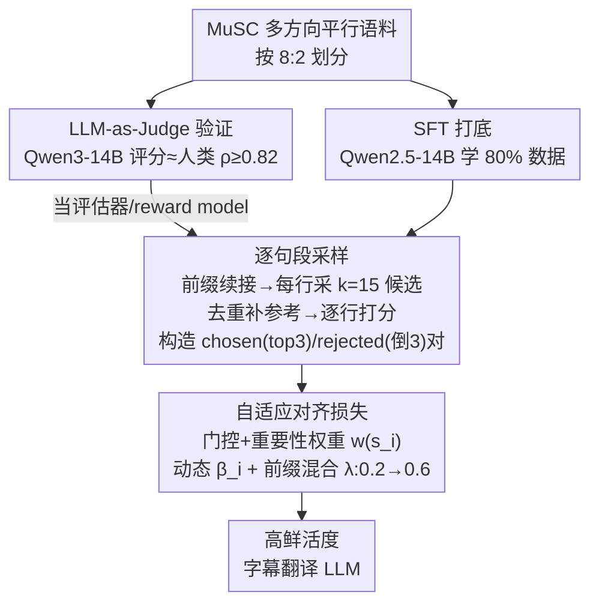

# From Utterance to Vividity: Training Expressive Subtitle Translation LLM via Adaptive Local Preference Optimization

**会议**: ICLR 2026  
**arXiv**: [2602.01068](https://arxiv.org/abs/2602.01068)  
**代码**: [GitHub](https://github.com/CcQunResearch/ALPO)  
**领域**: LLM对齐/NLP  
**关键词**: 字幕翻译, 偏好优化, LLM-as-Judge, 意译, 过程监督

## 一句话总结
提出ALPO(自适应局部偏好优化)用于训练表达力强的字幕翻译LLM：通过实证发现字幕翻译偏好意译且推理型LLM意译能力优于对话型LLM -> 验证LLM作为翻译评估器与人类高度一致 -> 提出逐句段的细粒度过程监督偏好对齐方法(自适应权重+动态beta+前缀混合) -> 14B模型在多方向字幕翻译的鲜活度上超越GPT-4o/DeepSeek-R1等SOTA。

## 研究背景与动机

**领域现状**：LLM在通用翻译上已接近人类水平，但在垂直领域(法律/医学/字幕)的定制化翻译仍有明显不足。字幕翻译需要本地化的意译来传达原文的氛围、情感和语调，但LLM倾向于直译。

**现有痛点**：(1) LLM翻译准确度高但缺乏表达力/鲜活度(vividness)；(2) 字幕翻译需要逐句段的细粒度对齐，而PPO/DPO是outcome-supervised只对完整输出优化——粒度太粗且存在梯度稀释问题；(3) 缺乏字幕翻译的评估体系和训练数据。

**核心矛盾**：字幕翻译的输入包含多行字幕(有上下文依赖)，但每一行需要独立的细粒度偏好对齐——这是一个"局部偏好优化"问题，现有DPO等方法不直接适用。

**本文目标**：(a) 验证LLM能否可靠地评估字幕翻译质量(替代昂贵的人工评估)；(b) 设计细粒度的偏好优化方法让LLM学习意译能力；(c) 构建多方向字幕平行语料。

**切入角度**：三个实证发现驱动方法设计：(1) 字幕翻译的back-translation一致性最低→意译程度最高；(2) 推理型LLM(R1/GPT-5 Thinking)的意译能力优于对话型LLM(GPT-4o/Qwen-Max)；(3) 14B模型作为评估器与人类的Spearman相关性>=0.82→可作为低成本reward model。

**核心 idea**：用逐句段采样+LLM评分+自适应加权的过程监督DPO实现字幕翻译的细粒度鲜活度对齐。

## 方法详解

### 整体框架
ALPO 要解决的核心问题是：字幕翻译的输入是一段多行字幕（行与行之间有上下文依赖），但"鲜活度"（vividness）的对齐必须落到每一行——这是一个 DPO 不直接处理的"局部偏好优化"（local preference optimization）问题。整条流水线建立在一个前提之上：先验证一个 14B 模型评分能逼近人类，从而当作低成本评估器（reward model）。有了它，剩下两阶段就能自动跑通：先用 80% 的 MuSC 平行语料对 Qwen2.5-14B 做监督微调（SFT）打底，再在剩下 20% 数据上做 ALPO 偏好对齐。ALPO 内部的转法是"逐行采样多个候选译文 → 用评估器逐行打分 → 按行构造 chosen/rejected 偏好对 → 加权细粒度 DPO 优化"，把对齐粒度从整段输出细化到单行字幕。

### 关键设计

**1. LLM-as-Judge 验证：先证明 14B 模型可当评估器，再用它造偏好数据**

整个方法的前提是"自动评分可靠"——如果 LLM 评分不可信，后面采样得到的偏好对就全是噪声，无从对齐。作者用 500 行字幕 × 10 种翻译，让人类和 LLM 各自打分（0-100），再算 Spearman 相关性来验证。结果是 Qwen3-14B 与人类评估者在所有翻译方向上都有 $\rho \geq 0.82$，Bland-Altman 分析进一步显示二者的系统偏差极低。这条结论让一个 14B 模型直接顶替昂贵的人工评估，成为整套流程的低成本 reward model。

**2. 逐句段采样：把"整段输出"拆成"每行一个偏好对"，并保持上下文一致**

这一步针对的痛点是：字幕翻译每一行都依赖前文语境，不能孤立地各翻各的。对一段 $n$ 行字幕，ALPO 逐行采样 $k=15$ 个候选译文，关键在于采样时把前面已选中的最佳译文作为前缀喂进去，保证候选与上文连贯。每行的候选去重后再补入人工参考译文，交给 Qwen3-14B 打分，得到该行的候选集 $\mathcal{T}_i$ 和对应评分序列 $\mathcal{E}_i$。构造偏好对时，chosen 取 top-3 中随机一个，rejected 取倒数第三——刻意避开"最好 vs 最差"这种 trivial 对比，让模型学到更细的差别。这种"逐行采样 + 逐行评分"本质上把传统 DPO 的结果监督（outcome-supervised）变成了过程监督（process-supervised）。

**3. 自适应对齐损失：让每行独立优化，把梯度集中在有改进空间的难行上**

DPO 对完整输出统一打分，结果是大量"本来就翻得不错、不需要对齐"的简单行把梯度稀释掉了。ALPO 给每行字幕 $s_i$ 配一个自适应权重 $w(s_i) = \mathbf{1}(s_i) \cdot \delta(s_i)$，由两部分组成。门控函数 $\mathbf{1}(s_i)$ 负责跳过没价值的行：当某行候选数不足（$\leq 3$）或 chosen/rejected 评分差距 $\leq 5$ 时直接置 0，不参与对齐。重要性分数 $\delta(s_i) = |\mathcal{T}_i| / \sum_j |\mathcal{T}_j|$ 则给候选越多样（即可选空间越大、改进余地越大）的行更高权重。在此之上，每行的 $\beta_i$ 按各自的 reward gap 做归一化动态调整，避免不同行 reward gap 差异过大时训练失稳。最后还加了一个前缀混合策略缓解 exposure bias：以概率 $\lambda$（训练中从 0.2 线性递增到 0.6）用 chosen 作前缀，否则随机采样，让模型逐渐适应自己生成的前缀而非总是依赖标准答案。

### 损失函数 / 训练策略
- SFT：Qwen2.5-14B 在 80% MuSC 数据上微调打底
- ALPO loss：Bradley-Terry 偏好对齐，按行做加权和（权重即上面的 $w(s_i)$、温度即动态 $\beta_i$）
- 前缀混合比例 $\lambda$ 从 0.2 线性增到 0.6

## 实验关键数据

### 主实验：多维度翻译质量评估 (LLM-as-Judge)

| 模型 | en->zh Acc | Nat | Viv | zh->en Acc | Nat | Viv |
|------|-----------|-----|-----|-----------|-----|-----|
| Google Translate | 84.2 | 79.7 | 54.4 | 79.8 | 66.3 | 50.2 |
| GPT-4o | 89.3 | 82.3 | 59.8 | 88.5 | 83.0 | 64.6 |
| DeepSeek-R1 | 90.5 | 85.7 | 70.8 | 88.5 | 85.6 | 73.5 |
| Qwen2.5-14B SFT | 86.4 | 82.0 | 59.1 | 85.2 | 80.1 | 54.8 |
| **Qwen2.5-14B ALPO** | **90.6** | **84.3** | **76.6** | **88.3** | **86.8** | **81.7** |

### 消融：人类评估 (win rate, en->zh)

| 对比 | Accuracy | Naturalness | Vividness | Comprehensive |
|------|----------|------------|-----------|---------------|
| ALPO vs Gold Reference | 29:49:22 | 28:50:22 | 32:42:26 | 31:46:23 |
| ALPO vs SFT | 26:50:24 | 31:48:21 | **38:41:21** | 37:43:20 |
| ALPO vs GPT-4o | 22:54:24 | 20:57:23 | **29:51:20** | 26:54:23 |
| ALPO vs DeepSeek-R1 | 22:55:23 | 19:57:24 | 22:58:20 | 20:59:21 |

### 关键发现
- **ALPO显著提升鲜活度**: zh->en方向从SFT的54.8提升到81.7(+26.9)，甚至超越DeepSeek-R1的73.5
- **准确度和自然度同步提升**: 不是牺牲准确度换鲜活度，三个维度同时改善
- **14B模型超越GPT-4o/DeepSeek-R1**: 在鲜活度上全方向领先，说明ALPO有效利用了领域数据
- **推理LLM意译更强**: DeepSeek-R1的鲜活度显著高于GPT-4o等chat模型，验证inference-time scaling有效增强翻译质量
- **人类评估一致**: 人类评估结果与LLM-as-Judge一致，验证评估框架可靠

## 亮点与洞察
- **过程监督vs结果监督的翻译对齐**：传统DPO对整个翻译输出打分，ALPO对每行独立打分对齐。这个"局部偏好优化"范式可迁移到任何需要逐段细粒度对齐的任务(如对话生成、代码生成)
- **推理型LLM意译更强的发现**有重要启示：inference-time scaling(thinking)不仅帮助推理，也帮助创造性翻译。这可能因为意译需要更多"思考"策略
- **门控+重要性加权**避免了简单行稀释梯度的问题——集中优化有改进空间的难行
- **前缀混合策略**简单有效地缓解了exposure bias

## 局限与展望
- MuSC数据集来自优酷平台，领域覆盖可能偏向影视娱乐
- 评估器虽然与人类高度相关，但在文化特定表达上可能存在盲区
- ALPO的采样阶段(每行15个候选)计算开销不小
- 目前只在14B模型上验证，更大/更小模型的效果待探索

## 相关工作与启发
- **vs DPO/SimPO**: outcome-supervised方法对完整输出优化，粒度太粗。ALPO实现逐段process-supervised对齐
- **vs VideoDubber**: 唯一相关的字幕翻译工作但只做长度控制，不关注表达力
- **vs RLHF**: ALPO完全避免了reward model训练和RL的不稳定性，用LLM-as-Judge + DPO变体实现

## 评分
- 新颖性: ⭐⭐⭐⭐ 局部偏好优化范式新颖，实证发现(推理LLM意译更强)有价值
- 实验充分度: ⭐⭐⭐⭐⭐ 6个翻译方向，LLM和人类评估结合，实证研究充分
- 写作质量: ⭐⭐⭐⭐ 实证驱动的方法设计逻辑清晰
- 价值: ⭐⭐⭐⭐ 对领域定制化翻译LLM和细粒度偏好对齐有重要参考

<!-- RELATED:START -->

## 相关论文

- [\[NeurIPS 2025\] On Extending Direct Preference Optimization to Accommodate Ties](../../NeurIPS2025/multilingual_mt/on_extending_direct_preference_optimization_to_accommodate_ties.md)
- [\[ACL 2026\] CLewR: Curriculum Learning with Restarts for Machine Translation Preference Learning](../../ACL2026/multilingual_mt/clewr_curriculum_learning_with_restarts_for_machine_translation_preference_learn.md)
- [\[ICLR 2026\] ATLAS: Adaptive Transfer Scaling Laws for Multilingual Pretraining, Finetuning, and Decoding the Curse of Multilinguality](atlas_adaptive_transfer_scaling_laws_for_multilingual_pretraining_finetuning_and.md)
- [\[ACL 2026\] Hierarchical Policy Optimization for Simultaneous Translation of Unbounded Speech](../../ACL2026/multilingual_mt/hierarchical_policy_optimization_for_simultaneous_translation_of_unbounded_speec.md)
- [\[ACL 2025\] CulFiT: A Fine-grained Cultural-aware LLM Training Paradigm via Multilingual Critique Data Synthesis](../../ACL2025/multilingual_mt/culfit_a_fine-grained_cultural-aware_llm_training_paradigm_via_multilingual_crit.md)

<!-- RELATED:END -->
