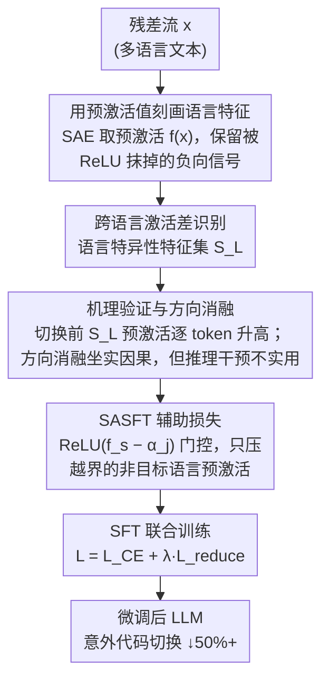

# SASFT: Sparse Autoencoder-guided Supervised Finetuning to Mitigate Unexpected Code-Switching in LLMs

## 基本信息

- **会议**: ICLR 2026
- **arXiv**: [2507.14894](https://arxiv.org/abs/2507.14894)
- **代码**: [GitHub](https://github.com/Aatrox103/SASFT)
- **领域**: 自然语言处理 / 大语言模型
- **关键词**: Code-Switching, Sparse Autoencoder, Multilingual LLMs, SFT, Language Features

## 一句话总结

利用稀疏自编码器（SAE）发现 LLM 中意外语言切换与目标语言特征异常高预激活值相关，提出 SASFT 方法在 SFT 训练中约束语言特征预激活值，将意外代码切换降低 50% 以上。

## 研究背景与动机

### 问题背景
多语言 LLM（如 Qwen-3、Llama-4、Gemma-3）在生成回复时经常出现意外的语言切换（code-switching），例如英文问题的回答中突然插入中文或韩文，严重影响用户体验。

### 现有方法的局限

**唯一已知尝试**：Guo et al. (2025) 使用 GRPO + 语言一致性奖励处理 DeepSeek-R1 的代码切换问题，但缺乏机理分析，效果有限；

**缺乏根本理解**：现有工作未深入分析代码切换的内部机制。

### 核心发现
通过 SAE 分析发现：
1. LLM 中存在**语言特异性特征**（language-specific features）——残差流中仅在处理特定语言 token 时有大投影值的方向；
2. 意外代码切换发生时，目标语言特征的**预激活值异常升高**；
3. 消融实验证实降低这些特征可减少代码切换。

## 方法详解

### 整体框架

SASFT 是一条"先诊断、再治疗"的流水线。诊断侧先用稀疏自编码器在残差流里定位"负责某种语言"的特异性特征，证实意外代码切换发生前这些特征的预激活值会异常爬升，并用方向消融从干预侧坐实因果；治疗侧把这个观测转化成一个辅助损失，在 SFT 阶段直接压住非目标语言特征的预激活值，让模型学会自己不越界，从而把推理时的干预提前固化进训练。

### 关键设计

**1. 用预激活值而非激活值刻画语言特征：保留被 ReLU 抹掉的负向信号**

给定残差流 $\mathbf{x} \in \mathbb{R}^N$，SAE 先编码出预激活 $\mathbf{f(x)} = \mathbf{W}_{\text{enc}} \mathbf{x} + \mathbf{b}_{\text{enc}}$，再经 $\mathbf{a(x)} = \text{ReLU}(\mathbf{f(x)})$ 得到稀疏激活（特征维度 $M \gg N$）。常规做法只看激活值 $\mathbf{a(x)}$，但 ReLU 会把所有负值截断为零，而本文要监控的恰恰是"一个本该保持负值或低值的语言特征慢慢被推高"的过程——这部分信息在 $\mathbf{a(x)}$ 里完全丢失。因此 SASFT 全程以预激活值 $\mathbf{f(x)}$ 为分析与约束对象，才能捕捉到代码切换爆发前那段连续上升的预兆。

**2. 用跨语言激活差识别语言特异性特征：把"只为某语言服务"的方向挑出来**

要约束语言特征，先得知道哪些特征属于哪种语言。沿用 Deng et al. (2025) 的度量，对特征 $s$ 和语言 $L$ 计算单语性分数 $\nu_s^L = \mu_s^L - \gamma_s^L$，其中 $\mu_s^L$ 是该特征在语言 $L$ 文本上的平均激活、$\gamma_s^L$ 是它在其余语言上的平均激活。差值越大说明该特征越只在处理 $L$ 的 token 时被点亮，于是取 $\nu$ 最高的一批特征构成语言 $L$ 的特异性特征集 $\mathcal{S}_L$。这一步依赖多语言校准数据来估计两个均值。

**3. 机理验证与方向消融的局限：先证明因果，再说明为什么不在推理时改**

定位到 $\mathcal{S}_L$ 后，作者验证它确实是代码切换的"开关"：统计显示切换到语言 $L$ 之前，$\mathcal{S}_L$ 中特征的预激活值逐 token 升高；进一步做方向消融，在残差流里沿语言方向 $\mathbf{d}$ 减去一个分量 $\mathbf{x}' \leftarrow \mathbf{x} - \lambda \mathbf{d}$，代码切换率随之下降，从干预侧坐实了因果关系。但推理时消融并不实用：一是要把预激活压得足够低才见效，幅度过大会牵连其他能力；二是每步生成都需外部钩子介入，平添推理开销。正是这两个缺陷促使作者把约束搬到训练阶段。

**4. SASFT 辅助损失：用带阈值的 ReLU 门控只惩罚越界的预激活值**

训练时在交叉熵之外加一项约束，教模型自己把非目标语言特征压在合理范围内：

$$
L_{\text{reduce}} = \mathbb{E}_{\mathcal{D}_j \sim \mathcal{D} \setminus \{\mathcal{D}_L\}}\left[\mathbb{E}_{\mathbf{x} \sim \mathcal{D}_j}\left[\sum_{s \in \mathcal{S}_L} \text{ReLU}(\mathbf{f}_s(\mathbf{x}) - \alpha_j)\right]\right]
$$

其中外层期望刻意排除目标语言自身的数据 $\mathcal{D}_L$（在 $L$ 文本里激活 $L$ 特征是正常的，不该惩罚），内层只对特异性特征集 $\mathcal{S}_L$ 求和。关键是 $\text{ReLU}(\mathbf{f}_s(\mathbf{x}) - \alpha_j)$ 这个门控：阈值 $\alpha_j$ 取该特征预估的平均预激活值而非零（因为预激活均值常为负，设零会过度压制），只有预激活超过 $\alpha_j$ 时才产生梯度，使损失只纠正"异常升高"而不打扰正常波动。总损失为 $L_{\text{training}} = L_{\text{cross-entropy}} + \lambda L_{\text{reduce}}$，并可跨多层同时施加约束以获得更稳定的效果。

## 实验

### 主实验：代码切换率对比

| 模型 | 方法 | CS→中文 | CS→俄语 | CS→韩语 |
|------|------|---------|---------|---------|
| Gemma-2-2B | SFT (基线) | 0.74% | 0.57% | 3.45% |
| | SFT+GRPO | 0.74 (0%) | 0.49 (-14%) | 3.44 (0%) |
| | SFT+Penalty | 0.67 (-10%) | 0.41 (-27%) | 1.18 (-66%) |
| | **SASFT** | **0.42 (-43%)** | **0.22 (-61%)** | **0.73 (-79%)** |
| Gemma-2-9B | SFT (基线) | 0.78% | 0.12% | 0.81% |
| | **SASFT** | **0.41 (-47%)** | **0.01 (-94%)** | **0.13 (-84%)** |
| Llama-3.1-8B | SFT (基线) | 1.16% | 0.67% | 0.57% |
| | **SASFT** | — | — | — |

### 消融实验：不同组件的影响

| 配置 | CS→中文 (↓) | MMLU (↑) | HumanEval (↑) |
|------|------------|---------|--------------|
| SFT 基线 | 0.78% | 69.2 | 42.1 |
| SASFT (单层) | 0.52% | 69.5 | 42.8 |
| SASFT (多层) | **0.41%** | **69.8** | **43.2** |
| 推理时消融 | 0.45% | 67.3 | 40.5 |

### 关键发现

1. **SASFT 在大多数情况下将代码切换降低 50% 以上**，韩语场景甚至实现 100% 消除；
2. **显著优于 GRPO**：GRPO 在多数设置下几乎无效（0% 改善），而 SASFT 持续有效；
3. **不损害多语言能力**：在 MMLU、HumanEval、Flores-200 等 6 个基准上性能保持甚至提升；
4. **多层应用效果更稳定**：跨层 SASFT 比单层更鲁棒；
5. **降低比增强更有效**：降低非目标语言特征优于增强源语言特征；
6. **训练式方法优于推理干预**：SASFT 改变模型内部行为，无推理额外开销。

## 亮点

- 首次深入分析 LLM 意外代码切换的内部机制，揭示与语言特征预激活值的因果关系
- 从推理干预到训练时约束的巧妙转换，解决了推理干预的两大缺陷
- 通用性强：在 Gemma-2、Llama-3.1、Qwen-3 三个系列五个模型上验证
- 辅助损失设计优雅，利用 ReLU 门控仅惩罚超过阈值的预激活值

## 局限性

- 需要对应模型的 SAE（Qwen-3 需自训练 SAE，额外开销未量化）
- 语言特异性特征识别依赖多语言校准数据
- 论文主要关注中文、韩文、俄文三种语言，更多语言的泛化性待验证
- 对代码切换的定义基于脚本检测，可能遗漏细粒度的词汇混用

## 相关工作

- **LLM 代码切换**: Guo et al. (2025) 发现并尝试用 GRPO 解决 DeepSeek-R1 的代码切换
- **SAE 分析**: Deng et al. (2025) 发现 LLM 中的语言特异性特征
- **多语言 LLM**: Qwen-3 (Yang et al., 2025), Llama-4 (Meta, 2025), Gemma-3 (Team et al., 2025)
- **机械可解释性**: 稀疏自编码器用于理解 LLM 内部表征

## 评分

- 新颖性：⭐⭐⭐⭐⭐ — 首次将 SAE 可解释性与代码切换问题结合，从机理到解法一气呵成
- 技术深度：⭐⭐⭐⭐ — 完整的分析-发现-解决链路，预激活值约束设计巧妙
- 实验充分度：⭐⭐⭐⭐⭐ — 5 个模型 × 3 种语言 × 6 个基准，全面覆盖
- 实用价值：⭐⭐⭐⭐⭐ — 直接解决多语言 LLM 部署中的痛点问题

<!-- RELATED:START -->

## 相关论文

- [\[ACL 2025\] MiLiC-Eval: Benchmarking Multilingual LLMs for China's Minority Languages](../../ACL2025/multilingual_mt/milic-eval_benchmarking_multilingual_llms_for_chinas_minority_languages.md)
- [\[ACL 2025\] Did Translation Models Get More Robust Without Anyone Even Noticing?](../../ACL2025/multilingual_mt/translation_robustness.md)
- [\[ACL 2025\] Code-Switching Curriculum Learning for Multilingual Transfer in LLMs](../../ACL2025/multilingual_mt/code-switching_curriculum_learning_for_multilingual_transfer_in_llms.md)
- [\[ACL 2025\] Code-Switching Red-Teaming: LLM Evaluation for Safety and Multilingual Understanding](../../ACL2025/multilingual_mt/code-switching_red-teaming_llm_evaluation_for_safety_and_multilingual_understand.md)
- [\[ICLR 2026\] ATLAS: Adaptive Transfer Scaling Laws for Multilingual Pretraining, Finetuning, and Decoding the Curse of Multilinguality](atlas_adaptive_transfer_scaling_laws_for_multilingual_pretraining_finetuning_and.md)

<!-- RELATED:END -->
