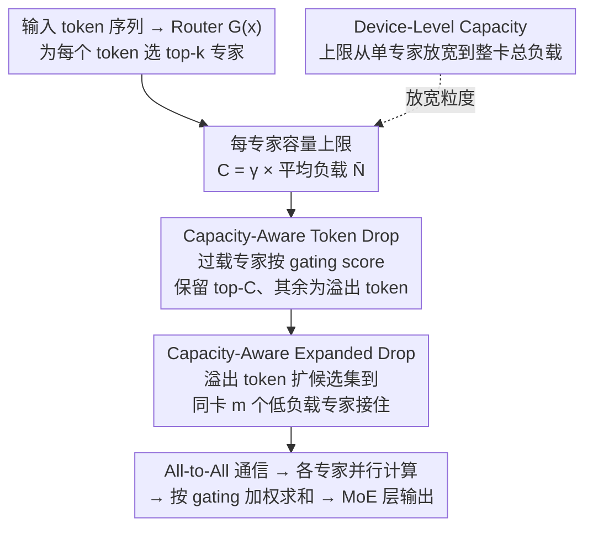

# Capacity-Aware Inference: Mitigating the Straggler Effect in Mixture of Experts

**会议**: ICLR2026  
**arXiv**: [2503.05066](https://arxiv.org/abs/2503.05066)  
**代码**: [https://github.com/CASE-Lab-UMD/Capacity-Aware-MoE](https://github.com/CASE-Lab-UMD/Capacity-Aware-MoE)  
**领域**: 多模态VLM  
**关键词**: Mixture of Experts, reasoning efficiency, straggler effect, token drop, expert parallelism

## 一句话总结
针对 MoE 推理时因 token 分配不均导致的 Straggler Effect（最重负载专家决定整体延迟），提出 Capacity-Aware Token Drop（丢弃过载专家的低分 token）和 Expanded Drop（将溢出 token 重路由到本地低负载专家），在 Mixtral-8×7B 上实现 1.85× 加速且性能提升 0.2%。

## 研究背景与动机

**领域现状**：MoE 是扩展 LLM 的关键架构——通过稀疏激活多个专家平衡性能与效率。在 expert parallelism 下，专家分布在多个 GPU 上并行计算。

**现有痛点**：训练时的负载均衡损失（auxiliary balance loss）无法保证推理时的均衡。实测表明推理时最重负载专家可承担超过平均值 7 倍的 token——低负载专家算完后只能等待高负载专家同步，造成严重延迟。

**核心矛盾**：这就是 **Straggler Effect**——MoE 层的延迟由最重负载专家决定（$L \propto \max(\{N_i\})$），而非平均负载。现有方案（如 DeepSeek-V3 复制高负载专家）需要额外GPU资源。

**本文目标** 在推理时不增加 GPU 资源的前提下，通过智能 token 调度缓解 Straggler Effect，提高推理速度。

**切入角度**：两个互补策略——对高负载专家设容量上限丢弃低重要性 token；对低负载专家扩展候选集接收溢出 token。

**核心 idea**：用 gating score 作为重要性指标限制高负载专家的 token 数，同时将溢出 token 重路由到同一 GPU 上的低负载专家，实现负载均衡和速度提升。

## 方法详解

### 整体框架
MoE 推理时，router 为每个 token 选择 top-k 专家。Capacity-Aware Inference 不改模型权重，只在 router 之后、All-to-All 通信之前插入一段容量调度：先给每个专家设容量上限 $C = \gamma \bar{N}$，**Token Drop** 让过载专家按 gating score 保留 top-$C$、其余标为溢出 token；**Expanded Drop** 把这些溢出 token 重路由到同一张 GPU 上的低负载专家接住，而不是直接丢掉；当多个专家共卡时，**Device-Level Capacity** 把上限从「每个专家」放宽到「整张卡的总负载」，允许同卡专家互相借负载。三步都发生在通信之前，所以零额外跨设备开销，调度后的 token 再走正常的 All-to-All → 专家计算 → 加权求和。

### 关键设计

**1. Capacity-Aware Token Drop：给过载专家设上限，丢掉它最不重要的那批 token**

Straggler 的根源是有的专家拿到远超均值的 token，那就直接给每个专家设一个容量天花板：最多处理 $C = \gamma \bar{N}$ 个 token，其中 $\bar{N} = tk/n$ 是期望均值、$\gamma$ 是可调的容量因子。当专家 $j$ 实际负载 $N_j > C$ 时，用一个评分函数 $\mathcal{S}$ 给它当前的所有 token 打分、保留 top-$C$、把其余溢出的丢掉。关键在于「丢谁」——论文对比了 Order / Reverse Order / Random / Score 四种选法，发现直接用 router 的 gating 分数（Score）远好于其他，因为 gating score 本身就反映了 token 与该专家的匹配度，分数低的 token 即使被丢也损失最小。看似丢 token 会伤性能，但过载专家里绝大多数 token 其实是冗余的：在 Mixtral 上只丢掉 12% 的溢出 token，就换来 85% 的加速。

**2. Capacity-Aware Expanded Drop：把丢掉的 token 重路由给同卡上的空闲专家，不浪费它们等同步的算力**

Token Drop 只解决了「削峰」，但被削掉的 token 直接消失、而那些低负载专家算完后仍在干等同步，空闲算力被白白浪费。Expanded Drop 把这两件事接起来：为每个 token 在原始 top-k 专家之外，额外把同一张 GPU 上的 $m$ 个本地专家也加进候选集（共 $k+m$ 个候选）。这样被原始专家因超容量拒绝的 token，就能被同卡的低负载专家接住。之所以只在同卡内扩展，是因为这一步发生在 All-to-All 通信之前，本地接收不产生任何跨设备通信开销。质量上之所以站得住，是因为 gating score 在 top-k 之后衰减很平缓（Figure 8）——被重路由到排名稍靠后的专家，匹配度其实没差多少，因此在 Mixtral 上 Expanded Drop 甚至比无约束 baseline 还高 0.2%。

**3. Device-Level Capacity：把约束从单专家放宽到整张卡，允许同卡专家之间互相借负载**

按专家逐个卡容量有时过严：某个专家超限、但同卡其他专家很空，仍会被迫丢 token。Device-Level Capacity 改成在设备粒度上约束——当一张 GPU 部署 $n_l$ 个专家时，只要求它们的总负载不超标：

$$N_1 + N_2 + \cdots + N_{n_l} \leq n_l \cdot \gamma \bar{N}$$

这相当于允许负载在同卡专家之间转移，缓解了专家级硬上限带来的不必要丢弃，是上面两个策略在「多专家共卡」部署下的更宽松变体。

### 损失函数 / 训练策略
本方法是纯推理时技术，**不需要重新训练**。直接在已训练好的 MoE 模型上应用，零训练成本。

## 实验关键数据

### 主实验（Expanded Drop vs Token Drop vs Expert Drop vs Baseline）

| 模型 | 方法 | 平均性能 | vs Baseline |
|------|------|---------|-------------|
| **Mixtral-8×7B-Instruct** | Baseline | 74.3 | - |
| | Token Drop ($\gamma$=1.5) | 73.8 | -0.5% |
| | Expanded Drop ($\gamma$=1.5) | **74.5** | **+0.2%** |
| | Expert Drop | 72.2 | -2.1% |
| **OLMoE-Instruct** | Baseline | 63.5 | - |
| | Token Drop ($\gamma$=2.0) | 62.3 | -1.2% |
| | Expanded Drop ($\gamma$=2.0) | **63.2** | -0.3% |
| | Expert Drop | 60.5 | -3.0% |
| **DeepSeek-V2-Lite-Chat** | Baseline | 69.3 | - |
| | Token Drop ($\gamma$=2.0) | 68.2 | -1.1% |
| | Expanded Drop ($\gamma$=2.0) | **68.9** | -0.4% |

### 消融实验（Token Drop 评分函数比较，OLMoE，$\gamma$=1.0）

| 评分函数 | OBQA | PIQA | MMLU | 平均 |
|---------|------|------|------|------|
| Order | 36.0 | 60.2 | 36.9 | 51.8 |
| Reverse Order | 36.2 | 59.5 | 38.7 | 52.0 |
| Random | 34.0 | 63.1 | 35.7 | 53.1 |
| **Score** | **41.6** | **76.0** | **47.8** | **61.1** |

### 关键发现
- **Score 评分远优于其他方法**：在 $\gamma$=1.0 时平均性能 61.1 vs Random 53.1（+8%），gating score 是 token 重要性的有效指标
- **低负载专家至关重要**：Expert Drop（跳过 10% 最轻专家）仅移除 2% token 却导致 3% 性能下降，而 Token Drop 移除 12% token 仅降 0.9%——说明每个专家即使负载低也承载独特知识
- **Expanded Drop 性能可超 baseline**：在 Mixtral 上 Expanded Drop 比无约束 baseline 还高 0.2%，说明重路由 token 到更多专家反而提升了表征质量
- **加速效果受 GPU-专家比影响**：每 GPU 1-2 个专家时加速最大（Mixtral 1.85×），每 GPU 8 个专家时效果减弱（因为聚合负载稀释了单个专家的瓶颈效应）
- **多模态模型中图像 token 可激进压缩**：对视觉 MoE 模型可以用 $\gamma$=0.5 仍保持性能，说明图像 token 在专家中有大量冗余

## 亮点与洞察
- **推理时免训练的负载均衡**：不需要重训模型，直接在推理时通过容量约束和重路由实现负载均衡——这对已部署的 MoE 模型（如 Mixtral、DeepSeek）有直接应用价值
- **Expanded Drop 的本地性设计**：只在同一 GPU 上扩展候选专家，完全避免跨设备通信开销。这是一个简单但关键的工程洞察——利用等待同步的空闲时间做有用计算
- **gating score 尾部平坦的发现**：Figure 8 展示 top-k 之后的专家 gating score 衰减平缓，为重路由提供了理论支撑——被路由到"次优"专家的 token 其实匹配度也不差
- **丢弃少量 token 的巨大加速**：在 Mixtral 上丢弃 12% 溢出 token 获得 85% 加速，说明 Straggler Effect 的长尾分布特性使得少量干预即可获得巨大收益

## 局限与展望
- **未考虑 token 丢弃对生成质量的影响**：评估仅在分类/选择题 benchmark 上进行，未测试开放式文本生成时丢弃 token 是否导致输出连贯性问题
- **静态容量因子**：$\gamma$ 是全局固定的。不同层、不同输入可能需要不同的容量策略——自适应 $\gamma$ 可能效果更好
- **仅测试推理场景**：在训练时的 Token Drop 和推理时的区别未深入探讨，且与训练时辅助损失的交互未研究
- **KV cache 影响未讨论**：token 在某层被丢弃后，后续层如何处理其缺失的信息传递（残差连接）需要更多分析

## 相关工作与启发
- **vs DeepSeek-V3 的专家复制**：DeepSeek-V3 通过在多个设备上复制高负载专家来缓解不均衡，需要额外 GPU 资源。本文方法零额外硬件开销，更加实用
- **vs Switch-Transformer Token Drop**：Switch-Transformer 在训练时用 Order 策略做 Token Drop。本文证明 Score 策略远优于 Order（+9%），且首次将 Token Drop 系统性地应用于推理
- **vs Expert Pruning**：专家剪枝（跳过低负载专家）虽然也减少计算，但性能下降严重。本文对比清楚表明低负载专家不可删除

## 评分
- 新颖性: ⭐⭐⭐⭐ Straggler Effect 的明确定义和系统分析是贡献，Expanded Drop 利用空闲容量的思路巧妙
- 实验充分度: ⭐⭐⭐⭐⭐ 4 个 MoE 模型 + 多模态实验 + 评分函数消融 + 效率分析 + 设备级变体
- 写作质量: ⭐⭐⭐⭐ 问题定义清晰，公式推导完整，图表丰富
- 价值: ⭐⭐⭐⭐⭐ 对已部署 MoE 模型的推理优化有直接实用价值，代码已开源

<!-- RELATED:START -->

## 相关论文

- [\[ICML 2026\] Toward Structural Multimodal Representations: Specialization, Selection, and Sparsification via Mixture-of-Experts](../../ICML2026/multimodal_vlm/toward_structural_multimodal_representations_specialization_selection_and_sparsi.md)
- [\[ICML 2026\] SAME: Stabilized Mixture-of-Experts for Multimodal Continual Instruction Tuning](../../ICML2026/multimodal_vlm/same_stabilized_mixture-of-experts_for_multimodal_continual_instruction_tuning.md)
- [\[CVPR 2026\] MoE-GRPO: Optimizing Mixture-of-Experts via Reinforcement Learning in Vision-Language Models](../../CVPR2026/multimodal_vlm/moe-grpo_optimizing_mixture-of-experts_via_reinforcement_learning_in_vision-lang.md)
- [\[ICLR 2026\] Procedural Mistake Detection via Action Effect Modeling](procedural_mistake_detection_via_action_effect_modeling.md)
- [\[AAAI 2026\] MCMoE: Completing Missing Modalities with Mixture of Experts for Incomplete Multimodal Action Quality Assessment](../../AAAI2026/multimodal_vlm/mcmoe_completing_missing_modalities_with_mixture_of_experts_for_incomplete_multi.md)

<!-- RELATED:END -->
