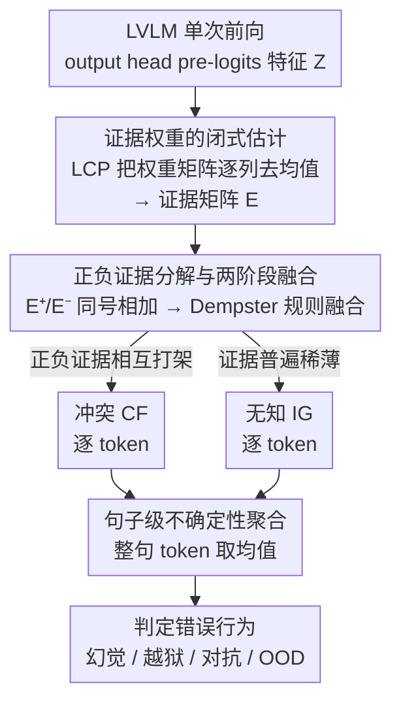

# Detecting Misbehaviors of Large Vision-Language Models by Evidential Uncertainty Quantification

**会议**: ICLR2026  
**arXiv**: [2602.05535](https://arxiv.org/abs/2602.05535)  
**代码**: [HT86159/EUQ](https://github.com/HT86159/EUQ)  
**领域**: 多模态VLM  
**关键词**: LVLM uncertainty, evidential reasoning, Dempster-Shafer, misbehavior detection, hallucination

## 一句话总结

提出 EUQ（Evidential Uncertainty Quantification），基于 Dempster-Shafer 证据理论将 LVLM 的认识不确定性分解为**冲突 CF**（内部矛盾）和**无知 IG**（信息缺失），无需训练、单次前向传播即可检测幻觉/越狱/对抗/OOD 四类错误行为，平均 AUROC 相对最佳基线提升 10.4%/7.5%。

## 研究背景与动机

LVLM 在面对困难、分布偏移或对抗性输入时，会产生四类典型**错误行为**（misbehavior）：

- **幻觉**：输出与视觉内容不一致（物体/关系/属性幻觉）
- **越狱**：被恶意视觉提示诱导生成有害内容
- **对抗脆弱**：像素级不可察觉扰动导致错误预测
- **OOD 失败**：面对训练分布外的风格/质量偏移无法正确识别

现有不确定性量化（UQ）方法的三个核心不足：

1. **贝叶斯方法计算量过大**——对 LVLM 规模不可行
2. **采样方法需多次推理**——如语义熵（SE）需生成 10 次才能估计一致性，延迟 10 倍
3. **只捕获总体不确定性**——无法区分"模型内部有矛盾证据"和"模型根本缺乏相关知识"

本文的核心洞察：不同错误行为对应不同的认识不确定性来源。幻觉时模型同时有支持和反对的证据（高冲突），OOD 失败时模型缺乏相关知识（高无知）。这一区分为有针对性的错误检测提供了理论基础。

## 方法详解

### 整体框架

EUQ 把 LVLM 单次前向得到的 output head pre-logits 特征当作"证据"，套用 Dempster-Shafer 证据理论拆出两种认识不确定性：支持与反对相互打架的**冲突 CF**，以及证据普遍稀薄的**无知 IG**。整个过程都是闭式计算，不需要训练、采样或多次推理，每个 token 都能近乎零成本地拿到一对不确定性读数，再聚合成句子级度量去判定错误行为。

### 关键设计

**1. 证据权重的闭式估计：把线性投影层的每个特征解读为一份证据**

output head 的投影层 $\mathbf{H} = \mathbf{Z}\mathbf{W} + \mathbf{b}$ 把 pre-logits 特征 $\mathbf{Z} \in \mathbb{R}^I$ 映射到各输出维度，方法要回答的核心问题是：第 $i$ 个特征 $z_i$ 究竟为第 $j$ 个假设 $h_j$ 提供了多少支持或反对，记作证据权重 $e_{ij}$。直接反解会有无穷多组解，作者引入最小承诺原则（LCP）来定锚——在能解释投影结果的前提下让证据尽量"不过度承诺"，即求解 $\min_{\mathbf{A},\mathbf{B}} \|\mathbf{A} \odot \mathbf{Z}^\top + \mathbf{B}\|_2^2$，得到闭式解 $\mathbf{A}^* = W - \mu_0(W)$，本质上只是对权重矩阵逐列去均值。正因为这一步无需任何训练或迭代优化，整套不确定性量化才能做到近乎零开销。

**2. 正负证据分解与两阶段融合：让"有矛盾"和"缺知识"各走各的账**

拿到证据矩阵 $\mathbf{E} \in \mathbb{R}^{I \times J}$ 后，按符号拆成支持假设的正证据 $\mathbf{E}^+ = \max(0, \mathbf{E})$ 和反对假设的负证据 $\mathbf{E}^- = \max(0, -\mathbf{E})$，融合分两阶段进行。第一阶段利用证据权重的可加性（Lemma 2），把同号证据直接相加，绕开了 Dempster-Shafer 框架里指数级的功率集枚举；第二阶段才用 Dempster 规则融合正负两侧，并从中读出两个互补的量。冲突 $\mathbf{CF} = \sum_j \eta_j^+ \cdot \eta_j^-$ 在某个假设 $h_j$ 同时被强支持又被强反对时两项乘积变大，对应模型内部自相矛盾；无知 $\mathbf{IG} = \sum_j \exp(-e_j^-)$ 则在负证据越弱（$e_j^-$ 越小）时指数项越接近 1，对应模型压根缺乏相关信息。正是这种正负分账，让"内部冲突"和"信息缺失"两类错误来源第一次能被分别量化，而不是混成一个笼统的总不确定性。

**3. 句子级不确定性聚合：从逐 token 读数汇成整句判断**

LVLM 是逐 token 生成的，上述每一步都会产出一对 CF/IG。EUQ 取一句话内所有 token 的均值作为句子级冲突和无知度量，用它去判定整段输出属于幻觉、越狱、对抗还是 OOD。均值聚合虽简单，却能避免被个别 token 的极端读数带偏，让句子级判断更稳。

## 实验结果

### Misbehavior-Bench 评测体系

为统一衡量四类错误，作者构建了涵盖 4 类错误行为、9 个数据集的评测基准：

| 错误类型 | 数据集 | 样本数 | 问题类型 |
|---------|--------|-------|---------|
| 幻觉 | POPE + R-Bench | 2000 | 多选 |
| 越狱 | FigStep + Hades + VisualAdv + Typographic | 2800 | 开放式/多选 |
| 对抗 | ANDA + PGN | 400 | 是/否 |
| OOD | OOD-Bench | 1300 | 是/否 |

评估模型：DeepSeek-VL2-Tiny、Qwen2.5-VL-7B、InternVL2.5-8B、MoF-7B（覆盖 SwiGLU 和 MoE 架构）。

### 总体对比（4 模型 × 4 场景平均）

| 方法 | 类型 | AUROC | AUPR | 额外开销 |
|------|------|-------|------|---------|
| SC (self-consistency) | 采样 ×10 | 0.626 | 0.730 | 8.9×10⁻¹s |
| SE (semantic entropy) | 采样 ×10 | 0.624 | 0.661 | 9.0×10⁻¹s |
| PE (predictive entropy) | 概率 | 0.701 | 0.656 | 3.1×10⁻⁶s |
| LN-PE | 概率 | 0.704 | 0.660 | 6.1×10⁻⁶s |
| HiddenDetect | 隐层特征 | 0.707 | 0.658 | 2.0×10⁻²s |
| **CF (ours)** | 证据融合 | **0.812** | 0.783 | 9.1×10⁻⁴s |
| **IG (ours)** | 证据融合 | 0.783 | **0.785** | 4.5×10⁻³s |

CF 相对最佳基线 HiddenDetect 的 AUROC 提升 10.5%，同时计算开销仅为采样方法的 ~1/1000。

### 分场景最优检测指标（AUROC，4 模型平均）

| 错误类型 | CF | IG | 最佳基线 | CF/IG 相对提升 |
|---------|------|------|---------|--------------|
| 幻觉 | **0.761** | 0.657 | PE 0.742 | CF +2.6% |
| 越狱 | **0.757** | 0.665 | HiddenDetect 0.752 | CF +0.7% |
| 对抗 | 0.836 | **0.861** | LN-PE 0.717 | IG +20.1% |
| OOD | 0.894 | **0.948** | HiddenDetect 0.694 | IG +36.6% |

核心发现：**幻觉 ↔ 高冲突**（CF 最佳），**OOD ↔ 高无知**（IG 最佳）；对抗场景两者均有效但 IG 更优，符合对抗扰动导致信息缺失的直觉。

### 层级动态分析

- **IG 随层深递减**：深层积累更多支持性线索，无知逐步消除
- **CF 随层深递增**：深层特征更具任务相关性，不同通道竞争加剧导致冲突上升
- 这一规律符合信息瓶颈理论——深层压缩冗余输入、增强判别信息

### 消融实验

- **温度鲁棒性**：温度从 0.1 到 1.4，CF 和 IG 的检测性能保持稳定
- **模型规模效应**：4B 和 38B 检测性能较好（小模型错误明显易捕获，大模型错误稀少但模式清晰），8B 中等模型的细微错误最难检测
- **外部提示无效**：添加 "None of the above" 选项后，Qwen 仅 0.27% 选择、Intern 0.00%——模型过度自信导致提示策略失效

## 亮点与局限

### 亮点

- **首次在 LVLM 中将认识不确定性分解为冲突和无知**——提供可解释的错误诊断：不同错误行为对应不同不确定性来源，指导有针对性的修复策略
- **零训练 + 单次前向传播**——闭式解无需优化，UQ 开销 <1ms，实际部署几乎无感
- **理论扎实**——从 Dempster-Shafer 证据理论出发，Lemma 1（闭式估计）、Lemma 2（可加性）、Theorem 1（CF/IG 表达式）层层递进
- **通用性**——方法适用于任何含线性投影层的模型（BERT、ResNet、LLM），不限于 VLM

### 局限

- 需要访问模型内部表示，无法用于 GPT-4 等闭源 API
- 对抗/越狱场景 CF 和 IG 性能接近，难以单独归因
- 目前层级分析仅在特定层能区分全部 4 类错误，尚无自动最优层选择机制

## 局限与展望
- 仅使用 output head 特征，未利用中间层的丰富信息
- 证据权重的闭式解依赖线性投影假设
- 目前是检测而非修复——检测到不确定性后如何改善输出是下一步

## 相关工作与启发
- **vs Semantic Entropy**：需多次采样+外部模型评估等价语义。EUQ 单次前向即可
- **vs Verbalized Confidence**：依赖模型元认知能力（不可靠）。EUQ 从特征直接提取
- **vs Evidential Deep Learning**：需要训练。EUQ 完全无需训练

## 评分
- 新颖性: ⭐⭐⭐⭐⭐ 首次将证据理论的 CF/IG 分解应用于 LVLM 错误检测
- 实验充分度: ⭐⭐⭐⭐⭐ 4 模型 × 4 类错误 × 多基线，层级分析有深度
- 写作质量: ⭐⭐⭐⭐ 理论推导严谨，可视化有帮助
- 价值: ⭐⭐⭐⭐⭐ 对 LVLM 可信度和安全部署有直接实用价值

<!-- RELATED:START -->

## 相关论文

- [\[ACL 2026\] VAUQ: Vision-Aware Uncertainty Quantification for LVLM Self-Evaluation](../../ACL2026/multimodal_vlm/vauq_vision-aware_uncertainty_quantification_for_lvlm_self-evaluation.md)
- [\[ICML 2026\] Debate with Images: Detecting Deceptive Behaviors in Multimodal Large Language Models](../../ICML2026/multimodal_vlm/debate_with_images_detecting_deceptive_behaviors_in_multimodal_large_language_mo.md)
- [\[CVPR 2026\] Topo-R1: Detecting Topological Anomalies via Vision-Language Models](../../CVPR2026/multimodal_vlm/topo-r1_detecting_topological_anomalies_via_vision-language_models.md)
- [\[CVPR 2026\] Uncertainty-Aware Knowledge Distillation for Multimodal Large Language Models](../../CVPR2026/multimodal_vlm/uncertainty-aware_knowledge_distillation_for_multimodal_large_language_models.md)
- [\[ICLR 2026\] CityLens: Evaluating Large Vision-Language Models for Urban Socioeconomic Sensing](citylens_evaluating_large_vision-language_models_for_urban_socioeconomic_sensing.md)

<!-- RELATED:END -->
