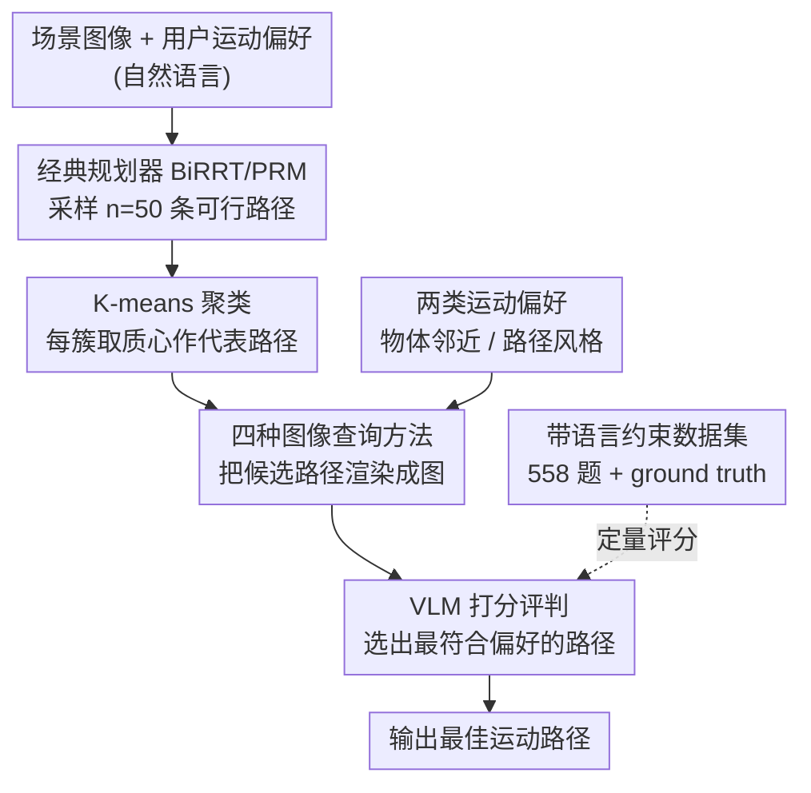

# Evaluating VLMs' Spatial Reasoning Over Robot Motion: A Step Towards Robot Planning with Motion Preferences

**会议**: ICLR 2026  
**arXiv**: [2603.13100](https://arxiv.org/abs/2603.13100)  
**代码**: 无  
**领域**: 多模态VLM  
**关键词**: VLM空间推理, 机器人运动规划, 运动偏好, 路径选择, 视觉语言模型评估  

## 一句话总结

系统评估了 VLM 对机器人运动路径的空间推理能力，提出 4 种图像查询方法用于让 VLM 根据用户自然语言描述选择最佳运动路径，发现 Qwen2.5-VL 零样本准确率达 71.4%，且微调后小模型可获显著提升。

## 研究背景与动机

在人机交互场景中，用户需要以自然语言表达对机器人运动的偏好，例如"远离窗户移动"或"沿曲线路径行进"。VLM 具备的语义知识和空间推理能力可能增强机器人规划器对新任务的泛化能力。

然而，现有研究的关键空白在于：

**运动偏好被忽视**：现有 VLM-机器人研究主要关注任务规划（做什么），而非运动规划（怎么走）——路径的拓扑属性和风格偏好从未被系统研究

**空间推理能力未知**：VLM 是否真的能理解"远离/靠近某物体"、"曲线/直线路径"等空间约束，缺乏定量评估

**集成路径不明**：将 VLM 集成到运动规划 pipeline 中的最佳方式（图像查询策略）尚未探索

## 方法详解

### 整体框架

整体是一条"生成候选—可视化—VLM 评分选择"的运动规划流水线：经典采样规划器先生成一批多样化的候选路径，把这些路径以彩色轨迹叠加渲染到场景图像上，再把图像连同用户的自然语言运动偏好一起交给 VLM，让它对候选路径打分并选出最符合偏好的那条。VLM 在这里扮演的不是路径生成器，而是运动质量的评判器，负责把"远离窗户""走曲线"这类语言约束落到具体路径选择上。两类运动偏好规定了 VLM 要听懂哪些语言约束，带 ground truth 的数据集则给每道题钉死标准答案、让整条流水线可以被定量打分。

### 关键设计

**1. 候选路径生成与聚类：用经典规划器保证可行性、用聚类保证多样性**

直接让 VLM 生成路径既不可靠也无法保证无碰撞，因此候选路径仍由经典规划器产出：用 BiRRT 加 PRM 采样出 $n=50$ 条候选路径，这些路径都已满足避障等几何可行性约束。但 50 条路径里有大量彼此高度相似的冗余，若全部塞给 VLM 既浪费 token 又干扰判断，所以先用 K-means 把候选路径聚成若干簇，每簇只保留最接近质心的那条作为代表。这样 VLM 面对的是一小组在拓扑和风格上真正不同的路径，比较起来更有区分度。

**2. 四种图像查询方法：把"路径选择"翻译成 VLM 能读懂的视觉问题**

VLM 只能看图说话，如何把多条候选路径呈现给它直接决定了推理质量，论文系统对比了四种查询策略。Single-image trajectory 把所有候选路径用不同颜色一次性画在同一张图上，VLM 一次查询就能横向比较，图像数 1、查询数 1；Multi-image trajectory 把每条路径单独画一张图，逐张查询并打分，需要 $k$ 张图、$k$ 次查询；Single-image + visual context 先让 VLM 生成一段图像描述、再结合描述在同一张图上做选择，用 2 次查询换取额外上下文；Screenshot gallery 则为每条路径渲染机器人沿途运动的截图序列拼成画廊。后文实验表明把所有路径放进同一张图供 VLM 相对比较的 Single-image 方法效果最好，因为相对比较比逐条绝对打分更契合 VLM 的能力。

**3. 两类运动偏好：把语言约束拆成 VLM 强弱分明的两个维度**

用户的运动偏好被显式分成两类，以便分别诊断 VLM 的能力边界。物体邻近偏好（Object proximity）描述路径与环境物体的空间关系，例如"远离灯""从物体 B 和 C 之间穿过"；路径风格偏好（Path style）描述路径自身的几何属性，例如"直线""曲线""锯齿形""最短路径"。这一划分不是为了好看，实验里 VLM 在邻近类约束上的准确率一致高于风格类，说明它更擅长理解物体间的空间关系，而对纯几何形状的把握偏弱，这条划分直接定位了能力短板所在。

**4. 带语言约束的运动规划数据集：在仿真里给每个问题钉死 ground truth**

为了能定量评估，作者在 iGibson 仿真环境中构建了 558 个带语言约束的运动规划问题，其中 126 个导航任务、432 个操控任务，并为每个问题手动标注了符合该语言偏好的 ground truth 路径。有了逐题的标准答案，VLM 选出的路径是否正确就能直接判定，整套查询方法和模型对比才有可比的统一标尺。

### 损失函数 / 训练策略

评估以零样本为主，微调只作为补充实验。微调采用 SFT（监督微调），在 98 个训练样本上对 LLaVa1.5-7B 和 Qwen2.5-VL-7B 等小模型进行训练，并在含 28 个问题的测试集上评估，用以考察少量样本下 VLM 适配新运动偏好的潜力。

## 实验关键数据

### 主实验

**不同查询方法的总体准确率（导航任务，Qwen2.5-VL-72B）**：

| 查询方法 | 准确率 | Token消耗 |
|----------|--------|-----------|
| Single-image trajectory | **71.4%** | 687.3 |
| Multi-image trajectory | ~55% | 高 |
| Single-image + visual context | ~68% | 中 |
| Screenshot gallery | 略高于随机 | 高 |

**不同 VLM 在导航任务上的表现（Single-query 方法）**：

| 模型 | 邻近偏好 | 路径风格 | 总体 |
|------|----------|----------|------|
| **Qwen2.5-VL-72B** | **74.4%** | **63.9%** | **71.4%** |
| GPT-4o | 较低 | 较低 | 低于Qwen |
| LLaVa1.5 | 最低 | 最低 | ~随机 |

**操控任务表现**：

| 模型 | 邻近偏好 | 路径风格 |
|------|----------|----------|
| Qwen2.5-VL-72B | **66.3%** | 65.5% |
| GPT-4o | 较低 | **69.5%** |

### 消融实验

**微调效果（28 个测试问题）**：

| 模型 | 微调前（零样本） | 微调后 | 提升 |
|------|------------------|--------|------|
| Qwen2.5-VL-7B | ~55% | **75%** | +20% |
| LLaVa1.5-7B | ~15% | ~75% | **+60%** |
| Qwen2.5-VL-3B | ~45% | ~55% | +10% |

**Token 数量与准确率的关系**：准确率随 token 数量（即图像大小）近似线性增长。在 200-800 token 范围内，Qwen2.5-VL-7B 和 72B 均呈现线性趋势。

### 关键发现

1. **Single-image 最优**：将所有路径放在同一张图中让 VLM 能进行相对比较，优于逐张评分
2. **邻近偏好优于路径风格**：邻近类型准确率一致高于路径风格类型，因为 VLM 更擅长理解物体空间关系而非路径几何属性
3. **导航优于操控**：导航任务总体成功率（71.4%）高于操控任务（65.5%），因为操控场景中路径差异更细微
4. **Visual context 无效**：额外生成视觉描述对大模型无帮助，可能引入冗余信息，反而与模型内置的上下文追踪冲突
5. **微调效率高**：仅 98 个样本即可带来显著提升，说明 VLM 架构具备快速适配新运动偏好的能力

## 亮点与洞察

1. **问题视角新颖**：首次系统研究 VLM 对机器人运动路径（而非目标/子目标）的空间推理能力，从任务规划扩展到运动质量控制
2. **评估框架完整**：4 种查询方法 × 3 种 VLM × 2 类偏好 × 2 种任务类型的全面交叉评估
3. **实用发现**：最简单的 single-image 方法在效果和计算成本上双赢，为实际部署提供清晰指导
4. **微调潜力大**：少量样本微调即可大幅提升小模型性能，降低部署门槛

## 局限与展望

1. **VLM 幻觉问题**：模型偶尔选择不存在的颜色路径（如选了"红色"但没有红色路径）
2. **最短/最长路径识别差**：这类问题恰好是经典最优规划器（RRT*, PRM*）的强项，应融合使用
3. **仅限仿真环境**：实际机器人场景中的视觉复杂度、遮挡和动态变化未涉及
4. **准确率尚不足以直接部署**：71.4% 的准确率在安全关键场景中仍需人类介入
5. **未考虑动态障碍物和多步规划**：数据集均为静态场景的单步路径选择

## 相关工作与启发

- **与 SayCan/PaLM-E 的区别**：那些工作关注任务规划（做什么），本工作关注运动属性（怎么走），互为补充
- **与 MotionGPT 的区别**：MotionGPT 生成人体运动，本工作用 VLM 评估机器人运动，且使用图像作为中间表示
- **与 IMPACT 的区别**：IMPACT 识别可接触物体，本工作调节运动风格/约束
- **启发**：VLM 作为运动质量评判器 + 经典规划器生成候选的混合范式值得深入探索

## 评分

- 新颖性: ⭐⭐⭐⭐ — 首次系统评估 VLM 对机器人运动空间推理能力
- 实验充分度: ⭐⭐⭐⭐ — 查询方法、VLM 类型、偏好类型、任务类型覆盖全面
- 写作质量: ⭐⭐⭐ — 结构清晰但部分图表呈现可改进
- 价值: ⭐⭐⭐⭐ — 为 VLM 融入运动规划 pipeline 提供了扎实的基准和可行性证据

<!-- RELATED:START -->

## 相关论文

- [\[ICLR 2026\] Spatial-DISE: A Unified Benchmark for Evaluating Spatial Reasoning in Vision-Language Models](spatial-dise_a_unified_benchmark_for_evaluating_spatial_reasoning_in_vision-lang.md)
- [\[ICLR 2026\] SpinBench: Perspective and Rotation as a Lens on Spatial Reasoning in VLMs](spinbench_perspective_and_rotation_as_a_lens_on_spatial_reasoning_in_vlms.md)
- [\[ICML 2025\] Diffusion-VLA: Generalizable and Interpretable Robot Foundation Model via Self-Generated Reasoning](../../ICML2025/multimodal_vlm/diffusion-vla_generalizable_and_interpretable_robot_foundation_model_via_self-ge.md)
- [\[CVPR 2026\] Self-Consistency for LLM-Based Motion Trajectory Generation and Verification](../../CVPR2026/multimodal_vlm/self-consistency_for_llm-based_motion_trajectory_generation_and_verification.md)
- [\[CVPR 2025\] Efficient Motion-Aware Video MLLM](../../CVPR2025/multimodal_vlm/efficient_motion-aware_video_mllm.md)

<!-- RELATED:END -->
