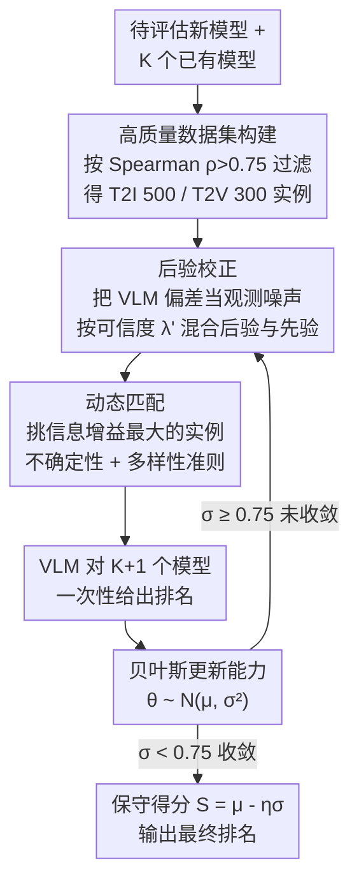

# K-Sort Eval: Efficient Preference Evaluation for Visual Generation via Corrected VLM-as-a-Judge

**会议**: ICLR 2026  
**arXiv**: [2602.09411](https://arxiv.org/abs/2602.09411)  
**代码**: [GitHub](https://github.com/zkkli/K-Sort-Eval)  
**领域**: 多模态VLM  
**关键词**: VLM-as-a-Judge, 偏好评估, 后验校正, 动态匹配, 视觉生成

## 一句话总结
提出 K-Sort Eval 框架，通过后验校正和动态匹配策略，使 VLM 能可靠高效地替代人类进行视觉生成模型的偏好评估，通常只需不到 90 次模型运行即可得出与人类 Arena 一致的结果。

## 研究背景与动机
- 视觉生成模型（text-to-image、text-to-video）发展迅速，但评估方法滞后，传统指标（FID、IS、FVD）无法反映人类偏好
- Arena 平台（如 K-Sort Arena）通过众包投票收集人类偏好，但成本高、耗时长、扩展性差
- 直接用 VLM（如 GPT-4o）替代人类评判虽有前景，但 VLM 存在幻觉和偏见，与人类偏好对齐不佳
- 现有方法采用静态评估方式，需遍历整个数据集，效率低下

## 方法详解

### 整体框架
K-Sort Eval 构建在 K-Sort Arena 之上，要评估的新模型会与数据集里 $K$ 个已有模型组成 $(K+1)$-wise 自由竞争，让 VLM 一次性给出排名。整套流程由三件事串起来：先从人类投票里筛出一批高质量对比实例，再用一套后验校正把 VLM 与人类的偏差掰回来，最后靠动态匹配只挑最有信息量的实例去问 VLM，从而在几十次运行内收敛出可信排名。整个评估是一个在线循环：每一轮先对当前能力后验做校正，再据此挑下一个最值得问的实例，让 VLM 给排名并更新后验，直到不确定性降到阈值以下才停。

### 关键设计

**1. 高质量数据集构建：让监督信号本身先靠谱**

VLM 校正依赖人类偏好作为参照，但 K-Sort Arena 数千次众包投票里噪声不小，单个实例的局部排名经常和全局排行榜不一致，直接拿来当真值会把误差传递下去。作者用 Spearman 秩相关系数衡量每个实例局部排名 $R_k^i$ 与全局排行榜排名 $R_k^{(L)}$ 的一致性，$\rho_i = \frac{\sum_{k=1}^K (R_k^i - \bar{R}^i)(R_k^{(L)} - \bar{R}^{(L)})}{\sqrt{\sum_{k=1}^K (R_k^i - \bar{R}^i)^2} \cdot \sqrt{\sum_{k=1}^K (R_k^{(L)} - \bar{R}^{(L)})^2}}$，只保留 $\rho_i$ 超过阈值 $\tau=0.75$ 的实例。过滤后剩下 T2I 500 个、T2V 300 个实例，确保后续校正参照的是与群体共识高度一致的样本。

**2. 后验校正：把 VLM 的不对齐当成观测噪声来吸收**

VLM 评判有幻觉和偏见，得到的能力后验会系统性偏离人类偏好。作者没有去微调 VLM，而是把这种偏差直接建模成观测噪声，由 Lemma 1 给出一个干净的结论：含噪后验等价于无噪后验与先验的加权混合，$\tilde{P}(\theta|D) = \lambda' P(\theta|D) + (1-\lambda') P(\theta)$。当 VLM 越可信，权重 $\lambda'$ 越靠近 1（结果更信 VLM 给的数据）；越不可信则越退回先验。这个可信度由 VLM 排名与人类排名的 Spearman 系数 $\rho'$ 经 sigmoid 映射得到，$\lambda' = \text{Sigmoid}(\kappa \rho')$（$\kappa=5.0$）。最终把校正落到能力分布的均值和方差上，$\hat{\mu}_c = \lambda' \hat{\mu} + (1-\lambda') \mu$、$\hat{\sigma}_c^2 = \lambda'^2 \hat{\sigma}^2 + (1-\lambda')^2 \sigma^2$，相当于用人类监督把 VLM 估计往可信方向拉，同时按可信度自动放大或收紧不确定性。

**3. 动态匹配：只问最有信息量的那几个实例**

静态评估要遍历整个数据集，问 VLM 上百上千次才停，绝大部分对比其实没带来新信息。作者改成每一步都挑信息增益最大的实例，准则是 $i^* = \arg\max_i (U_{\text{unc}}^i + \alpha U_{\text{div}}^i)$。其中不确定性项 $U_{\text{unc}}$ 偏好那些参赛模型能力接近、胜率约 50% 的实例，因为势均力敌的对决最能区分高下；多样性项 $U_{\text{div}}$ 则最小化同一实例内模型能力分布的重叠，避免反复问相似的对比，$\alpha=0.5$ 平衡两者。配合概率建模带来的自然停止信号，匹配往往几十步就能收敛。

### 损失函数 / 训练策略
方法不训练任何网络，而是用贝叶斯方式在线估计能力。每个模型的能力建模为高斯分布 $\theta \sim \mathcal{N}(\mu, \sigma^2)$，每轮 VLM 给出排名后做一次后验更新并接上述校正，直到不确定性 $\sigma$ 降到停止阈值 0.75 以下即终止。最终用保守得分 $S = \mu - \eta \sigma$（$\eta=3.0$）排名，相当于在能力均值上扣掉对不确定性的惩罚，避免把估计还不稳的模型排得过高。

## 实验关键数据

### 主实验

| 模型 | K-Sort Arena Rank | K-Sort Arena Score | K-Sort Eval Rank | K-Sort Eval Score |
|------|-------------------|-------------------|------------------|-------------------|
| FLUX.1-dev | 5 | 28.83 | 5 | 28.86 |
| Midjourney-v5.0 | 11 | 27.44 | 11 | 27.50 |
| SD-v1.5 | 29 | 20.10 | 29 | 20.03 |
| Runway-Gen3 (Video) | 2 | 33.93 | 2 | 33.98 |
| CogVideoX-5b (Video) | 3 | 33.60 | 3 | 33.63 |

### 消融实验

| 配置 | Rank | Score | #Runs |
|------|------|-------|-------|
| K-Sort Eval (完整) | 5 | 28.86 | 81 |
| w/o 后验校正 | 3 | 29.32 | 70 |
| w/o 动态匹配 | 5 | 28.79 | 500 |
| w/o Swapping操作 | 4 | 28.93 | 79 |
| w/o Rule增强 | 9 | 28.13 | 119 |

### 关键发现
- K-Sort Eval 的评估结果与完全基于人类偏好的 K-Sort Arena 高度一致（分数偏差<0.1）
- 91% 的图像模型和 93% 的视频模型评估在 90 次运行内完成，远优于 FID（50K 次）和 GenAI-Bench（1600 次）
- GPT-4o 作为评判始终优于 CLIP-based 评分方法，校正后相关性进一步提升
- 可用于评估压缩模型（蒸馏、量化），提供绝对分数和相对排名

## 亮点与洞察
- 将 VLM 判断的不对齐建模为观测噪声，通过贝叶斯框架优雅地将人类监督信号整合到 VLM 评估中
- 动态匹配策略无需遍历整个数据集，利用概率建模提供自然的停止准则
- 实用价值高：为新模型提供快速、低成本、自动化的偏好评估方案
- 同时适用于 T2I 和 T2V 任务

## 局限与展望
- 依赖 K-Sort Arena 已有数据作为监督信号，新模型类型可能覆盖不足
- VLM 评判仍有固有偏差，校正只能缓解而非消除
- 当前仅验证了 GPT-4o 和 Qwen-VL-Max 两个 VLM，更多 VLM 的适用性待验证
- 数据集规模（T2I 500、T2V 300）相对有限

## 相关工作与启发
- K-Sort Arena 的 K-wise 比较和概率建模为本文提供了核心基础
- LLM-as-a-Judge 的策略（swapping、rule augmentation）被迁移到视觉评估
- 可启发在其他模态（如音频、3D 生成）中构建类似的自动评估框架

## 技术细节补充
- VLM 判断采用 swapping（随机打乱顺序消除位置偏见）和 rule augmentation（提供与 K-Sort Arena 相同的评判指令）
- 数据集：T2I 使用 35 个模型、1800+ 投票、10800+ 成对比较；T2V 使用 14 个模型、700+ 投票
- 使用 Llama Guard 过滤有害/冒犯性 prompt，确保数据集的通用适用性
- 保守分数 $S = \mu - \eta\sigma$（$\eta=3.0$）同时反映能力估计和不确定性
- 支持 512×512 图像和 512×512@8FPS@5s 视频格式
- GPT-4o 用于 T2I 评判，Qwen-VL-Max 用于 T2V 评判（GPT-4o API 不支持视频输入）

## 评分
- 新颖性: ⭐⭐⭐⭐ 后验校正和动态匹配的组合设计新颖，但各技术单独看并不全新
- 实验充分度: ⭐⭐⭐⭐⭐ 涵盖 T2I/T2V、多个模型、压缩模型应用、完整消融
- 写作质量: ⭐⭐⭐⭐ 结构清晰，理论推导严谨
- 价值: ⭐⭐⭐⭐⭐ 极强的实用价值，解决了视觉生成评估的实际痛点

<!-- RELATED:START -->

## 相关论文

- [\[ICML 2026\] ReVSI: Rebuilding Visual Spatial Intelligence Evaluation for Accurate Assessment of VLM 3D Reasoning](../../ICML2026/multimodal_vlm/revsi_rebuilding_visual_spatial_intelligence_evaluation_for_accurate_assessment_.md)
- [\[ICLR 2026\] Customizing Visual Emotion Evaluation for MLLMs: An Open-vocabulary, Multifaceted, and Scalable Approach](customizing_visual_emotion_evaluation_for_mllms_an_open-vocabulary_multifaceted_.md)
- [\[CVPR 2026\] VLM-Guided Group Preference Alignment for Diffusion-based Human Mesh Recovery](../../CVPR2026/multimodal_vlm/vlm-guided_group_preference_alignment_for_diffusion-based_human_mesh_recovery.md)
- [\[NeurIPS 2025\] HAWAII: Hierarchical Visual Knowledge Transfer for Efficient VLM](../../NeurIPS2025/multimodal_vlm/hawaii_hierarchical_visual_knowledge_transfer_for_efficient_vision-language_mode.md)
- [\[ICCV 2025\] SparseVILA: Decoupling Visual Sparsity for Efficient VLM Inference](../../ICCV2025/multimodal_vlm/sparsevila_decoupling_visual_sparsity_for_efficient_vlm_inference.md)

<!-- RELATED:END -->
