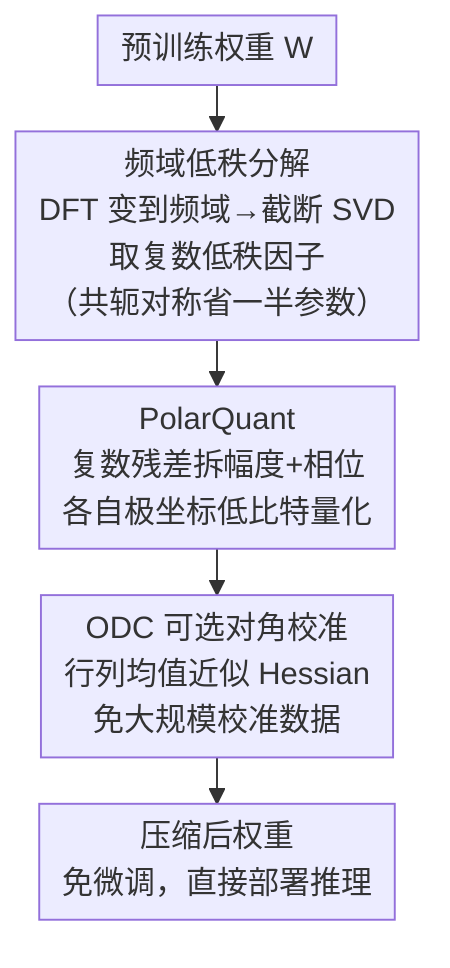

# LLaVA-FA: Learning Fourier Approximation for Compressing Large Multimodal Models

**会议**: ICLR 2026  
**arXiv**: [2602.00135](https://arxiv.org/abs/2602.00135)  
**代码**: 无  
**领域**: 多模态大模型  
**关键词**: 模型压缩, 傅里叶变换, 低秩分解, 量化, 多模态语言模型

## 一句话总结

提出 LLaVA-FA，一种在频域进行联合低秩加量化权重近似的高效多模态大模型压缩方法，利用傅里叶变换的去相关性和共轭对称性实现更紧凑准确的权重表示，并引入 PolarQuant（极坐标量化）和 ODC（可选对角校准）方案，在多个基准上以最少的激活参数和计算成本超越现有高效多模态模型。

## 研究背景与动机

大型多模态模型（LMMs）在视觉-语言任务上表现出色，但其巨大的计算和内存成本阻碍了实际部署。例如 LLaVA 70B 模型训练需要超过 800 GPU小时（A100）。

**现有压缩方法的问题**：

**低秩分解与量化解耦**：现有方法（如 LoRD、ASVD、LQER 等）将低秩分解和量化独立处理。低秩选择阶段对后续量化噪声视而不见，导致重建误差**复合叠加**

**多模态冗余未充分利用**：与纯文本 LLM 不同，大型视觉-语言模型额外携带图像编码器的跨模态适配器，每个新视觉领域的适配器秩膨胀，使得相同的低秩加量化方案对多模态模型仍显"臃肿"

**校准数据依赖**：许多压缩方法需要大规模校准数据集来估计 Hessian 矩阵

**核心问题**：如何更激进地压缩可学习参数，同时保持多模态模型的性能？

**关键观察**：傅里叶变换在数据压缩中有强大的表达能力——极稀疏的频谱信息就能恢复高保真信号。更重要的是，即使对于缺乏空间语义的权重矩阵，傅里叶变换也能有效处理近似问题。作者发现：
- LMM 权重矩阵在频域具有更紧凑的奇异值分布
- 在相同秩下，频域低秩近似的累积误差**小于**空间域
- 傅里叶变换的共轭对称性可节省近一半可学习参数

## 方法详解

### 整体框架

LLaVA-FA 把权重压缩整体搬到频域：先对权重矩阵 $W$ 做离散傅里叶变换得到 $\hat{W}=\text{DFT}(W)$，在频域做截断 SVD 拿到复数低秩因子，再用专为复数设计的 PolarQuant 把这些因子量化到低比特，最后用 ODC 做一次性误差校准。整套流程在频域/复数域里一气呵成，避免了在域之间来回转换丢信息，且全程后训练、无需微调。三个贡献（频域低秩分解、PolarQuant、ODC）对应下图自上而下的三个阶段：

### 关键设计

**1. 频域低秩分解：让奇异值衰减得更快，压得更狠误差更小**

空间域里权重矩阵的奇异值往往衰减缓慢，要保留足够多的秩才能压住重建误差，压缩空间有限。LLaVA-FA 先把 $W$ 变到频域 $\hat{W}=\text{DFT}(W)$，再对 $\hat{W}$ 做截断 SVD 得到低秩近似 $\hat{W}_r = U_r \Sigma_r V_r^H$。DFT 的去相关性把能量集中到少数频率分量上，使奇异值衰减更快——论文给出了严格证明：在相同秩下，频域低秩近似的 Frobenius 重建误差严格小于空间域，这正是"频域比空间域更适合压"的理论根据。更妙的是，实数矩阵的 DFT 满足共轭对称性，频谱的一半由另一半共轭决定，因此只需存储一半系数就能无损还原，相当于不付任何精度代价白拿一倍压缩。

**2. PolarQuant：用极坐标量化复数，保住低比特下的相位**

频域低秩分解后得到的是复数因子，直接套用实数量化方案并不合适——若把实部、虚部分开量化，在 2–4 bit 这种极低比特下相位信息会被严重扭曲。PolarQuant 改为把每个复数写成极坐标形式 $z = r e^{i\theta}$，把幅度 $r$ 和相位 $\theta$ 拆开、各用独立的缩放因子做均匀量化。这样量化网格天然贴合复数的"模长+角度"结构，相位不会因为实虚部的耦合误差而漂移，因此即便量化到 2–4 bit 仍能维持复数表示的保真度。

**3. ODC（可选对角校准）：用对角近似甩掉大规模校准数据**

传统压缩要估完整 Hessian 来校准量化与截断带来的误差，既要算大矩阵又要喂大量代表性校准数据，成本高。ODC 借助一个经验观察——深度网络的 Hessian 往往呈对角主导或低秩结构——只用行/列均值去近似整个 Hessian，把校准的计算复杂度大幅压低。结果是压缩过程几乎不依赖校准数据（或只需极少量），让整套方法真正做到"即插即用"。

### 损失函数 / 训练策略

LLaVA-FA 是纯后训练压缩，不引入任何额外微调或重训练：对预训练权重依次做 DFT、频域低秩截断、PolarQuant 量化，ODC 校准也只是一次性前向计算。压缩完即可直接部署推理，因此流程极为轻量。

## 实验关键数据

### 主实验

在多个视觉-语言基准上评估，包括理解型和幻觉型任务：

| 方法 | 激活参数 | VQAv2 | GQA | SQA | POPE | 平均 |
|------|---------|-------|-----|-----|------|------|
| LLaVA-1.5 (原始) | 7B | 基线 | 基线 | 基线 | 基线 | 基线 |
| ASVD + Q | ~2B | 较低 | 较低 | 较低 | 较低 | 较低 |
| LQER + Q | ~2B | 中等 | 中等 | 中等 | 中等 | 中等 |
| **LLaVA-FA** | **最少** | **最高** | **最高** | **最高** | **最高** | **最高** |

LLaVA-FA 在保持最少激活参数和最低计算成本的同时，在所有基准上超越了现有高效多模态模型。

### 消融实验

| 配置 | 效果 | 说明 |
|------|------|------|
| 空间域 vs. 频域低秩 | 频域更优 | 相同秩下重建误差更小 |
| 实部/虚部量化 vs. PolarQuant | PolarQuant 更优 | 保持复数结构，相位信息更完整 |
| 无 ODC vs. 有 ODC | ODC 提升明显 | 尤其在低比特量化时校准效果显著 |
| 仅低秩 vs. 低秩+量化 | 联合最优 | 频域中联合优化避免误差复合 |
| 不同比特宽度 | 4bit最佳性价比 | 2bit性能下降明显，4bit接近全精度 |

### 关键发现

1. **频域低秩近似确实优于空间域**：这不仅是实验现象，论文提供了理论证明——DFT 的去相关性使奇异值衰减更快
2. **共轭对称性带来"免费"的2倍压缩**：无需任何精度损失即可将参数量减半
3. **PolarQuant 对低比特至关重要**：在 2-4 bit 下，直接量化实部虚部会导致相位信息严重扭曲
4. **ODC 消除了校准数据瓶颈**：对角近似在深度网络 Hessian 上足够准确，使压缩变得真正"即插即用"

## 亮点与洞察

1. **开创性的频域压缩视角**：将神经网络权重压缩从空间域转到频域是全新思路，傅里叶变换的去相关、共轭对称和能量集中三大特性被充分利用
2. **理论与实践结合**：不仅有实验效果，还有严格的数学证明支撑频域低秩近似优于空间域
3. **端到端一致的设计哲学**：从低秩分解到量化再到校准，每一步都在频域/复数域中一致处理，避免了域间转换带来的信息损失
4. **极低部署门槛**：后训练压缩、无需校准数据、无需微调，使方法具有很强的实用性
5. **对多模态模型的针对性设计**：明确指出多模态模型比纯文本 LLM 面临更大的压缩挑战（跨模态适配器冗余）

## 局限与展望

1. **推理时需要频域-空间域转换**：虽然压缩了存储，推理时可能需要额外的 DFT/IDFT 计算开销
2. **主要在 LLaVA 系列验证**：是否适用于其他架构（如 Qwen-VL、InternVL）需要进一步验证
3. **极低比特（1-2 bit）表现**：在极低比特下性能损失仍然明显，可能需要结合知识蒸馏等技术
4. **硬件支持**：复数运算和极坐标量化在现有推理引擎中可能缺乏原生加速支持
5. **动态场景适应**：固定的截断秩可能不适合所有层，自适应秩选择策略值得探索

## 相关工作与启发

- **LoRA / QLoRA**：低秩适配的先驱工作，但在空间域操作
- **ASVD / FWSVD**：基于 SVD 的权重压缩，分别处理低秩和量化
- **LQER**：联合低秩加量化方法，但在空间域
- **GPTQ / AWQ**：仅量化方案，不涉及低秩分解

本文的核心启发：将信号处理中成熟的频域分析工具引入深度学习模型压缩，打开了一个全新方向。未来可能拓展到其他变换域（如小波变换）或其他模型架构。

## 评分
- 新颖性: ⭐⭐⭐⭐⭐
- 实验充分度: ⭐⭐⭐⭐
- 写作质量: ⭐⭐⭐⭐
- 价值: ⭐⭐⭐⭐

<!-- RELATED:START -->

## 相关论文

- [\[CVPR 2025\] LLaVA-Critic: Learning to Evaluate Multimodal Models](../../CVPR2025/multimodal_vlm/llava-critic_learning_to_evaluate_multimodal_models.md)
- [\[ICLR 2026\] Spatial Reasoning is Not a Free Lunch: A Controlled Study on LLaVA](spatial_reasoning_is_not_a_free_lunch_a_controlled_study_on_llava.md)
- [\[ICCV 2025\] LLaVA-KD: A Framework of Distilling Multimodal Large Language Models](../../ICCV2025/multimodal_vlm/llava-kd_a_framework_of_distilling_multimodal_large_language_models.md)
- [\[ICCV 2025\] FA: Forced Prompt Learning of Vision-Language Models for Out-of-Distribution Detection](../../ICCV2025/multimodal_vlm/fa_forced_prompt_learning_of_vision-language_models_for_out-of-distribution_dete.md)
- [\[ICCV 2025\] LLaVA-PruMerge: Adaptive Token Reduction for Efficient Large Multimodal Models](../../ICCV2025/multimodal_vlm/llava-prumerge_adaptive_token_reduction_for_efficient_large_multimodal_models.md)

<!-- RELATED:END -->
