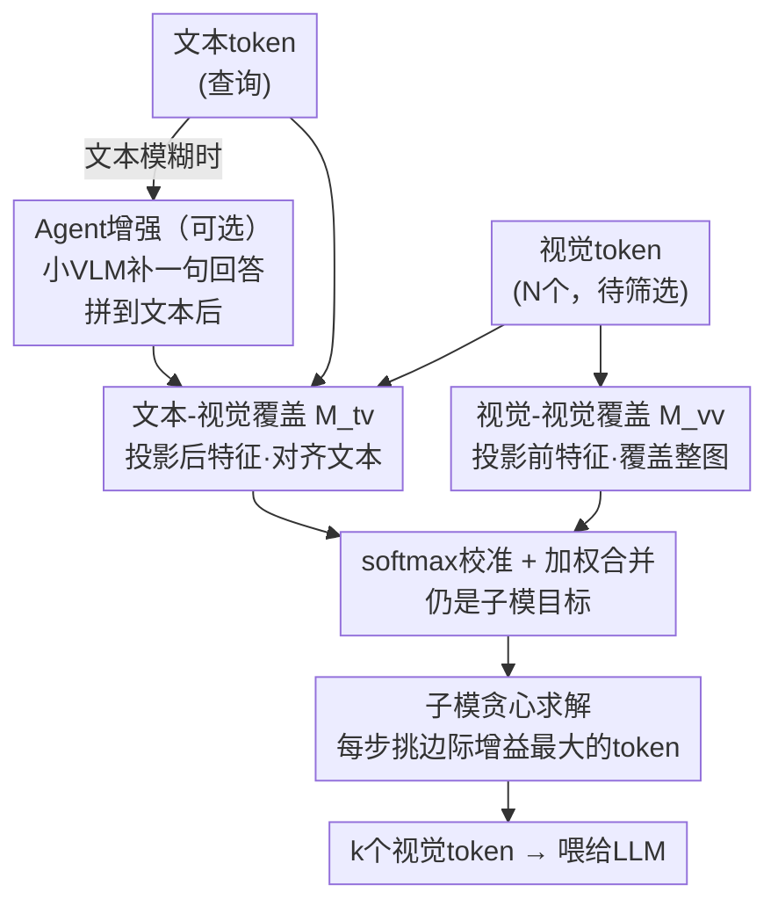

# MMTok: Multimodal Coverage Maximization for Efficient Inference of VLMs

**会议**: ICLR 2026  
**arXiv**: [2508.18264](https://arxiv.org/abs/2508.18264)  
**代码**: 无  
**领域**: Multimodal / VLM  
**关键词**: vision token selection, coverage maximization, submodular optimization, VLM efficiency, token pruning

## 一句话总结

提出MMTok——一种基于最大覆盖问题（Maximum Coverage Problem）的多模态视觉token选择框架，同时利用文本-视觉和视觉-视觉覆盖信息来选择最具信息量的视觉token子集，在training-free设置下显著优于单模态baseline，甚至超越需要微调的方法。

## 研究背景与动机

视觉语言模型（VLM）将图像转化为视觉token后与文本token拼接输入LLM，但视觉token数量远超文本token（如LLaVA-NeXT中单张图像可产生2,880个视觉token，而"Describe the image"仅不到10个文本token）。由于LLM中自注意力机制的计算复杂度与token总数的平方成正比，大量视觉token严重制约推理效率。

现有视觉token选择方法的核心问题在于**仅利用单模态信息**：
- **纯视觉方法**（VisionZip、FastV）：通过视觉编码器内部的attention信号（如[CLS] token attention）排序，忽略了文本查询的语义引导
- **纯文本方法**（SparseVLM）：利用文本到视觉的attention评分，但忽略了图像全局信息

关键观察：**相同图像对不同文本查询需要不同的视觉token**（如"这是什么动物"vs"背景颜色是什么"），而**相同文本指令可应用于不同图像**（如caption任务）。因此，单模态方法天然是次优的，需要同时利用视觉和文本信息。

## 方法详解

### 整体框架

MMTok要解决的是同一个老问题：VLM里视觉token太多、拖慢推理，得挑出一个大小为 $k$ 的子集只把它们喂进LLM。它的不同之处在于把"挑token"重新表述成一个**最大覆盖问题**——好的子集不是"每个token单看都重要"，而是"这一小撮token合起来既覆盖了文本查询在问什么、又覆盖了整幅图的视觉信息"。整条流程是：先分别构造文本-视觉相似度矩阵 $M^{tv}$（管语义相关）和视觉-视觉相似度矩阵 $M^{vv}$（管全局覆盖），各自做softmax校准后加权合成一个子模覆盖目标，再用贪心算法从空集出发逐个把"边际收益最大"的视觉token挑进来，凑满 $k$ 个就喂给LLM；若文本太空泛，还可先用一个小VLM补一句回答来加强T-V引导。整个流程不需要训练。

### 关键设计

**1. 覆盖目标与子模贪心：用"子集覆盖了多少目标"代替逐个token打分**

传统方法（VisionZip、FastV）给每个视觉token单独算一个重要性分数再取topk，问题是这样容易选出一堆彼此冗余、信息重复的token——它们各自分高，合在一起却覆盖不全。MMTok换成覆盖视角：对相似度矩阵 $M$ 和已选子集 $\mathcal{S}$ 定义覆盖函数 $f(\mathcal{S}; M) = \frac{1}{m} \sum_{i=1}^{m} \max M_{i,\mathcal{S}}$，即每个目标token只取它和子集里最相似那个被选token的相似度，再对所有目标求平均。直觉是一个目标只要已被子集里某个token"代表"了，再加相似的token边际收益就很低，于是天然鼓励多样性。论文证明该函数单调子模（Proposition 1），求解就用标准子模贪心（Algorithm 1/2）：从空集起每步挑能让覆盖目标涨得最多的token，直到凑满 $k$ 个，并享有 $(1-1/e) \approx 63.2\%$ 的最优近似保证。整个过程只有加法、乘法和取max这类矩阵运算，没有反向传播也没有迭代优化，所以实测耗时和VisionZip等纯排序方法几乎一致。

**2. 双模态覆盖：T-V管语义对齐、V-V补全局信息，且刻意用不同层的特征**

单模态信号天然次优，所以MMTok同时构造两个互补的覆盖项。文本-视觉项（T-V）负责语义相关：用投影到语言空间、已与文本对齐的视觉token算 $M_{i,j}^{tv} = \mathbf{t}_i^\top \mathbf{v}_j$，覆盖目标是所有文本token——要让被选子集尽量"答得上"每个文本关切；它的短板是文本本身很模糊（如"请描述图像"）时缺乏引导。视觉-视觉项（V-V）则要求被选子集能代表所有视觉token，补上文本顾不到的整图结构。一个关键且容易忽略的细节是：V-V用投影**前**的原始视觉特征 $M_{i,j}^{vv} = \mathbf{v}_i^{\prime\top} \mathbf{v}_j'$，而非T-V里投影**后**的特征——投影后特征偏向跨模态对齐，投影前特征才保留纯粹的视觉相似性。于是T-V管"和文本相关"、V-V管"覆盖整张图"，信息互补，消融里二者结合比任一单模态高2-3%。

**3. softmax校准融合：先按行归一再相加，让两项不被尺度差吞掉**

T-V和V-V两个矩阵数值尺度不一致，直接相加会被某一项主导。MMTok先对每个矩阵按行做带温度的softmax校准，如 $M_{i,j}^{tv'} = \frac{\exp(M_{i,j}^{tv}/\tau_t)}{\sum_j \exp(M_{i,j}^{tv}/\tau_t)}$，V-V同理用 $\tau_v$，再合成联合目标

$$f(\mathcal{S}; M^{tv'}, M^{vv'}) = f(\mathcal{S}; M^{tv'}) + \alpha \cdot f(\mathcal{S}; M^{vv'})$$

其中 $\alpha$ 平衡两项权重。因为子模函数的非负线性组合仍是子模函数（Corollary 1），上面的贪心近似保证对融合后的目标照样成立。默认取 $\tau_t=0.02$、$\tau_v=0.2$、$\alpha=0.5$，论文报告这几个超参对结果都不敏感。

**4. Agent增强文本（可选）：文本太空泛时先让小模型补一句回答**

针对"请描述图像"这类信息量不足的查询，T-V项几乎无从引导，MMTok可选地先用一个轻量VLM（SmolVLM2-256M）对图像生成一段初步回答，把回答的token拼到原始文本之后再算T-V覆盖——相当于用小模型预测的语义关切补全引导信号，因此对开放式描述类任务有帮助。但对"选A还是B"这类多选QA，Agent回答（如"A"）本身不含视觉指向，几乎没有增益。

## 实验关键数据

### 主实验（LLaVA-1.5-7B，576原始token）

| 方法 | 192 tokens保留率 | 128 tokens保留率 | 64 tokens保留率 |
|------|----------------|----------------|----------------|
| FastV | 89.6% | 84.4% | 75.6% |
| SparseVLM | 95.5% | 92.9% | 86.9% |
| VisionZip | 97.9% | 96.8% | 93.2% |
| DivPrune | 98.0% | 97.0% | 94.8% |
| VisionZip🔥(微调) | 98.4% | 97.7% | 95.0% |
| **MMTok** | **98.7%** | **97.9%** | **96.5%** |

### 跨模型泛化

| 模型 | 配置 | VisionZip | DivPrune | MMTok |
|------|------|-----------|----------|-------|
| LLaVA-1.5-13B | 64 tokens | 93.7% | 95.4% | **96.3%** |
| LLaVA-NeXT-7B | Up 160 | 90.4% | 92.4% | **95.1%** |
| LLaVA-NeXT-13B | Up 160 | 91.4% | 92.1% | **95.1%** |
| Qwen-2.5-VL-7B | 20% | 94.2% | 91.5% | **94.6%** |

### 极端压缩（LLaVA-1.5-7B，高IC数据集）

| token数 | VisionZip | DivPrune | MMTok |
|---------|-----------|----------|-------|
| 16 | 78.3% | 86.2% | **88.3%** |
| 8 | 63.2% | 76.3% | **82.9%** |
| 4 | 58.8% | 66.3% | **76.7%** |
| 2 | 57.8% | 63.5% | **70.0%** |

在POPE上仅用4个token就保留了87.7%的原始性能！

### 消融实验

| 配置 | 64 tokens保留率 | 说明 |
|------|----------------|------|
| T-V only（无softmax） | 93.7% | 仅用文本引导 |
| V-V only（无softmax） | 94.7% | 仅用视觉自覆盖 |
| T-V（softmax校准） | 93.8% | 校准不损性能 |
| V-V（softmax校准） | 95.7% | 校准有小幅提升 |
| **MMTok（T-V + V-V）** | **96.6%** | 多模态互补显著 |

### 推理效率（LLaVA-NeXT-13B，H100 GPU）

| 方法 | 总推理时间 | POPE时间 | GPU利用率 | 运行时内存 | 平均性能 |
|------|----------|---------|----------|----------|---------|
| 原始(2880) | 15204s | 1705s | 86.7% | 4.59GB | 100% |
| VisionZip(160) | 7551s | 866s | 52.4% | 1.92GB | 89.6% |
| DivPrune(160) | 8186s | 1060s | 50.9% | 1.23GB | 90.5% |
| **MMTok(160)** | **7768s** | **913s** | 58.0% | 1.78GB | **93.7%** |

实现1.87×加速同时在POPE上保持98.7%性能。

### 关键发现

- **多模态信息互补**：T-V和V-V覆盖的结合比任何单模态方法好2-3%
- **Image Contribution（IC）指标**的提出：部分数据集即使零视觉token也有很高性能（如SQA 82%、MMMU 92%），说明评估应重点关注高IC数据集
- **超参鲁棒性**：$\tau_t, \tau_v, \alpha$的选择对性能影响不大，固定默认值即可
- **Training-free优势**：无需微调即超越VisionZip🔥等微调方法
- **极端压缩潜力**：4个token时MMTok比VisionZip高18%，说明覆盖准则在极端情况下优势更大

## 亮点与洞察

- **将token选择形式化为经典组合优化问题**：子模函数+贪心算法的理论框架优雅且实用
- **投影前后特征的差异化使用**：投影后特征用于跨模态对齐（T-V），投影前特征用于纯视觉相似度（V-V），体现了对VLM架构的深入理解
- **IC指标对evaluation的反思**：指出SQA、MMMU等数据集不适合评估视觉token选择质量
- **Agent增强**：轻量级VLM的预回答作为辅助信号，思路新颖但效果因任务而异

## 局限与展望

- 当前仅在LLM输入前选择token，LLM推理过程中的token动态剪枝未探索
- Agent方法对多选题QA效果不佳（Agent回答如"A"对token选择无意义引导）
- 在Qwen-2.5-VL（已有token merging层）上的提升相对较小，说明对已优化模型的增量价值有限
- 贪心算法虽有理论保证，但可能存在更优的优化策略
- 未探索视频理解等多帧场景下的扩展

## 相关工作与启发

本文将**子模函数优化**（经典组合优化理论）引入VLM加速场景。与VisionZip（[CLS] attention排序）、FastV（层内attention剪枝）、SparseVLM（text-vision attention）、DivPrune（多样性准则）等方法相比，覆盖准则的独特之处在于其**同时优化相关性和覆盖度**。SmolVLM2-256M的agent使用暗示了小模型辅助大模型推理的有趣方向。

## 评分

- 新颖性: ⭐⭐⭐⭐ （覆盖准则+多模态融合新颖，但token pruning本身不新）
- 实验充分度: ⭐⭐⭐⭐⭐ （5个VLM×9个数据集×多压缩比+极端压缩+效率分析）
- 写作质量: ⭐⭐⭐⭐ （方法清晰，理论保证完整，实验详实）
- 价值: ⭐⭐⭐⭐ （实用性强，training-free+参数鲁棒，易于部署）

<!-- RELATED:START -->

## 相关论文

- [\[ICLR 2026\] Multimodal Classification via Total Correlation Maximization](multimodal_classification_via_total_correlation_maximization.md)
- [\[NeurIPS 2025\] SCOPE: Saliency-Coverage Oriented Token Pruning for Efficient Multimodal LLMs](../../NeurIPS2025/multimodal_vlm/scope_saliency-coverage_oriented_token_pruning_for_efficient_multimodel_llms.md)
- [\[ICML 2025\] SparseVLM: Visual Token Sparsification for Efficient Vision-Language Model Inference](../../ICML2025/multimodal_vlm/sparsevlm_visual_token_sparsification_for_efficient_vision-language_model_infere.md)
- [\[CVPR 2026\] DUET-VLM: Dual Stage Unified Efficient Token Reduction for VLM Training and Inference](../../CVPR2026/multimodal_vlm/duet-vlm_dual_stage_unified_efficient_token_reduction_for_vlm_training_and_infer.md)
- [\[ICCV 2025\] SparseVILA: Decoupling Visual Sparsity for Efficient VLM Inference](../../ICCV2025/multimodal_vlm/sparsevila_decoupling_visual_sparsity_for_efficient_vlm_inference.md)

<!-- RELATED:END -->
