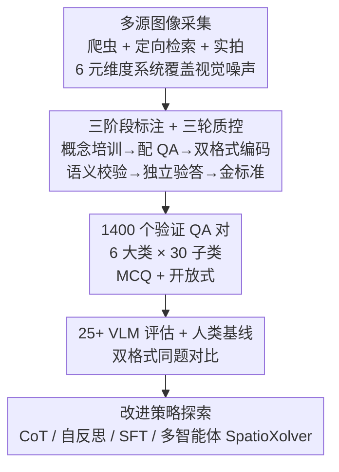

# SpatiaLab: Can Vision-Language Models Perform Spatial Reasoning in the Wild?

**会议**: ICLR 2026  
**arXiv**: [2602.03916](https://arxiv.org/abs/2602.03916)  
**代码**: [spatialab-reasoning.github.io](https://spatialab-reasoning.github.io/)  
**领域**: 多模态VLM  
**关键词**: 空间推理, VLM基准, 多选题评估, 开放式评估, 真实场景

## 一句话总结
提出SpatiaLab，一个包含1400个视觉QA对的真实场景空间推理基准，涵盖6大类30子类空间任务，支持多选和开放式双格式评估，揭示当前最强VLM（InternVL3.5-72B MCQ 54.93%）与人类（87.57%）之间存在巨大空间推理鸿沟，且开放式设置下差距更大。

## 研究背景与动机

**领域现状**：空间推理是人类认知的基础能力，对机器人、自动驾驶、AR/VR至关重要。现有VLM在多模态表示和语言接地上取得进展，但空间判断在真实环境中仍然脆弱。

**现有痛点**：
   - 现有空间推理基准过于简化：多数聚焦二元空间关系、低分辨率深度分类、或合成/拼图式场景
   - 控制环境减弱了感知和推理难度，导致表面上的饱和掩盖了分布偏移下的失败
   - 遮挡推理、跨视角尺度一致性、部分可观测下的路径规划等关键挑战严重采样不足
   - 在ScanQA、BLINK等合成基准上表现好的模型在真实场景中常常失败

**核心矛盾**：人类无缝整合相对位置、深度、方向、尺度、导航、3D几何等多维空间信息，但VLM在任何单一维度上都远逊于人类，更不用说多维联合推理。

**本文目标**
   - 构建涵盖全部空间推理核心轴的真实场景基准
   - 用MCQ和开放式双格式评估，避免格式偏差
   - 测试25+种VLM并建立人类基线
   - 深入分析失败模式，提供可行改进方向

**切入角度**：从认知心理学的空间认知分类出发，系统分解为6×5=30种细粒度任务类型，用真实照片（非合成数据）构建基准。

**核心 idea**：SpatiaLab通过30种真实场景空间推理任务的双格式评估，系统暴露了VLM在深度感知、遮挡推理、导航规划和3D几何上的根本性缺陷。

## 方法详解

### 整体框架
SpatiaLab 想回答一个问题：把视觉语言模型（VLM）丢进真实世界的杂乱照片里，它还能做空间推理吗？为此它先把空间认知拆成 6 大类——Relative Positioning（相对定位）、Depth & Occlusion（深度与遮挡）、Orientation（方向）、Size & Scale（大小与尺度）、Spatial Navigation（空间导航）、3D Geometry（3D几何），每大类再细分 5 个子类，共 30 种细粒度任务类型。整条构建流水线是：先从多源采集真实照片建图像库并沿 6 个元维度系统覆盖视觉噪声，再经三阶段人工标注 + 三轮质控为每张图配上空间 QA、并把每题编码成 MCQ（4选1）和开放式生成两种格式，最终每子类≥25 题、每大类≥200 题，汇成 1400 个经验证的 QA 对。模型在这套基准上跑完后，论文再用一组改进策略去探测「能不能补上短板」。

### 关键设计

**1. 多源图像采集：让基准反映真实世界的视觉噪声，而非实验室条件**

现有空间推理基准多用合成图或拼图式场景，受控环境把感知和推理难度都削弱了，于是表面饱和、真实场景一上就崩。SpatiaLab 改用三种互补来源凑齐视觉多样性：自动网络爬虫拉海量图、针对性在线检索补特定空间关系、再加手动室内外实拍。采集时沿 6 个元维度——光照、纹理复杂度、边缘复杂度、空间关系、材质类型、重力约束——系统性覆盖，避免图像分布偏向某一类。最终图库的复杂度相当高：平均每图 21.48 个物体、其中 11.88 个部分可见、3.23 层深度、需要 2.07 步空间推理链才能答对，正是这种遮挡多、层次深的真实噪声让模型暴露问题。

**2. 三阶段标注 + 三轮质控：保证每道 QA 的语义有效、答案正确、任务清晰**

空间推理 QA 在高复杂度场景下很容易标错，所以 SpatiaLab 用分阶段流程把质量锁死。Phase 1 先培训标注员对齐空间概念的判定标准，Phase 2 给每张图配上对应的空间 QA，Phase 3 再把每题编码成 MCQ 和开放式双格式。配好的题目还要过三轮审查：先做语义校验确认问题本身成立，再由独立标注员验证答案，最后建立金标准。这套层层过滤是 1400 题最终可靠的保证，也让 MCQ 与开放式两套答案严格对应、可做格式对比。

**3. 改进策略探索：不止暴露问题，还系统试探哪条路能补上空间短板**

发现差距之后，论文进一步把多种提升手段拉到同一基准上横评：模型内在推理、CoT 提示、CoT+自反思、SFT 微调（用 40% 数据训练、60% 留作评估，微调 Qwen-VL2.5-3B-Instruct），以及多智能体系统 SpatioXolver。结论是没有银弹——SFT 在导航和方向上收益最明显，多智能体推理对方向有帮助但在遮挡、尺度等类别上反而停滞甚至退化。这组对照说明当前主流增强手段只能局部缓解，空间推理的根本缺陷靠堆这些技巧补不齐。

### 损失函数 / 训练策略
基准论文本身无训练损失。仅在改进策略探索的 SFT 实验中用标准监督损失微调 Qwen-VL2.5-3B-Instruct（40% 数据训练 / 60% 评估）。

## 实验关键数据

### 主实验（MCQ格式，25+模型）

| 模型 | 3D几何 | 深度&遮挡 | 方向 | 相对位置 | 尺度 | 导航 | 总体 |
|------|-------|---------|------|---------|------|------|------|
| 人类基线 | 93.70 | 74.13 | 91.58 | 91.51 | 88.89 | 87.76 | **87.57** |
| InternVL3.5-72B | 50.00 | 57.14 | 53.47 | 66.04 | 49.21 | 54.85 | 54.93 |
| GPT-5-mini | 48.74 | 54.83 | 60.40 | 62.74 | 44.84 | 56.54 | 54.29 |
| o4-mini-medium | 51.26 | 58.30 | 54.95 | 64.15 | 40.87 | 51.48 | 53.21 |
| 空间专用模型 | ~42 | ~38 | ~48 | ~38 | ~43 | ~39 | ~41 |
| 随机选择 | 25.00 | 25.00 | 25.00 | 25.00 | 25.00 | 25.00 | 25.00 |

### 开放式格式对比

| 模型 | MCQ总体 | 开放式总体 | 性能下降 |
|------|--------|----------|---------|
| GPT-5-mini | 54.29 | **40.93** | -13.36 |
| o4-mini-medium | 53.21 | 37.86 | -15.35 |
| InternVL3.5-72B | 54.93 | 23.36 | **-31.57** |
| 人类基线 | 87.57 | 64.93 | -22.64 |
| 平均MCQ→Open gap | - | - | **-23.0%** |

### 关键发现
- **最强模型仅55%（MCQ）/41%（开放式）**：与人类88%/65%差距悬殊。空间专用模型反而更差（~41%），说明当前特化方法无效
- **开放式评估暴露真实能力**：平均MCQ→Open下降23%，空间专用模型下降最多（~27%），说明MCQ可高估真实空间推理能力
- **最难的三大类**：Size & Scale、Depth & Occlusion、Spatial Navigation一致成为瓶颈，多数模型<50%/30%
- **模型规模≠空间推理**：Llama-3.2-11B仅30.5%，比许多4B模型都差，说明空间推理需要特殊能力而非纯规模
- **推理增强有限效果**：CoT对方向类有帮助，SFT改善导航（+7.69%），但多智能体系统在遮挡/尺度上反而退化
- **系统性失败模式**：物体旋转（2%）、反射面（<20%）、工具惯用手（<30%）等任务几乎全军覆没

## 亮点与洞察
- **真实场景+双格式评估设计精良**：1400题覆盖30种任务是空间推理领域最细粒度的分类体系，MCQ+Open双格式避免了格式偏差这是之前基准忽略的关键问题
- **"空间专用模型不如通用模型"的反直觉发现**：SpaceOm/SpaceThinker/SpaceQwen在真实场景下全面落后于InternVL3.5-72B，说明在合成数据上训练的空间能力无法迁移
- **错误分析的诊断价值**：聚类分析发现失败集中在空间误定位、透视/尺度错误、遮挡排序失败三类，与VLM缺乏几何监督直接相关
- **开放式评估的必要性**：MCQ→Open平均下降23%，且下降在导航（最需要多步推理）上最大，说明当前VLM依赖消去法而非真正理解

## 局限与展望
- 1400题虽质量高但数量有限，每子类仅25+题可能不足以稳定评估
- 开放式评估依赖LLM judge（Gemini-2.5-Flash），虽然Cohen's kappa=0.738但评判本身仍不完美
- 未涵盖视频场景的时序空间推理
- **可改进方向**：开发基于物理引擎的空间推理预训练数据，或在VLM中引入显式的几何编码模块来弥补空间推理短板

## 相关工作与启发
- **vs BLINK-Spatial (2024)**：14类任务/3.8K题但混合合成和真实数据，最佳59%；SpatiaLab专注30种真实场景任务类型，更细粒度且更具挑战性
- **vs OmniSpatial (2025)**：50类但仅1.5K题/puzzle设置，最佳56%；SpatiaLab强调真实场景而非拼图场景
- **vs VSI-Bench (2025)**：室内视频基准8类，最佳45%；SpatiaLab覆盖更广的场景类型和图像模态

## 评分
- 新颖性: ⭐⭐⭐⭐ 30类任务+双格式评估设计新颖，但核心方法论（构建基准）非全新范式
- 实验充分度: ⭐⭐⭐⭐⭐ 25+模型、人类基线、改进策略探索、error analysis极为全面
- 写作质量: ⭐⭐⭐⭐ 结构清晰，分析深入，但篇幅较长
- 价值: ⭐⭐⭐⭐⭐ 填补了真实场景空间推理评估的空白，量化了VLM-人类差距，对VLM社区有重要指导意义

<!-- RELATED:START -->

## 相关论文

- [\[ICLR 2026\] OmniSpatial: Towards Comprehensive Spatial Reasoning Benchmark for Vision Language Models](omnispatial_towards_comprehensive_spatial_reasoning_benchmark_for_vision_languag.md)
- [\[ICLR 2026\] Spatial-DISE: A Unified Benchmark for Evaluating Spatial Reasoning in Vision-Language Models](spatial-dise_a_unified_benchmark_for_evaluating_spatial_reasoning_in_vision-lang.md)
- [\[ICLR 2026\] Spatial CAPTCHA: Generatively Benchmarking Spatial Reasoning for Human-Machine Differentiation](spatial_captcha_generatively_benchmarking_spatial_reasoning_for_human-machine_di.md)
- [\[ICLR 2026\] SpinBench: Perspective and Rotation as a Lens on Spatial Reasoning in VLMs](spinbench_perspective_and_rotation_as_a_lens_on_spatial_reasoning_in_vlms.md)
- [\[CVPR 2026\] SpatiaLQA: A Benchmark for Evaluating Spatial Logical Reasoning in Vision-Language Models](../../CVPR2026/multimodal_vlm/spatialqa_a_benchmark_for_evaluating_spatial_logical_reasoning_in_vision-languag.md)

<!-- RELATED:END -->
