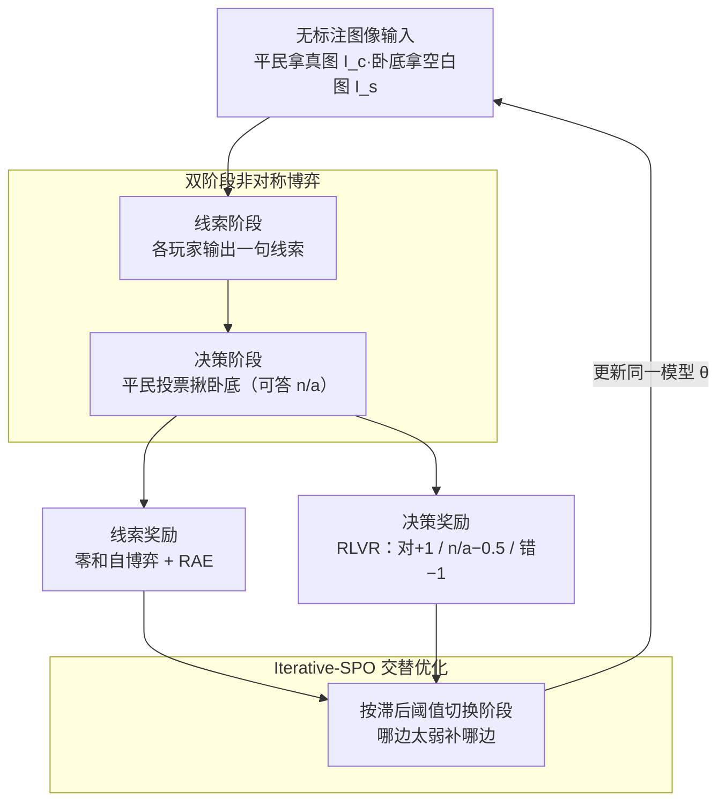

# Vision-Zero: Scalable VLM Self-Improvement via Strategic Gamified Self-Play

- **会议**: ICLR 2026
- **arXiv**: [2509.25541](https://arxiv.org/abs/2509.25541)
- **代码**: [GitHub](https://github.com/Vision-Zero-AI/Vision-Zero)
- **领域**: 多模态VLM
- **关键词**: VLM, Self-Play, Reinforcement Learning, Zero-Shot, Gamification, Self-Improvement

## 一句话总结

提出 Vision-Zero，首个无标注的游戏化自博弈框架，通过"谁是卧底"式视觉推理游戏实现 VLM 的可扩展自进化，结合 Iterative-SPO 训练算法在推理、图表理解和视觉中心任务上超越基于人工标注数据的 SOTA 方法。

## 研究背景与动机

当前 VLM 训练面临两个核心瓶颈：

**数据稀缺**：多模态标注成本极高（COCO Attributes: $60,480/200K 物体；Ego4D: >250K 标注小时）

**知识天花板**：模型能力受人类标注上限约束，无法发现超越人类经验的策略

**自博弈**（Self-Play）已在围棋（AlphaGo）、电竞（OpenAI Five）等领域证明可突破知识天花板。但将自博弈扩展到 VLM 面临挑战：需要同时考虑视觉和语言模态，设计满足技能对齐、难度可扩展、多样性和低数据需求的游戏环境。

**Vision-Zero 的设计理念**：灵感来自社交推理游戏"谁是卧底"，平民观察真实图像、卧底接收空白输入，通过交互式策略博弈让模型自主生成训练数据。

## 方法详解

### 整体框架

Vision-Zero 把 VLM 的自进化包装成一局"谁是卧底"：环境只需一张任意图像，$n_c$ 个平民拿到真实图像 $I_c$、1 个卧底拿到空白图像 $I_s$，全员先各自给出语言线索（线索阶段），再由平民根据所有线索投票揪出卧底（决策阶段）。一局博弈天然产出两类可自动判定胜负的监督信号——线索阶段的零和自博弈奖励与决策阶段的可验证奖励——喂给 Iterative-SPO 算法在两个阶段之间交替优化同一个模型，更新后的模型再开下一局。整个闭环只需任意图像、不依赖任何人工标注。

### 关键设计

**1. 无标注、领域无关的输入：一张图就能开局**

博弈只利用"谁看得到图、谁看不到"这一信息差，因此对图像类型没有任何要求，训练数据可以是任意来源的图。实验用三类数据验证通用性：CLEVR 自动渲染的 2000 张合成图（每张 4–6 个随机物体）、ChartQA 的 1000 张图表、ImgEdit 的 1000 张真实世界图像。无论哪一类，都不需要问答对或人工标签，必要时还能用 ChatGPT / NanoBanana 等工具快速批量生成，数据成本几乎为零。

**2. 双阶段非对称博弈：把视觉推理拆成"描述"与"识别"两道难题**

游戏的核心是信息不对称——卧底从未见过真图，只能靠平民的线索反推内容并伪装混入。线索阶段每个玩家根据自己的角色和观察输出一句线索：平民要描述得足够准确以便后续辨认卧底，却又不能泄露太多让卧底轻易模仿；卧底则要在只听到零散线索的情况下推断隐藏图像、编出一句以假乱真的描述。决策阶段平民综合全部线索和自己手里的真图投票指认卧底（卧底不参与投票），并允许回答 "n/a" 表示不确定。这套设定把"细粒度图像描述"和"跨线索逻辑识别"两种能力分别压到两个阶段，且双方的对抗会自动把任务难度顶到模型能力边缘。

**3. Iterative-SPO：自博弈与可验证奖励交替优化**

线索阶段是零和自博弈，奖励让卧底与平民此消彼长——卧底被投的票越多奖励越低，平民则在压制卧底的同时被惩罚自身线索的暴露程度：

$$r_s^{clue} = -\beta(v_s - \bar{v}_c), \quad r_{c_j}^{clue} = \frac{\beta}{n_c}(v_s - \bar{v}_c) - \lambda(v_{c_j} - \bar{v}_c)$$

其中 $v_s$ 是卧底得票、$\bar{v}_c$ 是平民平均得票，二者奖励之和恒为零。由于卧底天生处于劣势，直接用原始奖励会导致胜率失衡，于是引入角色优势估计（RAE），对每个角色维护一条滑动基线 $b_k$ 做归一化：$A_k^{clue} = r_k^{clue} - b_k$，$b_s = \alpha b_s + (1-\alpha) r_s^{clue}$，把不同角色的奖励拉回可比尺度。线索阶段对全体玩家 $\mathcal{K}$ 用带 KL 约束的策略梯度更新：

$$\mathcal{L}^{clue}(\theta) = -\mathbb{E}\left[\frac{1}{n}\sum_{k \in \mathcal{K}} A_k^{clue} \log \pi_\theta^k(u_k | I_k, h)\right] + \tau_{clue} \cdot D_{KL}(\pi_\theta^k \| \pi_{ref}^k)$$

决策阶段则是有明确对错的 RLVR：正确识别卧底记 +1、回答 n/a 记 −0.5、错误记 −1，奖励经组内归一化后用 GRPO 目标只更新平民的投票策略：

$$\mathcal{L}^{dec}(\theta) = -\mathbb{E}\left[\frac{1}{n_c}\sum_{i=1}^{n_c} A_{c_i}^{dec} \log q_\theta(\hat{s}_{c_i} | H)\right] + \tau_{dec} \cdot D_{KL}(q_\theta \| q_{ref})$$

两个阶段共享同一套参数 $\theta$，纯靠单阶段训练容易过早收敛（要么卧底太好认、要么完全认不出），因此 Iterative-SPO 用带滞后区间的阈值来回切换：当近期准确率 $\bar{acc}_t \geq \tau_{acc}^\uparrow$ 且 n/a 率 $\bar{na}_t \leq \tau_{na}^\downarrow$（卧底被秒认穿）时，从决策切回线索阶段去加强伪装难度；反之当错误率 $1-\bar{acc}_t \geq \tau_{err}^\uparrow$ 或 $\bar{na}_t \geq \tau_{na}^\uparrow$（卧底太难抓）时，切到决策阶段强化识别。这种"哪边太弱补哪边"的交替机制让博弈始终维持在势均力敌的状态，避免一方碾压导致的训练塌缩，也使得同一框架能同时增强推理、空间理解、视觉理解和 OCR 等多种能力。

## 实验

### 推理和数学任务

| 方法 | MathVista | MathVision | WeMath | MathVerse | LogicVista | Avg |
|------|-----------|------------|--------|-----------|------------|-----|
| Qwen2.5-VL-7B | 68.2 | 25.4 | 36.1 | 49.0 | 47.2 | 41.1 |
| MM-Eureka-7B | 73.0 | 26.9 | 36.2 | 50.3 | 42.9 | 42.9 |
| ViGaL-S+R | 71.9 | 27.5 | 36.9 | 52.4 | 46.5 | 43.0 |
| **VZ (CLEVR)** | 72.2 | **28.4** | **39.2** | **53.2** | **49.8** | **44.3** |
| **VZ (Real)** | **73.1** | 28.5 | **40.1** | 52.1 | 50.8 | **44.5** |

Vision-Zero 在仅使用无标注数据的情况下，超越了所有使用人工标注数据的基线。

### 图表理解和视觉中心任务

Vision-Zero (Chart) 在 ChartXiV、FunctionQA 等图表任务上显著提升，在 MMVP、BLINK 等视觉中心任务上也有增益。

### 训练动态

- 胜率（平民 vs 卧底）在训练中持续上升
- 线索长度（token 数）随训练增长，模型学会更详细地描述和推理
- Iterative-SPO 有效避免了纯自博弈的过早收敛

### 消融实验

| 消融 | MathVista | MathVision |
|------|-----------|------------|
| 仅线索阶段 | 70.8 | 27.1 |
| 仅决策阶段 | 71.5 | 27.6 |
| Iterative-SPO | **73.1** | **28.5** |

交替训练的效果显著优于单阶段训练。

### 与 Gobang 的对比

在 MathVision 上：Vision-Zero 提升 +3%（100轮），Gobang 无提升，证明视觉推理游戏的泛化能力。

## 亮点

1. **零人类参与**：完全不需要人工标注或人类反馈
2. **领域无关输入**：CLEVR、图表、自然图像均有效
3. **Iterative-SPO 理论优雅**：交替自博弈+RLVR避免局部均衡
4. **超越标注基线**：无标注方法超越昂贵人工标注训练的 SOTA
5. **多能力同时提升**：推理、图表理解、视觉中心任务全面增益

## 局限性

1. 游戏中固定角色数（$n_c + 1$），未探索更复杂的多角色设定
2. "谁是卧底"游戏的策略空间是否充分覆盖了所有视觉推理能力存疑
3. 卧底使用空白图像而非相似图像，与原版"谁是卧底"有偏差
4. Iterative-SPO 的阈值超参数需手动设定
5. 在部分视觉中心任务上（如 RealWorldQA）提升有限

## 相关工作

- **LLM 自博弈**：SPIRAL (Liu et al., 2025) 用棋类游戏增强推理；Absolute Zero (Zhao et al., 2025) 在数学/编码上 SOTA
- **VLM 后训练**：R1-OneVision, MM-Eureka, VLAA-Thinker 使用 RLVR + 人工标注
- **游戏化 VLM**：ViGaL (Xie et al., 2025) 用蛇/旋转游戏训练但需收集游戏数据
- **自博弈理论**：AlphaGo (Silver et al., 2017), TD-Gammon (Tesauro, 1995)

## 评分

- **创新性**: ⭐⭐⭐⭐⭐ — 首个 VLM 无标注游戏化自博弈框架
- **实用性**: ⭐⭐⭐⭐⭐ — 极低成本、领域无关、即插即用
- **清晰度**: ⭐⭐⭐⭐ — 框架清晰但公式较多
- **意义**: ⭐⭐⭐⭐⭐ — 开辟了 VLM 自进化的新范式

<!-- RELATED:START -->

## 相关论文

- [\[AAAI 2026\] Plug-and-Play Clarifier: A Zero-Shot Multimodal Framework for Egocentric Intent Disambiguation](../../AAAI2026/multimodal_vlm/plug-and-play_clarifier_a_zero-shot_multimodal_framework_for_egocentric_intent_d.md)
- [\[ICCV 2025\] SC-Captioner: Improving Image Captioning with Self-Correction by Reinforcement Learning](../../ICCV2025/multimodal_vlm/sc-captioner_improving_image_captioning_with_self-correction_by_reinforcement_le.md)
- [\[ICLR 2026\] VLM-SubtleBench: How Far Are VLMs from Human-Level Subtle Comparative Reasoning?](vlm-subtlebench_how_far_are_vlms_from_human-level_subtle_comparative_reasoning.md)
- [\[ICLR 2026\] WebDS: An End-to-End Benchmark for Web-based Data Science](webds_an_end-to-end_benchmark_for_web-based_data_science.md)
- [\[ICLR 2026\] VisJudge-Bench: Aesthetics and Quality Assessment of Visualizations](visjudge-bench_aesthetics_and_quality_assessment_of_visualizations.md)

<!-- RELATED:END -->
