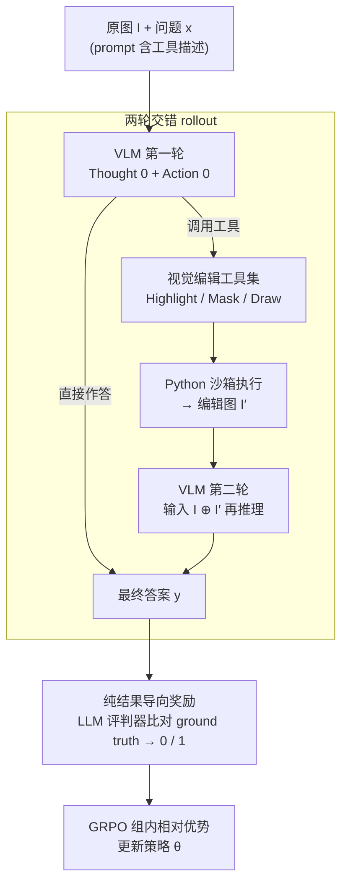

# VTool-R1: VLMs Learn to Think with Images via Reinforcement Learning on Multimodal Tool Use

## 论文信息
- **会议**: ICLR 2026
- **arXiv**: [2505.19255](https://arxiv.org/abs/2505.19255)
- **代码**: [https://github.com/VTOOL-R1/vtool-r1](https://github.com/VTOOL-R1/vtool-r1)
- **领域**: 视觉语言模型 / 强化学习微调 / 工具使用 / 多模态推理
- **关键词**: RFT, VLM, 视觉推理, 工具使用, GRPO, 多模态思维链

## 一句话总结
提出 VTool-R1，首个通过强化学习微调训练 VLM 生成交错文本和视觉中间推理步骤的框架，使模型学会"用图像思考"。

## 研究背景与动机

### 核心问题
RFT（强化学习微调）已大幅提升 LLM 的推理能力，但在 VLM 领域的复制尝试仍局限于**纯文本推理**：模型仅在初始编码阶段处理图像，推理链完全以文本形式生成，缺乏中间视觉推理步骤。

### 为什么纯文本推理不够？
即使最先进的 VLM 也可能依赖语言捷径。例如，展示一只六指手的图片并询问"有几个手指"，模型可能基于"一只手有五个手指"的文本推理路径回答"五"，忽略视觉证据。

### 现有方法局限
- **Visual Sketchpad**：推理时引入视觉步骤，但没有训练机制，仅在 GPT-4o 等强模型上有效
- **Refocus**：生成视觉编辑但依赖商业模型预生成，在开源弱模型上效果差
- **R1-VL 等**：仅训练纯文本 CoT，不包含视觉推理步骤

## 方法详解

### 整体框架

VTool-R1 把一组 Python 视觉编辑工具接入 RFT 的 rollout 过程，让 VLM 在一次问答中分两轮执行：第一轮先看原图和问题，决定是直接作答还是调用工具去高亮/遮挡/框选图中的关键区域；若选择用工具，工具代码在 Python 沙箱里执行得到编辑图，第二轮再把编辑图与原图一起送回模型生成最终答案。训练时整个过程只用最终答案对错作为奖励信号，通过 GRPO 回传，模型因此自主学到何时该"动手改图再看"、何时直接答更划算。

### 关键设计

**1. 两轮交错 rollout：把视觉编辑变成推理链里真实改变输入的一步**

纯文本 CoT 的问题在于模型一旦进入推理就只能靠语言，看不回图里的细节，于是可能走"一只手有五个手指"这种语言捷径而无视像素证据。VTool-R1 让第一轮先产出 Thought 0（分析该看哪里）和 Action 0（一段调用视觉工具的伪代码，或"无需动作"直接给答案）；若调用工具，这段代码在 Python 沙箱里执行后得到编辑图 $I'$，第二轮模型同时接收原图与 $I'$ 做拼接输入再推理。整条链可形式化为 $y \sim \pi_\theta(\cdot | I, x; \texttt{T}) = \pi_\theta(\cdot | I \oplus I', x) = \pi_\theta(\cdot | I \oplus \texttt{T}(y', I), x)$，其中 $\oplus$ 表示双图拼接、$\texttt{T}$ 是把工具调用 $y'$ 作用到原图 $I$ 上的编辑算子；若模型选择不用工具，则第一轮直接出答案 $y \sim \pi_\theta(\cdot | I, x)$ 无需第二轮。关键之处在于编辑图被当作第二张图像输入重新喂回同一个 VLM，而不是像 Search-R1 那样把工具结果以文本插回原序列——视觉操作因此成了推理链里一个真实改变模型输入的中间步骤，而非一句文本描述。本文限定单轮工具调用（最多调一次），多轮迭代编辑留作未来工作。

**2. 视觉编辑工具集：面向选择性注意力的确定性算子**

工具沿用 Refocus 的设计，不求复杂，只做"把注意力引到该看的地方"，模拟人先聚焦再下判断的视觉处理方式。表格任务上提供三类操作：Highlight Column/Row 用半透明红色覆盖目标行列、Mask Column/Row 用白色遮罩盖掉无关区域、Draw Column/Row 用红色边界框圈出目标；图表任务把同类操作落到条形图的各个柱状上。这些算子都是确定性的图像编辑、执行结果可复现，让模型能稳定地"先改图再看图"——也正因为工具本身简单可靠，模型的收益才能干净地归因到"什么时候该用、怎么用"的决策上。

**3. 纯结果导向奖励：只奖励答案对错，绕开过程奖励的 hacking**

给视觉工具调用单独设过程奖励看似合理，但作者发现它会被钻空子——奖励"成功调用"，模型就生成虚假的"成功"工具调用充数；惩罚"失败调用"，模型干脆完全不碰工具。于是 VTool-R1 只保留一个轻量 LLM 评判器，比对预测答案与 ground truth，匹配给奖励 1、否则给 0，工具用得好不好完全由它是否帮到最终答案来间接体现。训练只优化最终响应 $y$、不直接监督工具调用 $y'$，工具相关的梯度全部经由"它是否提升了答案正确率"间接回传。这把"该不该用、怎么用工具"的决策权交还给模型自己在试错中摸索，反而长出了选择性使用工具的自适应行为。

### 损失函数 / 训练策略

训练只优化最终推理响应 $y$，不直接监督中间工具调用 $y'$，目标为带 KL 约束的奖励最大化 $\max_{\pi_\theta} \mathbb{E}_{[I,x] \sim \mathcal{D},\, y \sim \pi_\theta(\cdot|I,x;\texttt{T})} [r_\phi(I,x,y)] - \beta \mathbb{D}_{KL}[\pi_\theta(\cdot|I,x;\texttt{T}) \| \pi_{\text{ref}}(\cdot|I,x;\texttt{T})]$。具体用 GRPO 实现，对每个样本采样 $G$ 条 rollout 用组内相对优势 $\hat{A}_{i,t}$ 归一化：

$$\mathcal{J}_{GRPO}(\theta) = \mathbb{E}\left[\frac{1}{G}\sum_{i=1}^{G}\frac{1}{|y_i|}\sum_{t=1}^{|y_i|}\min\left(r_{i,t}(\theta)\hat{A}_{i,t}, \text{clip}(r_{i,t}(\theta), 1-\epsilon, 1+\epsilon)\hat{A}_{i,t}\right) - \beta\mathbb{D}_{KL}[\pi_\theta||\pi_{\text{ref}}]\right]$$

由于奖励只看最终答案，工具调用的梯度全部经由"它是否提升了答案正确率"间接回传，这正是结果导向奖励能避开 hacking 的根源。

## 实验

### 主实验结果

| 模型 | 配置 | Chart Split | Table Split |
|------|------|-------------|-------------|
| Qwen2.5-VL 3B | Pure Run | 51.8 | 41.3 |
| Qwen2.5-VL 3B | Tool Use (无训练) | 24.6 | 24.3 |
| **Qwen2.5-VL 3B** | **VTool-R1** | **64.0** | **57.9** |
| Qwen2.5-VL 7B | Pure Run | 76.2 | 64.7 |
| **Qwen2.5-VL 7B** | **VTool-R1** | **80.7** | **71.7** |
| GPT-4o | Pure Run | 82.9 | 75.7 |
| GPT-4o | Tool Use | 80.5 | 77.0 |

### 与其他方法对比

| 方法 | Chart Split | Table Split |
|------|-------------|-------------|
| Deepeyes (7B) | 60.0 | - |
| R1-VL (7B) | 63.8 | 45.4 |
| **VTool-R1 (7B)** | **80.7** | **71.7** |

### 关键发现

1. **RFT 使更好的工具使用成为可能**：训练后 3B/7B 模型学会有效使用工具
2. **工具使用非单调递增**：训练过程中工具调用频率和成功率波动，模型学会选择性使用
3. **结果导向奖励最可靠**：过程奖励导致奖励 hacking
4. **VTool-R1 显著优于 Deepeyes**：80.7 vs 60.0（Chart Split）
5. **约 50 步训练内收敛**

### 失败案例分析
- 正确生成视觉步骤但第二轮推理错误
- 视觉增强有轻微瑕疵（数字被边界框遮挡）
- 错误判断不需要工具但直接回答错误
- 工具代码执行失败

## 亮点

1. **首个 RFT 训练 VLM 生成多模态思维链的框架**
2. **优雅的设计**：仅优化最终响应，让模型自主决定是否使用工具
3. **实际有效**：3B 模型经训练后媲美或超越 GPT-4o 的工具使用能力
4. **深入的训练动态分析**：工具使用频率、成功率的演化揭示自适应行为

## 局限性

1. 当前仅支持单轮工具调用，多轮视觉推理留待未来
2. 工具集限于选择性注意力操作，尚未扩展到更复杂的视觉工具
3. 需要 VLM 支持多图像输入
4. 缺乏精确的工具调用正确性 oracle 验证器
5. 训练需要大量 GPU 资源（32B 模型需 8×H200）

## 相关工作

- **视觉 CoT**: ViperGPT (通过 Python 程序)、Visual Sketchpad (推理时画板)
- **LLM/VLM 工具使用**: Search-R1、ReTool — 文本工具的 RFT
- **VLM RFT**: R1-V、Vision-R1 — 仅文本推理链
- **并发工作**: Deepeyes、OpenThink-IMG — 不同的工具和任务设计

## 评分
- **创新性**: ⭐⭐⭐⭐⭐ — 首次成功训练 VLM 生成多模态推理链
- **实验充分性**: ⭐⭐⭐⭐ — 多尺度模型对比，训练动态分析充分
- **写作质量**: ⭐⭐⭐⭐ — 结构清晰，定义明确
- **实用性**: ⭐⭐⭐⭐ — 开源框架，实际可操作

<!-- RELATED:START -->

## 相关论文

- [\[ICLR 2026\] Why Reinforcement Fine-Tuning Preserves Prior Knowledge Better: A Data Perspective](why_reinforcement_fine-tuning_enables_mllms_preserve_prior_knowledge_better_a_da.md)
- [\[AAAI 2026\] ReCAD: Reinforcement Learning Enhanced Parametric CAD Model Generation with Vision-Language Models](../../AAAI2026/multimodal_vlm/recad_reinforcement_learning_enhanced_parametric_cad_model_generation_with_visio.md)
- [\[ICLR 2026\] VLM-SubtleBench: How Far Are VLMs from Human-Level Subtle Comparative Reasoning?](vlm-subtlebench_how_far_are_vlms_from_human-level_subtle_comparative_reasoning.md)
- [\[ICCV 2025\] R1-VL: Learning to Reason with Multimodal Large Language Models via Step-wise Group Relative Policy Optimization](../../ICCV2025/multimodal_vlm/r1-vl_learning_to_reason_with_multimodal_large_language_models_via_step-wise_gro.md)
- [\[ICCV 2025\] SC-Captioner: Improving Image Captioning with Self-Correction by Reinforcement Learning](../../ICCV2025/multimodal_vlm/sc-captioner_improving_image_captioning_with_self-correction_by_reinforcement_le.md)

<!-- RELATED:END -->
