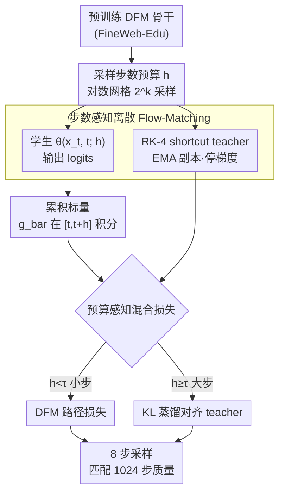

# FS-DFM: Fast and Accurate Long Text Generation with Few-Step Diffusion Language Model

**会议**: ICLR 2026  
**arXiv**: [2509.20624](https://arxiv.org/abs/2509.20624)  
**代码**: [GitHub](https://github.com/apple/ml-fs-dfm)  
**领域**: 文本生成  
**关键词**: 离散扩散模型, 少步采样, flow matching, 累积标量, 文本生成

## 一句话总结

提出 FS-DFM（Few-Step Discrete Flow-Matching），通过步数感知训练和累积标量更新规则，将离散 flow-matching 语言模型的采样步数从 1024 步降低到 8 步，实现 128 倍加速，同时保持相当的困惑度和生成质量。

## 研究背景与动机

自回归语言模型（ARM）生成质量优秀但串行性强——每生成一个 token 需要一次前向传播，限制了吞吐量。扩散语言模型（DLM）可以跨位置并行生成，但标准离散扩散通常需要数百到数千步模型评估才能达到高质量，本质上是用迭代深度换取了并行宽度。

具体来说：
- **ARM 的瓶颈**：严格串行，每个 token 一次前向传播，长序列延迟高
- **DLM 的瓶颈**：虽然并行但步数多。例如 LLaDA 需要大约每个输出 token 一步推理才能匹配 ARM 质量；DFM（Discrete Flow-Matching）在 1024-token 生成时需要约 1024 步

本文的目标是让 DLM 在少步（如 8 步）下就能达到多步（1024 步）的生成质量。先前的少步方法（如 SDTT）仍需 16-256 步且仅针对短文本。FS-DFM 是首个针对长文本（1024 tokens）的少步离散 flow-matching 方法。

## 方法详解

### 整体框架

FS-DFM 建立在 Discrete Flow-Matching（DFM）之上，DFM 把文本建模为连续时间离散马尔可夫链（CTMC），学习一个概率速度场，将源分布（uniform 或 mask）沿概率路径传输到目标数据分布，生成时从噪声序列出发沿速度场迭代去噪。FS-DFM 在此之上做两件事：把步数预算作为显式条件信号注入模型并用 shortcut teacher 蒸馏出大步一致性，同时把驱动 token 跳转的瞬时标量换成在整个步间隔上积分的累积标量，从而让 8 步采样逼近 1024 步的质量。训练采用"预训练 DFM 骨干 → 步数感知微调"的两阶段流程，下图给出微调阶段如何把三个设计串起来。

### 关键设计

**1. 步数感知离散 Flow-Matching：让模型知道自己被允许跳多大一步**

标准 DFM 训练时并不知道推理会用几步，于是在少步设置下表现崩塌。FS-DFM 把步数预算 $h$ 作为显式条件喂给模型，logits $= \theta(x_t, t; h)$，并在训练时从对数网格 $h \in \{2^k,\, k=-10,\dots,0\}$ 采样，让同一个模型既学会精细路径跟踪（小 $h$）也学会大步生成（大 $h$）。难点在于大步间隔上的"正确转移"无法直接从生成器 $u_t$ 解出，但转移概率满足 Kolmogorov 方程（本质是一个 ODE），因此可以用数值积分器近似。本文用经典四阶 Runge–Kutta（RK-4）作为 shortcut teacher：在 $t$、$t+h/2$、$t+h$ 处评估模型得到 $l_1,\dots,l_4$，按 $\bar l = \tfrac{1}{6}(l_1 + 2l_2 + 2l_3 + l_4)$ 加权得到大步目标，每步 4 次模型评估换来比 RK-2 低约 12% 的近似误差。又因为训练过程非平稳，直接拿当前模型当 teacher 会让目标随参数漂移，所以改用 EMA 副本（$\beta$ 接近 1）并停止梯度，给出稳定低方差的蒸馏目标。

**2. 累积标量（Cumulative Scalar）：解决少步采样在小 t 处"迈不动步"的根因**

这是 FS-DFM 的核心创新。DFM 把边际速度分解为标量与方向 $u_t^i(x^i, z) = g(t)\,[\,p_{1|t}(x^i|z) - \delta_z(x^i)\,]$，其中瞬时速率 $g(t) = \kappa'(t)/(1-\kappa(t))$。少步采样的第一步往往落在 $t$ 很小处，此时 $g(t)$ 太弱，不足以触发有效的 token 跳转，采样因此停滞。FS-DFM 把瞬时标量换成在步间隔 $[t, t+h]$ 上对 $g$ 积分并归一化的累积标量：

$$\bar g_{t,h} = \frac{1}{h}\,\ln\!\frac{1-\kappa(t)}{1-\kappa(t+h)}$$

对线性 scheduler $\kappa(t)=t$ 即 $\bar g_{t,h} = \tfrac{1}{h}\ln\frac{1-t}{1-t-h}$，替换后的速度为 $\bar u_t^i = \bar g_{t,h}\,[\,p_{1|t} - \delta_z\,]$。这样即使 $t$ 很小，只要 $h$ 足够大，累积标量就能积累出足够的概率流量驱动跳转；而当 $h \to 0$ 时 $\bar g_{t,h} \to g(t)$，FS-DFM 平滑退化回标准 DFM，因此大步和小步用的是同一套理论。消融显示这一项在 1 步采样时把 PPL 从 1312 压到 514（降 60.8%），少步收益最大。

**3. 预算感知混合损失：按步长大小给每个样本选对应的训练信号**

小步和大步需要的监督并不一样：小步要忠于局部概率路径，大步要对齐 shortcut teacher。FS-DFM 以 $\tau = 2^{-9}$ 为界切换——$h < \tau$ 时用 DFM 路径损失 $L_{\text{dfm}}$（Bregman 散度）保证路径忠实，$h \ge \tau$ 时用 KL 散度 $L_{\text{dist}}$ 把 student 拉向 RK-4 teacher 的大步输出。每个 batch 按各样本的 $h$ 选择性混合：

$$L = \frac{1}{B}\sum_b \big[\,m_b\, L_{\text{dfm}}^{(b)} + (1-m_b)\, L_{\text{dist}}^{(b)}\,\big]$$

其中掩码 $m_b$ 由该样本的 $h$ 是否小于 $\tau$ 决定，使一次训练同时覆盖路径跟踪和大步蒸馏两种 regime。

### 损失函数 / 训练策略

整体采用预训练后微调的两阶段策略：阶段一在 FineWeb-Edu 上训练一个标准 DFM 骨干（不带步数感知），阶段二用步数感知目标和累积标量微调该 checkpoint，避免从零开始做昂贵的步数感知训练。训练用 GPT-2 tokenizer、序列长度 1024（文档拼接填充），覆盖 0.169B / 1.3B / 1.7B 三种规模，源分布同时支持 uniform 和 mask，scheduler 取线性 $\kappa(t)=t$，评估在 WikiText-103 上进行。

## 实验关键数据

### 主实验

**表1：累积标量消融（0.169B 模型）**

| 采样步数 (NFE) | 普通标量 PPL | 累积标量 PPL | 降低 |
|:---:|:---:|:---:|:---:|
| 1 | 1312.65 | 514.40 | -60.8% |
| 2 | 462.31 | 333.07 | -28.0% |
| 4 | 194.29 | 176.19 | -9.3% |
| 8 | 97.51 | 90.49 | -7.2% |
| 1024 | 85.61 | 87.36 | ~持平 |

累积标量在少步时带来巨大提升（1步降低60.8%），多步时收敛到相同水平。

**表2：FS-DFM vs 扩散语言模型（512 token 续写）**

| 方法 | 规模 | 1步 PPL | 2步 PPL | 4步 PPL | 8步 PPL | 16步 PPL |
|------|:---:|:---:|:---:|:---:|:---:|:---:|
| Dream | 7B | 1163.08 | 785.87 | 752.11 | 739.40 | 630.30 |
| LLaDA | 8B | 256.07 | 290.35 | 495.17 | 441.26 | 432.65 |
| **FS-DFM** | **0.17B** | **173.39** | **143.77** | **97.07** | **75.78** | **67.42** |
| **FS-DFM** | **1.3B** | **231.89** | **169.99** | **99.79** | **70.97** | **59.84** |
| **FS-DFM** | **1.7B** | **191.20** | **155.01** | **101.20** | **72.84** | **61.67** |

FS-DFM 0.17B 在 8 步时的 PPL（75.78）已远优于 LLaDA 8B 在 16 步的结果（432.65），尽管参数量小 40 倍。Dream 和 LLaDA 在少步时生成内容多为重复 token。

### 消融实验

- **RK-4 vs RK-2**：RK-4 在各 NFE 下 PPL 比 RK-2 低约 12%（中位数比值 0.88x），代价是训练时额外的模型评估
- **EMA Teacher**：使用 EMA copy 作为 teacher 比直接用当前模型显著提升训练稳定性
- **源分布**：uniform 和 mask 两种源分布下 FS-DFM 都有效
- **步数采样策略**：对数网格覆盖全范围优于集中在某个区间

### 关键发现

1. **128 倍加速**：FS-DFM 用 8 步匹配 DFM 的 1024 步质量（1024 token 生成）
2. **小模型胜大模型**：0.17B FS-DFM 在少步生成上远优于 7-8B 的 Dream/LLaDA
3. **大步收敛性**：随着 NFE 增大（h 趋近 0），FS-DFM 平滑收敛到标准 DFM，因为累积标量 g_bar 此时趋近于瞬时 g(t)
4. **累积标量是关键**：在大步时（1-2 NFE），累积标量带来最大提升
5. **MAUVE 对比**：FS-DFM 在 16 步时 MAUVE 达 0.39-0.58，而 LLaDA/Dream 16 步仅约 0.005

## 亮点与洞察

- 问题切入精准：识别出 DFM 少步采样的核心障碍是瞬时标量在小 t 时过弱，提出累积标量是优雅的数学解决方案
- Shortcut teacher 的 RK-4 实现将 ODE 求解器与离散扩散训练无缝结合
- 预训练+微调策略避免了从零开始的昂贵步数感知训练
- 首个开源的 DFM + FS-DFM 模型和代码（Apple 出品）
- 少步下 0.17B 小模型碾压 8B 大模型的结果非常 surprising

## 局限与展望

1. 评估主要在 1024 token 长度，更长序列（4K+）的扩展性未验证
2. 仅用 GPT-2 tokenizer 和中小规模模型，与现代 LLM（7B+ ARM）的直接质量对比缺失
3. RK-4 teacher 训练时需要 4 次前向传播/步，训练成本较高
4. 未探索 FS-DFM 在条件生成（摘要、翻译等）上的表现
5. 生成的文本多样性（MAUVE）虽优于 LLaDA/Dream 但绝对值仍较低

## 相关工作与启发

FS-DFM 是连续空间 flow-matching 中少步/单步蒸馏思想（如 consistency models、shortcut models）在离散文本空间的首次全面实践。累积标量的思路对其他需要离散大步更新的 CTMC 应用也有参考价值。该工作也表明离散扩散在语言建模中仍有巨大潜力，关键在于解决步数效率问题。

## 评分

- 新颖性: ⭐⭐⭐⭐⭐（累积标量 + RK-4 shortcut teacher 在离散文本 FM 中的首次应用）
- 技术深度: ⭐⭐⭐⭐⭐（CTMC 理论 + Kolmogorov ODE + Bregman divergence，数学严谨）
- 实验充分度: ⭐⭐⭐⭐（多模型规模 + 多基线 + 消融充分，但缺少条件生成评估）
- 实用性: ⭐⭐⭐⭐（128x 加速有实际意义，但 DLM 整体生态仍不成熟）
- 写作质量: ⭐⭐⭐⭐（数学表述清晰，但符号较多需要反复查阅）

<!-- RELATED:START -->

## 相关论文

- [\[AAAI 2026\] Structured Language Generation Model: Loss Calibration and Formatted Decoding for Efficient Text](../../AAAI2026/nlp_generation/structured_language_generation_model_loss_calibration_and_formatted_decoding_for.md)
- [\[ACL 2026\] Frankentext: Stitching Random Text Fragments into Long-Form Narratives](../../ACL2026/nlp_generation/frankentext_stitching_random_text_fragments_into_long-form_narratives.md)
- [\[ICCV 2025\] Beyond Isolated Words: Diffusion Brush for Handwritten Text-Line Generation](../../ICCV2025/nlp_generation/beyond_isolated_words_diffusion_brush_for_handwritten_text-line_generation.md)
- [\[ICML 2026\] Characterizing the Effect of Noise in Language Generation in the Limit](../../ICML2026/nlp_generation/characterizing_the_effect_of_noise_in_language_generation_in_the_limit.md)
- [\[ACL 2025\] Tell, Don't Show: Leveraging Language Models' Abstractive Retellings to Model Literary Themes](../../ACL2025/nlp_generation/tell_dont_show_leveraging_language_models_abstractive_retellings_to_model_litera.md)

<!-- RELATED:END -->
