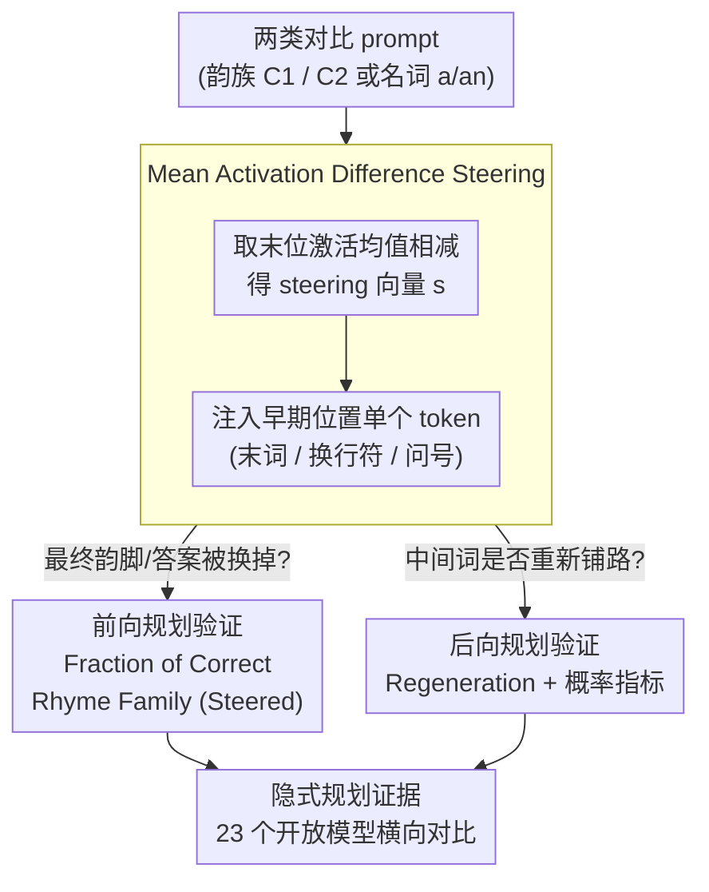

# What's the Plan? Metrics for Implicit Planning in LLMs and Their Application to Rhyme Generation and Question Answering

**会议**: ICLR 2026  
**arXiv**: [2601.20164](https://arxiv.org/abs/2601.20164)  
**代码**: 有（附supplementary material）  
**领域**: NLP理解  
**关键词**: implicit planning, forward planning, backward planning, activation steering, rhyme generation

## 一句话总结
提出 mean activation difference steering 方法和配套定量指标，在韵律诗生成和问答两个案例上跨 23 个开放模型（1B-32B）系统性证明：目标 token（韵脚/答案）的表示在序列早期位置已形成（前向规划），且因果性地影响中间 token 生成（后向规划）——隐式规划从 1B 模型即出现，是普遍机制而非大模型专属。

## 研究背景与动机

**领域现状**：LLM 通过 next-token prediction 训练，却能生成连贯文本。Lindsey et al. (2025) 用 cross-layer transcoder (CLT) 在 Claude 3.5 Haiku 上定性展示了押韵规划行为——模型在第一行末尾已有未来韵脚的表示，且该表示影响第二行中间词生成。

**现有痛点**：1）CLT 方法复杂昂贵（单模型训练需 H100 数天），不可扩展到多模型对比；2）Lindsey 的发现局限于单个闭源模型的少量定性示例，不可复现；3）缺乏隐式规划的定量评估指标——没有标准化方法判断"规划程度"。

**核心矛盾**：隐式规划的重要性（关乎 LLM 能力理解和安全）vs 研究方法的复杂性和不可扩展性。

**本文目标** 用简单可扩展的方法定量研究隐式规划——在多个模型、多个任务上系统性验证。

**切入角度**：韵律诗和问答是隐式规划的理想探针——目标 token 的性质和位置可从通用原则预测，但不由紧邻前文确定。

**核心 idea**：mean activation difference steering 在正确位置注入足以操纵前向和后向规划，无需训练 CLT 或 SAE。

## 方法详解

### 整体框架
全文围绕两个互补的概念展开：**前向规划**（forward planning）指模型在序列早期位置（第一行末尾、问题末尾）就把未来目标的属性编码进了隐藏表示里；**后向规划**（backward planning）指模型利用这份已成形的规划表示，去生成一条真正能通向目标的中间路径。论文不去训练昂贵的解释器来"看"这些表示，而是反过来——直接在表示上动手脚，看输出怎么变：先用两类对比 prompt 算出一个 steering 向量，把它注入早期位置的单个 token，再用两套指标分别检验「最终目标变没变」（前向）和「中间词有没有跟着重新铺路」（后向）。能被精准操纵，就说明那份规划表示确实存在并起作用。

实验在两个可控探针上展开：韵律诗里目标是第二行的韵脚，数据是 Claude 3.5 Sonnet 生成的 10 个韵族 × 105 行、配成 20 个韵族对；问答里目标是答案名词，数据是 20 个名词对（元音开头要冠词 an、辅音开头要 a），每个名词配 13 训练 + 5 测试 + 7 中性问题。两个任务的共同点是：目标 token 的性质能从通用规则预测，却不由紧邻前文决定，因此最适合用来探规划。

### 关键设计

**1. Mean Activation Difference Steering：用激活均值差当"规划开关"，省掉训练 CLT 的天价成本**

此前 Lindsey et al. 用 cross-layer transcoder（CLT）研究规划，单模型就要 H100 跑数天、且只能在一个闭源模型上做，根本铺不开。这里换了个极简思路：准备两类对比 prompt（目标分别落在韵族 $C_1$、韵族 $C_2$，或冠词 a/an），在它们的特定早期位置（末尾词 / 换行符 / 问号）各自取隐藏激活的均值，相减就得到一个 steering 向量

$$\mathbf{s}_{C_1 \to C_2}^{(l,i)} = m \cdot \left(\overline{\mathbf{x}_i^{(l)}}_{C_1} - \overline{\mathbf{x}_i^{(l)}}_{C_2}\right)$$

其中 $l$ 是层、$i$ 是 token 位置，放大系数 $m=1.5$（估计不精时用更大幅度补偿）。每个模型从所有层与位置里挑「操纵效果最强」的那组组合作为最终向量，生成时只把它加到**单个 token 位置**的 residual stream 上。整个过程只需前向传播提取激活再做均值差，无需训练任何 CLT 或 SAE，比 CLT 简单几个数量级，这正是它能一口气铺到 23 个模型（4 个家族 × 多尺度 × base/IT）做横向对比的关键。

**2. 前向规划验证——Fraction of Correct Rhyme Family (Steered)：用"能不能换掉最终韵脚"反推早期位置是否藏着未来目标**

要证明前向规划，逻辑很直接：如果早期干预位置上根本没有指向未来目标的规划表示，那么在这里 steering 就不该可预测地改变最终韵脚；反过来，只要向量真能把韵脚从韵族 1 切到韵族 2，就坐实了早期位置确实编码了未来目标。指标就是统计这种切换的成功比例——对 1000 个偶句（每个 test prompt 采 50 样本 × 20 个 prompt）施加 $\mathbf{s}_{RF_1 \to RF_2}$，数其中末词落进目标韵族 $RF_2$ 的比例，再和无 steering 的基线对照。比例越高、相对基线偏移越大，前向规划的证据越强。问答任务用对应的 Fraction of Correct Answer (Steered)。

**3. 后向规划验证——Regeneration + 概率指标：证明 steering 改的是"通往目标的整条路径"，而不只是替换最后一个词**

光改最终韵脚还不够，得说明模型在生成中间词时就已经在为目标铺路（否则只是末端单点替换，不算规划）。Regeneration 指标的做法是：把第二行的韵律上下文剥掉、再抹去最后一个词，然后让模型重新补这个词——如果中间词当初确实"通向"目标韵族，那即便没了上下文，重生成命中目标韵族的比例也会显著高于随机基线、也高于 steering 到别的韵族时。配套的概率指标则直接比较 steered 与 unsteered 下中间 token 的概率分布偏移，从而定位规划信号到底从哪一步开始介入中间词的生成。问答里这条线表现为 steering 不仅改最终答案、还连带改了冠词 a/an（Fraction of a/an Steered），说明中间 token 也被规划牵着走。

## 实验关键数据

### 主实验——23 个模型的韵律规划

| 模型 | 基线韵律率 | Steered韵律率 | 基线Regen率 | Steered Regen率 |
|------|:---:|:---:|:---:|:---:|
| Gemma2 9B IT | ~80% | ~75% | ~55% | ~52% |
| Gemma3 27B IT | ~85% | ~82% | ~60% | ~58% |
| Llama 3.1 8B IT | ~60% | ~55% | ~40% | ~38% |
| Gemma3 1B Base | ~25% | ~15% | ~20% | ~12% |

（IT = instruction-tuned; Base = 基座模型）

### 消融实验——Steering 位置分析

| Steering 位置 | Gemma2 9B | Gemma3 27B | 其他模型 |
|-------------|:---:|:---:|:---:|
| 最后一个词（低层）| ✓ 有效 | ✓ 有效 | ✓ 全部有效 |
| 换行符（中层）| ✓ 有效 | ✓ 有效 | ✗ 大多无效 |

### 关键发现
- **隐式规划从 1B 模型即出现**：即使最小模型（Gemma3 1B）也展示可检测的前向和后向规划，比之前认为的更普遍
- **指令微调增强规划**：IT 模型在所有指标上一致优于 base 模型→post-training 可能增强规划能力
- **跨任务共性**：问答中 steering 同样改变冠词选择（a vs an）→planning 不是韵律特定机制
- **规划电路定位**（Gemma2 9B）：两个 attention head（L30H3, L31H15）从第一行末尾读取规划信息→activation patching 恢复 59%-93% 的 steering 效果→后续 MLP 层将信息转化为预测
- **韵律 vs 问答使用不同电路**：韵律电路集中在 L30H3/L31H15，问答中 L39H13 更重要→规划机制通用但电路任务特定
- **所有韵律指标高度相关**：韵律能力 ↔ 规划能力→二者共同发展

## 亮点与洞察
- **方法论贡献大于发现本身**：mean activation difference steering 如此简单却能系统研究 23 个模型——将规划研究从"需要 CLT 的 H100 级计算"降维到"任何 GPU 几小时可完成"
- **1B 就有规划 → autoregressive 训练的必然产物**：如果只需预测下一个 token，为什么要提前规划？因为当前 token 的最优选择依赖于未来意图→即使最小的 LLM 也学到了这种 lookahead
- **韵律是完美的规划探针**：必须提前计划押什么韵→中间词必须语义兼容→这正是前向+后向规划的定义。问答中冠词选择是类似的但更简单的证据
- **对 AI 安全的直接含义**：隐式规划 = 模型有"意图尚未表达"的内部状态→理解和监控这些状态对 alignment 至关重要

## 局限与展望
- Steering 成功率不完美——在弱模型上 steered 韵律率显著低于 baseline，说明规划表示的提取有噪声
- 仅研究韵律和问答两个案例——更复杂的规划场景（如代码生成、长程推理）需要进一步验证
- Mean activation difference 是粗糙方法——不区分规划具体词 vs 规划韵族的不同层次
- 换行符位置的规划仅在部分模型（Gemma2 9B, Gemma3 27B）有效——模型间架构差异如何影响规划电路拓扑未清
- 电路分析仅深入 Gemma2 9B 一个模型——其他模型是否有类似少数 attention head 主导规划未知
- 未涉及显式规划（如 CoT）与隐式规划的交互——二者是替代还是互补？

## 相关工作与启发
- **vs Lindsey et al. (2025) CLT 分析 Claude Haiku**：他们定性展示了规划现象但方法昂贵不可复现；本文用简单方法在 23 个开放模型上定量复现+扩展——方法论降维是核心贡献
- **vs Turpin et al. (2023) 不忠实 CoT**：他们发现偏置答案后 CoT 会合理化错误答案→隐式前向规划的间接证据；本文直接定量确认
- **vs Wu et al. (2024), Men et al. (2024) lookahead 研究**：他们在特定模型发现 lookahead 表示，本文在 23 个模型上系统验证→从个案到群体研究的升级

## 评分
- 新颖性: ⭐⭐⭐⭐ 定量隐式规划评估方法 + 23 模型系统研究，方法简单但洞察丰富
- 实验充分度: ⭐⭐⭐⭐⭐ 23 模型（4 家族×多尺度×base+IT）× 2 任务 + 电路分析 + 注意力消融
- 写作质量: ⭐⭐⭐⭐ 前向/后向规划定义清晰，实验直观可复现
- 价值: ⭐⭐⭐⭐⭐ 对理解 LLM 内部机制有基础性贡献，方法论可广泛复用

<!-- RELATED:START -->

## 相关论文

- [\[ACL 2025\] Active LLMs for Multi-hop Question Answering](../../ACL2025/nlp_understanding/active_llms_for_multi-hop_question_answering.md)
- [\[NeurIPS 2025\] Planning without Search: Refining Frontier LLMs with Offline Goal-Conditioned RL](../../NeurIPS2025/nlp_understanding/planning_without_search_refining_frontier_llms_with_offline_goal-conditioned_rl.md)
- [\[ACL 2026\] It's High Time: A Survey of Temporal Question Answering](../../ACL2026/nlp_understanding/it39s_high_time_a_survey_of_temporal_question_answering.md)
- [\[ACL 2026\] BoundRL: Efficient Structured Text Segmentation through Reinforced Boundary Generation](../../ACL2026/nlp_understanding/boundrl_efficient_structured_text_segmentation_through_reinforced_boundary_gener.md)
- [\[ACL 2026\] Filling the Gap: Is Commonsense Knowledge Generation useful for Natural Language Inference?](../../ACL2026/nlp_understanding/filling_the_gap_is_commonsense_knowledge_generation_useful_for_natural_language_.md)

<!-- RELATED:END -->
